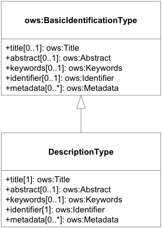
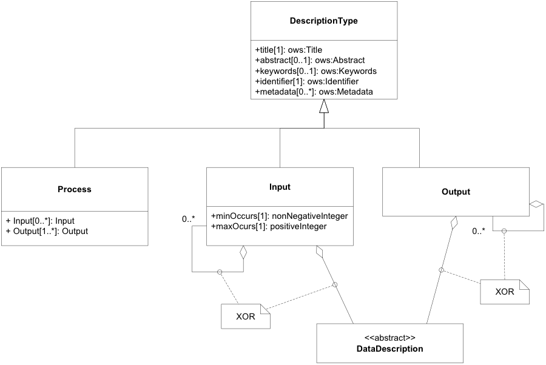

## 2.2 流程描述通用结构

### 2.2.1 通用描述类型

流程、输入和输出的描述性元素源自 OWS Common 提供的 BasicIdentificationType（图 2.6）。其他描述性信息应以带有适当角色标识符的简单链接的形式记录在元数据元素中。*流程描述以及相关流程输入和输出源自 OWS 通用基本识别类型。*

图2.6：流程的描述类型、流程输入和流程输出 UML 类图

**表 2.2 – DescriptionType 结构的属性**

| 名称       | 定义                                                 | 数据类型和值                               | 多样性和用途                               |
| ---------- | ---------------------------------------------------- | ------------------------------------------ | ------------------------------------------ |
| Title      | 流程、输入和输出的标题。通常可向人类显示。           | ows:Title                                  | 1个（必填）                                |
| Abstract   | 流程、输入和输出的简要叙述性描述。通常可向人类显示。 | ows:Abstract                               | 0个或个（可选） 在可用且有用时包括在内。   |
| Keywords   | 描述流程、其输入和输出的关键字。                     | ows:Keywords                               | 0个或多个（可选） 在可用且有用时包括在内。 |
| Identifier | 流程、输入和输出的明确标识符。                       | ows:Identifier 值是 URI 或 HTTP- URI **a** | 1个（必填）                                |
| Metadata   | 参考有关此项目的其他元数据。                         | ows:Metadata 允许的值在表 2.3 中指定。     | 0个或多个（可选）                          |

<u>***a**不允许在 Identifier 元素中添加附加内容，例如单独的代码空间和版本属性。*</u>

**表 2.3 – 元数据结构的属性**

| 名称      | 定义                                 | 数据类型和值             | 多样性和用途 |
| --------- | ------------------------------------ | ------------------------ | ------------ |
| Title     | 文档的标题。通常可向人类显示。       | 字符串                   | 1个（必填）  |
| Link type | xlink 的类型，固定为 simple。        | 字符串，固定为“simple”。 | 1个（必填）  |
| Role      | 角色标识符，指示链接文档的角色。     | HTTP-URI                 | 1个（必填）  |
| href      | 对流程、输入或输出的文档站点的引用。 | HTTP-URI                 | 1个（必填）  |

### 2.2.2 进程描述

本节定义描述流程的信息结构。它包括链接到有关流程的行为和机制的文档资源的元素以及有关其输入和输出的描述性元素。流程描述模型实现并扩展了 抽象流程模型中定义的需求。

流程描述是DescriptionType 的扩展（图2.7）。它应用于表达标识符、标题和摘要，并链接到提供有关流程的附加或更详细信息的相关元数据元素。应使用附加语言属性来指示过程及其输入和输出的描述中人类可读元素的语言。

过程输入和输出的描述结构继承了DescriptionType（第2.2.1节）的公共元素。这些元素应用于表达标识符、标题和摘要，并链接到提供有关过程输入和输出的附加或更详细信息的相关元数据元素。输入和输出描述中人类可读元素的内容应遵循过程描述中指示的语言。

流程输入是流程的参数。流程输入具有基数，以便 (1) 将具有相同标识符的多个值传递给流程，或 (2) 将流程输入声明为可选（基数“0”）。输入元素可以是简单的（即输入没有附加子输入）或聚合（即输入有一个或多个附加子输入元素）。简单输入包括 DataDescription 元素的实现。聚合输入包含一个或多个子输入。

输出是过程的返回值。输出的基数为一。输出元素可以是简单的（即输出没有附加的子输出）或聚合的（即输出有一个或多个附加的子输出元素）。简单的输出包括 DataDescription 元素的实现。聚合输出包含一个或多个子输出。

图2.7 流程UML类关系图

**表 2.4 – 流程结构**

| 名称   | 定义                                 | 数据类型和值                                        | 多样性和用途       |
| ------ | ------------------------------------ | --------------------------------------------------- | ------------------ |
| 标题   | 继承自表2.2                          |                                                     |                    |
| 抽象的 |                                      |                                                     |                    |
| 标识符 |                                      |                                                     |                    |
| 元数据 |                                      |                                                     |                    |
| 语言   | 人类可读的过程描述元素的语言标识符。 | 字符串。该语言标识符应符合 IETF RFC 4646 中的规定。 | 1个（必填）        |
| 输入   | 流程的输入项（参数）。               | 输入结构，见表2.5。                                 | 零个或多个（可选） |
| 输出   | 过程的输出项（结果）                 | 输出结构，见表2.6。                                 | 一项或多项（必填） |

**表 2.5 – 输入结构的各个部分**

| 名称            | 定义                     | 数据类型和值                                                 | 多样性和用途          |
| --------------- | ------------------------ | ------------------------------------------------------------ | --------------------- |
| Title           | 继承自表2.2              |                                                              |                       |
| Abstract        |                          |                                                              |                       |
| Keywords        |                          |                                                              |                       |
| Identifier      |                          |                                                              |                       |
| Metadata        |                          |                                                              |                       |
| minOccurs **a** | 需要此参数值的最小次数   | 非负整数；默认为“1”，“0”表示输入是可选的。                   | 零或一 （可选）       |
| maxOccurs **a** | 该参数可能出现的最大次数 | 非负整数，默认为“1”。                                        | 零或一 （可选）       |
| DataDescription | 此输入的数据类型和域。   | DataDescription的实现，即ComplexData、LiteralData、BoundingBoxData。 | 零或一（有条件）**b** |
| Input           | 嵌套输入。**C**          | 输入结构，表 2.5（本表）。                                   | 零个或多个（有条件）b |
|                 |                          |                                                              |                       |

*<u>**a** minOccurs 和 maxOccurs 参数与类似名称的 XML 模式出现约束具有相同的语义。 b输入应包括 DataDescription 的一种实现或任意数量的子输入。 **c**建议保持尽可能低的嵌套级别。</u>*

**表2.6 – 输出结构的各个部分**

| 名称            | 定义                   | 数据类型和值                                                 | 多样性和用途          |
| --------------- | ---------------------- | ------------------------------------------------------------ | --------------------- |
| Title           | 继承自表2.2            |                                                              |                       |
| Abstract        |                        |                                                              |                       |
| Keywords        |                        |                                                              |                       |
| Identifier      |                        |                                                              |                       |
| Metadata        |                        |                                                              |                       |
| DataDescription | 此输入的数据类型和域。 | DataDescription的实现，即ComplexData、LiteralData、BoundingBoxData。 | 零或一（有条件）      |
| Output          | 嵌套输出。 b           | 输出结构，表2.6（本表）。                                    | 零个或多个（有条件）a |
|                 |                        |                                                              |                       |

<u>a输出应包括 DataDescription 的一种实现或任意数量的子输出。 b建议保持尽可能低的嵌套级别。</u>