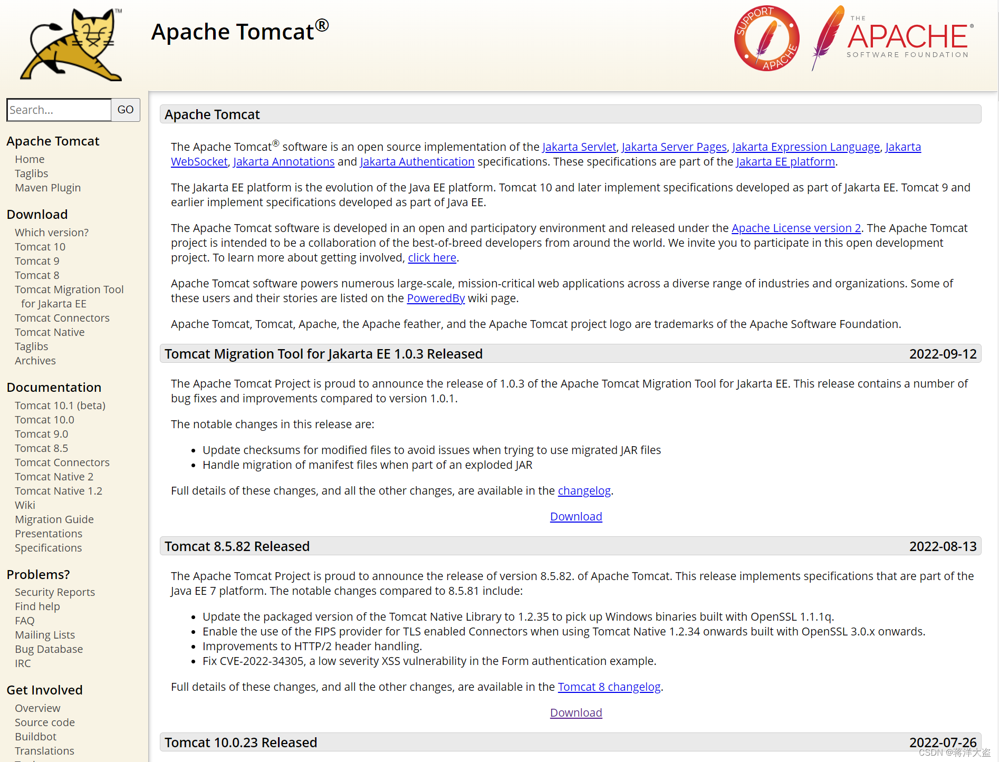
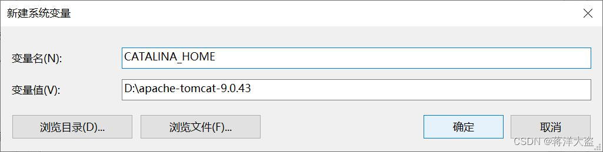
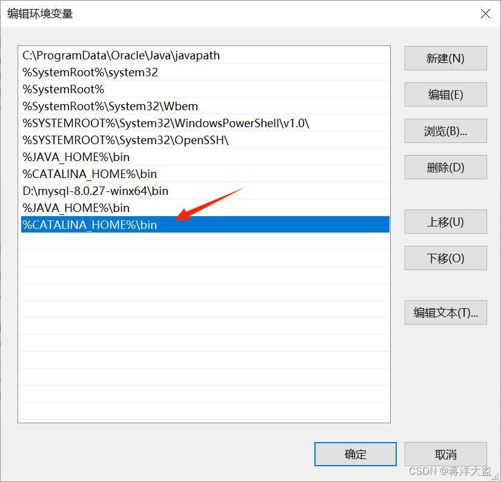
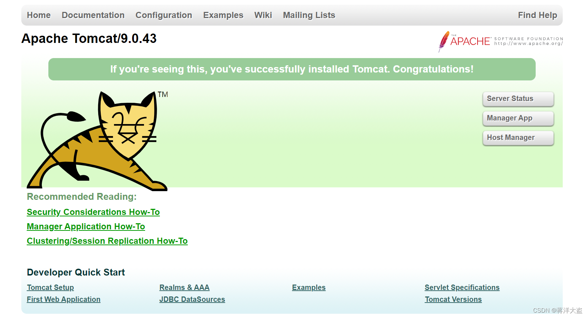
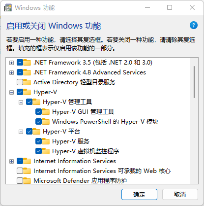

## 4.1 环境准备
### 4.1.1 Python 安装

### 4.1.2  Tomcat 介绍与安装

Tomcat是在Oracle公司的JSWDK（JavaServer Web DevelopmentKit，是Oracle公司推出的小型Servlet/JSP调试工具）的基础上发展起来的一个优秀的Servlet容器，**Tomcat本身完全用Java语言编写**。作为一个开源软件，Tomcat除了运行稳定、可靠，并且效率高之外，还可以和目前大部分的主流Web服务器（如IIS、Apache、Nginx等）一起工作。

tomcat的版本实际上比较复杂，目前有7、8、9、10四个版本并行发布，在安装它之前我们需要在电脑上配置好JDK环境，具体的各个版本的兼容信息我们可以通过官网查询。安装Tomcat服务器，为WPS服务发布和数据资源发布提供环境。

第一步，在Tomcat官网(http://tomcat.apache.org/)下载Zip到指定目录中并解压，这一步不需要安装过程。

第二步，配置Tomcat环境变量。首先复制Tomcat的安装路径（如D:\apache-tomcat-9.0.43），然后在【此电脑】→【属性】→【高级系统设置】→【环境变量】中新建变量名，【系统变量】→【新建】→变量名：CATALINA_HOME  变量值：Tomcat的安装路径→【确定】，如图4.1所示。最后在【Path】→【编辑】→【新建】→输入%CATALINA_HOME%\bin，如图4.2所示。

第三步，启动并测试Tomcat。 在Tomcat安装路径下的bin目录里找到startup.bat，双击运行，保持窗口打开状态。  打开浏览器，在地址栏输入http://localhost:8080/或http://127.0.0.1:8080/，能看到Tomcat首页即启动成功(若出现闪退现象，请先检查环境变量配置是否正确)，如图4.3所示。如果关闭Tomcat窗口，则Tomcat服务器关闭。

### 4.1.3  Docker 介绍与安装

Docker 并非是一个通用的容器工具，它依赖于已存在并运行的 Linux 内核环境。Docker 实质上是在已经运行的 Linux 下制造了一个隔离的文件环境，因此它执行的效率几乎等同于所部署的 Linux 主机。因此，Docker 必须部署在 Linux 内核的系统上。如果其他系统想部署 Docker 就必须安装一个虚拟 Linux 环境。在 Windows 上部署 Docker 的方法都是先安装一个虚拟机，并在安装 Linux 系统的的虚拟机中运行 Docker。

第一步，安装Hyper-V 。方式一：Hyper-V 是微软开发的虚拟机，类似于 VMWare 或 VirtualBox，仅适用于 Windows 10。这是 Docker Desktop for Windows 所使用的虚拟机。【控制面板】→【程序】→【程序和功能】→【启用或关闭Widows功能】→【Hyper-V】，全部勾选并点击确定。如图4.4所示。方式二：可以通过命令来启用 Hyper-V ，请右键开始菜单并以管理员身份运行 PowerShell，执行以下命令：`Enable-WindowsOptionalFeature -Online -FeatureName Microsoft-Hyper-V -All`

第二步，安装 Docker Desktop for Windows。点击(https://hub.docker.com/?overlay=onboarding)，并下载 Windows 的版本，如果你还没有登录，会要求注册登录。双击下载的 Docker for Windows Installer 安装文件，一直点击【Next】，直到 【Finish】 完成安装。安装之后，可以打开 PowerShell 并运行以下命令检测是否运行成功：`docker run hello-world`.安装成功后会出现：Hello from Docker！

### 4.1.4  Git的安装
