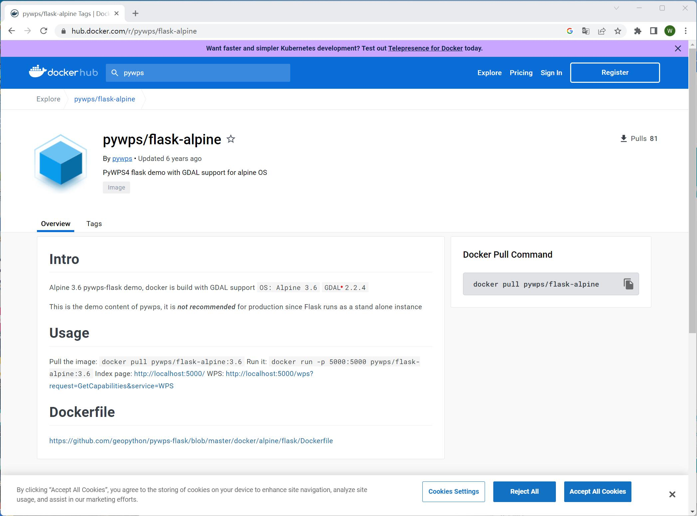
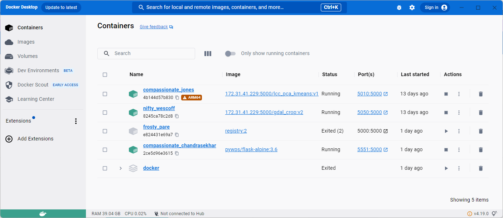
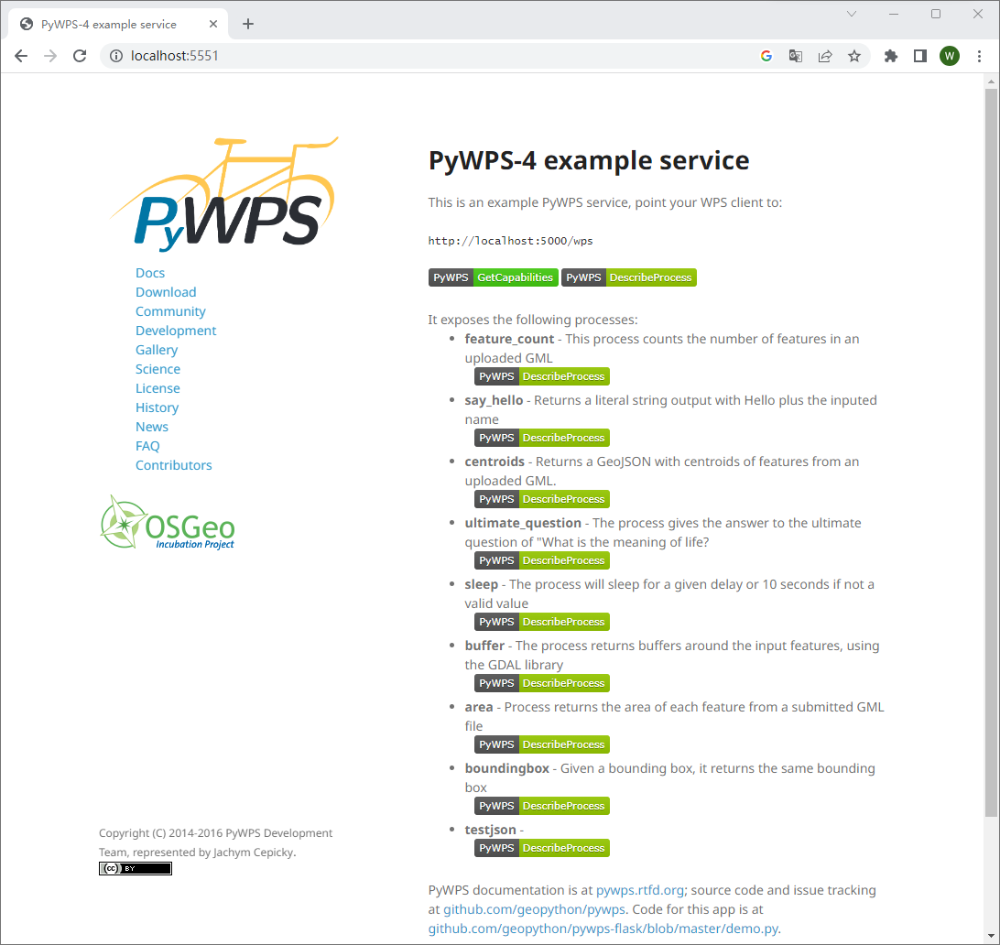

## 4.2 PyWPS的安装与使用

### 4.2.1 依赖关系和要求(Linux安装)

PyWPS 在 Python 2.7、3.3 或更高版本上运行。PyWPS 目前在 Linux（主要是 Ubuntu）上进行测试和开发。在安装 PyWPS 之前，必须在系统中安装 GDAL 的 Git 和 Python 绑定。*在基于 Debian 的系统中，可以使用apt*等工具安装这些软件包：

`$ sudo apt-get install git python-gdal`

或者，如果 GDAL 已安装在您的系统上，您可以通过 pip 安装 GDAL Python 绑定：

`$ pip install GDAL==1.10.0 --global-option=build_ext --global-option="-I/usr/include/gdal"`

1. 使用pip:安装 PyWPS 最简单的方法是使用 Python 包索引 (PIP)。它从存储库中获取源代码并自动将其安装在系统中。这可能需要超级用户权限（例如基于 Debian 的系统中的*sudo*）：

`$ sudo pip install -e git+https://github.com/geopython/pywps.git@master#egg=pywps-dev`

2. 手动安装：手动安装 PyWPS 需要[下载](https://pywps.org/download)源代码，然后使用setup.py脚本。再次是基于 Debian 的系统的示例（注意sudo的安装用法）：

   ```sh
   $ tar zxf pywps-x.y.z.tar.gz
   $ cd pywps-x.y.z/
   ```

   然后使用 pip 安装包依赖项：

   ```sh
   $ pip install -r requirements.txt
   $ pip install -r requirements-gdal.txt  # 用于GDAL Python绑定 (如果 python-gdal 没有通过 apt-get被安装)
   $ pip install -r requirements-dev.txt  # 对于开发人员任务
   ```

   要在系统范围内安装 PyWPS，请运行：

   ```sh
   $ sudo python setup.py install
   ```

### 4.2.2 Windows 安装

要使用 PyWPS，用户必须对流程进行编码并通过服务发布它们。官方提供了一个示例服务，为首次使用的用户提供了一个良好的起点。它启动了一个非常简单的内置服务器（依赖于[Flask Python Microframework](http://flask.pocoo.org/)），这对于测试来说足够好。该示例服务可以直接克隆到用户区域：

```sh
$ git clone https://github.com/geopython/pywps-flask.git
```

PyWPS 未在 MS Windows 平台上进行测试。这主要是因为缺少多处理库。它用于处理异步执行，即在发出存储响应文档的请求并更新显示执行进度的状态文档时。因此我们通过Docker来安装PyWPS。

第一步，在DockerHub中搜索PyWPS，并找到可用的Docker镜像pywps/flask-alpine，如图4.X所示。



第二步，打开终端，在命令行中输入`docker pull pywps/flask-alpine:3.6` 拉取镜像，拉取成功后输入`docker run -p 5551:5000 pywps/flask-alpine:3.6`启动镜像，其中-p是端口映射，我们以端口号5551启动该镜像。在Docker Desktop中可以看到镜像已经被启动。



第三步，在浏览器中输入`http://localhost:5551/` 并回车，可以看到一个PyWPS的页面已经被打开，此时说明拉取的镜像已经成功部署并启动。

