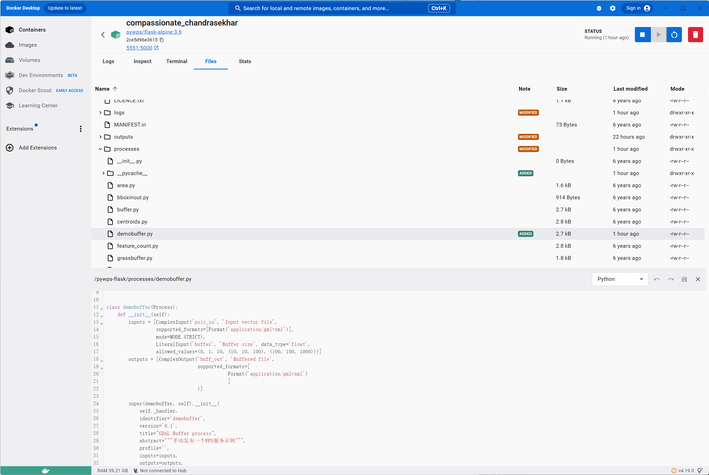
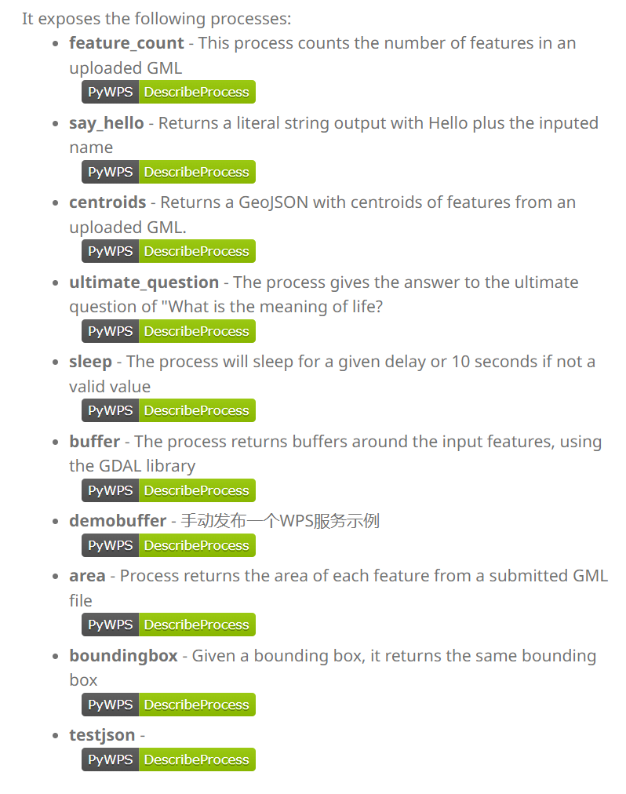
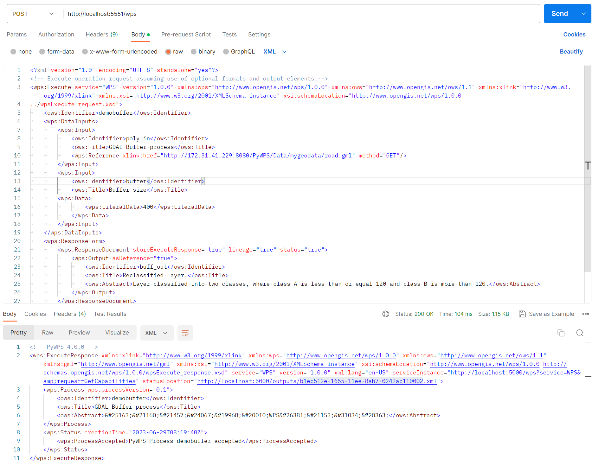
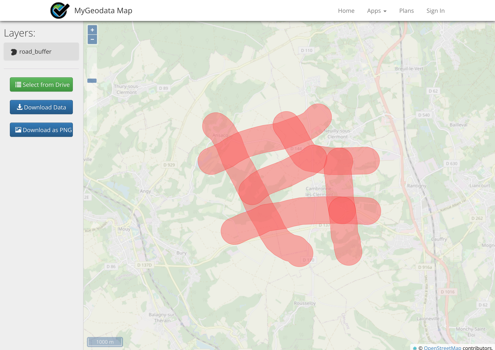

## 4.3 手动发布一个WPS服务

进程可以位于*系统中的任何位置*，只要它们的位置在`PYTHONPATH`环境变量，并且可以在最终服务器实例中导入。进程被编码为继承自[`Process`](https://pywps.readthedocs.io/en/latest/api.html#pywps.Process) 的类。在[PyWPS-Flask](https://github.com/geopython/pywps-flask)服务器中，它们保存在*进程*文件夹中，通常位于单独的文件中。

流程实例需要配置以下属性：

- **identifier:**进程的唯一标识符
- **title:** 相应标题
- **inputs:**过程输入列表
- **outputs:**过程输出列表
- **handler:**接收[`pywps.app.WPSRequest`](https://pywps.readthedocs.io/en/latest/api.html#pywps.app.WPSRequest)和[`pywps.response.WPSResponse`](https://pywps.readthedocs.io/en/latest/api.html#pywps.response.WPSResponse)作为输入的方法。

https://pywps.readthedocs.io/en/latest/process.html

### 4.3.1向量缓冲过程示例

作为示例，我们将创建一个*缓冲区*进程 - 它将采用矢量文件作为输入，在数据周围创建指定的缓冲区（使用[Shapely](https://shapely.readthedocs.io/)），然后返回结果。

因此，该过程将有两个输入：

- ComplexData输入 - 矢量文件
- LiteralData输入 - 缓冲区大小

它将有一个输出：

- ComplexData输出 - 最终缓冲区

该过程可以称为demobuffer，我们现在可以开始对其进行编码：

1. 首先，我们必须导入所需的类和模块这是一个非常基本的例子：

```py
from pywps import Process, LiteralInput, ComplexOutput, ComplexInput, Format
from pywps.app.Common import Metadata
from pywps.validator.mode import MODE
from pywps.inout.formats import FORMATS
```

2. 下一步，我们定义输入列表。第一个输入的 [`pywps.ComplexInput`](https://pywps.readthedocs.io/en/latest/api.html#pywps.ComplexInput)标识符为向量，标题为向量图 ，并且只有一种允许的格式：GML。下一个输入是[`pywps.LiteralInput`](https://pywps.readthedocs.io/en/latest/api.html#pywps.LiteralInput)，标识符大小和数据类型设置为float：

```py

inputs = [ComplexInput('vector', 'Input vector file',
                  supported_formats=[Format('application/gml+xml')],
                  mode=MODE.STRICT),
                  LiteralInput('size', 'Buffer size', data_type='float',
                  allowed_values=(0, 1, 10, (10, 10, 100), (100, 100, 1000)))]
```

3. 接下来我们将输出定义为[`pywps.ComplexOutput`](https://pywps.readthedocs.io/en/latest/api.html#pywps.ComplexOutput)。此输出仅支持 GML 格式。

```py
out_output = ComplexOutput(
    'output',
    'HelloWorld Output',
    supported_formats=[Format('application/gml+xml')]

```

4. 接下来我们定义*处理*程序方法。其中*可能会发生地理空间分析*。该方法获取 a[`pywps.app.WPSRequest`](https://pywps.readthedocs.io/en/latest/api.html#pywps.app.WPSRequest)和 a [`pywps.response.WPSResponse`](https://pywps.readthedocs.io/en/latest/api.html#pywps.response.WPSResponse)对象作为参数。[在我们的例子中，我们使用GDAL/OGR 库](https://gdal.org/)计算每个向量特征周围的缓冲区 。我们不会过多讨论细节，您应该注意的是如何从对象获取输入数据 [`pywps.app.WPSRequest`](https://pywps.readthedocs.io/en/latest/api.html#pywps.app.WPSRequest)以及如何将数据设置为 [`pywps.response.WPSResponse`](https://pywps.readthedocs.io/en/latest/api.html#pywps.response.WPSResponse)对象中的输出。

```py
@staticmethod
def _handler(request, response):
    """处理程序方法-此方法获取请求对象和响应对象并创建缓冲区
    """

    from osgeo import ogr

    # 获取文件名为标识符为‘VECTOR’的输入
    input_file = request.inputs['vector'][0].file

    # 直接获取标识符为SIZE的输入作为数据
    size = request.inputs['size'][0].data

    # 使用GDAL的方式打开文件
    input_source = ogr.Open(input_file)
    input_layer = input_source.GetLayer()
    layer_name = input_layer.GetName()

    # 创建输出文件
    driver = ogr.GetDriverByName('GML')
    output_source = driver.CreateDataSource(
        layer_name,
        ["XSISCHEMAURI=http://schemas.opengis.net/gml/2.1.2/feature.xsd"])
    output_layer = output_source.CreateLayer(layer_name, None, ogr.wkbUnknown)

    # 获取要素数量
    count = input_layer.GetFeatureCount()
    index = 0

    # 为每个要素创建缓冲区
    while index < count:

        response._update_status(WPS_STATUS.STARTED, 'Buffering feature {}'.format(index), float(index) / count)

        # 获取 geometry
        input_feature = input_layer.GetNextFeature()
        input_geometry = input_feature.GetGeometryRef()

        # 做缓冲分析
        buffer_geometry = input_geometry.Buffer(float(size))

        # 将输出要素创建到文件
        output_feature = ogr.Feature(feature_def=output_layer.GetLayerDefn())
        output_feature.SetGeometryDirectly(buffer_geometry)
        output_layer.CreateFeature(output_feature)
        output_feature.Destroy()
        index += 1

    # 设置输出格式
    response.outputs['output'].data_format = FORMATS.GML

    # 将输出数据设置为文件名
    response.outputs['output'].file = layer_name

    return response
```

5. 最后，我们将所有内容放在一起并创建一个新的DemoBuffer类，其中包含处理程序、输入和输出。它基于[`pywps.Process`](https://pywps.readthedocs.io/en/latest/api.html#pywps.Process)：

```py

from pywps import Process, LiteralInput, \
        ComplexInput, ComplexOutput, Format, FORMATS


from pywps.validator.mode import MODE

__author__ = 'Brauni'


class demobuffer(Process):
    def __init__(self):
        inputs = [ComplexInput('poly_in', 'Input vector file',
                  supported_formats=[Format('application/gml+xml')],
                  mode=MODE.STRICT),
                  LiteralInput('buffer', 'Buffer size', data_type='float',
                  allowed_values=(0, 1, 10, (10, 10, 100), (100, 100, 1000)))]
        outputs = [ComplexOutput('buff_out', 'Buffered file',
                                 supported_formats=[
                                            Format('application/gml+xml')
                                            ]
                                 )]

        super(demobuffer, self).__init__(
            self._handler,
            identifier='demobuffer',
            version='0.1',
            title="GDAL Buffer process",
            abstract="""手动发布一个WPS服务示例""",
            profile='',
            inputs=inputs,
            outputs=outputs,
            store_supported=True,
            status_supported=True
        )

    def _handler(self, request, response):
        from osgeo import ogr

        inSource = ogr.Open(request.inputs['poly_in'][0].file)

        inLayer = inSource.GetLayer()
        out = inLayer.GetName() + '_buffer'

         # 创建输出文件
        driver = ogr.GetDriverByName('GML')
        outSource = driver.CreateDataSource(
                                out,
                                ["XSISCHEMAURI=\
                            http://schemas.opengis.net/gml/2.1.2/feature.xsd"])
        outLayer = outSource.CreateLayer(out, None, ogr.wkbUnknown)

        # 获取要素数量
        featureCount = inLayer.GetFeatureCount()
        index = 0
        # 为每个要素创建缓冲区
        while index < featureCount:
            # 获取 geometry
            inFeature = inLayer.GetNextFeature()
            inGeometry = inFeature.GetGeometryRef()

            # 做缓冲分析
            buff = inGeometry.Buffer(float(request.inputs['buffer'][0].data))

            # 将输出要素创建到文件
            outFeature = ogr.Feature(feature_def=outLayer.GetLayerDefn())
            outFeature.SetGeometryDirectly(buff)
            outLayer.CreateFeature(outFeature)
            outFeature.Destroy()  # makes it crash when using debug
            index += 1

            response.update_status('Buffering', 100*(index/featureCount))

        outSource.Destroy()
        # 设置输出格式
        response.outputs['buff_out'].output_format = FORMATS.GML
        # 将输出数据设置为文件名
        response.outputs['buff_out'].file = out

        return response

```

### 4.3.2 发布WPS服务

为了让客户端调用进程，PyWPS `Service`类必须具有侦听请求的能力。必须创建此类的实例，以接收所有所需进程类的实例。在*Flask*示例服务中，`Service`类实例是在 `Server`类中创建的。`Server`是一个依赖于[Flask 的](http://flask.pocoo.org/)开发服务器。流程的发布封装在*demo.py*中，其中 main 方法将流程实例列表传递给该类 `Server`。

第一步,我们通过命令行输入`cd  pywps-flask\processes`，输入`touch demo buffer.py`创建文件demobuffer.py,并编辑文件，将4.3.1中的自定义WPS服务写入文件，如图所示。



第二步, 在pywps-flask中编辑demo.py ,将demobuffer注册为服务。

```py
from processes.sleep import Sleep
from processes.ultimate_question import UltimateQuestion
from processes.centroids import Centroids
from processes.sayhello import SayHello
from processes.feature_count import FeatureCount
from processes.buffer import Buffer
from processes.demobuffer import demobuffer
from processes.area import Area
from processes.bboxinout import Box
from processes.jsonprocess import TestJson


app = flask.Flask(__name__)

processes = [
    FeatureCount(),
    SayHello(),
    Centroids(),
    UltimateQuestion(),
    Sleep(),
    Buffer(),
    demobuffer(),
    Area(),
    Box(),
    TestJson()
]
```

第三步，在浏览器中打开PyWPS主页，可以看到服务已成功注册。如图所示。



### 4.3.3 编写Execute请求测试WPS服务
第一步，准备数据，在示例数据中我们准备了道路数据road.gml,数据位于/OGC_WPS_ Practical_Materials/Data/4.3/Road中，如图所示，该要素有多条线组成。


第二步，对于复杂输入，我们使用编写Execute请求文档，将数据按照前文的方式放置在Tomcat服务器中确保能够被访问到，在文档中以Reference的方式引入，同时在LiteralData中写入缓冲距离，Execute请求文件位于OGC_WPS_ Practical_Materials/Example/wps/1.0.0/xml-examples/中。由于在4.3.2章节中我们自定义了服务的输入与输出，因此直接编写文档如下所示。如果在不清楚某个WPS服务的细节时，我们需要使用DescribeProcess请求来查看服务的具体描述。

```xml
<?xml version="1.0" encoding="UTF-8" standalone="yes"?>
<!-- Execute operation request assuming use of optional formats and output elements.-->
<wps:Execute service="WPS" version="1.0.0" xmlns:wps="http://www.opengis.net/wps/1.0.0" xmlns:ows="http://www.opengis.net/ows/1.1" xmlns:xlink="http://www.w3.org/1999/xlink" xmlns:xsi="http://www.w3.org/2001/XMLSchema-instance" xsi:schemaLocation="http://www.opengis.net/wps/1.0.0
../wpsExecute_request.xsd">
	<ows:Identifier>demobuffer</ows:Identifier>
	<wps:DataInputs>
		<wps:Input>
			<ows:Identifier>poly_in</ows:Identifier>
			<ows:Title>GDAL Buffer process</ows:Title>
			<wps:Reference xlink:href="http://172.31.41.229:8080/PyWPS/Data/mygeodata/road.gml" method="GET"/>
		</wps:Input>
		<wps:Input>
			<ows:Identifier>buffer</ows:Identifier>
			<ows:Title>Buffer size</ows:Title>
		<wps:Data>
				<wps:LiteralData>400</wps:LiteralData>
			</wps:Data>
		</wps:Input>
	</wps:DataInputs>
	<wps:ResponseForm>
		<wps:ResponseDocument storeExecuteResponse="true" lineage="true" status="true">
			<wps:Output asReference="true">
				<ows:Identifier>buff_out</ows:Identifier>
				<ows:Title>Reclassified Layer.</ows:Title>
				<ows:Abstract>Layer classified into two classes, where class A is less than or equal 120 and class B is more than 120.</ows:Abstract>
			</wps:Output>
		</wps:ResponseDocument>
	</wps:ResponseForm>
</wps:Execute>

```
第三步，使用WPS客户端或请求测试工具（Postman、Swagger等）来发送请求。本节中我们使用Postman发送一个WPS请求来执行道路缓冲分析。如图所示。当服务执行完成后，我们可以看到响应状态信息。根据statusLocation可以查看详细的输出。在WPS 2.0.0中，可通过GetResult请求查看结果。




```xml

This XML file does not appear to have any style information associated with it. The document tree is shown below.
<wps:ExecuteResponse xmlns:xlink="http://www.w3.org/1999/xlink" xmlns:wps="http://www.opengis.net/wps/1.0.0" xmlns:ows="http://www.opengis.net/ows/1.1" xmlns:gml="http://www.opengis.net/gml" xmlns:xsi="http://www.w3.org/2001/XMLSchema-instance" xsi:schemaLocation="http://www.opengis.net/wps/1.0.0 http://schemas.opengis.net/wps/1.0.0/wpsExecute_response.xsd" service="WPS" version="1.0.0" xml:lang="en-US" serviceInstance="http://localhost:5000/wps?service=WPS&request=GetCapabilities" statusLocation="http://localhost:5000/outputs/b1ec512e-1655-11ee-8ab7-0242ac110002.xml">
<wps:Process wps:processVersion="0.1">
<ows:Identifier>demobuffer</ows:Identifier>
<ows:Title>GDAL Buffer process</ows:Title>
<ows:Abstract>手动发布一个WPS服务示例</ows:Abstract>
</wps:Process>
<wps:Status creationTime="2023-06-29T08:19:41Z">
<wps:ProcessSucceeded>PyWPS Process GDAL Buffer process finished</wps:ProcessSucceeded>
</wps:Status>
<wps:DataInputs>
<wps:Input>
<ows:Identifier>poly_in</ows:Identifier>
<ows:Title>Input vector file</ows:Title>
<wps:Reference xlink:href="http://172.31.41.229:8080/PyWPS/Data/mygeodata/road.gml" mimeType="application/gml+xml" method="GET"/>
</wps:Input>
<wps:Input>
<ows:Identifier>buffer</ows:Identifier>
<ows:Title>Buffer size</ows:Title>
<wps:Data>
<wps:LiteralData dataType="float">400.0</wps:LiteralData>
</wps:Data>
</wps:Input>
</wps:DataInputs>
<wps:OutputDefinitions>
<wps:Output>
<ows:Identifier>buff_out</ows:Identifier>
<ows:Title>Buffered file</ows:Title>
</wps:Output>
</wps:OutputDefinitions>
<wps:ProcessOutputs>
<wps:Output>
<ows:Identifier>buff_out</ows:Identifier>
<ows:Title>Buffered file</ows:Title>
<wps:Reference xlink:href="http://localhost:5000/outputs/b1ec512e-1655-11ee-8ab7-0242ac110002/road_buffer.gml" mimeType="application/gml+xml"/>
</wps:Output>
</wps:ProcessOutputs>
</wps:ExecuteResponse>
```
第四步，打开结果文件`http://localhost:5000/outputs/b1ec512e-1655-11ee-8ab7-0242ac110002/road_buffer.gml`，可以看到GML格式的输出内容。在https://mygeodata.cloud/中可视化查看结果，可以看到道路要素缓冲了400米，如图所示。 
```xml

<?xml version="1.0" encoding="utf-8" ?>
<ogr:FeatureCollection
     xmlns:xsi="http://www.w3.org/2001/XMLSchema-instance"
     xsi:schemaLocation="                            http://schemas.opengis.net/gml/2.1.2/feature.xsd"
     xmlns:ogr="http://ogr.maptools.org/"
     xmlns:gml="http://www.opengis.net/gml">
  <gml:boundedBy>
    <gml:Box>
      <gml:coord><gml:X>3326.195713775053</gml:X><gml:Y>1627.82946790224</gml:Y></gml:coord>
      <gml:coord><gml:X>8724.41287291242</gml:X><gml:Y>6451.688291514184</gml:Y></gml:coord>
    </gml:Box>
  </gml:boundedBy>
                                                                                                  
  <gml:featureMember>
    <ogr:road_buffer fid="road_buffer.0">
      <ogr:geometryProperty><gml:Polygon srsName="EPSG:31370"><gml:outerBoundaryIs><gml:LinearRing><gml:coordinates>4196.33147731094,6142.18950421284 4213.30529484914,6129.37034016668 4229.57367389515,6115.66700875138 
        	......
4103.36374450285,6207.92135977243 4120.71737893737,6196.19957447968 4196.33147731094,6142.18950421284</gml:coordinates></gml:LinearRing></gml:outerBoundaryIs></gml:Polygon></ogr:geometryProperty>
    </ogr:road_buffer>
  </gml:featureMember>
  <gml:featureMember>
    <ogr:road_buffer fid="road_buffer.1">
      <ogr:geometryProperty><gml:Polygon srsName="EPSG:31370"><gml:outerBoundaryIs><gml:LinearRing><gml:coordinates>3771.1944762722,5280.39624052323 3990.24913397652,5371.6690145667 4120.02661320108,5458.18733404974 
					......        
3543.03918717423,5189.31807756875 3561.90113190572,5198.41620482013 3581.21338618723,5206.51470549019 3771.1944762722,5280.39624052323</gml:coordinates></gml:LinearRing></gml:outerBoundaryIs></gml:Polygon></ogr:geometryProperty>
    </ogr:road_buffer>
  </gml:featureMember>
  <gml:featureMember>
    <ogr:road_buffer fid="road_buffer.2">
      <ogr:geometryProperty><gml:Polygon srsName="EPSG:31370"><gml:outerBoundaryIs><gml:LinearRing><gml:coordinates>6465.42809479247,5855.59973843232 6476.92668710025,5837.97386117971 6487.48234746575,5819.76762026531 
					......        
6300.61523042755,6093.30747661074 6312.96178261993,6076.39264502728 6465.42809479247,5855.59973843232</gml:coordinates></gml:LinearRing></gml:outerBoundaryIs></gml:Polygon></ogr:geometryProperty>
    </ogr:road_buffer>
  </gml:featureMember>
  <gml:featureMember>
    <ogr:road_buffer fid="road_buffer.3">
      <ogr:geometryProperty><gml:Polygon srsName="EPSG:31370"><gml:outerBoundaryIs><gml:LinearRing><gml:coordinates>4272.43901370208,3129.91770443621 4539.33018039858,3245.57054333804 4561.78471348791,3254.50520234294 
					......        
4269.54402941743,3129.3811508138 4272.43901370208,3129.91770443621</gml:coordinates></gml:LinearRing></gml:outerBoundaryIs></gml:Polygon></ogr:geometryProperty>
    </ogr:road_buffer>
  </gml:featureMember>
  <gml:featureMember>
    <ogr:road_buffer fid="road_buffer.4">
      <ogr:geometryProperty><gml:Polygon srsName="EPSG:31370"><gml:outerBoundaryIs><gml:LinearRing><gml:coordinates>4861.99740522056,4383.53633238473 
					......        
4656.75913820656,4210.70410753084 4861.99740522056,4383.53633238473</gml:coordinates></gml:LinearRing></gml:outerBoundaryIs></gml:Polygon></ogr:geometryProperty>
    </ogr:road_buffer>
  </gml:featureMember>
  <gml:featureMember>
    <ogr:road_buffer fid="road_buffer.5">
      <ogr:geometryProperty><gml:Polygon srsName="EPSG:31370"><gml:outerBoundaryIs><gml:LinearRing><gml:coordinates>7869.31632543336,4462.52492647913 7894.10967135861,4214.59146722663 7895.14692664381,4202.31081626436 
					......        
7922.48995590512,4656.60887387108 7918.33443960135,4636.08375358434 7913.11041649105,4615.80424518104 7869.31632543336,4462.52492647913</gml:coordinates></gml:LinearRing></gml:outerBoundaryIs></gml:Polygon></ogr:geometryProperty>
    </ogr:road_buffer>
  </gml:featureMember>
  <gml:featureMember>
    <ogr:road_buffer fid="road_buffer.6">
      <ogr:geometryProperty><gml:Polygon srsName="EPSG:31370"><gml:outerBoundaryIs><gml:LinearRing><gml:coordinates>8012.47044373112,2922.72090364402 8014.30485500389,2900.66844751079 8014.91694986167,2878.54829321407 
					......        
7966.40573846449,3332.33921479725 7969.26238751764,3311.59340956526 8012.47044373112,2922.72090364402</gml:coordinates></gml:LinearRing></gml:outerBoundaryIs></gml:Polygon></ogr:geometryProperty>
    </ogr:road_buffer>
  </gml:featureMember>
</ogr:FeatureCollection>

```

