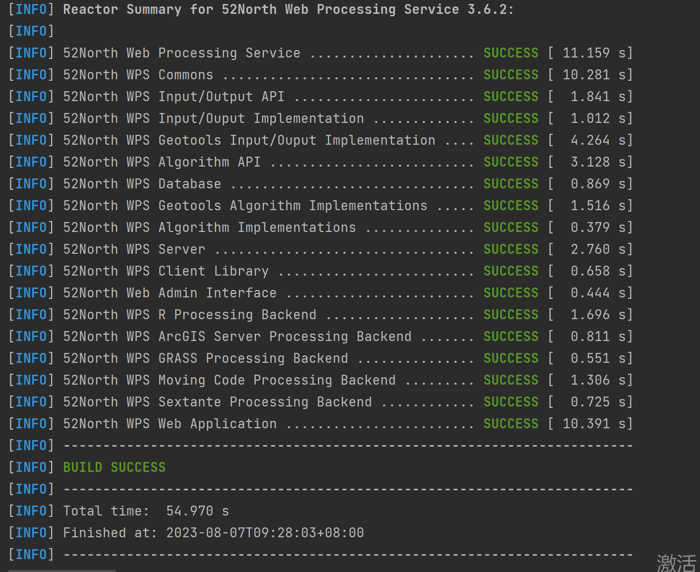
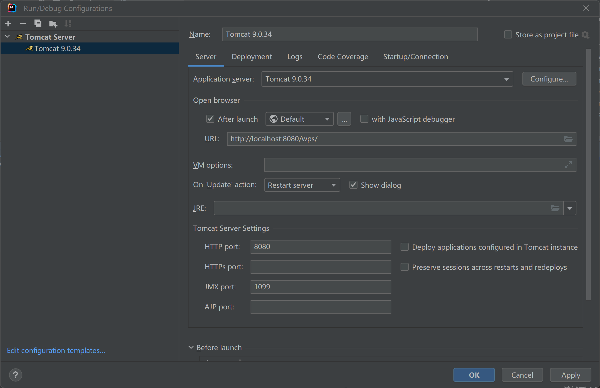

# 5.2 安装52 North WPS 框架

### 5.2.1 克隆WPS Git存储库

导航到您的本地目录(如果已经存在)，或者导航到一个方便的位置以在那里创建Git仓库。

执行以下命令：

```shell
git clone https://github.com/52North/WPS.git
```

WPS Git存储库将被克隆到子文件夹WPS中。

### 5.2.2 构建WPS

第一步，导入 Eclipse 或 IDEA，等待maven 下载相关依赖。使用Maven构建项目，`mvn clean install -P with-geotools -Dlicense.skip=true` ，其中，`-DSkipTests`为跳过测试，可以去掉。WPS的pom中，若部分插件如果报错，可以注释掉，确保项目pom文件中WPS模块的版本与需要使用的WPS版本相匹配。


第二步，构建项目 出现Build Success时说明项目安装成功


### 5.2.3.配置Tomcat

在前面的章节中我们已经安装了Tomcat，在IDEA的启动配置中选择Tomcat Server，出现Tomcat的配置面板。按照提示内容进行Tomcat配置，输入Name为Tomcat的版本名称，Application Server中选择Tomcat的安装目录即可，URL为项目启动的访问连接，HTTP port 选择项目启动端口号，此处默认为8080，如果端口号与其他项目冲突，可自行修改。



### 5.2.4 部署工件

Tomcat Server 配置完成后点击Deployment部署工件，当项目启动后，Build构建的war包会被部署到Tomcat中启动。Applicaiton context默认为war包名称，可以自定义修改，如/wps。完成配置后点击Apply再点击确定。


### 5.2.5启动Tomcat

点击项目启动按钮，WPS开始构建项目并部署，当进程结束后，会通过默认浏览器跳转到网页中，该网页由52N官方社区提供，通过GetCapabilities request using HTTP GET可以访问当前服务器中存在的算法列表。Client中包含对服务器的测试脚本，Documentation中包含项目文档。在Administration中是52North WPS的控制台，可以通过可视化界面上传和部署算法，在本文中，我们使用项目源代码以更灵活的方式来自定义算法服务。


### 5.2.6 测试项目

发送GetCapabilities 请求 查看已有算法，出现以下界面则表示项目启动和部署成功，能够访问到项目的默认算法服务。


