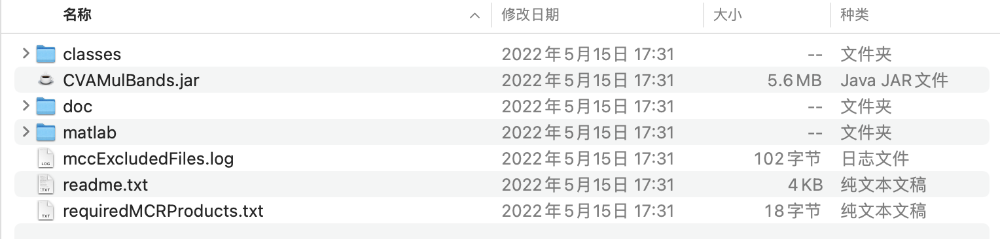
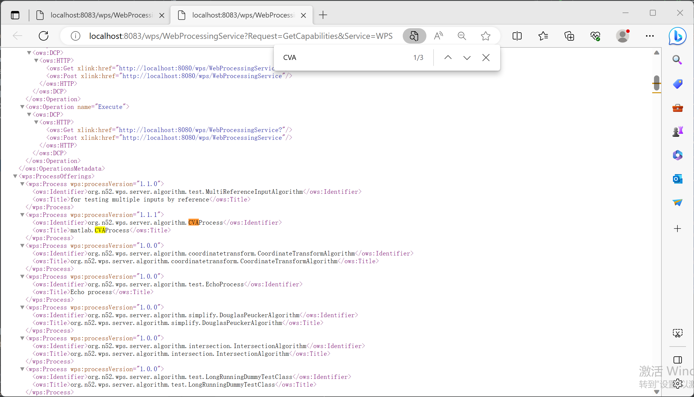
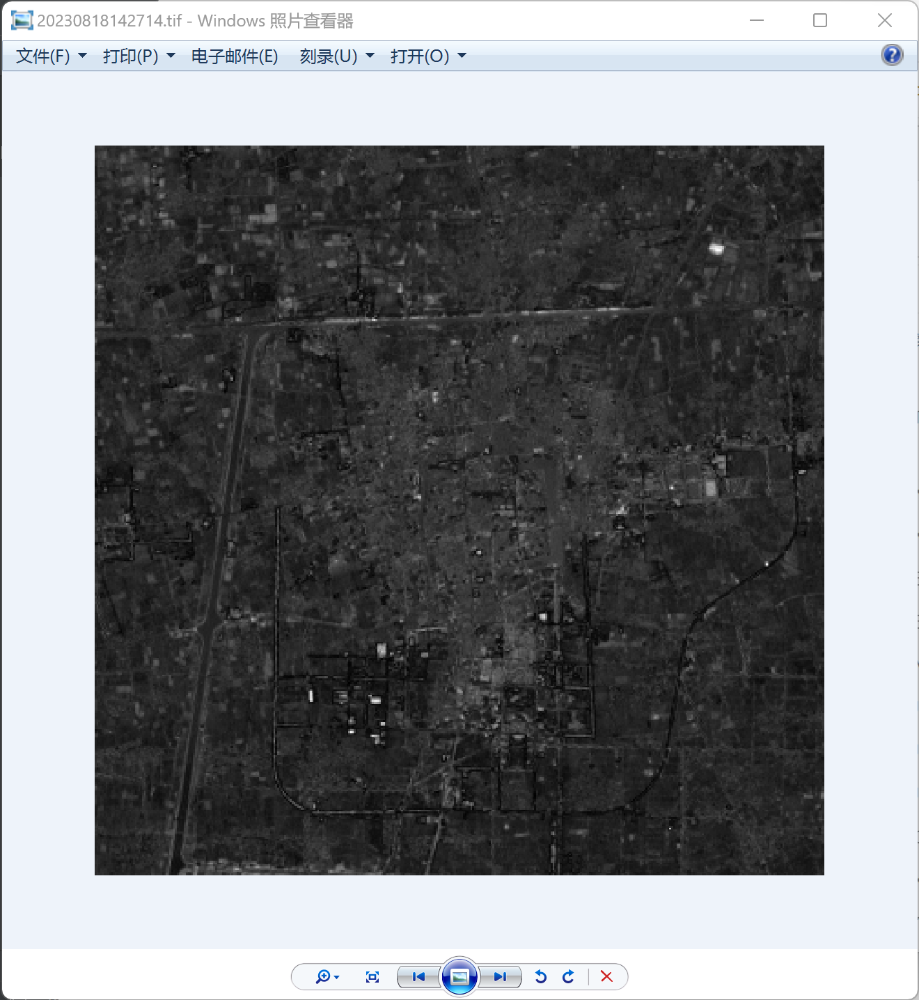

## 5.3 封装和发布自定义算法


此部分内容说明如何在52°North WPS中使用一个java文件开发和部署一个自定义处理过程。

**注意**，支持所选定的DataBinding 的所有Parsers/Generators的格式将会被添加到 ProcessDescription 文件中。如果你需要控制你的算法所支持的格式类型，你可能需要选择使用 [AbstractAlgorithm](https://wiki.52north.org/Geoprocessing/ExtendAbstractAlgorithm)，并参照此[教程](https://wiki.52north.org/Geoprocessing/ExtendAbstractAlgorithm). AbstractSelfDescribingAlgorithm 对ProcessDescription的某些特定元素有所限制。例如，你*不能指定处理（process）的标题和摘要*。如果需要更多的控制，可以 [继承 AbstractAnnotatedAlgorithm](https://wiki.52north.org/Geoprocessing/ExtendAbstractAnnotatedAlgorithm).

### 5.3.1 Matlab自定义算法封装

 准备算法文件(CVA变化强度计算为例)，注释掉 所有 imshow 界面显示的函数，将算法改为函数执行方式，其中r为返回值 - 将计算得到的值作为返回，使用Matlab运行CVA.m，确保能够执行并不包含UI函数。封装示例如下:

```matlab
function c = CVAMulBands(iA,iB,res)

InputTIFImageA = importdata(iA);
InputTIFImageB = importdata(iB);

[I,R] = geotiffread(iA);
info = geotiffinfo(iA);
disp(info)
A1= InputTIFImageA(:,:,1);%获取第1个波段
A2= InputTIFImageA(:,:,2);%获取第2个波段
A3= InputTIFImageA(:,:,3);%获取第3个波段
A4= InputTIFImageA(:,:,4);%获取第4个波段
A5= InputTIFImageA(:,:,5);%获取第5个波段
A6= InputTIFImageA(:,:,6);%获取第6个波段

B1= InputTIFImageB(:,:,1);%获取第1个波段
B2= InputTIFImageB(:,:,2);%获取第2个波段
B3= InputTIFImageB(:,:,3);%获取第3个波段
B4= InputTIFImageB(:,:,4);%获取第4个波段
B5= InputTIFImageB(:,:,5);%获取第5个波段
B6= InputTIFImageB(:,:,6);%获取第6个波段

A1=double(A1);A2=double(A2);A3=double(A3);A4=double(A4);A5=double(A5);A6=double(A6);
B1=double(B1);B2 =double(B2);B3 =double(B3);B4 =double(B4);B5 =double(B5);B6=double(B6);
C=sqrt((B1-A1).^2+(B2-A2).^2+(B3-A3).^2+(B4-A4).^2+(B5-A5).^2+(B6-A6).^2);
disp(C)
 amax = max(max(C));   
amin = min(min(C));  
a1=255*(C-amin)/(amax-amin); 
a1=uint8(a1);
%保存图像
outraster = a1;
filename = res;
geotiffwrite(filename, outraster,R, 'GeoKeyDirectoryTag', info.GeoTIFFTags.GeoKeyDirectoryTag);
c=1;
end

```

第二步,使用matlab runtime的 macc命令编译改算法文件，将其打包为jar包。

mcc命令的主要参数如下:

-m:指定入口函数所在的.m文件,这个文件包含了main函数。

-o:指定输出的jar包文件名。

-d:指定jar包输出的目录。

-v:显示详细的日志信息。

-R:搜索并包含依赖的其他.m文件。

-N:指定jar包中的包名。

-J:指定JVM最大内存。

-C:编译成class而不是jar包。

一个示例命令是:

`mcc -m main.m -o main.jar -d build -R -N com.example.main -J-Xmx512m`

这个命令会将main.m作为入口,编译打包成main.jar,输出到build目录,-R会包含依赖的其他.m文件,指定包名为com.example.main,JVM最大内存为512M。

打包CVA算法文件的示例命令如下：

```
mcc 
-W 'java:matlab.CVA,Matlab' 
-a 'D:/MatlabService/CVA-OSTU/CVA_mcc*' 
-d 'D:/MatlabService/CVA-OSTU/CVA_mcc' 
CVA.m
```

得到的文件结构如下所示：

使用mcc命令打包Matlab代码后,输出的目录中主要包含以下内容和结构:

- classes: 该目录包含了编译生成的Java class文件,这些是从Matlab代码编译而来,包含了主要的算法和逻辑。
- CVAMulBands.jar: 这是封装好的jar包jar包,在需要时引入。
- doc: 包含一些文档文件,比如使用说明等。
- matlab: 这个目录包含了一些Matlab代码中引用的资源文件,比如数据文件、图片等,打包时会一起带上。
- mccExcludedFiles.log: 编译时排除的一些文件日志。
- readme.txt: 使用说明的文档。
- requiredMCRProducts.txt: 当前项目依赖的Matlab Compiler Runtime产品清单。



### 5.3.2 扩展WPS-扩展抽象注解算法

第一步，新建 package: 如 `org.n52.wps.demo`；新建Class `CVA`使新类继承抽象注解算法`public class CVA extends AbstractAnnotatedAlgorithm {}`。

第二步，为该算法提供WPS的定义，这些注解为算法组件提供了重要的元信息,包括标识、版本、名称、描述等,方便算法的注册、发现和使用。

```java
@Algorithm(version = "1.1.1",
        identifier = "matlab.CVAProcess",
        title="matlab.CVAProcess",
        abstrakt = "This is CVAMulBandsAlgorithm image processing algorithm.")
```

第三步，继承 `AbstractAnnotatedAlgorithm`之后，需要实现一些方法，接收1-2个 `GenericFileData` 类型的复杂输入 `source`,存储为 `List<GenericFileData>` 类型的 `data`,提供字符串类型的字面量输出 `literalOutput`,使用注解标识输入输出绑定。

```java
public GenericFileData source;
private List<GenericFileData> data;
private String literalOutput;

@ComplexDataInput(identifier = "source", binding = GenericFileDataBinding.class,minOccurs=1, maxOccurs=2)

@SuppressWarnings("unused")
public void setData(List<GenericFileData> data) {
    log.info(String.valueOf(data));
    this.data = data; }

@LiteralDataOutput(identifier = "literalOutput")
public String getLiteralOutput() { return literalOutput; }
```

第四步，实现了算法组件的核心执行逻辑,包括数据处理、调用运算、构建结果响应等功能。

```java
    @Execute
    @SuppressWarnings("unused")
    public void run() {
    GenericFileData a1 = data.get(0);
    GenericFileData b1 = data.get(1);

  // 直接获取文件路径,无需创建File对象
String x1 = a1.getBaseFile().getAbsolutePath(); 
String y1 = b1.getBaseFile().getAbsolutePath();

// 使用更简短的日期格式化方式  
String fileName = new SimpleDateFormat("yyyyMMddHHmmss").format(new Date());

// 直接使用反射调用方法,无需先获取Method对象
Class<?> clazz = classLoader.loadClass(processId + ".Matlab");
clazz.getConstructor().newInstance()
     .invoke(methodName, 1, new Object[]{x1, y1, outputfile}); 

// 使用JSONObject构建JSON  
JSONObject json = new JSONObject();
json.put("code", "200");
json.put("filename", fileName + ".tif");
json.put("fileurl", fileurl);  
json.put("imagetype", "Intensity");

literalOutput = json.toString();
}
```

完整的代码如下所示：

```java
package org.n52.wps.server.algorithm;

import org.n52.wps.algorithm.annotation.Algorithm;
import org.n52.wps.algorithm.annotation.ComplexDataInput;
import org.n52.wps.algorithm.annotation.Execute;
import org.n52.wps.server.AbstractAnnotatedAlgorithm;
import org.n52.wps.algorithm.annotation.LiteralDataOutput;
import org.n52.wps.io.data.GenericFileData;
import org.n52.wps.io.data.binding.complex.GenericFileDataBinding;
import org.slf4j.Logger;
import org.slf4j.LoggerFactory;
import java.io.File;
import java.lang.reflect.Method;
import java.net.URL;
import java.net.URLClassLoader;
import java.text.SimpleDateFormat;
import java.util.Date;
import java.util.List;


/**
 * desc: <br />
 * Date: 2023/8/18 <br/>
 *
 * @author wanghaihang
 */
@Algorithm(version = "1.1.1",
        identifier = "matlab.CVAProcess",
        title="matlab.CVAProcess",
        abstrakt = "This is CVAMulBandsAlgorithm image processing algorithm.")
//@Slf4j
public class CVA extends AbstractAnnotatedAlgorithm {
    //定义处理id
    private String processId="matlab.CVAProcess";
    //定义jar包的位置
    private String jarPath="E://WPS-3.6.2/WPS-3.6.2/52n-wps-algorithm-impl/lib/CVAMulBands.jar";
    //定义matlab封装的方法名
    private String methodName="CVAMulBands";
    //定义数据存放路径tomcat下面
    private String tomcatDir="E:/Tomcat/apache-tomcat-9.0.34/webapps/";

    public GenericFileData source;
    private List<GenericFileData> data;
    private static final Logger log = LoggerFactory.getLogger(EchoProcess.class);
    private String literalOutput;

    @SuppressWarnings("unused")
    public CVA() {
    }

    @ComplexDataInput(identifier = "source", binding = GenericFileDataBinding.class,minOccurs=1, maxOccurs=2)
    @SuppressWarnings("unused")
    public void setData(List<GenericFileData> data) {
        log.info(String.valueOf(data));
        this.data = data; }

    @LiteralDataOutput(identifier = "literalOutput")
    public String getLiteralOutput() { return literalOutput; }

    @Execute
    @SuppressWarnings("unused")
    public void run() {

        GenericFileData a1 = data.get(0);
        GenericFileData b1 = data.get(1);

       // 直接获取文件路径,无需创建File对象
String x1 = a1.getBaseFile().getAbsolutePath(); 
String y1 = b1.getBaseFile().getAbsolutePath();

// 使用简短的日期格式化   
String fileName = new SimpleDateFormat("yyyyMMddHHmmss").format(new Date());

// 直接使用反射调用方法,无需先获取Method对象
Class<?> clazz = classLoader.loadClass(processId + ".Matlab");
clazz.getConstructor().newInstance()
     .invoke(methodName, 1, new Object[]{x1, y1, outputfile}); 

// 使用JSONObject构建JSON  
JSONObject json = new JSONObject();
json.put("code", "200");
json.put("filename", fileName + ".tif");
json.put("fileurl", fileurl);  
json.put("imagetype", "Intensity");

literalOutput = json.toString();
    }
}
```

### 5.3.3 注册WPS服务

在配置文件wps_config.xml中添加对注解算法的引用。

```xml
<Repository name="LocalAlgorithmRepository"
			className="org.n52.wps.server.LocalAlgorithmRepository" active="true">
<Property name="Algorithm" active="true">org.n52.wps.server.algorithm.CVAProcess</Property>
<Property name="Algorithm" active="true">org.n52.wps.server.algorithm.test.ImageProcess</Property>
<Property name="Algorithm" active="true">org.n52.wps.server.algorithm.SimpleBufferAlgorithm</Property>
······
</Repository>
```

向服务器发送Getcapabilities请求，查看是否添加为WPS服务。


### 5.3.4 执行自定义算法服务


使用Postman向服务器发送以下请求：

```xml
<?xml version="1.0" encoding="UTF-8" standalone="yes"?>
<wps:Execute service="WPS" version="1.0.0" xmlns:wps="http://www.opengis.net/wps/1.0.0" xmlns:ows="http://www.opengis.net/ows/1.1" xmlns:xlink="http://www.w3.org/1999/xlink" xmlns:xsi="http://www.w3.org/2001/XMLSchema-instance" xsi:schemaLocation="http://www.opengis.net/wps/1.0.0
  http://schemas.opengis.net/wps/1.0.0/wpsExecute_request.xsd">
  <ows:Identifier>org.n52.wps.server.algorithm.test.CVAProcess</ows:Identifier>
  <wps:DataInputs>
    <wps:Input>
      <ows:Identifier xmlns:ns1="http://www.opengis.net/ows/1.1">source</ows:Identifier>
      <wps:Reference xlink:href="http://localhost:8080/ILCSData/aa.tif" mimeType="image/tiff" />
    </wps:Input>
      <wps:Input>
      <ows:Identifier xmlns:ns1="http://www.opengis.net/ows/1.1">source</ows:Identifier>
      <wps:Reference xlink:href="http://localhost:8080/ILCSData/bb.tif" mimeType="image/tiff" />
    </wps:Input>
  </wps:DataInputs>
  <wps:ResponseForm>
    <wps:RawDataOutput  asReference="false" >
      <ows:Identifier>literalOutput</ows:Identifier>
    </wps:RawDataOutput>
  </wps:ResponseForm>
</wps:Execute>

```

输出配置为，Literaloutput，因此返回结果如下：

```json
[{"code":"200"},{"filename":"20230818142714.tif"},{"fileurl":"http://localhost:8080/ILCSData/"},{"imagetype":"Intensity"}]
```

在浏览器中输入http://localhost:8080/ILCSData/20230818142714.tif ，可以看到输出结果，由两期影像计算出的变化强度图像。





注意：

1 不同版本的MCR和JDK编译的文件存在执行差异

2 打包好算法后先查看doc下的文档 查看class中是否编译好了执行函数的输入参数，如: OTSU(int, Object...) - matlab.OTSU.Matlab Provides the standard interface for calling the OTSU MATLAB function with 2 comma-separated input arguments.

3 在IDEA控制台中，如果出现空指针异常，检查请求XML配置文件是否存在算法identifier