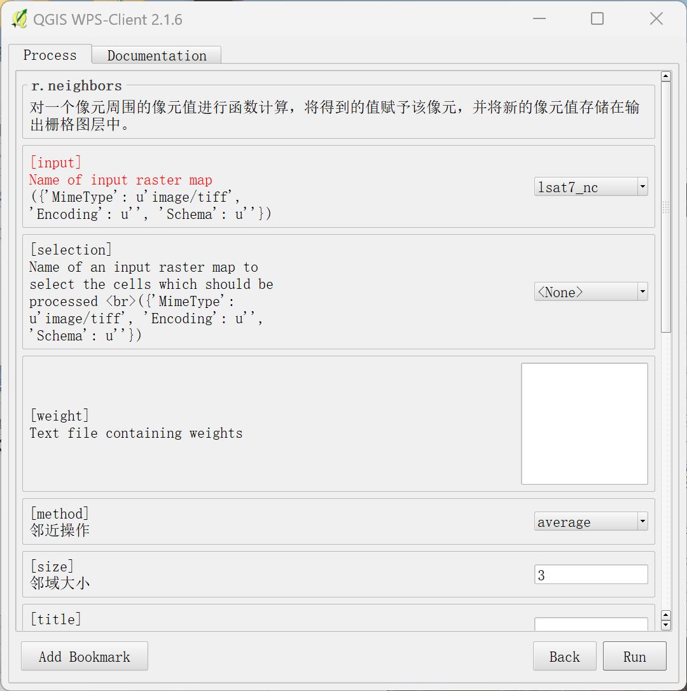
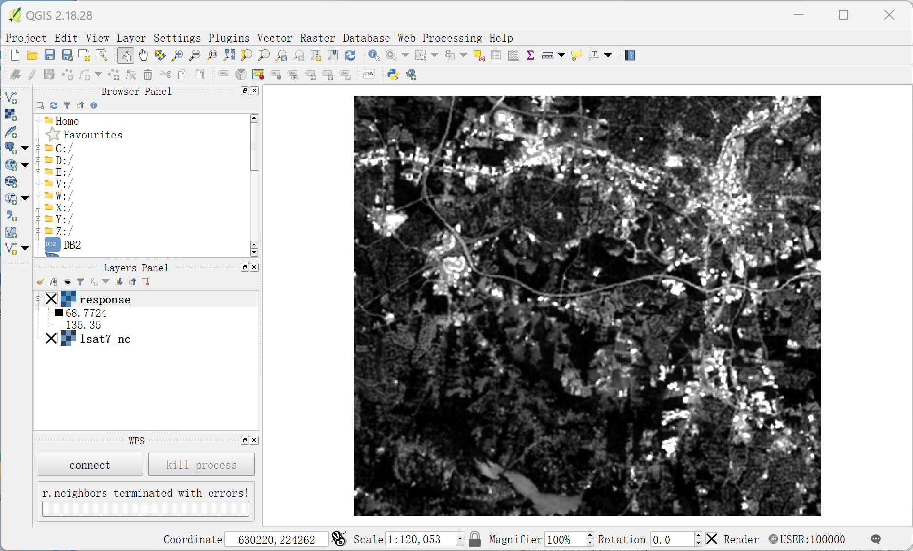

## 5.5 客户端调用WPS服务

### 5.4.3  GRASS: r.neighbors

r.neighbors - 使每个像元类别值成为分配给其周围像元的类别值的函数，并将新像元值存储在输出栅格地图图层中。

r.neighbors查看栅格输入文件中的每个像元，并检查分配给其周围某些用户定义的“邻域”中的像元的值。它输出一个新的栅格地图图层，其中每个像元都被分配一个值，该值是该像元邻域中的值的某个（用户指定的）函数。例如，输出层中的每个像元可能被分配一个值，该值等于输入层中其 3 x 3 像元“邻域”中出现的值的平均值。请注意，中心单元格也包含在计算中。

r.neighbors为基于邻域平均值、中值、众数、最小值和最大值的输出地图图层复制与输入栅格地图图层关联的GRASS颜色文件。由于标准差、方差、多样性和散布是索引，而不是输入值的直接对应项，因此不会为这些地图图层复制颜色文件。（用户应注意，虽然颜色文件是为平均邻域函数输出而复制的，但颜色文件对于输出是否有意义将取决于输入数据值。）

- input=name [required]
  输入栅格地图的名称

- selection=name
  用于选择要处理的像元的输入栅格地图的名称

- output=name[,name,...] [required]
  输出栅格地图的名称

- method=string[,string,...]
  邻域操作
  可选: average, median, mode, minimum, maximum, range, stddev, sum, count, variance, diversity, interspersion, quart1, quart3, perc90, quantile
  默认值: average

- size=integer
  邻域大小
  默认值: 3
- title=phrase
  输出栅格地图的标题
- weight=name
  包含权重的文本文件
- gauss=float
  高斯过滤器的西格玛(以单元为单位)
- quantile=float[,float,...]
  要为方法计算的分位数=分位数
  可选: 0.0-1.0

### 5.4.4 QGIS调用GRASS服务

打开QGIS 2.18和已经安装好的WPS插件（见环境准备5.1），加载数据lsat7_nc，数据和插件位于附录中。

专著_第五章：Java构建WPS服务实践/img/5.4使用GRASS_GIS作为WPS服务/img-2023-08-16-19-16-22.png)

点击WPS插件的connect，输入部署的52North地址，如http://localhost:8080/wps/WebProcessingServices/，并点击Connect，插件会获取已注册的全部WPS服务。

专著_第五章：Java构建WPS服务实践/img/5.4使用GRASS_GIS作为WPS服务/img-2023-08-16-19-17-19.png)

选中r.neighbors，双击可以看到Process的交互窗口，输入我们加载的数据，并设置GRASS_Band数量为1，其他保持默认设置，点击执行，可以得到处理结果。

