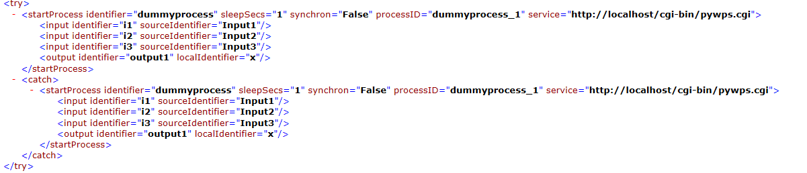
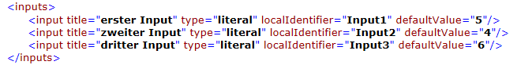
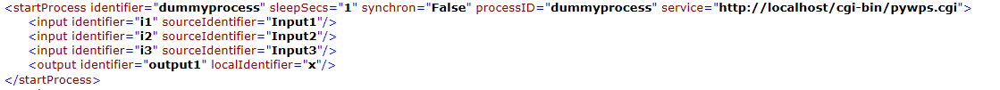

### 6.2.1 计划的目的

该程序是对允许链接WPS进程的PyWPS的扩展。该工作流被描述为一个XML文档。可以将该文档发送到PyWPS，在那里将其转换为一个PyWPS流程并进行注册。然后，它就可以像正常的PyWPS进程一样执行。

### 6.2.2 XML文档的结构

XML有三个部分，即输入部分、描述流程的部分和输出部分。
每个工作流都以根元素“WORKFORK”和属性“IDENTIFIER”开始，该属性是工作流的名称，以后可以使用该名称将其作为一个PyWPS流程进行调用。

在输入部分中，定义了流程链的输入。当作为PyWPS流程调用工作流时，可以将这些输入传递给工作流。

它从INPUTS标记开始。在INPUTS元素中，定义了不同的输入及其属性。

每个输入标记都必须包含属性“title”，这是流程标题、属性“type”(可能的值是文本和复杂，对应于可能的WPS输入和输出类型)和属性“localIdentifier.”。这是可以在流程链中引用输入的变量。此外，还可以定义属性“defaultValue”。

描述过程的部分包含启动过程的所有信息，并定义了这些输入和输出之间的关系。

每个“startProcess”元素都必须在try/Catch块中。首先执行“try”标记内的进程，如果失败，则执行“Catch”标记内的进程。就像在示例中一样，它们可以是相同的；只是XML描述的形式主义导致了这种加倍。

调用流程所需的信息包含在“startProcess”标记的属性中。下面列出了可能的属性。

| **属性**   | **描述**                                |
| ---------- | --------------------------------------- |
| identifier | 进程的标识符，如getCapbilites描述中所示 |
| processID  | 流程链中流程的名称                      |
| service    | WPS服务的URL                            |
| synchron   | 同步为True，异步流程执行为False         |
| sleepSecs  | 进程以异步方式执行时的休眠秒数          |

IDENTIFIER、PROCESSID、SERVICE是必选的，SYNCHRON、SLEEPSecs是可选的。如果流程只包含文字输入，则它将以异步方式执行。如果您想要异步执行它，必须将“Synchron”设置为“False”。如果流程包含Complex Input，它将始终以异步方式执行。“sleepSecs”是指异步流程执行的休眠秒数。默认是3个S。

流程的输入在“startProcess”元素的子元素中描述。有三种方法来描述流程输入。它们都有一个共同点，那就是它们都需要“IDENTIFIER”属性，这是流程中指定的输入的名称。差异就是输入的来源。

1. 流程输入是工作流的输入。则需要属性“SourceIdentifier.”它获取相应工作流输入的属性“LocalIdentifier”的值。
 

2. 流程输入是前一个流程的输出。
   然后是属性“SourceName”和“SourceProcess”，前者是进程输出的标识符，后者是输出所来自的进程的进程ID。

   

3. 该流程的输入是前一流程的输出，并获得了引用。
   可以为进程的输出指定一个特定名称，以便在工作流中引用该名称。这一点将在下一段中解释。该输出可以用作输入，方法是使用带有输出名称的属性“本地标识”。

   

如前所述，可以为流程的输出指定一个特定的名称，以便在以后的流程中引用它们。这看起来像这样：

它们或者使用“process ID”和它们来自的进程的“标识符”来描述，或者使用“localIdentifier”来描述。
在PyWPS的TESTS文件夹中可以找到一个示例工作流“Example.py”。

### 6.2.3 流程链的注册

有两种方法可以将XML转换为PyWPS流程。第一种方法是调用“manuellParser.py”，它位于“进程”目录中。该命令是

`Python manuellParser.py“Location of XML”“流程链的名称”`

该命令将把XMLExample.xml转换为流程链Example.py。

`$python manuellParser.py/home/user/Shared/Example.xml Example.py`

不要忘记将进程的名称(在本例中)写入“_init_.py”文件。然后，可以像调用普通的PyWPS流程一样调用流程链。

还可以将XML作为进程“ReceieveXML”的输入发送到Web服务器。

为此，ApacheWeb服务器需要对“进程”目录具有写入访问权限。这必须首先完成。

执行请求可能如下所示：

输入的是XML的位置和密码。如果您想要更改流程，可以更改XML的内容，并使用相同的密码再次执行ReceieveXML。此机制应可防止其他进程被覆盖。