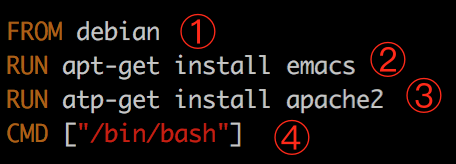

#  什么是镜像以及镜像分层详解

## 什么是镜像

镜像是一种轻量级、可执行的独立软件包，用来打包软件运行环境和基于运行环境开发的软件，它包含运行某个软件所需的所有内容，包括代码、运行时库、环境变量和配置文件

Docker镜像是由文件系统叠加而成。最底端是一个引导文件系统，即bootfs，这很像典型的Linu/Unix的引导文件系统。Docker 用户几乎永远不会和引导文件系统有什么交互。实际上，当一个容器启动后，它将会被移到内存中，而引导文件系统则会被卸载（ummount），以留出更多的内存供initrd 磁盘镜像使用。

到目前为止，Docker看起来还很像一个典型的Linux 虚拟化栈。实际上，Docker镜像的第二层是root文件系统 rootfs，它位于引导文件系统之上。rootfs可以是一种或多种操作系统（如Debian或者 Ubuntu文件系统）。

在传统的Linux 引导过程中，root文件系统会最先以只读的方式加载，当引导结束并完成了完整性检查之后，它才会被切换为读写模式。但是在 Docker里，root文件系统永远只能是只读状态，并且Docker利用联合加载（union mount）技术又会在root文件系统层加载更多的只读文件系统。联合加载指的是一次同时加载多个文件系统，但是在外面看起来只能看到一个文件系统。联合加载会将各层文件系统叠加到一起，这样最终的文件系统会包含所有底层的文件和目录。

Docker 将这样的文件系统称为镜像。一个镜像可以放到另一个镜像的顶部。位于下面的镜像称为父镜像（parent image），可以依次类推，直到镜像栈的最底部，最底部的镜像称为基础镜像（base image）。最后，当从一个镜像启动容器时，Docker会在该镜像的最顶层加载一个读写文件系统。我们想在Docker中运行的程序就是在这个读写层中执行的。


当 Docker 第一次启动一个容器时，初始的读写层是空的。当文件系统发生变化时，这些变化都会应用到这一层上。比如，如果想修改一个文件，这个文件首先会从该读写层下面的只读层复制到该读写层。该文件的只读版本依然存在，但是已经被读写层中的该文件副本所隐藏。


通常这种机制被称为写时复制（copy on wrte），这也是使Docker如此强大的技术之一。每个只读镜像层都是只读的，并且以后永远不会变化。当创建一个新容器时，Docker 会构建出一个镜像栈，并在栈的最顶端添加一个读写层。这个读写层再加上其下面的镜像层以及一些配置数据，就构成了一个容器。容器是可以修改的，它们都有自己的状态，并且是可以启动和停止的。容器的这种特点加上镜像分层框架（image-layering famework），使我们可以快速构建镜像并运行包含我们自己的应用程序和服务的容器。

## Docker镜像加载原理

### UnionFs：联合文件系统

UnionFs(联合文件系统)：Union文件系统(UnionFs)是一种分层、轻量级并且高性能的文件系统，它支持对文件系统的修改作为一次提交来一层层的叠加，同时可以将不同目录挂载到同一个虚拟文件系统下，UnionFs联合文件系统是Docker镜像的基础，镜像可以通过分层来进行继承，基于基础镜像（没有父镜像），可以制作各种具体的应用镜像特性：一次同时加载多个文件系统，但从外面看起来，只能看到一个文件系统，联合加载会把各层文件系统叠加起来，这样最终的文件系统会包含所有底层的文件和目录。

**Docker镜像加载原理**

Docker的镜像实际上由一层一层的UnionFs文件系统组成bootfs：主要包含 bootloader和 Kernel，bootloader主要是引导加 kernel，Linux刚启动时会加bootfs文件系统，在 Docker镜像的最底层是bootfs，这一层与我们典型的Linux/Unix系统是一样的，包含bootfs加载器和内核，当bootfs加载完成之后整个内核就都在内存中了，此时内存的使用权已由 bootfs转交给内核，此时系统也会卸载bootfs。

rootfs：在 bootfs之上，包含的就是典型 Linux系统中的/dev、/proc、/bin、/etc等标准目录和文件，rootfs就是各种不同的操作系统发行版，比如：Ubuntu、CentOS等等


简单理解：

1. 对于Docker安装OS来说：就是Docker使用了Linux本身的bootfs，只需要安装自己所需的rootfs。

2. 对于Docker安装普通镜像来说：就是Docker本身是分层下载镜像，所以可以提取出公共层镜像，进行复用。

### Docker镜像的特点

Docker镜像都是只读的，当容器启动时，一个新的可写层加载到镜像的顶部，这一层就是我们通常说的容器层，容器之下的都叫镜像层


Commit镜像
```
# 提交本地镜像 
# -a：作者信息 -m：描述信息 容器ID 镜像名称:版本信息
docker commit -a="test" -m="test" 容器id tomcat01:1.0
```

## 镜像的分层结构


Docker 支持通过扩展现有镜像，创建新的镜像。实际上，Docker Hub 中 99% 的镜像都是通过在 base 镜像中安装和配置需要的软件构建出来的。比如我们现在构建一个新的镜像，Dockerfile 如下：



1. 新镜像不再是从 scratch 开始，而是直接在 Debian base 镜像上构建。
2. 安装 emacs 编辑器。
3. 安装 apache2。
4. 容器启动时运行 bash。


可以看到，新镜像是从 base 镜像一层一层叠加生成的。每安装一个软件，就在现有镜像的基础上增加一层。为什么 Docker 镜像要采用这种分层结构呢？

最大的一个好处就是 - 共享资源。

比如：有多个镜像都从相同的 base 镜像构建而来，那么 Docker Host 只需在磁盘上保存一份 base 镜像(因为镜像的ID唯一)；同时内存中也只需加载一份 base 镜像，就可以为所有容器服务了。而且镜像的每一层都可以被共享，我们将在后面更深入地讨论这个特性。

这时可能就有人会问了：如果多个容器共享一份基础镜像，当某个容器修改了基础镜像的内容，比如 /etc 下的文件，这时其他容器的 /etc 是否也会被修改？

答案是不会！修改会被限制在单个容器内。这就是我们接下来要学习的容器 Copy-on-Write 特性。


## 可写的容器层

当容器启动时，一个新的可写层被加载到镜像的顶部。这一层通常被称作“容器层”，“容器层”之下的都叫“镜像层”。


所有对容器的改动 - 无论添加、删除、还是修改文件都只会发生在容器层中。只有容器层是可写的，容器层下面的所有镜像层都是只读的。

镜像层数量可能会很多，所有镜像层会联合在一起组成一个统一的文件系统。如果不同层中有一个相同路径的文件，比如 /a，上层的 /a 会覆盖下层的 /a，也就是说用户只能访问到上层中的文件 /a。在容器层中，用户看到的是一个叠加之后的文件系统。

- 添加文件
在容器中创建文件时，新文件被添加到容器层中。

- 读取文件
在容器中读取某个文件时，Docker 会从上往下依次在各镜像层中查找此文件。一旦找到，打开并读入内存。

- 修改文件
在容器中修改已存在的文件时，Docker 会从上往下依次在各镜像层中查找此文件。一旦找到，立即将其复制到容器层，然后修改之。

- 删除文件
在容器中删除文件时，Docker 也是从上往下依次在镜像层中查找此文件。找到后，会在容器层中记录下此删除操作。

只有当需要修改时才复制一份数据，这种特性被称作 Copy-on-Write。可见，容器层保存的是镜像变化的部分，不会对镜像本身进行任何修改。

这样就解释了我们前面提出的问题：容器层记录对镜像的修改，所有镜像层都是只读的，不会被容器修改，所以镜像可以被多个容器共享。


转载 ：https://blog.csdn.net/qq_34556414/article/details/107211603