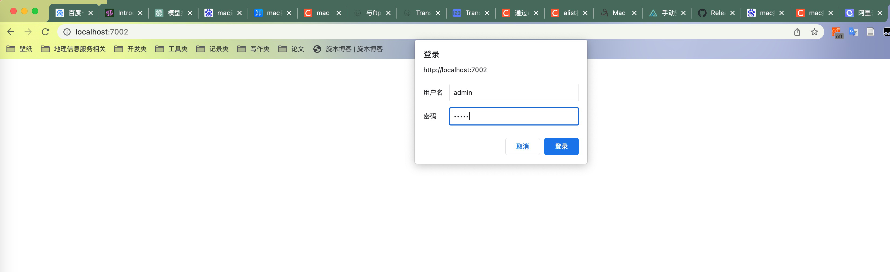
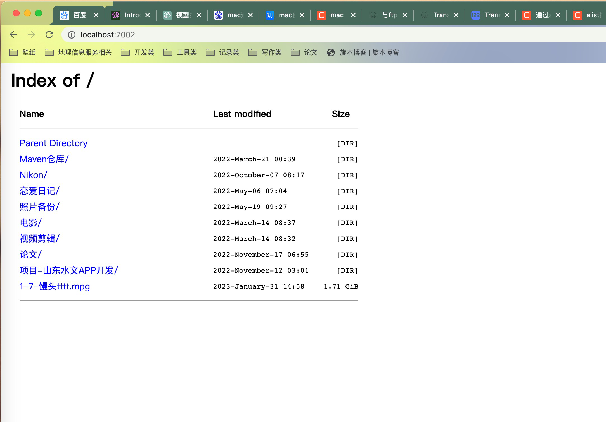
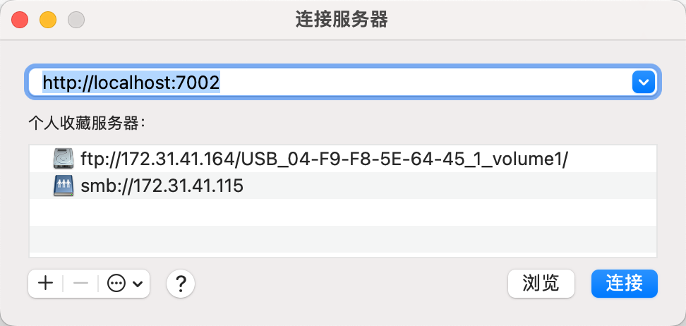
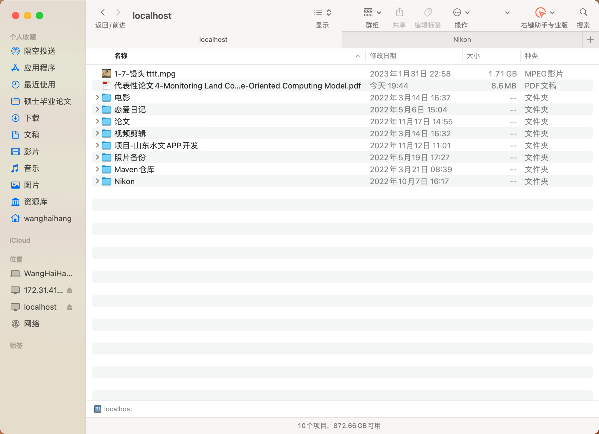
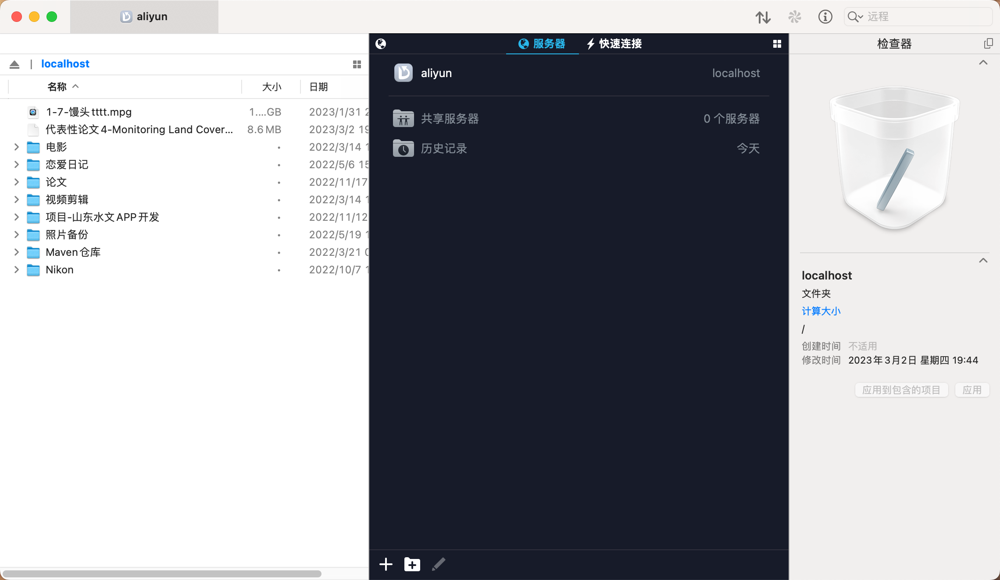

# 挂载阿里云盘
## webdav-aliyundriver安装：
github：https://github.com/messense/aliyundrive-webdav

或

docker pull messense/aliyundrive-webdav:latest

## 获取阿里云refreshtoken，

## 运行

`docker run -d --name=aliyundrive-webdav --restart=unless-stopped -p 7002:8080   -v /etc/aliyundrive-webdav/:/etc/aliyundrive-webdav/   -e REFRESH_TOKEN='ef9ac4f9c88d446e8d3e04dbfbb1b33a'   -e WEBDAV_AUTH_USER=admin   -e WEBDAV_AUTH_PASSWORD=admin  messense/aliyundrive-webdav:latest`

## 测试
输入http://localhost:7002，点击连接，用户名密码都是刚刚启动时设置的admin

## 文件夹挂载

## Transmit 挂载

