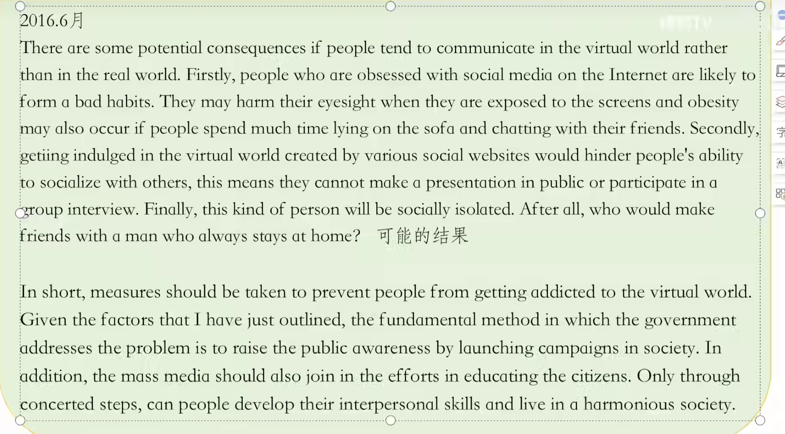

# 六级写作

## 六级写作介绍

 ### 题型
- 题型1：格言类

Directions: For this part you are allowed 30 minutes to write an essay commenting on the saying "Earth provides enough to satisfy every man's need but not every Iman's greed. You can cite examples to illustrate yout point. You should wtite at least 150 words but no more than 200 words.

- 题型2：图片式

图表式 ：图表类

- 题型3：议论式

Directions: For this part, you are alowed 30 minutes to wtite an essay on why students should be encouraged to develop the ability to meet challenges.

Directions: Fot this part, you are allowed 30 minutes to write an essay On why students should be encouraged to develop effective comnmunication skills.

### 顺序：

开考第一项，与听力一起交卷

### 标题：

大多不需要写标题，除非题目特别要求，如：Directions: For this part, you are allowed 30 minutes to write a short essay on the topic of **My View on University Ranking** You should wtite at least 150 words and no more than 200 words.

### 格式：

每段顶格写，写完之后空一整行。  

单词之间有间隔，标点之后有间隔

### 段落

## 如何分析写作任务？
*what/how/why*

- 名言警句型：概括与抽象能力 （Why）

Directions : For this part you are allowed 30 minutes to write an essay commenting on the saying "Earth provides enough to satisfy every man's need but not every man's greed." You can cite examples to ilustrate your point.

感恩的心、过度索取

A curse can e a blessing in disguise.————stay positive 保持积极乐观的态度

It is unwise to put all eggs in just one basket.————avoid（prevent） risk 规避风险

Wealth of the mind is the only true wealth.———— 具像化：知识、经验等

- 漫画型 
  

（What） 讨论的是结果

- 议论类

## 怎么写首段
### 首段-当题目存在对立的矛盾：

高分模板:

1. In the contemporary society,时间状语

2. there is a heated debate over whether....题目矛盾 

3. Some believe that..., while others harbour(怀有某种想法)  the idea that.... 题目具体内容

4. From my perspective, I stand for the former/latter one. 抛出观点

eg1:

***Directions: Suppose you are asked to give advice On whether to attend college at home or abroad, write an essay to state yout opinion.***

In the modern world, especially fot this increasingly globalised world, there has been a heated bebate / controversy over whether student should go to  domestic university or study abroad. Some believe that studying in China give them a better career prospect, while others harbour the idea that studying overseas could offer them an unforgettable experience. From my perspective, I  stand for the former one.

在现代世界，尤其是在这个日益全球化的世界里，关于学生应该去国内大学还是出国留学，一直存在着激烈的争论。一些人认为在中国留学会给他们带来更好的职业前景，而另一些人则认为出国留学可以给他们带来一次难忘的经历。在我看来，我代表的是前者。

eg2:

***Directions: Fot this part, you are allowed 30 minutes to write importance of having a sense of family responsibility.***

In the modern world, especially fot the working adults, there has been a heated bebate/ controversy over whether they should cultivate sense of family responsibility. Some believe that the cultivation of family responsibility can be conducive to a closer family bonds, while others hatbour the idea that one should focus more on work at social life. From my perspective, I stand fot the former one.

在现代社会，尤其是对于打工的成年人来说，关于他们是否应该培养家庭责任感的问题一直存在着激烈的争论。一些人认为培养家庭责任感有助于建立更紧密的家庭纽带，而另一些人则反对一个人应该更多地专注于工作而不是社交生活。在我看来，我支持前一种观点。

### 首段- 针对本质为“重要性的”题目

高分模板:

1. It is widely accepted that sth plays a key role in... 人们普遍认为某事在……中起着关键作用

2.  Were it not for..., it would be harder to for sb to do..要不是……，某人做某事将是困难的。

- There is no/little doubt that... 毫无疑问/众所周知的是…

- It cannot be denied that... 不可否认的是……

- It is widely accepted /acknowledged that... 人们普遍接受/承认……

- There is a growing recognition that.. 越来越多的人认识到……

高分句型:

…. 是十分重要/必要的

- sth plays an extremely important role. 某事起着极其重要的作用。

- sth is of great importance  某事很重要

- nothing is more important than 没有什么比这更重要了

*常见替换:*

*significant, essential, indispensable, paramount, key*

 

 

### 首段-针对名言型题目
1.  there has been much debate/ controversy over..  ……引起了许多争论。

2. It is widely accepted that sth plays a key tole in... 人们普遍认为某事在……中起着关键作用

3.  As a famous saying goes,....  正如一句名言所说，……
 
4.  From my perspective, this proverb tells us that we cannot ....unless..... 在我看来，这句谚语告诉我们，我们不能……除非……

### 首段- 针对社会现象类题目

1.  In the contemporary society/With out society developing increasingly fastet, there is a prevalent phenomenon that people in growing numbers..  在当代社会，随着社会的日益发展，有一个普遍的现象，那就是越来越多人....

2. To illustrate, We can often see that.....举个例子，我们经常可以看到……

3. Obviously, this issue has already given rise to a lot of public concerns /some prompt actions should be taken to tackle this issue.显然，这个问题已经引起了许多公众的关注/应该采取一些迅速的行动来解决这个问题。

### 首段-漫画类

1. As is explicitly demonstrated in the cartoon, A is doing.. and B says with doubt/itony/ certainty...--正如卡通画中清楚地展示的那样，A正在做..B带着怀疑/怀疑/肯定的口吻说。

2.  Then, A looks rather embatrassed/frustrated/ disappointed.然后，A看起来相当受挫/沮丧/失望。

3.  Apparently, this cartoon aims to tell us that in order to.., sb should ..显然，这幅漫画旨在告诉我们，为了……，某人应该……

### 首段-图表类

1. As is explicitly illustrated by the figures in the table(line graph/pictute /pie chart/ bar chart),  如表中的图(折线图/图片/饼图/条形图)所明确示出的，

2. XXX has been on (rise / decrease) (significantly/ dramatically/steadily) from ...in ...to...in... 从……到……，xxx一直在(显著地/显著地/稳定地)(上升/下降)。

3. From the sharp / matked decline /rise in the chart, it goes without saying that....  从图表上的大幅下跌/上涨来看，不用说……

## 正文高分模板

- 第一句- 回答原因:

There are a multitude of reasons accounting for …  造成…的原因有很多

The are d multitude of reasons that should be responsibile fot this alatming trend.（消极主题）造成这一趋势的原因有很多。

The reasons why I stand fot ..... are as follows.我支持的理由是……如下所示。

- 第一句-回答结果:

There are some potential consequences if sth... 如果……会有一些潜在的后果。

The potential consequences are as follows. 如果……会有一些潜在的后果。

- 第一句-回答方式:

There are certainly some measures that can be taken to tackle this issue. 当然，可以采取一些措施来解决这个问题。

Some reasonable measures can certainly be taken to help...  当然可以采取一些合理的措施来帮助……

### 正文- 若题目要求分析原因

Firstly, students who can meet challenges bravely

they will have a positive outlook on life and would always make every endeavour in life. Aftet all, nobody would refuse to make friends with such a man with so much positive energy and enthusiasm.
他们会有积极的人生观，永远会在生活中尽一切努力。毕竟，没有人会拒绝和这样一个充满正能量和热情的人交朋友。

中国在口语方面取得巨大成就的原因是多方面的。
首先，中国经济的快速增长促进了城市化进程，因为政府有足够的资金发展郊区的基础设施。其次，在过去的几十年里，技术取得了突破，这意味着农村阿特阿斯发生了巨大的变化。例如，高速尾道的建设将大城市与小城镇联系起来。最后，为了缩小贫富差距，实现共同富裕，中国政府在农村地区的教育和医疗服务方面投入了大量资金，使其成为一个舒适宜居的地方。

comment on = explain 解释

例子中 需要解释中国城镇化的原因

### think harder 素材

1. technology

   - contribute to the development of technology -technological innovations 助力科技发展--科技创新
  - provide talents for the country and they can contribute to country's development为国家输送人才，才能为国家发展作出贡献

2. travel

   - broaden one's horizons be more open-minded and embrace the different cultutes开阔眼界，更加开放，接受不同的文化

3. right/ responsibility

   - enhance the awareness of law to defend theit basic right增强法律意识维护公民基本权利

   - cultivate the sense of responsibility and learn to take up the responsibility independently gtow into a mature individual培养责任感，学会独立担当，成为一个成熟的人

4. education

   - be equipped with the professional knowledge and practical skills 一 find a decent job 
 具备专业知识和实践技能一找到一份体面的工作
   - nartow the disparity between the rich and the poor缩小贫富差距 social equality

5. environment

   - maintain the balance of ecosystem 一 prevent animals from extinction 维护生态系统平衡一防止动物灭绝
   - keep the ait clean 一 reduce the incidence of developing respiratory diseases保持AIT清洁一降低发展中呼吸道疾病的发病率

6. economy

   - boost the national economy 一 people's living standard will be improved and international status will be improved一将提高人民的生活水平，提高国际地位

   - governments can allocate more funds to scientific research so as to make technological breakthroughs政府可以将更多的资金用于科学研究，以实现技术突破

7. health

   - people will keep in Q good conditions 一 they can ensure their working efficiency SO that the society can operate smoothly.人们会保持良好的工作状态，一才能保证他们的工作效率，从而使社会能够顺利运行。

   - if people are all in good conditions, the financial burden of medical services on governments will be greatly reduced   .如果人们都身体状况良好，政府在医疗服务方面的财政负担将大大减轻

8. culture

   - cultural diversity can be enhanced 一 people will have a colorful life and experience exotic customs and traditions in theit own country.文化多样性可以增强一人们将在自己的国家拥有丰富多彩的生活和体验异国风情和传统。

   - cultural diversity can be enhanced reduce the cultural misunderstanding and conflicts, which is a symbol of social progress.文化多样性可以增强，减少文化误解和冲突，这是社会进步的标志。

9. Crime 犯罪
**——与教育联系在一起**
   - high moral standards so that the crime rates will be controlled 一 the public will have Q sense of security.
高尚的道德标准，让犯罪率得到控制，公众才会有安全感。

如果人们倾向于在虚拟世界中进行交流，而不是在现实世界中，这会产生一些潜在的后果。首先，沉迷于互联网社交媒体的人很可能养成坏习惯。当他们暴露在屏幕前时，他们可能会损害视力，如果人们花很多时间躺在沙发上和朋友聊天，也可能发生肥胖。
其次，沉迷于各种社交网站创造的虚拟世界会阻碍人们与他人交往的能力，这意味着他们不能在公共场合发表演讲或参加集体采访。最后，这种人会被社会孤立。毕竟，谁会和一个总是呆在家里的男人交朋友呢？

## 结尾高分模板

### 论措施

1. government 政府

   - launch a campaign for + 题目主题 + to arouse people's awareness of sth （发起一场运动以唤起人们对某事的认识）
   - invest in sth 一+题目主题

   - enact laws to force sb to do（制定法律）

2. individual 个人

   - endeavor to form a good habit + 题目主题（努力养成好习惯）

   - be more passionate and positive about life 对生活充满激情和积极

3. parents and schools 家长和学校

   - parents should set a good example for their children 一 guide theit children in a tght wqy 
父母应该为孩子树立好榜样，引导孩子正确的生活方式

   -  attach great importance to children's moral education and develop their practical skills.高度重视少年儿童的道德教育，培养他们的实践技能。

有一些措施可以帮助人们在工作职责和个人利益之间保持平衡。首先，我认为对人们来说最重要的因素是提高他们的工作效率，这样他们的生产力就会提高，他们就可以更轻松地完成他们的工作。在这种情况下，他们可以在自己的爱好上腾出一些时间。其次，政府可以发起一场运动，要求合理的工作时间安排，确保人们在工作场所的紧凑，这样他们就不会加班。最后，个人可以选择与信息技术人员相关的工作，这意味着他们将对信息技术工作充满热情。

###  **万能套句1：**

In short,+文章主题．

总之,

It is high time that people should take full advantage of existing opportunities advocate/curb this social phenomenon. Only in this way can we live in Q hatmonious and liveable society with supportive qtmosphere and loving citizens.

现在是人们充分利用现有机会倡导/遏制这一社会现象的时候了。只有这样，我们才能生活在一个充满仇恨和宜居的社会里，有支持的氛围和有爱心的公民。

### **万能套句2：**

Given the factors that I have just outlined, the fundamental method in which the government addresses the problem /advocates this phenomenon is  to taise the public awareness of ....  by launching campaigns in society. In addition, the mass media should also join in the efforts in educating the citizens to.... Only thtough concerted steps, can our society make progress in....

考虑到我刚才概述的因素，政府解决问题/倡导这种现象的根本方法是提高公众对……的认识。通过在社会上发起运动。此外，传媒亦应积极参与，教育市民……只有齐心协力，我们的社会才能在……中进步。

###  **万能套句3：**

To sum up, while XXX  can ...,it is just like a doubleedged swotd i people cannot make use of it properly. We must bear in mind that we should avoid the undesitable effects of..., when taking advantage of it. Only in this way can we...

总而言之，虽然xxx可以…，它就像一把双刃剑，人们不能正确地利用它。我们必须牢记，在利用……的时候，我们应该避免……的不可阻挡的影响。只有这样，我们才能..

### example 

