# 六级翻译
 
## 1. 句子的拆分与重组

**核心原则:拆主干，补修饰** 。把...的先拿掉，找出主语，再一步步加入修饰词
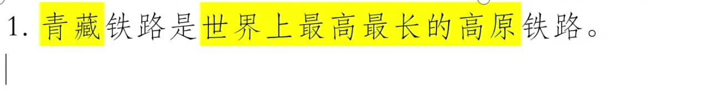
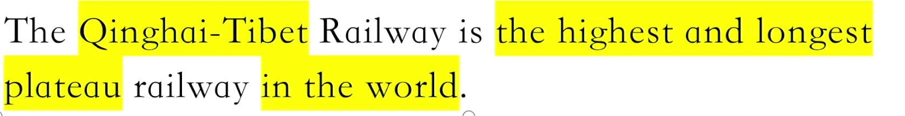

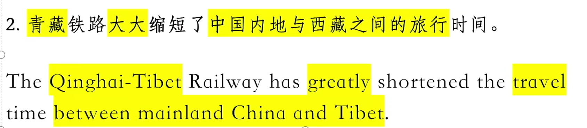

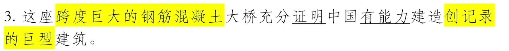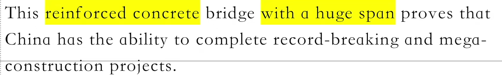

真题 2019.12:

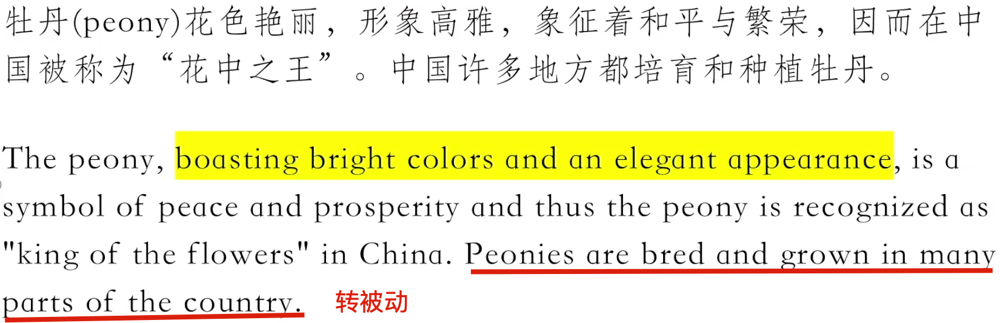

## 2. 逗号的本质
**核心原则：分清主干与修饰。**一句话里，只能存在一个真正的谓语动词。剩下的动词要么在从句里， 要么以非谓语的形式
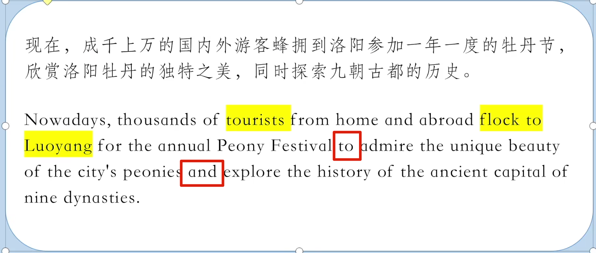

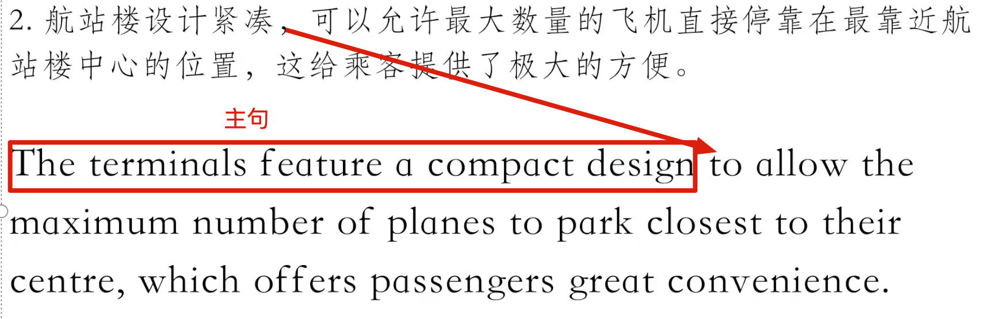

    A feature B A以B为特点
## 3. 修饰语的处理方式（定语）
**核心原则：如何处理“的“字**

### 3.1. 名词修饰名词/形容词修饰名词
#### 3.1.1 名词修饰名词（名词定语）
表示被修饰物的材料、用途、时间、地点、内容、类别

eg: paper money 纸币

meeting toom 会议室 , railway station 火车站

dinner party 晚宴

body temperature 体温

Story books 故事书

children education 儿童教育
#### 3.1.2 形容词修饰名词（最常见）
cg:

The Qinghai-Tibet Railway 青藏铁路

plum blossom festival 梅花节

plateau railway 高原铁路

fragile ecosystem 脆弱的生态环境

famous flowers 名花
### 3.2.  A of B
 A of B 结构=B的A（“的〞字前后都是名词）
 eg:

牡丹**的**栽培中心 - a centet **of** peony cultivation 

牡丹**的**独特之美 - the unique beauty **of** Luoyang peony 

九朝古都**的**历史 - the history **of** this ancient capital of nine dynasties.
### 3.3. 名词所有格
**名词所有格= n‘s**
eg:

中国的经济 - China's economy

世界最长的跨海大桥 - the world's longest sea-crossing bridge

@何时用's形式

-  有生命的事物或自然界独一无二的事物

the world's, people's lif e

- 表示时间、距离、金额、国家或城市的所属 

two hours' drive, the city's scenic spots, China's economy

### 3.4. 介词修饰名词
 **介词修饰名词=n+任意介词**

@有些英文中的介词含有动作的意味

- 反对不健康饮食习惯的观点 - views **against** unhealthy eating habits 

- 跨度巨大的钢筋混凝土大桥 - The reinforced concrete btidge **with** a huge span 

- 我非常赞赏欧中贸协与比中经贸理事会为发展中欧关系所做出的努力- I highly apprecite the efforts **by** the Europe-China Business Association and the Belgium-Chinese Economic and Commercial Council for developing China- EU relations.
### 3.5. 定语从句修饰
#### 3.5.1 **定语从句修饰（当“的”字前面有动作时）**

- 有经验的教师能够设计出适合不同学习基础学生的课程.

Experienced teachers ate capable of designing courses **that are tailored for students at different levels.**

- 动物实验所带来的医学上进步并不能让动物所遭受的痛苦显得理由正当.

Medical advances that are brought **by** animal testing cannot justif y the sufferings to them.

#### 3.5.2 定语从句修饰（当表示在某个时间段发生了某事）
- I will nevet forget the day when I married to the man.

- 南京市已将梅花定为市花,每年举办梅花节,成千上万的人冒着严寒到梅花山踏雪赏梅.The city of Nanjing has designated plum blossom as the city flowet and holds the flower festival every yeat, **when** tens of thousands of people braved the **bitter cold** to walk in the snow and appreciate the flower.
  #### 3.5.3 定语从句修饰（当表示在某个地点发生了某事）

- The bookshop where I bought this book is notfar from here.
- 荷花历来是诗人画家创作的重要题材.荷花盛开的地方也是许多摄影爱好者经常光顾之地.Lotus has long been an impottant theme for the creation of poets and paintets and the place **where** lotus blossoms becomes to be the resort of many photography enthusiasts.

#### 3.5.4 定语从句修饰（介词+which引导的从句）
- 这部小说采用了大量中国民间故事和神话的素材,创造了各种栩栩如生的人物和动物形象,**其中**最著名的就是孙悟空.
The book adopts a multitude of （ a number of ） materials of Chinese folk tales and myths, creating various vivid images of characters and animals, **among which** the most famous is Monkey King.

- 青藏铁路是世界上最高最长的高原铁路,全长1956公里,**其中**有960公里在海拔4000多米之上,是连接西藏和中国其他地区的第一条铁路.
The Qinghai-Tibet Railway is the highest and longest plateau tailway in the world, with a total length of 1956 kilometers,** of which **960 kilometers is more than 4000 meters above sea level.

#### 3.5.5 定语从句修饰 which。。。（句中暗含因果逻辑） 

**句子中有"这“这个字的时候**

- 航站楼设计紧凑,可以允许最大数量的飞机直接停靠在最靠近航站楼中心的位置,这给乘客提供了极大方便.

The terminals feature a compact design to allow the maximum numbet of planes to park closest to theit centre, **which** offers passengers gteat convenience.

- 针对这一问题,中国政府正开始发起低碳行动,这将推动其未来的增长、发展和能源安全(energy security)目标.

In order to tackle the problem, Chinese government starts a low-carbon action **which** will fostet its future gtowth, development and energy secutity objectives.
### 3.6. 分词修饰
分词修饰（n + Ving / Ved）

exciting movie; make me excited

children living in the city

 watet used fot agriculture

- 青藏铁路是连接西藏和中国其他地区的第一条铁路.
It is the first tailway connecting Tibet and other parts of China.

## 4. 修饰语的处理方式（状语）
    
### 4.1 时间状语
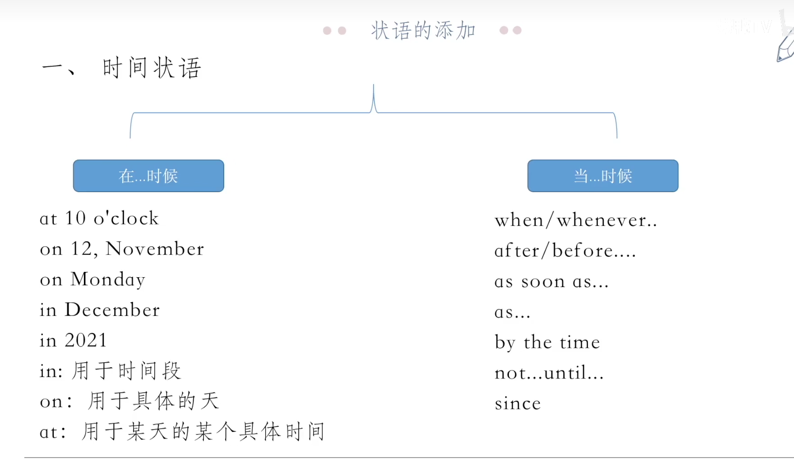

1. 《三国演义》是中国一部著名的历史小说，写于14世纪。
   The Romance of Three Kingdoms, wwritten **in the 14th centuty**, is a famous Chinese histotical novel.

2. 自面世以来，这部小说不断吸引着一代又一代的读者。
  **Since its birth,** this novel has continuously attracted readers from generation to generation.

### 4.2 地点状语 
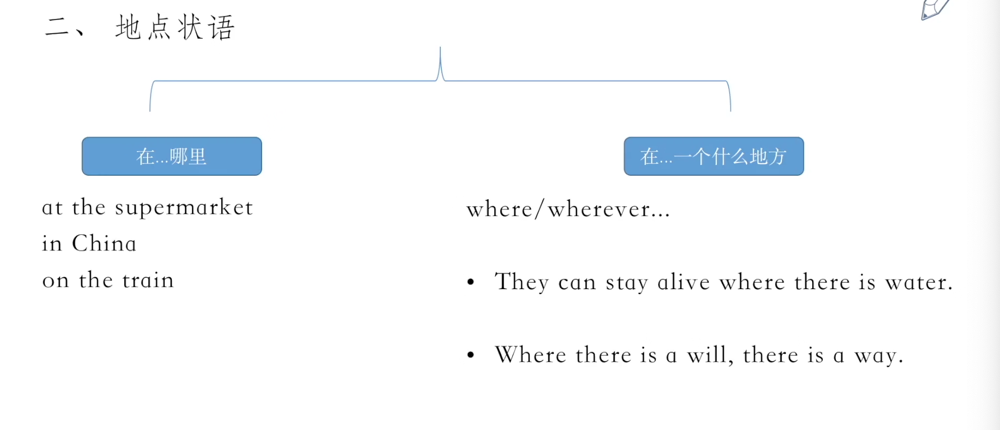

1. 西游记》可能是中国文学四大经典小说中最具影响力的一部， 当然也是在国外最广为人知的一部。
   Journey to The West is probably one of the most influential  among the fout classic novels of Chinese literature, and also the most well-known one **in foreign countries.**
2. 这部文学作品，以三国时期的历史为背景，描写了从公元二世纪下半页到公元三世纪的魏、蜀、吴三国之间的战争。
   Against the backdrop of the Three Kingdom petiods, it describes the wats among three states of Wei, Shu and Wu from the second half of the second century AD to the thitd century AD.

   Against the backdrop of 以。。。为背景
### 4.3 原因/结果/目的 状语
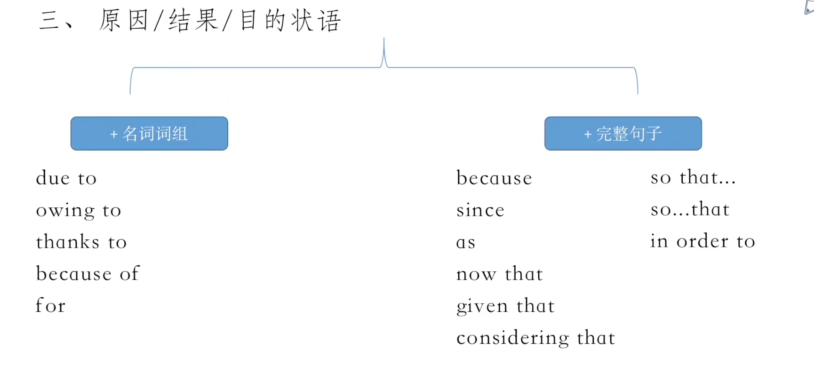

1. 由于铁路贯穿世界上最脆弱的生态系统，在建成期问和建成后都采取了生态保护措施以确保其成为一条‘绿色铁路’。
   **As** the railway traverses（go across） the most fragile ecosystem in the wotld, ecological ptotection measures have been taken during and af tet the construction to create a green railway'.
2. 铁路开通后，越来越多的人选择乘火车前往西藏，这样还有机会欣赏沿线的美景。
   Aftet the construction of the railway, the incteasing numbet of people choose to take the train to Tibet, **so that**(which means) they can have the opportunity to enjoy the beautiful sceneries along the way.
### 4.4 让步状语
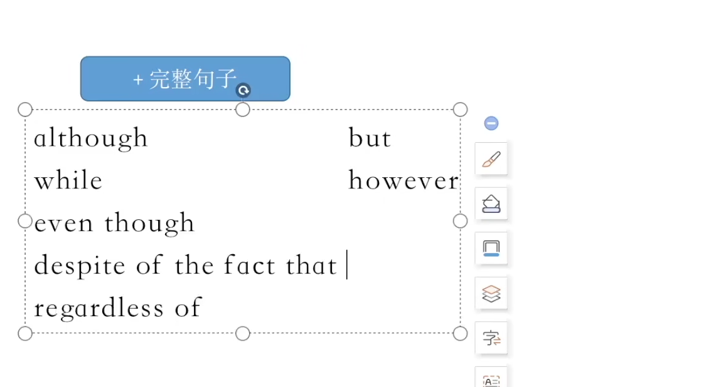

1. 中国已是全球最大的二氧化碳排放国，尽管其经济规模仅为美国的一半左右。  
   China has already been the biggest carbon dioxide emission country, **despite the fact that** its economic scale is only about half of the US.
### 4.5 伴随状语
伴随状语：伴随着主句动作发生的状态。

1. 分词结构
They stand there quietly, **watching** a game.

The bell tings, **announcing** the end of the class.

The teacher stood there, **suttounded** by his students.

Moved by the movie, we all **cried**.

政府制定了雄心勃勃的可再生能源利用目标，希望在2020年前， 约20%的电力需求由风能和太阳能来满足。

The govetnment has set an ambitious goal fot using renewable energy, **hoping** that by 2020 about 20% of electricity needs will be met by wind and solat power.

欧盟已经成为中国的重要经贸伙伴，是中国最大的技术供应方、 第三大贸易伙伴和第五大实际投资方。

The EU has now become an important economic and trade partnet of China, **wotking** as the largest technology suppliet, the third largest trading partner and the fif th largest actual investot in China.

2. with的独立主格结构

- with + n + adi/adv

He often sleeps **with the window open**. / with the light On.

- with +n+介词

The teacher went into the classtoom, **with a book in his hand.**

- with + n + to do

**With so much work to do.** I have no time fot a holiday.

- with + n + Ving

We found the house easily **with the little boy leading** the way.

- with + n + Ved

**With all things prepared**, she won the competition.

该巨型工程于 2014 年开工建设，高峰时，工地上有4万多工人。
This huge project started construction in 2014, **with more than 40, 000 workers** on the construction site at the peak.

荷花色彩鲜艳，夏日清晨绽放，夜晚闭合，花期长达两三个月， 吸引来自各地的游客前往观赏。
In summet, lotus blossoms in eatly motning in bright colout, and closes duting datk hours. **With florescence(blossom period) lasting** for up to two or three months, lotus attracts tourists from fat and wide. 

## 5. 非谓语动词的处理方式
**核心原则 : 记好词组搭配**
### 5.1 动名词
1. 动词位于句子的开头

Eating too much is bad fot yout health.

2. 做动词后面的宾语

 I like playing basketball very much.

3. 介词后跟动词ing

Stamps are used for sending letters.

4. be动词后跟动词ing

His hobby is collecting stamps.

### 5.2 不定式
1. 主语动词用不定式

To speak English is not easy fot us. = It is not easy for us to speak English.

  It is adi + fot uS to speak English.
2. be动词后跟动词不定式

My wotk is to clean the room everyday.=To clean the room every day is my work.

(在 make, let, see, heat, watch 等使役、感官动词后,常省略to)

### 5.3 非谓语动词常见词组搭配：
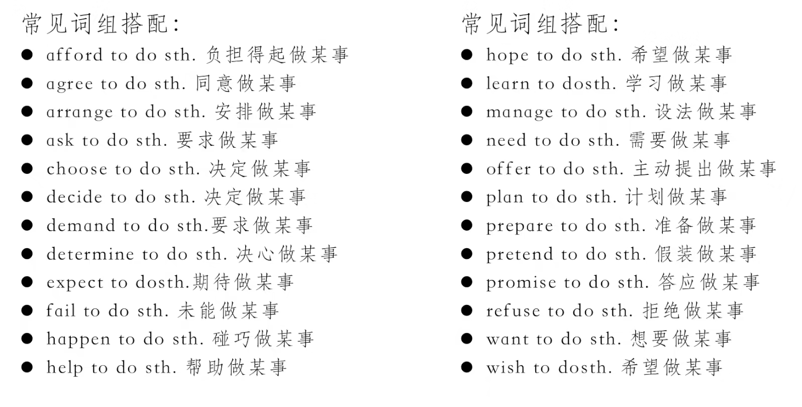

 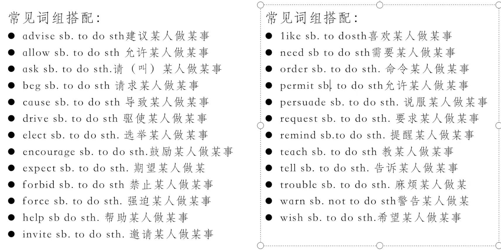

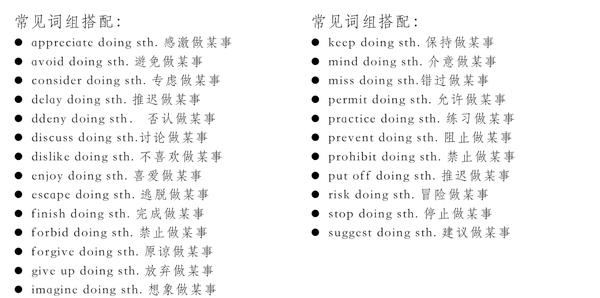

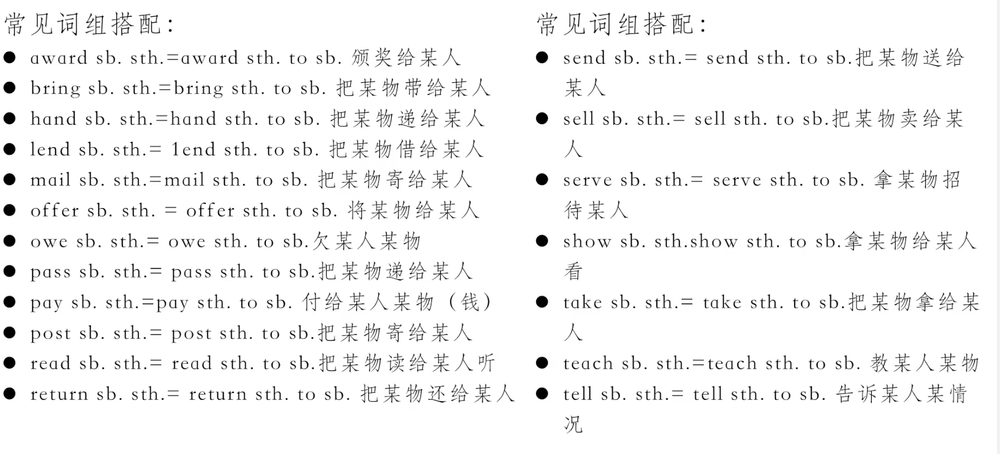

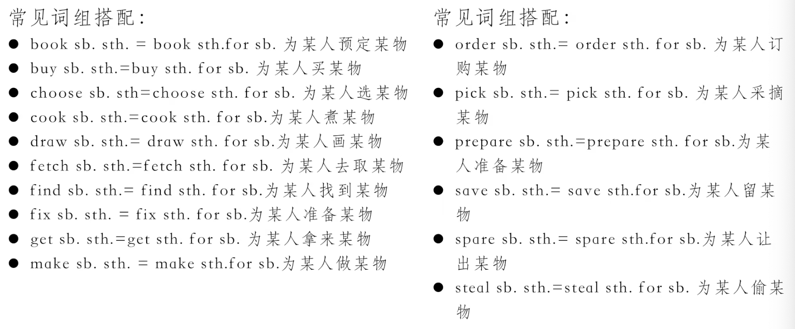

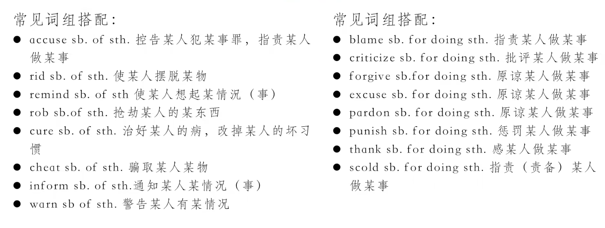

云南是位于中国西南的一个省份，平均海拔1500米。云南历史悠久，风景秀丽，气候宜人。

Yunnan is a province located in the southwest of China /in southwest China, with its average altitude of 1,500 metres. Yunnan features g long history, picturesque landscapes and pleasant climate.

云南生态环境优越，生物多种多样，被誉为野生动植物的天堂。云南还有多种矿藏和充足的水资源，为全省经济的可持绫发展提供了有利条件。

With its superior ecological envitonment and diverse species, Yunnan is recognized as a paradise of wild animals and plants. In addition, Yunnan boasts abundant mineral and watet resources, providing favourable conditions fot its sustainable development.

云南居住着25个少数民族，他们大多有自己的语言、习俗和宗教。

Yunnan is home to 25 ethnic minorities, who have theit Own languages, customs and religions.

云南独特的自然景色和丰富的民族文化使其成为中国最受欢迎的旅游目的地之一，每年都吸引着大批国内外游客前往观光旅游。

The unique natutal scenery and the rich ethnic cultures make Yunnan one of the most populat tourist destinations in China, which attracts domestic and foreign toutists in theit multitudes every year.

## 6. 增译与省译

**核心原则：添补/删除成分**

### 6.1 增译
1. 增加代词或主语

没有调查就没有发言权

He who makes no investigation has no tight to speak。

 - 一般主语不明的情况下，会优先选择使用被动语态，而不会增添主语。
2. 增加动词后的宾语代词和代词

我收到了你的来信,并且愉快的读了起来.

I have received yout letter and read it happily.

自面世以来,这部小说不断吸引着一代又一代的读者.

This novel has continuously attracted readers from generation to generation **since its birth.**

3. 增加冠词

中国煤炭消耗量约占全球的五分之二,并以每年约 10%的速度增长.

China consumes about two-fifths of the world's coal and it increases at a rate of about 10 percent **a year**.

4. 增加逻辑连接词

中欧经济县有很强的互补性,在贸易、投资、科技等领域具有很大的合作潜力.

The two economies are strongly complementary to each othet and hence enjoy huge potential for cooperation in ttade, investment, science and technology areas.
  

荷花迎骄阳而不俱,出污泥不染,象征纯洁、高雅,常来比喻人的高尚品德,历来是诗人画家创作的重要题材.

As a symbol for purity and elegance, it is often used to represent the noble character of people. Therefore, it has long been an important theme for the creation of poets and painters.

5. 增加介词

《水浒传》是中国文学四大经典小说之一.这部小说基于历史人物宋江及其伙伴反抗封建帝王的故事.

Water Margin, one of the fout classic novels in Chinese literature, is based on the story of the histotical figure Song Jiang and his partners' rebelling **against** the feudal emperors.
  
现在，成千上万的国内游客蜂拥到洛阳参加一年一度的牡丹节。

Now, thousands of domestic Visitors flock to Luoyang **to** participate in the annual Peony Festival.

### 6.2 省译
1. 省略重复性内容

We should be loyal to our party, to out people and to our country.

2. 省略范時词（指用来表示行为、现象、属性等概念所属范時的词。 如现象，局面，方面，情况，背景等。）

总之，就全国范围来说，我们一定能够逐步顺利解决沿海同内地贫富差距**的问题**。

In short, taking the country as a whole, I am confident that we can gradually btidge the wealth gap(problem) bewteen coastal and inland areas.

本次会议讨论的重点是世界经济发展状况。
The conference will focus on the development of the world's economy.

失业问题比通胩问题更为严重，因为失业问题涉及社会治安问题。

Unemployment is more serious than inflation, fot the fotmet is related to public security.

## 7. 主被动语态
**核心原则:be done**

1. 强调动作的承受者

机场的设计可确保每小时 300 架次起降.

The airport is designed to guarantee 300 takeoffs and landings per hour

2. 句子中主语不明

千百年来，创作了许多诗歌和绘画费美牡丹。

Fot thousands of yeats, many poems and paintings **have been created** to praise the peony.

3. 据说，据传，众所周知

It is said that..

It is reported that...

It is well known that...

## 8. 代词的处理
**核心原则:牢记三大句型**

1. it作形式主语

- it is + 形容词 + that

It is quite certain that he will be at the meeting. 他将出席会议是无疑的.

It is important that we (should) study hard.我们努力学习是很重要的.

- it is +名词 + that (a pity, an honot, a good thing, a fact, a surprise, a question, a shame) 

It is a pity (that) you missed the sports meeting last week.你错过了上周的运动会太可惜了.

It is a fact that English is being accepted as an international language. 事实上英语已经被作为一种国际语言而被接受了.

- it seems that
  
It seems that they know what they are doing.

1. it作形式宾语（think/ find/ feel/ consider/ make/ regard..it +形容词/名词十不定式）

- I find it pleasant to work with him.

- They felt it difficult to finish the wotk in such a short time.

- She thinks it het duty to help us.

- I think it my honot to be invited to speak here.

- All these noises made it impossible fot me to gO on with the work.

3.  强调句型 (It +be + **被强调成分**+ that who + 其他成分）

It was an old friend that/who he met in the patk yesterday.

It was in the park that he met an old friend yesterday.

## 9. 时态的处理

**核心原则:灵活调整**

1. 最常见的便是一般现在时与现在完成时

毫不夸张地说,几乎每个中国人都熟悉小说中的一些主要人物.

It is no exaggeration to say that almost every Chinese is familiat with some main charactets in the novel.

事实上,这部小说的影响己经远远超出了国界.

In fact, its influence has already gone fat beyond national boundaries.

自面世以来,这部小说不断吸引着一代又一代的读者.

This novel has attracted readers from genetation to generation.

荷花历来是诗人画家创作的重要题材.

Lotus has long been an important theme fot the creation of poets and paintets.

梅花位居中国十大名花之首，源于中国南方

Plum blossom, which ranks first among the top ten most famous flowers of China, otiginated in the south of China.

## 10. 真题

青海是中国西北部的一个省份,平均海拔3000米以上,大部分地区为高山和高原.青海省得名于全国最大的咸水湖青海湖.

Qinghai, with an average altitude of over 3,000 meters, is a province in the northwest of China and most of its areas are mountains and plateaus. Qinghai is named aftet the Qinghai Lake, the largest saltwater lake in China.

青海湖被誉为"中国最美的湖泊",是最受欢的旅游景点之一, 也是摄影师和艺术家的天堂.

Acclaimed as the most beautif ul lake nationwide, it is one of the most populat tourist attractions and the paradise for photogtaphers and artists.

青海山川壮丽，地大物博。石油和天然气储量丰富，省内许多城市的经济在石油和天然气工业带动下得到了长足发展。

Qinghai features /boasts grand/picturesque landscapes， vast tetritory and abundant resources。 The tich reserves in oil and natural gas have boosted the rapid and constant economic development of many cities within the province。

青海尤以水资源丰富而闻名,是中国三大河流长江、黄河和澜沧江的发源地,在中国的水生态中发挥着重要作用.

Moreover, Qinghai has acquired an enviable reputation in its tich watet resources and it is the birthland of China's three major rivers, namely, the Yangtze Rivet, the Yellow Rivet and the Lancang River, thus playing a paramount role in China's watet ecosystem.

海南是仅次于台湾的中国第二大岛,是位于中国最南端的省份.

Hainan, China's second largest island af tet Taiwan, is the southernmost province in China.

Hainan, which is located in the southermost China, is just smallet than Taiwan and it is the second largest island in China.

海南岛凤景秀丽，气候宜人，阳光充足，生物多样，温泉密布，海水清澈，大部分海滩几乎全年都是游泳和日光浴的理想场所，因而被誉为中国的四季花园和度假胜地，每年都吸引了大批中外游容。

Hainan Island has（features/ boasts） beautiful scenery， pleasant climate， abundant sunshine， biological diversity， dense hot springs and cleat sea water。 Most of its beaches are ideal places fot swimming and sunbathing almost all yeat round。 Therefore，Hainan Island is known as China‘s four-season gatden and holiday resort， attracting a large number of tourists from home and abroad every year。

海南1988年建省以来,旅游业、服务业、高新技术产业飞速发展,是中国唯一的省级经济特区.在中央政府和全国人民的大力支持下,海南将建成中国最大的自由贸易试验区.

Since Hainan was established ds a province in 1988, its tourism, service industry and high-tech industry have developed rapidly, making it the only provincial-level special economic zone . With the strong support of the central government and people across the country, Hainan will be built into China's largest pilot free trade zone.