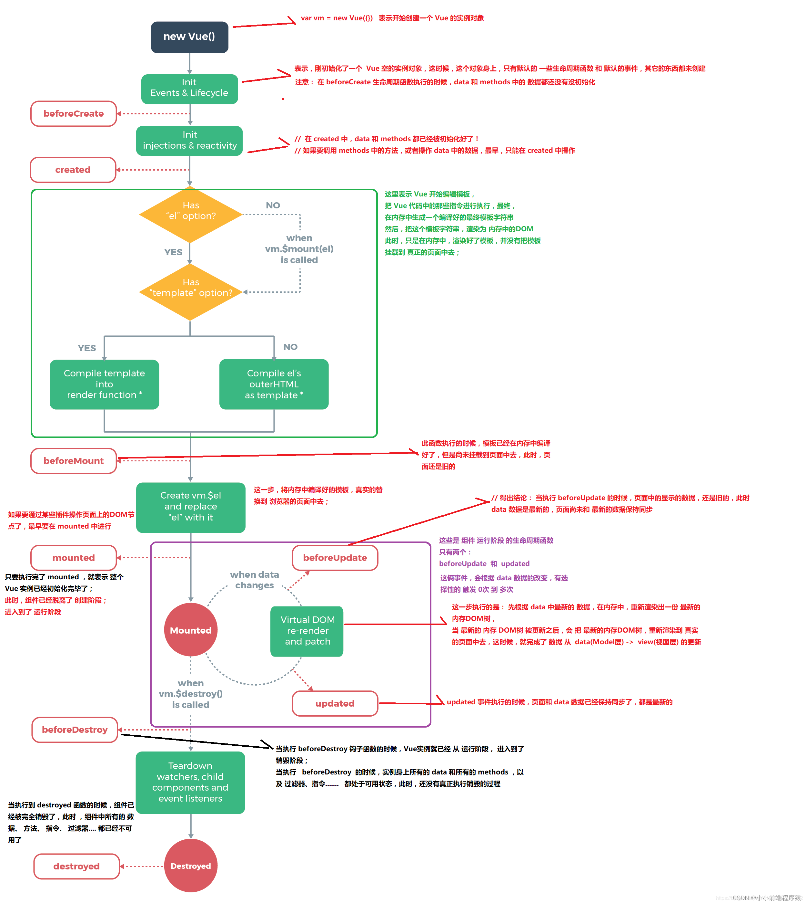

# Vue 的八个生命周期

每个 Vue 实例在被创建时都要经过一系列的初始化过程——例如，需要设置数据监听、编译模板、将实例挂载到 DOM 并在数据变化时更新 DOM 等。同时在这个过程中也会运行一些叫做生命周期的函数，这给了用户在不同阶段添加自己的代码的机会。

1. beforeCreate（创建前）
2. created （创建后）
3. beforeMount (载入前)
4. mounted （载入后）
5. beforeUpdate （更新前）
6. updated   （更新后）
7. beforeDestroy（ 销毁前）
8. destroyed （销毁后）

- Vue生命周期函数就是vue实例在某一个时间点会自动执行的函数
当Vue对象创建之前触发的函数（beforeCreate）

- Vue对象创建完成触发的函数(Created)

- 当Vue对象开始挂载数据的时候触发的函数(beforeMount)

- 当Vue对象挂载数据的完成的时候触发的函数(Mounted)

-  Vue对象中的data数据发生改变之前触发的函数 (beforeUpdate)

- Vue对象中的data数据发生改变完成触发的函数(Updated)

- Vue对象销毁之前触发的函数 (beforeDestroy)

- Vue对象销毁完成触发的函数(Destroy)

## Vue生命周期的作用是什么？
Vue 所有的功能的实现都是围绕其生命周期进行的，在生命周期的不同阶段调用对应的钩子函数可以实现组件数据管理和DOM渲染两大重要功能。

## Vue每个生命周期的详细介绍：
1. beforeCreate（）{}：Vue创建前，此阶段为实例初始化之后，this指向创建的实例，数据观察,数据监听事件机制都未形成，不能获得DOM节点。data，computed，watch，methods 上的方法和数据均不能访问，注：date和methods的数据都还未初始化。

2. Created（）{}：  Vue创建后，此阶段为实例初始化之后，data、props、computed的初始化导入完成， 注：要调用methods中的方法，或者操作data中的数据，最早只能在Created中操作
能访问 data computed watch methods 上的方法和数据，初始化完成时的事件写这个里面，
此阶段还未挂载DOM。

3. beforeMount（）{}: Vue载入前，阶段执行时，  模板已经在内存中编译好了，但是未挂载到页面中，（页面还是旧的）
注：这个阶段是过渡性的，一般一个项目只能用到一两次。

4. Mounted（）{}：Vue载入后，(完成创建vm.$el，和双向绑定)； 只要执行完mounted,就表示整个Vue实例已经初始化完成了，此时组件已经脱离里了创建阶段， 进入到了运行阶段。

5. beforeUpdate（）{}:Vue更新前， 当执行beforeUpdate的时候，页面中显示的数据还是旧的，此时date数据是最新的，页面尚未和最新数据数据保持同步。但是DOM中的数据会改变，这是vue双向数据绑定的作用，可在更新前访问现有的DOM，如手动移出添加的事件监听器。

6. Updated（）{}：Vue更新后， Updated执行时数据已经保持同步了，都是最新的，
完成虚拟DOM的重新渲染和打补丁。
组件DOM已完成更新，可执行依赖的DOM操作。
- 注意：不要在此函数中操作数据（修改属性），否则就会陷入死循环。

7. beforeDestroy（）{}：（Vue销毁前，可做一些删除提示，比如：您确定删除****吗？）
当执行beforeDestroy的时候，Vue实例就已经从运行阶段进入到销毁阶段了。实例上的所有date和methods以及过滤器和指令都是处于可用状态，此时还没有真正的执行销毁过程。

8. Destroyed（）{}：Vue销毁后, 当执行到destroted函数的时候，组件已经完全销毁（渣都不剩），此时组件中的所有的数据，方法，指令，过滤器...都已经销毁（不可用了）。

