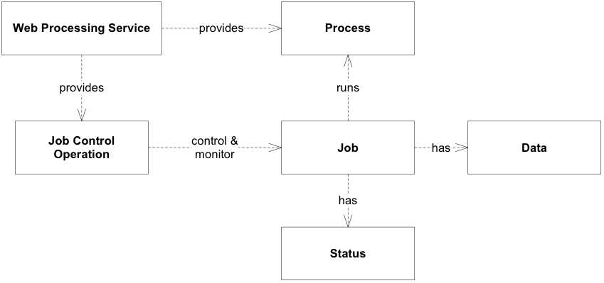
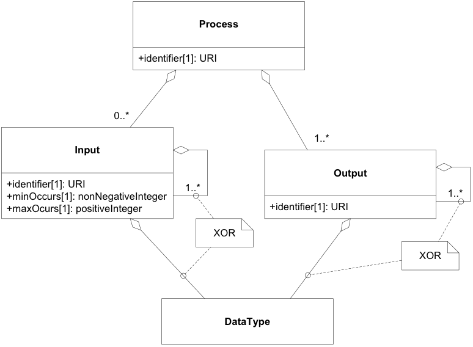
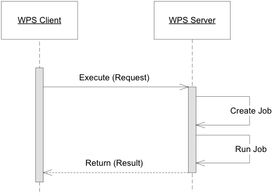
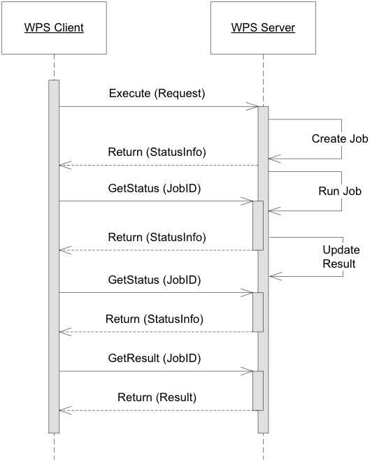
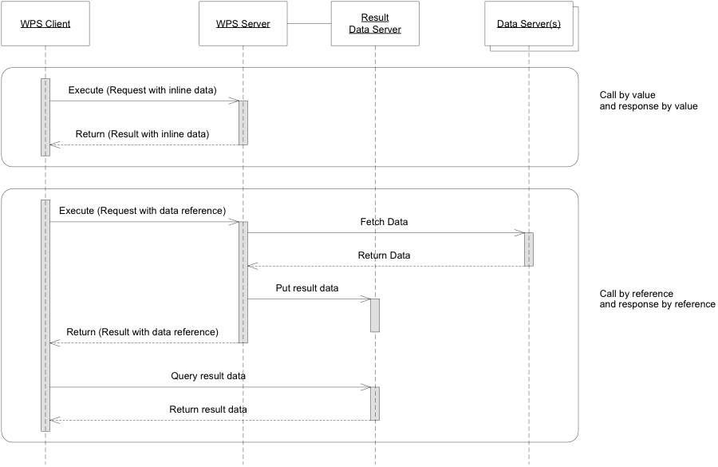

## 2.1 WPS 概念模型

WPS 服务模型定义了任何 WPS 服务器的基本属性。WPS 服务器是一种 Web 服务，可提供对预定义流程的访问，并提供作业控制操作来实例化、控制和监视处理作业（图 2.1）。

图*2.1*：WPS 服务模型的工件

### 2.1.1  服务发现

任何WPS 服务器都应该是自包含的，即提供可由WPS 客户端用来确定服务器功能的初始端点。这要求（1）所有 WPS 服务器均应有一个初始端点 (HTTP URI)；（2）*该服务应为所有服务功能提供系统的发现机制。*；（3）*服务功能的发现机制应可从初始端点预测。*

### 2.1.2 服务能力

任何 WPS 服务器的基本功能都分为两类：第一类包括进程发现和进程描述检索的功能。第二类包括管理和监控处理作业的能力。由于 WPS 服务器提供的进程可能具有不同程度的复杂性，因此服务器应指示每个进程提供的允许的作业控制功能模式。进一步的服务能力，即用于安全通信和用户认证的服务能力可以与服务一起提供，但是只要它们不改变或改变其他作业控制能力的语义，则WPS规范既不覆盖也不限制它们。

因此WPS规范要求：（1） *服务应提供流程提供功能。此功能向服务客户端通知可用的流程。*（2）*所有流程产品均应为其所使用的流程模型提供标识符。*（3）*服务应提供作业控制和监视功能。这些功能使服务客户端能够通过服务接口管理处理作业。*（4）*服务应指示每个进程允许的作业控制功能。*

### 2.1.3 抽象过程模型

抽象流程模型指定了可与 WPS 结合使用的流程产品的一般要求。流程及其输入和输出都是具有同一性的元素。过程输入可以具有任意定义的值基数，即对于给定输入，可以提交多个数据集来执行。流程输出的值基数始终为 1。过程输入和输出也可以嵌套。输入和输出的标识符应是唯一的。对于嵌套的孩子来说，有一个独特的嵌套路径就足够了。任何没有子元素的输入和输出都应具有已定义的数据类型，以便客户端了解流程执行的有效数据格式。

抽象流程模型为流程描述提供了许多自由度。但是，它不会对非常简单的流程施加额外的复杂性。

图*2.2*：抽象流程模型UML类图

**流程输出可以根据图 2.2 进行嵌套。*嵌套输出的标识符在其嵌套节点内应是唯一的。***所有不用作嵌套父级的输入和输出应具有定义的数据格式。*如果输入和输出需要编码属性，则这些属性应限于表 2.1 中定义的属性。*

**表2.1 数据编码属性**

| 属性     | 定义                                                 |
| -------- | ---------------------------------------------------- |
| mimetype | 数据的媒体类型。                                     |
| encoding | 使用的编码过程或字符集 (例如 raw, base64, or UTF-8). |
| schema   | 数据架构的标识。                                     |

### 2.1.4 作业控制

执行功能允许 WPS 客户端实例化并运行处理作业，这是最突出的作业控制功能。此外，驳回或删除作业的能力对于长时间运行的进程非常有用。*此功能使服务客户端能够表明他们不再对作业或其结果感兴趣，并允许服务器尽快释放相关资源。**每个作业会被分配一个唯一的标识符*，*如果客户端尝试使用无效的作业标识符，服务应返回异常。*

根据定义，处理作业是由处理服务创建的服务器端对象，以响应特定的流程执行。它由流程定义（即 WPS 服务器功能中定义的流程产品之一）、WPS 客户端提供或指定的输入数据以及作业完成时最终交付的输出组成。

由于处理作业是服务器端对象，因此 WPS 客户端无法自行检查作业的状态。因此，服务器应该为每个作业提供唯一的标识符。为了隐私，建议在客户端和服务器之间对该标识符保密。

对于以异步模式运行的作业，WPS 服务器还应提供监控信息，并且还可能包含完成时间的估计或与状态轮询相关的附加元素。

如果客户端在状态信息中发现轮询时间，则应尊重该轮询时间并采取相应的行为。该服务可能依赖于客户端在此时大致轮询来获取更新的状态信息。

如果客户端在状态信息中发现到期日期，则应尊重该日期并采取相应的行为，即确保按时评估执行结果并在从服务器删除作业之前检索输出。此要求允许强大的 WPS 实施和服务器资源的及时重新分配。

### 2.1.5 流程执行

WPS 服务器上的流程执行可以同步运行（图 2.3），也可以异步运行（参见图 2.4）。同步执行对于耗时相对较短的作业来说是一种合适的方法[[2\]](https://docs.ogc.org/is/14-065/14-065.html#fn2)完成. 对于可能需要很长时间才能完成的作业，异步执行是更可取的。

在同步情况下，WPS客户端向WPS服务器提交执行请求，并持续监听响应，直到处理作业完成并返回处理结果。这需要客户端和服务器之间有持久的连接。

图*2.3*：同步流程执行UML序列图

在异步情况下，客户端向WPS服务器发送执行请求并立即接收状态信息响应。此信息确认服务器已接收并接受请求，并且已创建处理作业并将在将来运行。状态信息响应还包含客户端在检查执行是否已完成时使用的处理作业标识符。（客户端还可以使用可用的引导功能来管理处理作业。）此外，状态信息响应包含结果位置，即处理作业完成后可以在其中找到处理结果的URL。

图2.4：异步流程执行UML序列图

### 2.1.6 按值和按引用进行数据传输

WPS 客户端和服务器之间的数据交换需要就通用数据交换模式和合适的通信协议达成一致。该规范定义了WPS客户端和服务器之间数据交换的两种通用数据传输模式。

客户端可以通过两种不同的方式向进程发送输入数据或从进程接收输出数据：(1) 通过引用，以及 (2) 通过值（参见图 2.5）。为了简洁起见，该图仅显示了纯粹形式的传输模式，即相同的模式用于所有输入和输出。然而，混合模式是可能的。通常，小数据或原子数据（例如整数、双精度数或短字符串）按值提交。大数据输入（输出）通常通过引用提供。*如果客户端指定了不支持的传输模式，服务应返回异常。*

图2.5：“按值”和“按引用”执行调用和响应 UML 序列图