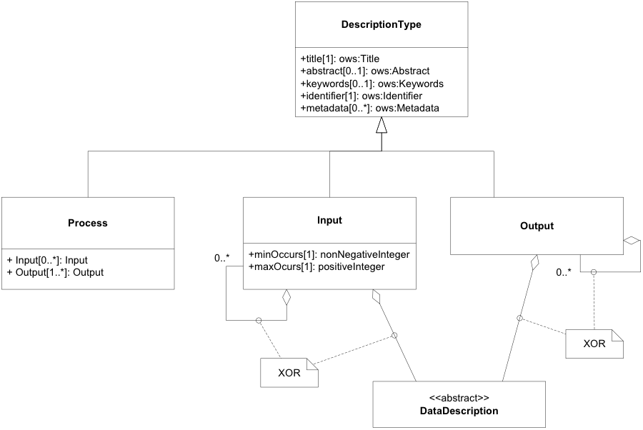
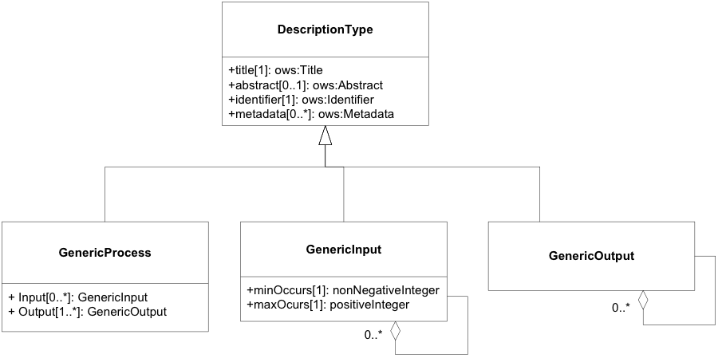
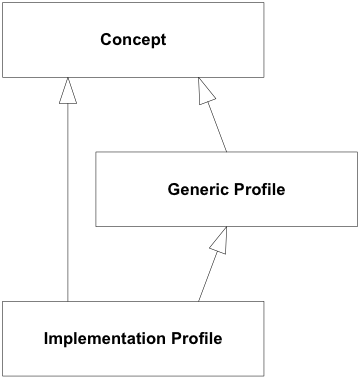

## 2.3 进程描述

描述流程的信息结构。它包括链接到有关流程的行为和机制的文档资源的元素以及有关其输入和输出的描述性元素。流程描述模型实现并扩展了 6.3 节中抽象流程模型中定义的需求。


流程描述是DescriptionType 的扩展（图12）。它应用于表达标识符、标题和摘要，并链接到提供有关流程的附加或更详细信息的相关元数据元素。应使用附加语言属性来指示过程及其输入和输出的描述中人类可读元素的语言。



图*12*：流程 UML 类图

过程输入和输出的描述结构继承了DescriptionType（第7.1节）的公共元素。这些元素应用于表达标识符、标题和摘要，并链接到提供有关过程输入和输出的附加或更详细信息的相关元数据元素。输入和输出描述中人类可读元素的内容应遵循过程描述中指示的语言。

流程输入是流程的参数。流程输入具有基数，以便 (1) 将具有相同标识符的多个值传递给流程，或 (2) 将流程输入声明为可选（基数“0”）。输入元素可以是简单的（即输入没有附加子输入）或聚合（即输入有一个或多个附加子输入元素）。简单输入包括 DataDescription 元素的实现。聚合输入包含一个或多个子输入。


输出是过程的返回值。输出的基数为一。输出元素可以是简单的（即输出没有附加的子输出）或聚合的（即输出有一个或多个附加的子输出元素）。简单的输出包括 DataDescription 元素的实现。聚合输出包含一个或多个子输出。*流程描述应符合图 12 中定义的结构。* 

进程描述示例：

<u>*此示例描述了一个缓冲区命令，该命令接受 GML 中的面坐标，并使用以米为单位的缓冲区距离来生成缓冲的面要素，该要素以 GML 格式输出。*</u>

```xml

<wps:Process 
  xmlns:wps=“http://www.opengis.net/wps/2.0”
  xmlns:ows=“http://www.opengis.net/ows/2.0”
  xmlns:xlink=“http://www.w3.org/1999/xlink”
  xmlns:xsi=“http://www.w3.org/2001/XMLSchema-instance”
  xsi:schemaLocation=
“http://www.opengis.net/wps/2.0 ../../wps.xsd”>
 
  <ows:Title>Planar Buffer operation for GML features</ows:Title>
  <ows:Abstract>
  Create a buffer around a GML feature. Accepts any valid GML
  feature and computes the joint buffer.</ows:Abstract>
  <ows:Identifier>
    http://some.host/profileregistry/implementation/Planar-GML-
Buffer
  </ows:Identifier>
  <ows:Metadata
    xlink:role="http://www.opengis.net/spec/wps/2.0/def/
process-profile/concept"
    xlink:href="http://some.host/profileregistry/concept/
buffer"/>
  <ows:Metadata
    xlink:role="http://www.opengis.net/spec/wps/2.0/def/
process-profile/concept"
    xlink:href="http://some.host/profileregistry/concept/
planarbuffer"/>
  <ows:Metadata
    xlink:role="http://www.opengis.net/spec/wps/2.0/def/
process-profile/generic"
    xlink:href="http://some.host/profileregistry/generic/
SF-Buffer"/>
  <ows:Metadata
    xlink:role="http://www.opengis.net/spec/wps/2.0/def/
process/description/documentation"
    xlink:href="http://some.host/profileregistry/implementation/
Planar-GML-Buffer.html"/>
  <wps:Input>
    <ows:Title>Geometry to be buffered</ows:Title>
    <ows:Abstract>Geometry input in GML</ows:Abstract>
    <ows:Identifier>INPUT_GEOMETRY</ows:Identifier>
    <ows:Metadata
      xlink:role="http://www.opengis.net/spec/wps/2.0/def/
process/description/documentation"
      xlink:href="http://some.host/profileregistry/
implementation/Planar-GML-Buffer.html#input_geometry"/>
    <wps:ComplexData>
      <wps:Format mimeType=“text/xml” encoding=“UTF-8”
        schema=“http://schemas.opengis.net/gml/3.2.1/feature.xsd”
        default=“true”/>
    </wps:ComplexData>
  </wps:Input>
  <wps:Input>
    <ows:Title>Distance</ows:Title>
    <ows:Abstract>
      Distance to be used to calculate buffer.
    </ows:Abstract>
    <ows:Identifier>DISTANCE</ows:Identifier>
    <ows:Metadata
      xlink:role="http://www.opengis.net/spec/wps/2.0/def/
process/description/documentation"
      xlink:href="http://some.host/profileregistry/
implementation/Planar-GML-Buffer.html#distance"/>
    <wps:LiteralData>
      <wps:Format mimeType=“text/plain” default=“true”/>
      <wps:Format mimeType=“text/xml”/>
      <LiteralDataDomain default=“true”>
        <ows:AllowedValues>
          <ows:Range>
            <ows:MinimumValue>-INF</ows:MinimumValue>
            <ows:MaximumValue>INF</ows:MaximumValue>
          </ows:Range>
        </ows:AllowedValues>
        <ows:DataType
          ows:reference="http://www.w3.org/2001/
XMLSchema#double">Double</ows:DataType>
      </LiteralDataDomain>
    </wps:LiteralData>
  </wps:Input>
  <wps:Output>
    <ows:Title>Buffered Geometry</ows:Title>
    <ows:Abstract>
      GML stream describing the buffered Geometry.</ows:Abstract>
    <ows:Identifier>BUFFERED_GEOMETRY</ows:Identifier>
    <ows:Metadata
      xlink:role="http://www.opengis.net/spec/wps/2.0/def/
process/description/documentation"
      xlink:href="http://some.host/profileregistry/
implementation/Planar-GML-Buffer.html#buffered_geometry"/>
    <wps:ComplexData>
      <wps:Format mimeType=“text/xml” encoding=“UTF-8”
        schema=“http://schemas.opengis.net/gml/3.2.1/feature.xsd”
        default=“true”/>
    </wps:ComplexData>
  </wps:Output>
</wps:Process>
```


### 2.3.1 进程概念

流程概念是一个提供有关一般流程组的高级文档的对象。它描述了过程的目的、方法和属性，但不描述具体的输入和输出参数。相反，它是一种文档资源，可以通过细化的流程定义来引用，以记录它们与通用原则的关系。

*示例：“Buffer”这个概念可以用来描述所有的 Buffer 操作。更具体的缓冲过程可以在栅格或矢量数据模型上定义，在大地水准面或 CRS 单元中执行，具有进一步的输入，例如距离或容差，甚至可以执行附加计算，例如溶解或线帽样式。*

由于流程定义的异构性和文档要求的多样性，流程概念没有通用的信息模型。大多数时候，概念会以 HTML 或类似的多媒体格式记录。形式上，概念由唯一标识符和描述性文档组成。

### 2.3.2 通用进程配置


通用配置文件是进程的抽象接口。它提供了流程机制的详细描述，并声明了流程输入和输出的签名。通用配置文件由唯一标识符和通用过程描述组成。这类似于第 7.4 节中定义的过程描述，但没有提供支持的数据交换格式的定义。

*示例：缓冲区操作的通用配置文件可以源自简单功能访问的 ISO 标准中的缓冲区定义 [ISO 19125-1:2006]。简单特征上的 buffer 方法“返回一个几何对象，该几何对象表示与该几何对象的距离小于或等于 distance 的所有点。计算是在该几何对象的空间参考系统中进行的”（ISO 19125-1:2006，第 6.1.2.4 款）。该定义具体涉及概念数据模型，详细说明了缓冲方法的行为和 CRS 单元的处理。此外，它还定义了距离参数的名称和数据类型。*

*简单特征缓冲过程的这种通用定义可以由对输入和输出数据使用任意编码的多个实现继承。这里重要的部分是在通用级别上明确定义流程的行为以及参数名称的标准化。*[[6\]](https://docs.ogc.org/is/14-065/14-065.html#fn6)



图*13*：GenericProcess UML 类图

通用进程配置文件示例：

<u>*此示例描述了简单特征缓冲区的通用配置文件。它返回一个几何图形，该几何图形表示与该几何图形的距离小于或等于距离的所有点。计算是在该几何的空间参考系统中进行的。*</u>

```xml

<wps:GenericProcess
  xmlns:ows=“http://www.opengis.net/ows/2.0”
  xmlns:wps=“http://www.opengis.net/wps/2.0”
  xmlns:xlink=“http://www.w3.org/1999/xlink”
  xmlns:xml=“http://www.w3.org/XML/1998/namespace”
  xmlns:xsi=“http://www.w3.org/2001/XMLSchema-instance”
  xsi:schemaLocation="http://www.opengis.net/wps/2.0 ../../wps.xsd">
  <ows:Title>Simple Features Buffer</ows:Title>
  <ows:Identifier>http://some.host/profileregistry/generic/
    SF-Buffer</ows:Identifier>
  <ows:Metadata
    xlink:role="http://www.opengis.net/spec/wps/2.0/def/
process-profile/concept"
    xlink:href="http://some.host/profileregistry/
concept/buffer"/>
  <ows:Metadata
    xlink:role="http://www.opengis.net/spec/wps/2.0/def/
process-profile/concept"
    xlink:href="http://some.host/profileregistry/
concept/planarbuffer"/>
 
  <ows:Metadata
    xlink:role="http://www.opengis.net/spec/wps/2.0/def/
process/description/documentation"
    xlink:href="http://some.host/profileregistry/
generic/SF-Buffer.html"/>
  <wps:Input>
    <ows:Title>Input Geometry</ows:Title>
    <ows:Identifier>INPUT_GEOMETRY</ows:Identifier>
    <ows:Metadata
      xlink:role="http://www.opengis.net/spec/wps/2.0/def/
process/description/documentation"
      xlink:href="http://some.host/profileregistry/
generic/SF-Buffer.html#input_geometry"/>
  </wps:Input>
  <wps:Input>
    <ows:Title>Distance</ows:Title>
    <ows:Identifier>DISTANCE</ows:Identifier>
    <ows:Metadata
      xlink:role="http://www.opengis.net/spec/wps/2.0/def/
process/description/documentation"
      xlink:href="http://some.host/profileregistry/
generic/SF-Buffer.html#distance"/>
  </wps:Input>
  <wps:Output>
    <ows:Title>Buffered Geometry</ows:Title>
    <ows:Identifier>BUFFERED_GEOMETRY</ows:Identifier>
    <ows:Metadata
      xlink:role="http://www.opengis.net/spec/wps/2.0/def/
process/description/documentation"
      xlink:href="http://some.host/profileregistry/
generic/SF-Buffer.html#buffered_geometry"/>
  </wps:Output>
</wps:GenericProcess>
```


### 2.3.3 进程实施配置

实施配置文件涵盖流程的所有描述性元素，直至支持的数据交换格式。从技术上讲，它们是流程描述，但具有流程配置文件的范围，即可以由多个服务提供商实施的协调且明确定义的计算流程。

### 2.3.4 配置继承 

分层结构允许不同类型的配置文件之间的继承（参见图**14**）。通常建议定义和使用常用处理功能的通用配置文件。然而，可能存在特定于产品的流程接口协调的用例。在这种情况下，实现配置文件可以直接从概念导出或单独定义。

如果层次结构中的配置文件派生自同等或更高级别的另一个配置文件，则它必须遵守表 21 中给出的继承规则。这些规则确保标识符使用、输入和输出规范以及符合声明的父配置文件的行为。

流程和流程配置文件可以使用元数据链接来指示符合特定流程配置文件。特定配置文件的链接应嵌入流程的元数据元素中。表 22 列出了不同配置文件级别的保留角色标识符。




图14：流程配置文件 UML 类图的继承层次结构

**表 21 – 进程配置文件的继承和覆盖规则**

| 属性         | **通用配置** | **实施概况** | **实施（实例级别）** |
| ------------ | ------------ | ------------ | -------------------- |
| Process      |              |              |                      |
| Identifier   | D            | O            | O                    |
| Title        | D            | O            | O                    |
| Keywords     | D            | E            | E                    |
| Abstract     | D            | O            | O                    |
| Metadata     | D            | E/O a        | E/O a                |
|              |              |              |                      |
| Input        |              |              | E b                  |
| Identifier   | D            | I            | I                    |
| Title        | D            | I            | I                    |
| Keywords     | D            | E            | E                    |
| Abstract     | D            | I            | I                    |
| Metadata     | D            | E/O a        | E/O a                |
| Multiplicity | D            | R c          | E d                  |
| Data format  |              | D            | E d                  |
|              |              |              |                      |
| Output       |              |              | E b                  |
| Identifier   | D            | I            | I                    |
| Title        | D            | I            | I                    |
| Keywords     | D            | E            | E                    |
| Abstract     | D            | I            | I                    |
| Metadata     | D            | O            | O                    |
| Data format  |              | D            | E d                  |

| D – 声明（引入新属性）<br/>I – 继承（属性从上级继承，其值保持不变。）<br/>O – 覆盖（属性从上级继承，其值被覆盖。）<br/>E –扩展（属性是从上级继承的，并且其值被扩展。）<br/>R – 限制（属性是从上级继承的，并且其值受到限制。）<br/>a – 应扩展对上级过程配置文件的元数据引用列表。文档元数据可以被覆盖，即被其他文档资源替换。<br/>b –可以在此处添加 额外的可选输入或补充输出。<br/>C– 实现配置文件可能会限制高级通用配置文件的最大基数（例如，对于理论上无限的输入）。他们不得修改最小基数。<br/>d – 实现可能允许比实现配置文件更多或更大的输入数据集，或者支持其他数据交换格式。 |
| ------------------------------------------------------------ |

**表 22 – 流程配置文件的角色标识符**

| 配置级别     | 统一资源标识符                                               |
| ------------ | ------------------------------------------------------------ |
| 进程概念     | http://www.opengis.net/spec/wps/2.0/def/process-profile/concept |
| 通用进程配置 | http://www.opengis.net/spec/wps/2.0/def/process-profile/generic |
| 进程实施配置 | http://www.opengis.net/spec/wps/2.0/def/process-profile/implementation |