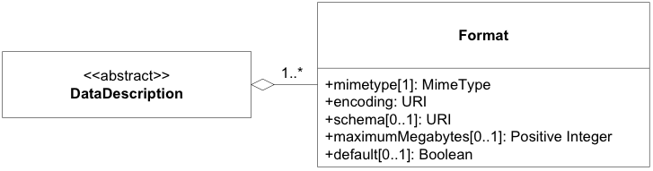
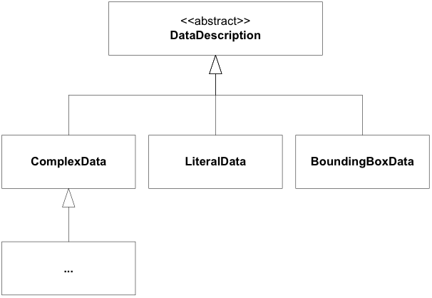
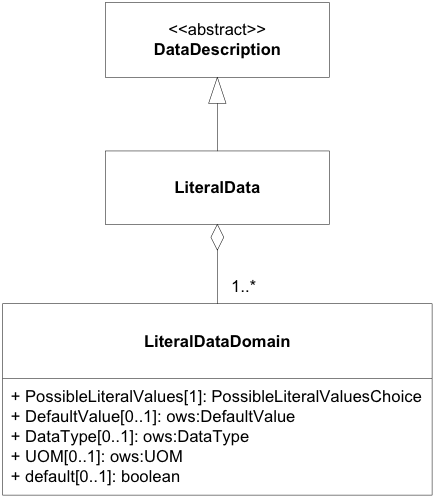
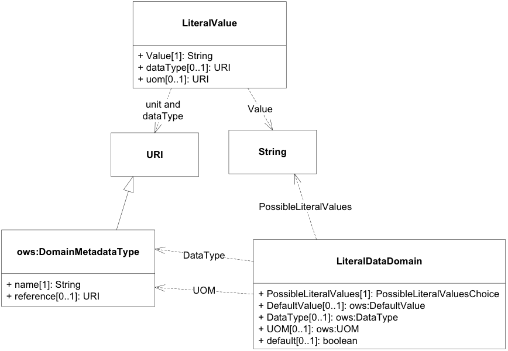
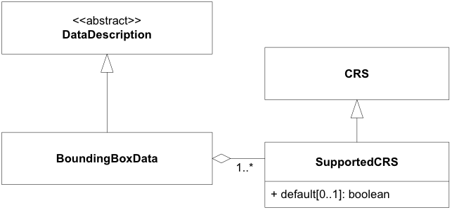
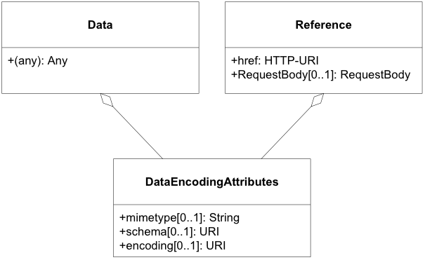

## 2.4 进程数据类型

### 2.4.1 数据描述结构

DataDescription 结构包含用于定义数据输入和输出的基本属性，包括 mimetype、编码和模式。这些属性指定计算过程的输入和输出数据支持的格式。任何输入或输出项都可以支持多种格式，其中一种是默认格式。过程可能要求输入或输出数据集不超过一定的数据量。*流程输入和输出的格式描述应符合图 2.11 和表 2.8 中定义的 DataDescription 结构。*


图*2.11*：DataDescription 和支持的格式 UML 类图


**表 2.8 – 格式属性**

| 名称             | 定义                                         | 数据类型和值             | 多样性和用途         |
| ---------------- | -------------------------------------------- | ------------------------ | -------------------- |
| mimetype         | 数据的媒体类型。                             | 字符串                   | 1个（必填）          |
| encoding         | 数据的编码过程或字符集（例如 raw 或 base64） | 字符串，固定为“simple”。 | 1个（必填）          |
| schema           | 数据模式的识别。                             | HTTP-URI                 | 1个（必填）          |
| maximumMegabytes | 输入数据的最大大小（以兆字节为单位）。       | 整数                     | 零或一（可选）       |
| default          | 表示此格式是默认格式。**a**                  | 布尔值                   | 零或一 （有条件）a,b |

*<u>a 如果省略，则默认为FALSE.</u>*
<u>b DataDescription结构中包含的格式之一应将属性“Default”设置为“True”。</u> 


### 2.4.2 数据类型

WPS规范定义了过程输入和输出数据的三种常见数据类型（图 2.12）：

1. ComplexData，例如 GML 或地理参考图像。该类型对于内容保持通用，并且可以扩展以提供更详细的特定于域的信息。
2. LiteralData，定义为具有可选单位的值。
3. BoundingBoxData，定义为地理坐标中的最小边界矩形。




图*2.12*：I/O 数据类型概述

#### 2.4.2.1 ComplexData

ComplexData 结构是抽象 DataDescription 元素的直接实现（图 2.11）。它依赖于表 2.8 中定义的编码属性来对输入和输出数据进行基本描述。如果这些属性不足以捕获所需或生成的数据的结构和内容，ComplexData 元素可以在格式规范旁边包含任何其他描述性元素。流程提供者和消费者可以使用该挂钩来传达基本信息以及输入和输出数据项的进一步约束。

**表2.9-ComplexData描述属性**

| 名称   | 定义                           | 数据类型和值             | 多样性和用途       |
| ------ | ------------------------------ | ------------------------ | ------------------ |
| Format | 标识输入或输出的有效格式。     | 格式属性，请参见表 2.8。 | 一项或多项（必填） |
| Any    | WPS 复杂数据架构扩展的占位符。 | 任何类型。               | 零个或多个（可选） |

复杂数据值直接传递给进程（或由进程返回）。复杂数据的通用性质不允许使用特定的结构进行值编码。相反，此结构由 ComplexData 描述定义，并且传递的值必须符合给定的格式和扩展信息（如果提供）。


#### 2.4.2.2 LiteralData

LiteralData 类型对原子数据进行编码，例如标量、线性单位或众所周知的名称。LiteralData 的域是数据类型（例如 Double、Integer、String）、给定值范围和关联单位（例如米、摄氏度）的组合。
*有效文字数据输入输出的描述应符合图中定义的结构参见图2.13、表2.10、表2.11、表2.12和表2.13。*


LiteralData 描述结构继承了 ows:DomainType 的基本元素，允许它指定值域，包括度量单位和默认值。它通过禁止以下方式限制 ows:DomainType：

 

1.  特定域的“NoValues”
2.  能够指定有关值的更多元数据（因为此信息已存在于 DescriptionType 元素中的输入和输出定义级别）。

LiteralData 数据类型应通过其 URI 定义使用 XML 模式中众所周知的类型[[5\]](https://docs.ogc.org/is/14-065/14-065.html#fn5) . 表 2.13列出了最常见文字数据类型的推荐 URI。




图2.13 *LiteralData UML 类图*

**表 2.10 – LiteralData 结构**

| 名称       | 定义                       | 数据类型和值             | 多样性和用途       |
| ---------- | -------------------------- | ------------------------ | ------------------ |
| 格式       | 标识输入或输出的有效格式。 | 格式属性，请参见表 2.8。 | 一项或多项（必填） |
| 文字数据域 | 文字数据的有效域           | 文字数据域类型           | 一项或多项（必填） |

**表 2.11 – LiteralDataDomain 结构的各个部分**

| 名称                  | 定义                             | 数据类型和值                                                 | 多样性和用途                                     |
| --------------------- | -------------------------------- | ------------------------------------------------------------ | ------------------------------------------------ |
| PossibleLiteralValues | 标识输入或输出的有效格式。       | 可能的文字值选择，请参见表 2.12。                            | 1个（必填）                                      |
| DataType              | 引用这组值的数据类型             | ows:DataType。强烈建议使用众所周知的数据类型 URN；参见表 2.13。 | 1个（必填）                                      |
| UOM                   | 指示该数量有单位并提供测量单位。 | ows:ValuesUnit                                               | 零或一（可选）当值具有单位或参考系统时包括在内。 |
| DefaultValue          | 该数量的默认值。                 | ows:DefaultValue                                             | 零或一（可选）如果有默认值则包括在内。A          |
| default               | 指示这是默认/本机域。            | 布尔值，默认为 false。                                       | 零或一（有条件）b,c                              |

*<u>a对于输出，DefaultValue 没有意义，因此应被省略。 b 如果省略，则默认为 FALSE。 c LiteralData 结构中包含的格式之一应将属性“default”设置为“true”。</u>*

**表 2.12 – MaybeLiteralValuesChoice 结构的各个部分**

| 名称       | 定义                                      | 数据类型和值        | 多样性和用途      |
| ---------- | ----------------------------------------- | ------------------- | ----------------- |
| 允许值     | 该数量的所有有效值和/或值范围的列表。     | ows:AllowedValues   | 零或一（有条件）a |
| 任意值     | 指定该数量允许任何值。                    | ows:AnyValue        | 零或一（有条件）a |
| 价值观参考 | 参考该数量的所有有效值和/或值范围的列表。 | ows:ValuesReference | 零或一（有条件）a |

*<u>a应包括这三项中的一项且仅一项。</u>*

**表 2.13 – 推荐的文字数据数据类型 URI**

| **数据类型** | **统一资源标识符**                       |
| ------------ | ---------------------------------------- |
| String       | http://www.w3.org/2001/XMLSchema#string  |
| Integer      | http://www.w3.org/2001/XMLSchema#integer |
| Decimal      | http://www.w3.org/2001/XMLSchema#decimal |
| Boolean      | http://www.w3.org/2001/XMLSchema#boolean |
| Double       | http://www.w3.org/2001/XMLSchema#double  |
| Float        | http://www.w3.org/2001/XMLSchema#float   |

LiteralData 值表示对应于 LiteralData 结构中定义的特定域的值。图 2.14显示了从 LiteralValue 结构到 LiteralDataDescriptionType 中相应元素的映射。



图*2.14*：LiteralValue UML 类图

**表 2.14 – LiteralValue 结构的各个部分**

| 名称     | 定义                     | 数据类型和值     | 多样性和用途        |
| -------- | ------------------------ | ---------------- | ------------------- |
| Value    | 实际值的字符串表示形式。 | Character String | 1个（必填）         |
| dataType | 值的数据类型。           | URI              | 零个或一个 （可选） |
| uom      | 值的测量单位。           | URI              | 零个或一个 （可选） |

<u>*a如果未指定，将使用 LiteralData 描述中的相关默认值。*</u>

#### 2.4.2.3 BoundingBox Data


BoundingBox Data在空间数据处理中具有多种用途。一些简单的应用是定义剪切操作的范围或定义分析区域。该规范继承了 OWS Common 的BoundingBox规范。边界框数据的域由受支持的 CRS 列表描述。
*有效边界框数据输入和输出的描述应符合结构体图 2.15、表 2.15 和表 2.16 中定义。*



图2.15：BoundingBoxData UML 类图

**表 2.15 – BoundingBox 结构**

| 名称         | 定义                         | 数据类型和值                | 多样性和用途       |
| ------------ | ---------------------------- | --------------------------- | ------------------ |
| Format       | 标识输入或输出的有效格式。   | 格式属性，请参见表 2.8。    | 一项或多项（必填） |
| SupportedCRS | BoundingBox 数据支持的 CRS。 | 支持的CRS类型，参见表2.16。 | 一项或多项（必填） |

**表 2.16 – SupportedCRS 类型结构**

| 名称    | 定义                    | 数据类型和值           | 多样性和用途         |
| ------- | ----------------------- | ---------------------- | -------------------- |
| CRS     | 参考 CRS 定义。         | 统一资源标识符         | 一项或多项（必填）   |
| default | 指示此 CRS 是默认 CRS。 | 布尔值，默认为 false。 | 零或一 （有条件）a,b |

<u>*a 如果省略，则默认为 FALSE。 b BoundingBox 结构中包含的格式之一应将属性“default”设置为“true”。*</u>

BoundingBoxData在 OWS Common [OGC 06-121r9] 的 BoundingBox 数据类型中指定。为了与 BoundingBoxData 描述保持一致，CRS 的规范是强制性的，即BoundingBoxData值结构的 CRS 部分不得为空。


### 2.4.3 数据类型的XML编码示例

数据类型的 XML 编码定义了 ComplexData、LiteralData、BoundingBoxData 及其值的编码规则。

ComplexData描述：

```xml
<wps:ComplexData>
  <wps:Format mimeType=“application/geotiff” encoding=“raw”
default=“true”/>
  <wps:Format mimeType=“application/geotiff” encoding=“base64”/>
</wps:ComplexData>
```

LiteralData描述：

```xml
<wps:LiteralData>
  <wps:Format mimeType=“text/plain” default=“true”/>
  <wps:Format mimeType=“text/xml”/>
  <LiteralDataDomain default=“true”>
    <ows:AllowedValues>
      <ows:Range>
        <ows:MinimumValue>1</ows:MinimumValue>
        <ows:MaximumValue>1000</ows:MaximumValue>
      </ows:Range>
    </ows:AllowedValues>
    <ows:DataType
ows:reference=“http://www.w3.org/2001/XMLSchema#float”>float
</ows:DataType>
    <ows:UOM>meters</ows:UOM>
    <ows:DefaultValue>100</ows:DefaultValue>
  </LiteralDataDomain>
  <LiteralDataDomain>
    <ows:AllowedValues>
      <ows:Range>
        <ows:MinimumValue>1</ows:MinimumValue>
        <ows:MaximumValue>3000</ows:MaximumValue>
      </ows:Range>
    </ows:AllowedValues>
    <ows:DataType
ows:reference=“http://www.w3.org/2001/XMLSchema#float”>float
</ows:DataType>
    <ows:UOM>feet</ows:UOM>
  </LiteralDataDomain>
</wps:LiteralData>
```

LiteralData值描述：

```xml
<LiteralValue
  dataType=http://www.w3.org/2001/XMLSchema#double
  uom=“meter”>
    42.1
</LiteralValue>
 
<LiteralValue
  dataType=“http://www.w3.org/2001/XMLSchema#string”>
    ArableLand
</LiteralValue>
```

BoundingBoxData 描述：

```xml
<wps:BoundingBoxData>
  <wps:Format mimeType=“text/plain” default=“true”/>
  <wps:Format mimeType=“text/xml”/>
  <wps:SupportedCRS default=“true”>EPSG:4326</wps:SupportedCRS>
  <wps:SupportedCRS>
    http://www.opengis.net/def/crs/EPSG/0/4258
  </wps:SupportedCRS>
</wps:BoundingBoxData>
```

BoundingBoxData 值描述：

```xml
<ows:BoundingBox crs=“EPSG:4326”>
  <ows:LowerCorner>51.9 7.0</ows:LowerCorner>
  <ows:UpperCorner>53.0 8.0</ows:UpperCorner>
</ows:BoundingBox>
 
<ows:BoundingBox
   crs=“http://www.opengis.net/def/crs/EPSG/0/4258”>
  <ows:LowerCorner>51.9 7.0</ows:LowerCorner>
  <ows:UpperCorner>53.0 8.0</ows:UpperCorner>
</ows:BoundingBox>
```

### 2.4.4 LiteralData 和 BoundingBoxData 值的纯文本编码

*文字和边界框值的纯文本编码符合下面的 BNF 模式。*

*纯文本编码文字和边界框值的 mime 类型应为“text/plain” 。*

```python
 Literal values – BNF schema: 
 literalvalue   = value *1(“@datatype=” datatype) *1(“@uom=” uom) 
 value          = 1*VCHAR 
 datatype  = URI 
 uom       = URI 
   
 Literal values – Example: 
 70@datatype=http://www.w3.org/2001/XMLSchema#integer@uom=meter 
   
 BoundingBox values – BNF schema[7]: 
 bbox      = lc_coords “,” uc_coords [“,” crs] [“,” dimensions] 
 lc_coords = number [“,” number] 
 uc_coords = number [“,” number] 
 number         = 1*DIGIT[“.” 1*DIGIT] 
 crs       = 1*VCHAR 
 dimensions = 1*DIGIT 
   
 BoundingBoxData values – Examples: 
 51.9,7.0,53.0,8.0,EPSG:4326 
   
 51.9,7.0,53.0,8.0,http://www.opengis.net/def/crs/EPSG/0/4258 
```

### 2.4.5 数据传输

WPS 客户端和服务器之间的数据交换需要就通用数据交换模式和合适的通信协议达成一致。数据可以通过两种不同的方式发送到 WPS（从 WPS 接收）：(1) 通过引用（使用 HTTP/GET 或 HTTP/POST），以及 (2) 通过值。客户端可以以任一方式发送输入数据。可以通过为过程提供定义的数据传输选项声明的任何方式来请求输出数据。通常，大数据输入和输出是通过引用传递的。



图2.16：输入输出数据传输结构UML类图

**表 2.17 – 内联数据结构的部分**

| 名称      | 定义                                                | 数据类型和值 | 多样性和用途 |
| --------- | --------------------------------------------------- | ------------ | ------------ |
| mimetype  | 请参见表 2.18 – DataEncodingAttributes 结构的属性。 |              |              |
| encoding  |                                                     |              |              |
| schema    |                                                     |              |              |
| （任何）a | 实际输入或输出数据。                                | 任何类型和值 | 1个（必填）  |

<u>*a数据作为 Data 元素的一部分嵌入此处，嵌入到由前三个参数（如果存在）或相关默认值指示的 mimeType、encoding和schema中。*</u>

**表2.18-DataEncodingAttributes结构的属性**

| 名称     | 定义                     | 数据类型和值                                                 | 多样性和用途      |
| -------- | ------------------------ | ------------------------------------------------------------ | ----------------- |
| mimetype | 数据的 MimeType。        | 字符串                                                       | 1个（必填）       |
| encoding | 常见的数据编码或字符集。 | 类型 “raw”应用于纯二进制数据 “base64”应用于base64 编码<br/>数据 字符集标识符（例如“UTF-8”）应用于文本或CSV 数据。 | 零或一（有条件）a |
| schema   | 数据模式的标识。         | URI                                                          | 零或一（有条件）a |

*<u>a如果满足以下条件，则应提供此信息： 1) 过程数据项支持多种编码/模式，并且</u>*
*<u>\2) 数据不属于默认编码/模式，并且</u>*
*<u>3a) 无法从数据本身检索模式/编码，或者</u>*
*<u>3b ）编码/模式信息深深地埋藏在数据内部（即不是某些标头的一部分）并且需要大量的解析工作。</u>*

**表 2.19 – 参考结构的各个部分**

| 名称          | 定义                                                         | 数据类型和值                  | 多样性和用途    |
| ------------- | ------------------------------------------------------------ | ----------------------------- | --------------- |
| mimetype      | 请参见表 2.18 – DataEncodingAttributes 结构的属性。          |                               |                 |
| encoding      |                                                              |                               |                 |
| schema        |                                                              |                               |                 |
| href          | 指向可以检索数据的远程资源的 HTTP URI。                      | HTTP URI                      | 1个（必填）     |
| RequestBody体 | 用于对上述 URL 进行 HTTP/POST 请求的请求正文元素。如果不存在请求正文，则应使用 HTTP/GET 请求来检索数据。 | RequestBody结构，参见表2.20。 | 零或一 （可选） |

**表 2.20 – RequestBody 结构的各个部分**

| 名称          | 定义                                                         | 数据类型和值              | 多样性和用途       |
| ------------- | ------------------------------------------------------------ | ------------------------- | ------------------ |
| Body          | 该元素的内容用作要发送到 ../Reference/@href 中标识的服务的 HTTP 请求消息的正文。例如，它可以是使用 HTTP/POST 的 XML 编码的 WFS 请求。 | 任何类型                  | 零或一 （有条件）a |
| BodyReference | 对远程文档的引用，该文档用作对参考结构中的 href 元素中标识的服务的 HTTP/POST 请求消息的正文（表 2.19）。 | BodyReference，见表2.21。 | 零或一 （有条件）a |

<u>*a应包含且仅包含其中一项。*</u>

**表 2.21 – BodyReference 结构的各个部分**

| 名称 | 定义                                        | 数据类型和值 | 多样性和用途 |
| ---- | ------------------------------------------- | ------------ | ------------ |
| href | 指向可以检索请求正文的远程资源的 HTTP URI。 | HTTP URI     | 1个（必填）  |