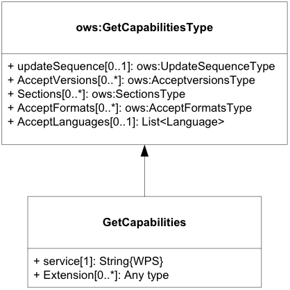
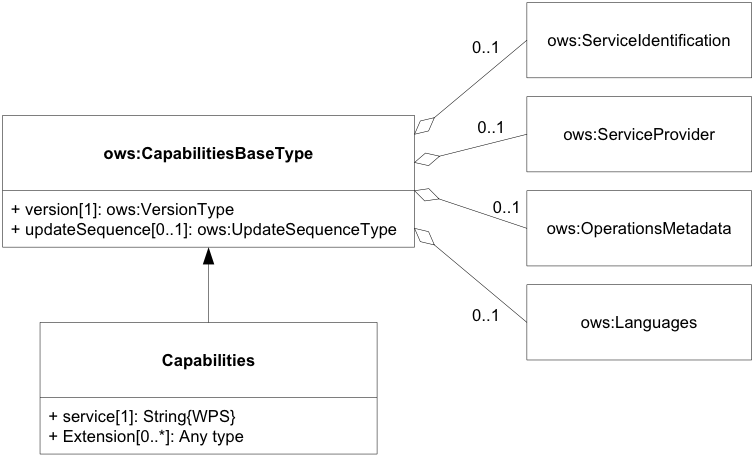
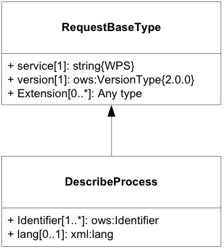
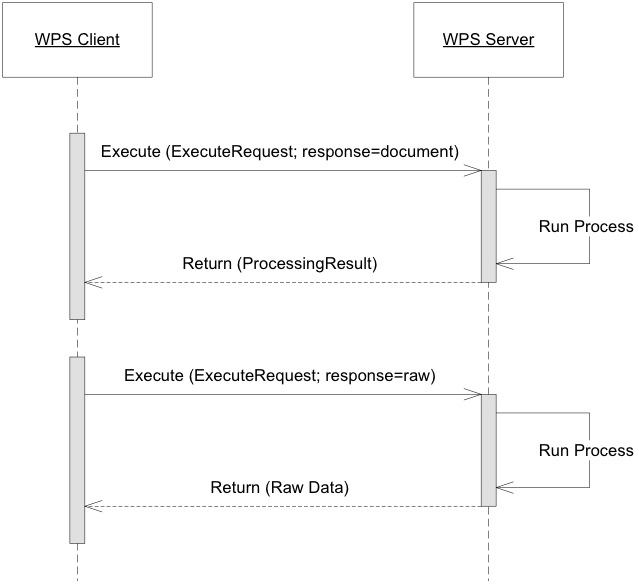
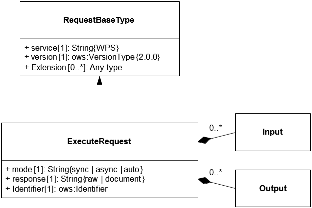
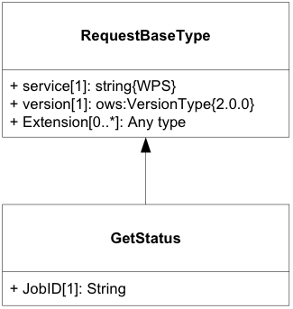
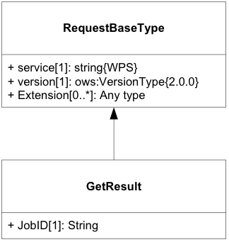

## 2.5 WPS的核心操作

WPS 接口支持地理空间计算过程的检索和执行。为此，WPS 服务模型指定了可由 WPS 客户端调用并由 WPS 服务器执行的以下操作[[8\]](https://docs.ogc.org/is/14-065/14-065.html#fn8)：

- GetCapability——此操作允许客户端请求有关服务器功能和所提供进程的信息（参见第 9.7 节）。

- DescribeProcess——此操作允许客户端请求服务器提供的选定进程的详细元数据（参见第 9.8 节）。

- Excute——该操作允许客户端执行由进程标识符、所需数据输入和所需输出格式组成的进程（参见第 9.9 节）。

- GetStatus——该操作允许客户端查询处理作业的状态信息（有条件的，参见第 9.10 节）。

- GetResult – 此操作允许客户端查询处理作业的结果（有条件，请参见第 9.11 节）。

### 2.5.1 GetCapability

#### 2.5.1.1 GetCapability请求

任何 OGC Web 服务都需要 GetCapability 操作。对于 WPS，此操作允许客户端检索服务元数据、基本流程产品以及 WPS 服务器上存在的可用流程。

GetCapability 请求对于任何 OGC 服务都是强制性的。图 17 显示了 WPS 的 GetCapability 请求如何与 OWS Common 定义的通用 GetCapabilityType 相关。Extension 元素为可由 WPS 扩展规范定义的进一步请求参数提供挂钩。*除了从 OWS Common GetCapability 继承的属性之外，WPS GetCapability 请求还应包括根据表 35.*



图17：GetCapability 请求 UML 类图

GetCapability请求示例：

```xml
<wps:GetCapabilities service=“WPS”
  xmlns:ows=“http://www.opengis.net/ows/2.0”
  xmlns:wps=“http://www.opengis.net/wps/2.0”
  xmlns:xsi=“http://www.w3.org/2001/XMLSchema-instance”
  xsi:schemaLocation="http://www.opengis.net/wps/2.0 ../wps.xsd">
</wps:GetCapabilities>
```

**表 35 – GetCapability 请求中的其他属性**

| 名称      | 定义                       | 数据类型和值                 | 多样性和用途       |
| --------- | -------------------------- | ---------------------------- | ------------------ |
| Service   | 服务类型标识符             | 字符串，固定为“WPS”          | 1个（必填）        |
| Extension | 由扩展规范定义的元素的容器 | 任何类型。值由扩展规范定义。 | 零个或多个（可选） |

#### 2.5.1.2 GetCapability响应

对 GetCapability 操作的响应是描述服务功能的文档。图 18 显示了如何从 [OGC 06-121r9] 中定义的 CapabilityBaseType 导出 WPS 功能。OperationsMetadata 元素列出了 WPS 服务器支持的请求类型。内容部分提供有关服务器进程产品的信息。Extension 元素为其他可用元素无法覆盖的附加服务功能提供了一个钩子。



图*18*：功能文档 UML 类图

| 名称      | 定义                                    | 数据类型和值                 | 多样性和用途       |
| --------- | --------------------------------------- | ---------------------------- | ------------------ |
| Service   | 服务类型标识符                          | 字符串，固定为“WPS”          | 1个（必填）        |
| Content   | 此 WPS 服务器提供的进程的简要描述列表。 | 流程总结，见表37             | 1个（必填）        |
| Extension | 由扩展规范定义的元素的容器              | 任何类型。值由扩展规范定义。 | 零个或多个（可选） |

GetCapability相应示例：

```xml

<wps:Capabilities service=“WPS” version=“2.0.0”
  xmlns:ows=“http://www.opengis.net/ows/2.0”
  xmlns:wps=“http://www.opengis.net/wps/2.0”
  xmlns:xlink=“http://www.w3.org/1999/xlink”
  xmlns:xml=“http://www.w3.org/XML/1998/namespace”
  xmlns:xs=“http://www.w3.org/2001/XMLSchema”
  xmlns:xsi=“http://www.w3.org/2001/XMLSchema-instance”
  xsi:schemaLocation="http://www.opengis.net/wps/2.0 ../wps.xsd ">
  <ows:ServiceIdentification>
    <ows:Title>MyWebProcessingService</ows:Title>
    <ows:Abstract>
      A Web Processing Service offering typical GIS distance
      transform processes.
    </ows:Abstract>
    <ows:Keywords>
      <ows:Keyword>Geoprocessing</ows:Keyword>
      <ows:Keyword>Toolbox</ows:Keyword>
      <ows:Keyword>Distance transform</ows:Keyword>
    </ows:Keywords>
    <ows:ServiceType>WPS</ows:ServiceType>
    <ows:ServiceTypeVersion>2.0.0</ows:ServiceTypeVersion>
    <ows:Fees>NONE</ows:Fees>
    <ows:AccessConstraints>NONE</ows:AccessConstraints>
  </ows:ServiceIdentification>
  <ows:ServiceProvider>
    <ows:ProviderName>TU Dresden</ows:ProviderName>
    <ows:ProviderSite
xlink:href=“http://tu-dresden.de/geo/gis” />
    <ows:ServiceContact>
      <ows:IndividualName>Matthias Mueller</ows:IndividualName>
      <ows:ContactInfo>
        <ows:Address>
          <ows:ElectronicMailAddress>
            matthias_mueller@tu-dresden.de
          </ows:ElectronicMailAddress>
        </ows:Address>
      </ows:ContactInfo>
    </ows:ServiceContact>
  </ows:ServiceProvider>
  <ows:OperationsMetadata>
    <ows:Operation name=“GetCapabilities”>
      <ows:DCP>
        <ows:HTTP>
          <ows:Get
          xlink:href=“http://wps1.gis.geo.tu-dresden.de/wps”/>
        </ows:HTTP>
      </ows:DCP>
    </ows:Operation>
    <ows:Operation name=“DescribeProcess”>
      <ows:DCP>
        <ows:HTTP>
          <ows:Get
          xlink:href=“http://wps1.gis.geo.tu-dresden.de/wps”/>
          <ows:Post
          xlink:href=“http://wps1.gis.geo.tu-dresden.de/wps”/>
        </ows:HTTP>
      </ows:DCP>
    </ows:Operation>
    <ows:Operation name=“Execute”>
      <ows:DCP>
        <ows:HTTP>
          <ows:Post
          xlink:href=“http://wps1.gis.geo.tu-dresden.de/wps”/>
        </ows:HTTP>
      </ows:DCP>
    </ows:Operation>
    <ows:Operation name=“GetStatus”>
      <ows:DCP>
        <ows:HTTP>
          <ows:Get
          xlink:href=“http://wps1.gis.geo.tu-dresden.de/wps”/>
          <ows:Post
          xlink:href=“http://wps1.gis.geo.tu-dresden.de/wps”/>
        </ows:HTTP>
      </ows:DCP>
    </ows:Operation>
    <ows:Operation name=“GetResult”>
      <ows:DCP>
        <ows:HTTP>
          <ows:Get
          xlink:href=“http://wps1.gis.geo.tu-dresden.de/wps”/>
          <ows:Post
          xlink:href=“http://wps1.gis.geo.tu-dresden.de/wps”/>
        </ows:HTTP>
      </ows:DCP>
    </ows:Operation>
    <ows:Operation name=“Dismiss”>
      <ows:DCP>
        <ows:HTTP>
          <ows:Get
          xlink:href=“http://wps1.gis.geo.tu-dresden.de/wps”/>
          <ows:Post
          xlink:href=“http://wps1.gis.geo.tu-dresden.de/wps”/>
        </ows:HTTP>
      </ows:DCP>
    </ows:Operation>
  </ows:OperationsMetadata>
  <wps:Contents>
    <wps:ProcessSummary
jobControlOptions=“sync-execute async-execute dismiss”>
      <ows:Title>Euclidean Distance</ows:Title>
      <ows:Identifier>
        http://my.site/distance-transform/euclidean-distance
      </ows:Identifier>
    </wps:ProcessSummary>
    <wps:ProcessSummary
jobControlOptions=“async-execute dismiss”>
      processVersion=“1.4.0”>
      <ows:Title>Cost Distance</ows:Title>
      <ows:Identifier>
        http://my.site/distance-transform/cost-distance
      </ows:Identifier>
    </wps:ProcessSummary>
  </wps:Contents>
</wps:Capabilities>
```

### 2.5.2  DescribeProcess

#### 2.5.2.1 DescribeProcess 请求

DescribeProcess 请求从RequestBaseType 继承基本属性。标识符元素应包含应为其获取流程描述的流程标识符的列表。如果服务支持多语言流程描述，则可以使用语言参数来查询流程描述中的自由文本元素的所需语言。



图19：DescribeProcess 请求 UML 类图

**表 38 –DescribeProcess 请求中的其他属性**

| 名称       | 定义                                     | 数据类型和值                                                                                                             | 多样性和用途       |
| ---------- | ---------------------------------------- | ------------------------------------------------------------------------------------------------------------------------ | ------------------ |
| Identifier | 应获得其详细描述的一个或多个进程标识符。 | ows:Identifier Value 应为功能文档中 ProcessSummary 元素中列出的流程标识符之一。固定值“ALL”表示应返回所有流程产品的描述。 | 一项或多项（必填） |
| lang       | 所需的流程描述语言。                     | xml:lang 流程描述中人类可读文本元素的 IETF RFC 4646 语言代码（例如“en”）。这应该是功能文档中定义的语言之一。             | 零或一（可选）     |

请求示例：

```xml
<wps:DescribeProcess service=“WPS” version=“2.0.0”
  xmlns:ows=“http://www.opengis.net/ows/2.0”
  xmlns:wps=“http://www.opengis.net/wps/2.0”
  xmlns:xsi=“http://www.w3.org/2001/XMLSchema-instance”
  xsi:schemaLocation="http://www.opengis.net/wps/2.0 ../wps.xsd">
  <ows:Identifier>Buffer</ows:Identifier>
  <ows:Identifier>Viewshed</ows:Identifier>
</wps:DescribeProcess>

```

#### 2.5.2.2DescribeProcess 响应

对DescribeProcess 操作的响应是一个ProcessOfferings 文档。本文档包含服务器上每个可用进程的 ProcessOfferings 部分。与服务器功能中的 ProcessSummary 相比，进程以其声明的描述格式进行描述。

**表 39 – ProcessOfferings 文档中的属性**

| 名称            | 定义                 | 数据类型和值                                                                                                         | 多样性和用途       |
| --------------- | -------------------- | -------------------------------------------------------------------------------------------------------------------- | ------------------ |
| lang            | 描述流程产品的语言。 | xml:lang 流程描述中人类可读文本元素的 IETF RFC 4646 语言代码（例如“en”）。这应是在DescribeProcess 请求中标识的语言。 | 零或一（可选）     |
| ProcessOffering | 流程产品列表。       | ProcessOffering，在表 40 中定义。                                                                                    | 一项或多项（可选） |

**表 40 – ProcessOffering 属性**

| 名称               | 定义                                              | 数据类型和值                                        | 多样性和用途     |
| ------------------ | ------------------------------------------------- | --------------------------------------------------- | ---------------- |
| processModel       | 继承自表29                                        |                                                     |                  |
| jobControlOptions  |                                                   |                                                     |                  |
| outputTransmission |                                                   |                                                     |                  |
| Process            | 本机进程描述。                                    | 进程类型，如本机进程模型中定义。                    | 零或一（有条件） |
| Any                | 任何其他明确定义的流程描述，由 processType 标识。 | 任何类型。必须符合与声明的 processType 相关的要求。 | 零或一（有条件） |

<u>*a应包含且仅包含其中一项。*</u>

响应示例：

```xml

<wps:ProcessOfferings xmlns:wps=“http://www.opengis.net/wps/2.0.0”
  xmlns:ows=http://www.opengis.net/ows/2.0
  xmlns:xlink=“http://www.w3.org/1999/xlink”
  xmlns:xsi=“http://www.w3.org/2001/XMLSchema-instance”
  xsi:schemaLocation="http://www.opengis.net/wps/2.0 ../wps.xsd">
  <wps:ProcessOffering
jobControlOptions=“sync-execute async-execute dismiss”
outputTransmission=“value reference”>
    <wps:Process>      
      <ows:Title>
        Planar Buffer operation for Simple Features
      </ows:Title>
      <ows:Abstract>
        Create a buffer around Simple Feature geometries. Accepts
        any valid simple features input in GML or GeoJson and
        computes their joint buffer geometry.
      </ows:Abstract>
      <ows:Identifier>
        http://my.wps.server/processes/proximity/Planar-Buffer
      </ows:Identifier>
      <ows:Metadata
        xlink:role="http://www.opengis.net/spec/wps/2.0/
def/process-profile/concept"
        xlink:href="http://some.host/profileregistry/
concept/buffer"/>
      <ows:Metadata
        xlink:role="http://www.opengis.net/spec/wps/2.0/
def/process-profile/concept"
        xlink:href="http://some.host/profileregistry/
concept/planarbuffer"/>
      <ows:Metadata
        xlink:role="http://www.opengis.net/spec/wps/2.0/
def/process-profile/generic"
        xlink:href="http://some.host/profileregistry/
generic/SF-Buffer"/>
      <ows:Metadata
        xlink:role="http://www.opengis.net/spec/wps/2.0/
def/process/description/documentation"
        xlink:href="http://my.wps.server/processes/
proximity/Planar-Buffer.html"/>
      <wps:Input>
        <ows:Title>Geometry to be buffered</ows:Title>
        <ows:Abstract>
          Simple Features geometry input in GML or GeoJson
        </ows:Abstract>
        <ows:Identifier>INPUT_GEOMETRY</ows:Identifier>
        <ows:Metadata
          xlink:role="http://www.opengis.net/spec/wps/2.0/
def/process/description/documentation"
          xlink:href="http://my.wps.server/processes/
proximity/Planar-Buffer.html#input_geometry"/>
        <wps:ComplexData>
          <wps:Format mimeType=“text/xml” encoding=“UTF-8”
            schema="http://schemas.opengis.net/gml/
3.2.1/feature.xsd" default=“true”/>
          <wps:Format mimeType=“application/json”
encoding=“UTF-8”/>
        </wps:ComplexData>
      </wps:Input>
      <wps:Input>
        <ows:Title>Distance</ows:Title>
        <ows:Abstract>
           Distance to be used to calculate buffer.
        </ows:Abstract>
        <ows:Identifier>DISTANCE</ows:Identifier>
        <ows:Metadata
          xlink:role="http://www.opengis.net/spec/wps/2.0/
def/process/description/documentation"
          xlink:href="http://my.wps.server/processes/
proximity/Planar-Buffer.html#distance"/>
        <wps:LiteralData>
          <wps:Format mimeType=“text/plain” default=“true”/>
          <wps:Format mimeType=“text/xml”/>
          <LiteralDataDomain default=“true”>
            <ows:AllowedValues>
              <ows:Range>
                <ows:MinimumValue>-INF</ows:MinimumValue>
                <ows:MaximumValue>INF</ows:MaximumValue>
              </ows:Range>
            </ows:AllowedValues>
            <ows:DataType
              ows:reference="http://www.w3.org/2001/
XMLSchema#double">
              Double
            </ows:DataType>
          </LiteralDataDomain>
        </wps:LiteralData>
      </wps:Input>
      <wps:Output>
        <ows:Title>Buffered Geometry</ows:Title>
        <ows:Abstract>
          Output Geometry in GML or GeoJson
        </ows:Abstract>
        <ows:Identifier>BUFFERED_GEOMETRY</ows:Identifier>
        <ows:Metadata
          xlink:role="http://www.opengis.net/spec/wps/2.0/
def/process/description/documentation"
          xlink:href="http://my.wps.server/processes/
proximity/Planar-Buffer.html#buffered_geometry"/>
        <wps:ComplexData>
          <wps:Format mimeType=“text/xml” encoding=“UTF-8”
            schema="http://schemas.opengis.net/gml/
3.2.1/feature.xsd" default=“true”/>
          <wps:Format mimeType=“application/json”
encoding=“UTF-8”/>
        </wps:ComplexData>
      </wps:Output>
    </wps:Process>
  </wps:ProcessOffering>
</wps:ProcessOfferings>
```

#### 2.5.2.3DescribeProcess 异常

如果WPS服务器在执行DescribeProcess操作时遇到错误，它应返回[OGC 06-121r9]第8条中指定的异常报告。如果由于无效的进程标识符而遇到错误，服务器应使用表 41 中定义的异常代码进行响应。

**表 41 –DescribeProcess 操作的附加异常代码**

| 异常代码值    | 异常文本                                           | 定位器               | HTTP 状态码     |
| ------------- | -------------------------------------------------- | -------------------- | --------------- |
| NoSuchProcess | 传递的标识符之一与该服务器提供的任何进程都不匹配。 | 违规进程标识符列表。 | 400（错误请求） |

### 2.5.3 Execute

执行操作允许 WPS 客户端运行由服务器实现的指定进程，使用提供的输入参数值并返回产生的输出值。输入可以直接包含在执行请求中（按值），或引用 Web 可访问资源（按引用）。输出可以以 XML 响应文档的形式返回，或者嵌入到响应文档中，或者存储为 Web 可访问资源。或者，对于单个输出，服务器可以被指示以原始形式返回该输出，而不将其包装在 XML 响应文档中。图 20 对此进行了说明。


图*20*：执行响应文档和原始数据UML序列图

#### 2.5.3.1 Execute 请求

执行请求是同步和异步执行的通用结构。它继承了 RequestBaseType 的基本属性，并包含标识应执行的流程、数据输入和输出以及服务的响应类型的附加元素。*仅当进程执行将提供一个输出值时才请求原始数据输出。（对于提供多个输出的流程，必须在原始数据交付请求中指定所需的输出。）*



图*21*：执行请求 UML 类图

**表 42 – 执行请求中的附加属性**

| 名称       | 定义                                                       | 数据类型和值                                                                                                                     | 多样性和用途           |
| ---------- | ---------------------------------------------------------- | -------------------------------------------------------------------------------------------------------------------------------- | ---------------------- |
| response   | 所需的响应格式，即响应文档或原始数据。                     | String{raw a \| document}                                                                                                        | 1个（必填）            |
| mode       | 所需的执行模式。                                           | String{sync\| async\| auto} 有效值将从每个 ProcessOffering 的 jobControlOptions 属性中派生。“auto”将执行模式的选择委托给服务器。 | 1个（必填）            |
| Identifier | 应执行的进程的明确标识符。                                 | ows:Identifier Value 应为功能文档中 ProcessSummary 元素中列出的流程标识符之一。                                                  | 1个（必填）            |
| Input      | 提供给该流程执行的数据输入。                               | DataInputType 结构，参见表 43。                                                                                                  | 零个或多个 （有条件）c |
| Output     | 流程执行预期的输出规范，包括每个输出所需的格式和传输模式。 | OutputDefinitionType 结构，参见表 44。                                                                                           | 零个或多个（有条件）d  |

| 仅当执行返回单个输出时才应请求原始输出 。<br/>b如果是auto，服务器应快速响应，以避免连接超时。<br/>c如果流程没有任何输入，或者对于所有必需的输入，流程描述包含默认值，则可以省略该元素。<br/>d如果进程应以其默认格式返回所有输出，则可以省略该元素。 |
| --------------------------------------------------------------------------------------------------------------------------------------------------------------------------------------------------------------------------------------------------- |

**表 43 – DataInputType 的属性**

| 名称      | 定义                                   | 数据类型和值                    | 多样性和用途           |
| --------- | -------------------------------------- | ------------------------------- | ---------------------- |
| id        | 特定输入的标识符，如流程描述中所定义。 | 统一资源标识符                  | 1个（必填）            |
| Data      | 为此输入项提供的数据。                 | 数据结构，表23                  | 零或一 （有条件）      |
| Reference | 提供输入数据的 HTTP 资源。             | 参考结构，表25                  | 零或一 （有条件）      |
| Input     | 嵌套输入，子元素。                     | DataInputType结构，表43（本表） | 零个或多个 （有条件）a |

<u>*a应包含且仅包含其中一项。*</u>

**表 44 – OutputDefinitionType 的属性**

| 名称         | 定义                                              | 数据类型和值                                                            | 多样性和用途            |
| ------------ | ------------------------------------------------- | ----------------------------------------------------------------------- | ----------------------- |
| mimetype     | 请参见表 24 – DataEncodingAttributes 结构的属性。 |                                                                         |                         |
| encoding     |                                                   |                                                                         |                         |
| schema       |                                                   |                                                                         |                         |
| transmission | 指示此输出所需的数据传输模式的代码。              | 字符串。每个 ProcessOffering 的 outputTransmission 属性中列出了有效值。 | 零或一 （有条件）       |
| id           | 特定输出的标识符，如流程描述中所定义。            | 统一资源标识符                                                          | 1个（必填）             |
| Output       | 嵌套输出，子元素。                                | OutputDefinitionType 结构，表 44（本表）。                              | 零个或多个d （有条件）c |

*<u>a对于 (1) 原始数据输出、(2) 作为嵌套父级的输出元素，可以省略该元素。</u>*
*<u>b根据流程模型，客户端可以提供所需输出格式的基本规范。该信息应确保过程输出的成功解码。该元素的使用和解释应在 WPS 服务配置文件中指定。</u>*
*<u>c仅包含嵌套输出。</u>*
*<u>d见图2</u>*

请求示例(异步，结果文档)：

```xml

<wps:Execute
  xmlns:wps=“http://www.opengis.net/wps/2.0”
  xmlns:ows=“http://www.opengis.net/ows/2.0”
  xmlns:xlink=“http://www.w3.org/1999/xlink”
  xmlns:xsi=“http://www.w3.org/2001/XMLSchema-instance”
  xsi:schemaLocation="http://www.opengis.net/wps/2.0 ../wps.xsd"
  service=“WPS” version=“2.0.0” response=“document” mode=“async”>
  <ows:Identifier>
    http://my.wps.server/processes/proximity/Planar-Buffer
  </ows:Identifier>
  <wps:Input id=”INPUT_GEOMETRY”>
    <wps:Reference xlink:href="http://some.data.server/
mygmldata.xml"/>
  </wps:Input>
  <wps:Input id=”DISTANCE”>
    <wps:Data>10</wps:Data>
  </wps:Input>
  <!– Uses default output format –>
  <wps:Output id=”BUFFERED_GEOMETRY”
wps:dataTransmissionMode=“reference”>
  </wps:Output>
</wps:Execute>

```

#### 2.5.3.2 Exexute 响应

根据所需的执行模式和执行请求中声明的响应类型，执行响应可能采用三种不同形式之一：响应文档、StatusInfo 文档或原始数据。

**表 45 – 对执行请求的可能响应**

| /        | /        | 执行模式         | /            | /                                            |
| -------- | -------- | ---------------- | ------------ | -------------------------------------------- |
| /        | /        | 同步             | 异步         | 自动                                         |
| 响应格式 | Raw      | 原始数据         | 状态信息文档 | 原始 数据或 StatusInfo 文档（由服务器选择）a |
| /        | document | 响应文件         | 状态信息文档 | 响应文档或 StatusInfo 文档（由服务器选择）a  |
| /        | n/a      | 响应文档（默认） | 状态信息文档 | 响应文档或 StatusInfo 文档（由服务器选择）a  |

<u>*a客户端通过检查响应类型来识别服务器的选择（表 45）。*</u>

执行响应示例(StatusInfo):

```xml
<wps:StatusInfo xmlns:ows=“http://www.opengis.net/ows/2.0”
  xmlns:wps=“http://www.opengis.net/wps/2.0”
  xmlns:xsi=“http://www.w3.org/2001/XMLSchema-instance”
  xsi:schemaLocation="http://www.opengis.net/wps/2.0 ../wps.xsd">
  <wps:JobID>FB6DD4B0-A2BB-11E3-A5E2-0800200C9A66</wps:JobID>
  <wps:Status>Accepted</wps:Status>
  <wps:NextPoll>2014-12-24T16:00:00Z</wps:NextPoll>
</wps:StatusInfo>
```

执行响应(结果)示例：

```xml

<wps:Result
  xmlns:ows=“http://www.opengis.net/ows/2.0”
  xmlns:wps=“http://www.opengis.net/wps/2.0”
  xmlns:xlink=“http://www.w3.org/1999/xlink”
  xmlns:xsi=“http://www.w3.org/2001/XMLSchema-instance”
  xsi:schemaLocation="http://www.opengis.net/wps/2.0 ../wps.xsd ">
  <wps:JobID>FB6DD4B0-A2BB-11E3-A5E2-0800200C9A66</wps:JobID>
  <wps:ExpirationDate>2014-12-24T24:00:00Z</wps:ExpirationDate>
  <wps:Output id=”BUFFERED_GEOMETRY”>
    <wps:Reference
      xlink:href="http://result.data.server/
FB6DD4B0-A2BB-11E3-A5E2-0800200C9A66/
BUFFERED_GEOMETRY.xml"/>
  </wps:Output>
</wps:Result>
```

#### 2.5.3.3 Execute 异常

当 WPS 服务器在执行执行操作时遇到错误时，它应返回 [OGC 06-121r9] 第 8 条中指定的异常报告。如果合适，服务器应使用本节中定义的附加异常代码。

对于同步执行，返回异常而不是结果。对于异步执行，建议尽早返回异常。在语法错误的请求的情况下（例如，由于使用错误的标识符和数据格式），可以返回异常报告消息而不是StatusInfo文档。如果稍后在执行过程中发生异常，则应将 StatusInfo 设置为“Failed”，并使用 GetResult 操作下发异常报告。

**表 46 – 执行操作的附加异常代码**

| 异常代码值          | 异常文本                                                     | 定位器                      | HTTP 状态码            |
| ------------------- | ------------------------------------------------------------ | --------------------------- | ---------------------- |
| NoSuchProcess       | 传递的标识符之一与该服务器提供的任何进程都不匹配。           | 违规进程标识符列表。        | 400（错误请求）        |
| NoSuchMode          | 该进程不允许所需的执行模式。                                 | 违反模式值。                | 400（错误请求）        |
| NoSuchInput         | 传递的一个或多个输入标识符与该进程的任何输入标识符都不匹配。 | 违规输入标识符列表          | 400（错误请求）        |
| NoSuchOutput        | 传递的一个或多个输出标识符与该进程的任何输入标识符都不匹配。 | 违规输入标识符列表          | 400（错误请求）        |
| DataNotAccessible   | 引用的输入数据集之一无法访问。                               | 违规输入标识符列表          | 400（错误请求）        |
| SizeExceeded        | 其中一个输入参数的大小太大，该进程无法处理。                 | 违规输入标识符列表          | 400（错误请求）        |
| TooManyInputs       | 指定的输入项目过多。                                         | 违规输入标识符列表          | 400（错误请求）        |
| TooManyOutputs      | 指定的输出项目过多。A                                        | 违规输入标识符列表          | 400（错误请求）        |
| ServerBusy          | 服务器太忙，此时无法接受请求并对其进行排队。                 | 无（省略定位器参数）        | 503服务不可用）        |
| StorageNotSupported | 执行操作请求包括输出之一的传输=“参考”，但该服务器不提供存储。 | 无（省略定位器参数）        | 400（错误请求）        |
| NoSuchFormat        | 请求中指定的一种或多种输入或输出格式与为该特定输入或输出定义的任何格式都不匹配。 | 违规输入和/或输出标识符列表 | 400（错误请求）        |
| WrongInputData      | 服务能够检索数据但无法读取的一项或多项输入。                 | 违规输入标识符列表          | 400（错误请求）        |
| InternalServerError | 无（省略异常文本）                                           | 无（省略定位器参数）        | 500（内部服务器错误）b |
| /                   | a这应与原始数据结合使用，其中执行请求必须仅指定一个输出。<br/>b如果无法确定原因或上述异常代码未涵盖原因，则应使用该异常。 | /                           | /                      |

### 2.5.4 GetStatus

GetStatus 操作允许 WPS 客户端查询异步执行作业的状态。

#### 2.5.4.1 GetStatus 请求

GetStatus 请求从RequestBaseType 继承基本属性。它包含一个附加元素，用于标识处理作业的 JobID，并返回其状态。



图*22*：GetStatus 请求 UML 类图

**表 47 – GetStatus 请求中的其他属性**

| 名称  | 定义         | 数据类型和值                                       | 多样性和用途 |
| ----- | ------------ | -------------------------------------------------- | ------------ |
| JobID | 作业标识符。 | 字符串。这应该是客户端在流程执行期间收到的 JobID。 | 1个（必填）  |

请求示例：

```xml
<wps:GetStatus service=“WPS” version=“2.0.0”
  xmlns:wps=“http://www.opengis.net/wps/2.0”
  xmlns:xsi=“http://www.w3.org/2001/XMLSchema-instance”
  xsi:schemaLocation="http://www.opengis.net/wps/2.0 ../wps.xsd ">
  <wps:JobID>FB6DD4B0-A2BB-11E3-A5E2-0800200C9A66</wps:JobID>
</wps:GetStatus>
```

#### 2.5.4.2 GetStatus 响应

对 GetStatus 请求的响应是第 9.5 节中定义的 StatusInfo 文档。StatusInfo 文档用于提供有关 WPS 服务器上作业的标识和状态信息。

| 名称                | 定义                                    | 数据类型和值                                                                                         | 多样性和用途                         |
| ------------------- | --------------------------------------- | ---------------------------------------------------------------------------------------------------- | ------------------------------------ |
| JobID               | WPS 实例中作业的明确标识符。            | 字符串a                                                                                              | 1个（必填）                          |
| Status              | 描述作业状态的众所周知的标识符。        | 字符串b                                                                                              | 1个（必填）                          |
| ExpirationDate      | 作业及其结果将不再可访问的日期和时间。C | ISO-8601 日期/时间字符串，格式为 YYYY-MM-DDTHH:MM:SS.SSSZ，带有 T 分隔符和协调世界时 (UTC) 的 Z 后缀 | 零或一（可选）如果需要，请包括在内。 |
| EstimatedCompletion | 处理作业完成的日期和时间。              | ISO-8601 日期/时间字符串，格式为 YYYY-MM-DDTHH:MM:SS.SSSZ，带有 T 分隔符和协调世界时 (UTC) 的 Z 后缀 | 零或一（可选）包括（如果有）。       |
| NextPoll            | 下次建议状态轮询的日期和时间。          | ISO-8601 日期/时间字符串，格式为 YYYY-MM-DDTHH:MM:SS.SSSZ，带有 T 分隔符和协调世界时 (UTC) 的 Z 后缀 | 零或一（可选）如果需要，请包括在内。 |
| PercentCompleted    | 已完成流程的百分比。                    | 整数{0..100} d                                                                                       | 零或一（可选）包括（如果有）。       |

*<u>a特别合适的 JobID 是 UUID 或单调标识符，例如唯一时间戳。如果处理作业的隐私性至关重要，则 JobID 应该是不可猜测的。</u>*
*<u>b基本状态集在表 3 中定义。附加状态可以通过本标准的某些操作或扩展来定义。</u>*
*<u>c该元素通常在执行完成后可用（状态=“完成”）。</u>*
*<u>d零 (0) 表示执行刚刚开始，100 表示作业已完成。该值仅供参考，不保证任何准确性。</u>*

响应示例：

```xml

<wps:StatusInfo xmlns:ows=“http://www.opengis.net/ows/2.0” xmlns:wps=“http://www.opengis.net/wps/2.0” xmlns:xsi=“http://www.w3.org/2001/XMLSchema-instance xsi:schemaLocation="http://www.opengis.net/wps/2.0 ../wps.xsd" >

  <wps:JobID>FB6DD4B0-A2BB-11E3-A5E2-0800200C9A66</wps:JobID>
  <wps:Status>Running</wps:Status>
  <wps:NextPoll>2014-12-24T16:00:00Z</wps:NextPoll>

</wps:StatusInfo>
```

#### 2.5.4.3 响应异常

如果 WPS 服务器在执行 GetStatus 操作时遇到错误，它将返回 [OGC 06-121r9] 第 8 条中指定的异常报告。如果由于进程标识符无效而遇到错误，服务器应使用表 48 中定义的异常代码进行响应。

**表 48 – GetStatus 操作的附加异常代码**

| 异常代码值 | 异常文本                                          | 定位器    | HTTP 状态码     |
| ---------- | ------------------------------------------------- | --------- | --------------- |
| NoSuchJob  | 请求中的 JobID 与此服务器上运行的任何作业都不匹配 | 违反JobID | 400（错误请求） |

### 2.5.5 GetResult

GetResult 操作允许 WPS 客户端查询已完成的处理作业的结果。它与异步执行结合使用。

#### 2.5.5.1 GetResult 请求

GetResult 请求从RequestBaseType 继承基本属性。它包含一个附加元素，用于标识处理作业的 JobID，并返回其结果。



图*23*：GetResult 请求 UML 类图

**表 49 – GetResult 请求中的其他属性**

| 名称  | 定义         | 数据类型和值                                       | 多样性和用途 |
| ----- | ------------ | -------------------------------------------------- | ------------ |
| JobID | 作业标识符。 | 字符串。这应该是客户端在流程执行期间收到的 JobID。 | 1个（必填）  |

请求示例：

```xml
<wps:GetResult service=“WPS” version=“2.0.0”
  xmlns:wps=“http://www.opengis.net/wps/2.0”
  xmlns:xsi=“http://www.w3.org/2001/XMLSchema-instance”
  xsi:schemaLocation="http://www.opengis.net/wps/2.0 ../wps.xsd ">
  <wps:JobID>FB6DD4B0-A2BB-11E3-A5E2-0800200C9A66</wps:JobID>
</wps:GetResult>
```

#### 2.5.5.2 GetResult 响应

对 GetResult 请求的响应是第 9.6 节中定义的处理结果文档。结果文档是包含流程执行结果的结构。它是 Execute 和 GetResult 操作之间的共享元素。

**表 33 – 结果结构**

| 名称           | 定义                          | 数据类型和值                                                                                         | 多样性和用途                                                                |
| -------------- | ----------------------------- | ---------------------------------------------------------------------------------------------------- | --------------------------------------------------------------------------- |
| JobID          | WPS 实例中作业的明确标识符。  | 字符串a                                                                                              | 零或一 （有条件）b                                                          |
| ExpirationDate | 无法再获取结果的日期和时间。C | ISO-8601 日期/时间字符串，格式为 YYYY-MM-DDTHH:MM:SS.SSSZ，带有 T 分隔符和协调世界时 (UTC) 的 Z 后缀 | 零或一（有条件） 如果需要则包括，即服务器是否会在某个时间点删除存储的结果。 |
| Output         | 流程执行返回的输出项。        | DataOutputType 结构，参见表 37。                                                                     | 一项或多项（必填）                                                          |

*<u>a特别合适的 JobID 是 UUID 或单调标识符，例如唯一时间戳。如果处理作业的隐私性至关重要，则 JobID 应该是不可猜测的。在异步执行中，JobID 将在相关的 StatusInfo 和 Result 文档之间共享。</u>*
*<u>b如果需要则包括在内，例如在对异步执行的响应中。</u>*
*<u>c对于“通过引用”传递的结果，此元素可能指示服务器何时删除数据输出。</u>*

**表 34 – DataOutputType 结构的各个部分**

| 名称   | 定义                       | 数据类型和值                       | 多样性和用途      |
| ------ | -------------------------- | ---------------------------------- | ----------------- |
| ID     | 输出项的明确标识符或名称。 | 统一资源标识符                     | 1个（必填）       |
| Data   | 该输出项提供的数据。       |                                    | 零或一（有条件）a |
| Output | 嵌套输出，子元素。         | DataOutputType结构体见表34（本表） | 零或一（有条件）a |

<u>*a应包含且仅包含其中一项。*</u>

响应示例：

```xml

<wps:Result
  xmlns:ows=“http://www.opengis.net/ows/2.0”
  xmlns:wps=“http://www.opengis.net/wps/2.0”
  xmlns:xlink=“http://www.w3.org/1999/xlink”
  xmlns:xsi=“http://www.w3.org/2001/XMLSchema-instance”
  xsi:schemaLocation="http://www.opengis.net/wps/2.0 ../wps.xsd ">
  <wps:JobID>FB6DD4B0-A2BB-11E3-A5E2-0800200C9A66</wps:JobID>
  <wps:ExpirationDate>2014-12-24T24:00:00Z</wps:ExpirationDate>
  <wps:Output id=”BUFFERED_GEOMETRY”>
    <wps:Reference
      xlink:href="http://result.data.server/
FB6DD4B0-A2BB-11E3-A5E2-0800200C9A66/
BUFFERED_GEOMETRY.xml"/>
  </wps:Output>
</wps:Result>
```

#### 2.5.5.3  GetResult 异常

当 WPS 服务器在执行 GetResult 操作时遇到错误时，它应返回 [OGC 06-121r9] 第 8 条中指定的异常报告。如果由于无效的JobID而遇到错误，服务器应使用表48中定义的异常代码（NoSuchJob）进行响应。如果由于某种原因，过早调用 GetResult 并且尚未计算结果，则服务器应使用表 50 中定义的异常（ResultNotReady）进行响应。

如果作业完成时状态为“失败”，GetResult 将提供相应的异常报告。在这种情况下，应使用为执行操作定义的适当异常代码。

**表 50 – GetResult 操作的其他异常代码**

| 异常代码值       | 异常文本                        | 定位器    | HTTP 状态码     |
| ---------------- | ------------------------------- | --------- | --------------- |
| ResultNotReady a | 所请求的 JobID 的结果尚未生成。 | 违反JobID | 400（错误请求） |

<u>*a通常，如果客户端违反异步协议（图 4）并在作业执行完成之前调用 GetResult，则会引发此异常。*</u>

### 2.5.6 Dismiss

Dismiss操作是作业控制操作。它的可用性是使用 ProcessSummary 和 ProcessOffering 结构中的 jobControlOptions 按进程指示的。

#### 2.5.6.1 Dismiss 请求

Dismiss 请求继承了 RequestBaseType 的基本属性。它包含一个附加元素，用于标识要取消的处理作业的 JobID。


图*25*：Dismiss请求 UML 类图

**表 54 – Dissmiss请求中的其他属性**

| 名称  | 定义         | 数据类型和值                                       | 多样性和用途 |
| ----- | ------------ | -------------------------------------------------- | ------------ |
| JobID | 作业标识符。 | 字符串。这应该是客户端在流程执行期间收到的 JobID。 | 1个（必填）  |

请求示例：

```xml
<wps:Dismiss service=“WPS” version=“2.0.0”
  xmlns:wps=“http://www.opengis.net/wps/2.0”
  xmlns:xsi=“http://www.w3.org/2001/XMLSchema-instance”
  xsi:schemaLocation="http://www.opengis.net/wps/2.0 ../wps.xsd ">
  <wps:JobID>FB6DD4B0-A2BB-11E3-A5E2-0800200C9A66</wps:JobID>
</wps:Dismiss>
```

#### 2.5.6.2 Dismiss响应

对 Dismiss 请求的响应是第 9.5 节中定义的 StatusInfo 文档。工作状态应设置为“已解雇”。使用已解除的 jobID 对服务的后续请求将导致 NoSuchJob 异常。

响应示例:

```xml
<wps:StatusInfo xmlns:ows=“http://www.opengis.net/ows/2.0”
  xmlns:wps=“http://www.opengis.net/wps/2.0”
  xmlns:xsi=“http://www.w3.org/2001/XMLSchema-instance”
  xsi:schemaLocation="http://www.opengis.net/wps/2.0 ../wps.xsd">
  <wps:JobID>FB6DD4B0-A2BB-11E3-A5E2-0800200C9A66</wps:JobID>
  <wps:Status>Dismissed</wps:Status>
</wps:StatusInfo>
```

#### 2.5.6.3  Dismiss异常

如果 WPS 服务器在执行 Dismiss 操作时遇到错误，它应返回 [OGC 06-121r9] 第 8 条中指定的异常报告。如果由于无效的JobID而遇到错误，服务器应使用表48中定义的异常代码（NoSuchJob）进行响应。

### 2.5.7 HTTP/GET + KVP 绑定

以上小节操作通过HTTP/POST + XML 绑定的方式进行编码请求。由于不同的 HTTP 客户端和服务器库可能会限制 URL 的大小，因此仅当生成的 HTTP/GET URL 相当短时才应使用此绑定。本节指定使用 HTTP/GET 和 KVP 的 WPS 请求的编码。HTTP/GET + KVP 绑定仅为 GetCapability、DescribeProcess、GetStatus 和 GetResult 操作定义。[[10\]](https://docs.ogc.org/is/14-065/14-065.html#fn10) .

HTTP/GET + KVP 绑定中的任何 WPS 请求都包含带有 KVP 参数的 URL。响应始终是为 HTTP/POST + XML 绑定定义的 XML 文档。

KVP请求示例：

- GetCapability：

  - <http://主机名:端口/路径?service=WPS&request=GetCapability>

- DescribeProcess：

  - <http://主机名:端口/路径?service=WPS&version=2.0.0&request=DescribeProcess&identifier=buffer,viewshed>
  - <http://主机名:端口/路径?service=WPS&version=2.0.0&request=DescribeProcess&identifier=ALL>

- GetStatus

  - <http://主机名:端口/路径?service=WPS&version=2.0.0&request=GetStatus&jobid=> FB6DD4B0-A2BB-11E3-A5E2-0800200C9A66

- GetResult:

  - <http://主机名:端口/路径?service=WPS&version=2.0.0&request=GetResult&jobid=> FB6DD4B0-A2BB-11E3-A5E2-0800200C9A66

- Dismiss:

  - <http://主机名:端口/路径?service=WPS&version=2.0.0&request=dismiss&jobid=> FB6DD4B0-A2BB-11E3-A5E2-0800200C9A66

  注意：由于请求的复杂和嵌套结构，Execute请求没有 HTTP/GET + KVP 绑定。
