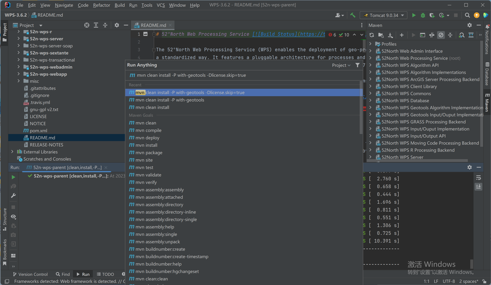
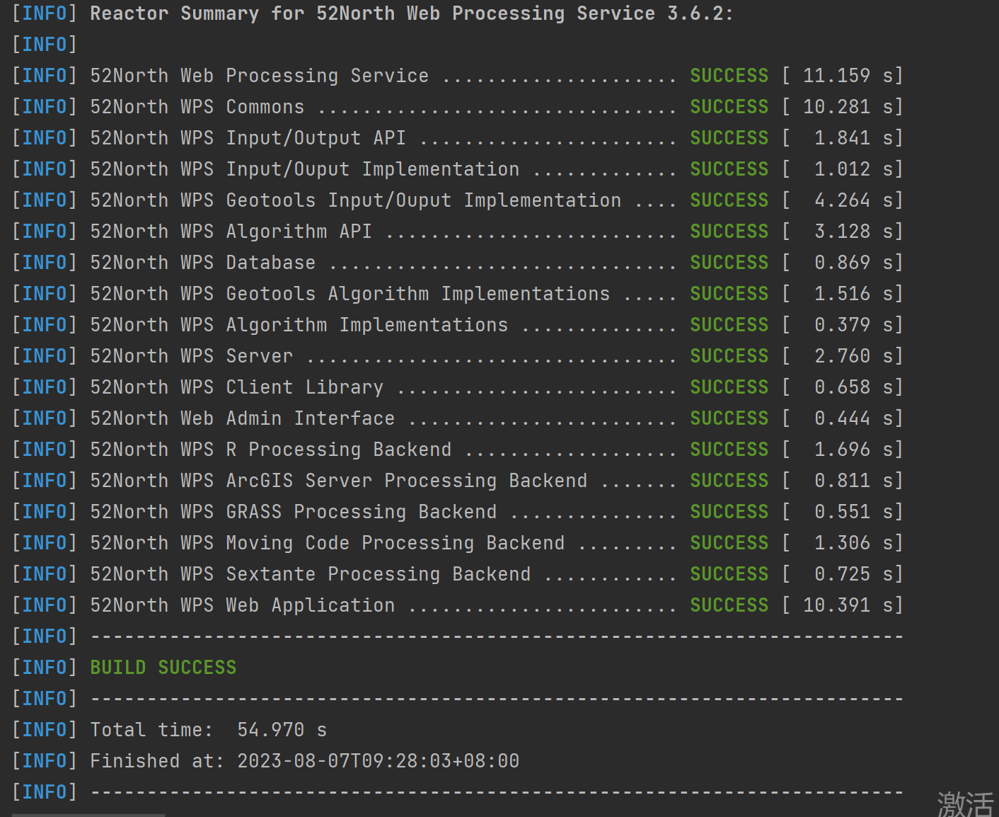
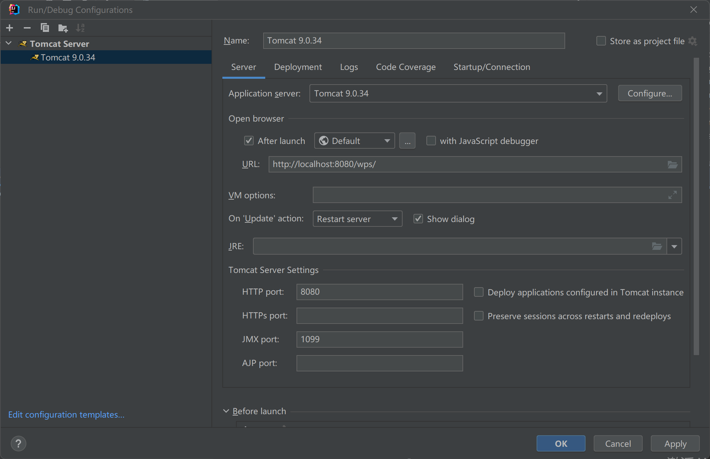
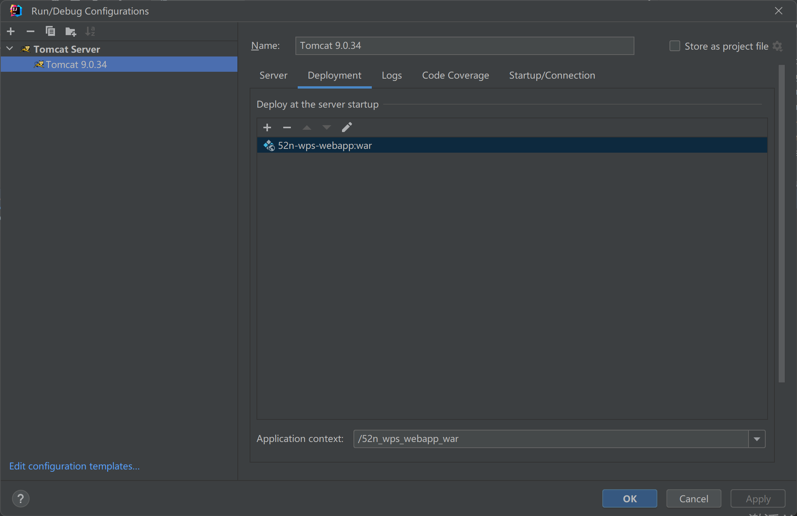
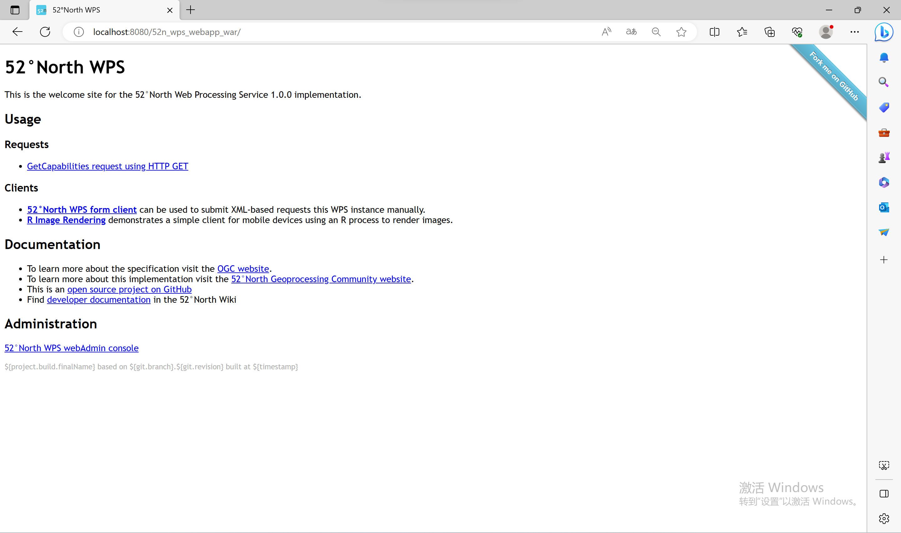
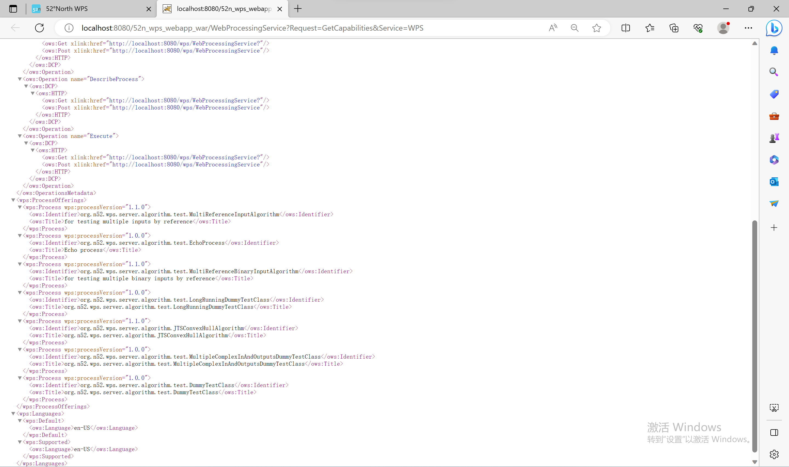

### 5.2.1 从Github中拉取项目

### 5.2.2 构建项目

拉取项目并执行mvn clean install -P with-geotools -Dlicense.skip=true

2.构建项目 出现Build Success时说明项目安装成功

### 5.2.3.配置Tomcat

### 5.2.4 部署工件

### 5.2.5启动Tomcat

### 5.2.6 测试项目

发送GetCapabilities 请求 查看已有算法

https://jdbc.postgresql.org/download/

Pgjdbc驱动程序。将JAR文件放到WPS Web应用程序的WEB-INF/lib文件夹中。