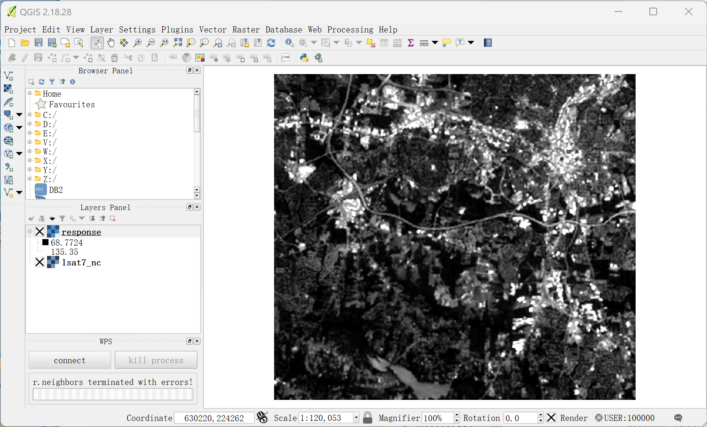

## 5.4   使用GRASS GIS作为WPS服务


### 5.4.1 配置GRASS 后台

从 WPS 版本 3.3.0 开始，您需要将 GeoTools 包添加到 WPS。[您可以在下载区](http://52north.org/downloads/category/15-wps)找到它。（假设已经安装了 Java 1.7 及以上和 Apache Tomcat。其他 servlet 容器也应该可以工作。）

第一步，打开目录 '<GRASS_INSTALL_PATH>\demolocation'中的文件 .grassrc70。将 GISDBASE 参数更改为 GRASS 安装路径，例如 GISDBASE: C:/Programme/GRASS-70-SVN（使用斜杠而不是反斜杠）。


第二步，从(http://52north.org/files/geoprocessing/GRASS/wps-grass-bridge-patched.zip)下载并解压 wps-grass-bridge。请注意，GRASS 后端当前不适用于wps-bridge的主干版本。


第三步，修改"\52n-wps-webapp\src\main\webapp\config\wps_config.xml"中关于GRASS 算法服务的配置,注意设置active="true"。如下所示:

```xml
<Repository name="GrassRepository"
	className="org.n52.wps.server.grass.GrassProcessRepository" active="false">
      <Property name="Grass_Home" active="true">E:\GRASS7\GRASS GIS 7.0.6</Property>
			<Property name="Python_Home" active="true">C:\Python27</Property>
			<Property name="Python_Path" active="true">C:\Python27</Property>
			<Property name="ModuleStarter_Home" active="true">E:\GRASS7\wps-grass-bridge\gms</Property>
			<Property name="GISRC_Dir" active="true">E:\GRASS7\GRASS GIS 7.0.6\demolocation\.grassrc70</Property>
			<Property name="TMP_Dir" active="true">E:\GRASS7\grass_tmp</Property>
</Repository>
```

- Grass_Home必须指向GRASS 7.0的安装目录
- Python_Home 必须指向包含 python 可执行文件的目录（例如 GRASS 7.0 安装的 extrabin 目录或 python 安装的路径）
- Python_Path 必须指向包含 python 安装的目录。
- Addon_Dir（可选）必须指向包含 GRASS 插件（Python 脚本和同名的 .exe 文件）的目录。
- ModuleStarter_Home 变量必须指向包含文件 GrassModuleStarter.py 的 wps-grass-bridge 的子目录。
- GISRC_Dir 必须指向 .grassrc70 文件。父目录还必须包含 PERMANENT 目录。这将在安装 GRASS 7.0 时自动创建，因此除非您知道自己在做什么，否则请将 <GRASS_INSTALL_PATH>\demolocation\.grassrc70 放在这里。
- TMP_Dir 必须指向非只读目录。**注意**：每次启动启用了 GRASS 后端的 WPS 时，它都会尝试删除 tmp 目录中的所有文件，因此请勿指向包含任何重要文件的目录！
- 所有将作为 WPS 进程公开的 Grass 进程都列为该存储库的算法属性。在这里您可以根据需要添加、删除、激活和停用 Grass 进程。


### 5.4.2 获取和描述GRASS服务

当服务启动后，可以在启动进程中看到GRASS被52N注册为WPS服务的信息。

```cmd
···
[RMI TCP Connection(4)-127.0.0.1] INFO  org.n52.wps.server.grass.GrassProcessRepository: GRASS process v.vol.rst added.
[RMI TCP Connection(4)-127.0.0.1] INFO  org.n52.wps.server.grass.GrassProcessRepository: GRASS process v.voronoi added.
[RMI TCP Connection(4)-127.0.0.1] INFO  org.n52.wps.server.RepositoryManager: Algorithm Repository org.n52.wps.server.grass.GrassProcessRepository initialized


```
使用Getcapabilities请求可以查看该项目中所有已注册服务，可以看到GRASS GIS服务已经添加到项目中。


使用DescribeProcess查看服务描述，使用客户端发送以下请求：

```xml
<?xml version="1.0" encoding="UTF-8"?>
<wps:DescribeProcess service="WPS" version="1.0.0"
  xmlns:wps="http://www.opengis.net/wps/1.0.0" xmlns:ows="http://www.opengis.net/ows/1.1"
  xmlns:xsi="http://www.w3.org/2001/XMLSchema-instance"
  xsi:schemaLocation="http://www.opengis.net/wps/1.0.0 http://schemas.opengis.net/wps/1.0.0/wpsDescribeProcess_request.xsd">
  <ows:Identifier>r.neighbors</ows:Identifier>
</wps:DescribeProcess>​
```

请求后服务器会返回该服务的描述：

```xml
<wps:ProcessDescriptions xmlns:wps="http://www.opengis.net/wps/1.0.0" xmlns:xsi="http://www.w3.org/2001/XMLSchema-instance" xsi:schemaLocation="http://www.opengis.net/wps/1.0.0 http://schemas.opengis.net/wps/1.0.0/wpsDescribeProcess_response.xsd" xml:lang="en-US" service="WPS" version="1.0.0">
<ProcessDescription xmlns:ows="http://www.opengis.net/ows/1.1" xmlns:xlink="http://www.w3.org/1999/xlink" wps:processVersion="1" storeSupported="true" statusSupported="true">
<ows:Identifier>r.neighbors</ows:Identifier>
<ows:Title>对一个像元周围的像元值进行函数计算，将得到的值赋予该像元，并将新的像元值存储在输出栅格图层中。</ows:Title>
<ows:Abstract>http://grass.osgeo.org/grass70/manuals/r.neighbors.html</ows:Abstract>
<ows:Metadata xlink:title="raster"/>
<ows:Metadata xlink:title="algebra"/>
<ows:Metadata xlink:title="statistics"/>
<ows:Metadata xlink:title="aggregation"/>
<ows:Metadata xlink:title="neighbor"/>
<ows:Metadata xlink:title="focal statistics"/>
<ows:Metadata xlink:title="filter"/>
<DataInputs>
<Input minOccurs="1" maxOccurs="1">
<ows:Identifier>input</ows:Identifier>
<ows:Title>Name of input raster map</ows:Title>
<ComplexData maximumMegabytes="2048">
<Default>
<Format>
<MimeType>image/tiff</MimeType>
</Format>
</Default>
<Supported>
<Format>
<MimeType>image/tiff</MimeType>
</Format>
<Format>
<MimeType>image/geotiff</MimeType>
</Format>
<Format>
<MimeType>application/geotiff</MimeType>
</Format>
<Format>
<MimeType>application/x-geotiff</MimeType>
</Format>
<Format>
<MimeType>image/png</MimeType>
</Format>
<Format>
<MimeType>image/gif</MimeType>
</Format>
<Format>
<MimeType>image/jpeg</MimeType>
</Format>
<Format>
<MimeType>application/x-erdas-hfa</MimeType>
</Format>
<Format>
<MimeType>application/netcdf</MimeType>
</Format>
<Format>
<MimeType>application/x-netcdf</MimeType>
</Format>
<Format>
<MimeType>image/tiff</MimeType>
<Encoding>base64</Encoding>
</Format>
<Format>
<MimeType>image/tiff</MimeType>
<Encoding>base64</Encoding>
</Format>
<Format>
<MimeType>application/geotiff</MimeType>
<Encoding>base64</Encoding>
</Format>
<Format>
<MimeType>application/geotiff</MimeType>
<Encoding>base64</Encoding>
</Format>
<Format>
<MimeType>application/x-geotiff</MimeType>
<Encoding>base64</Encoding>
</Format>
<Format>
<MimeType>application/x-geotiff</MimeType>
<Encoding>base64</Encoding>
</Format>
<Format>
<MimeType>image/png</MimeType>
<Encoding>base64</Encoding>
</Format>
<Format>
<MimeType>image/png</MimeType>
<Encoding>base64</Encoding>
</Format>
<Format>
<MimeType>image/jpeg</MimeType>
<Encoding>base64</Encoding>
</Format>
<Format>
<MimeType>image/jpeg</MimeType>
<Encoding>base64</Encoding>
</Format>
<Format>
<MimeType>application/x-erdas-hfa</MimeType>
<Encoding>base64</Encoding>
</Format>
<Format>
<MimeType>application/x-erdas-hfa</MimeType>
<Encoding>base64</Encoding>
</Format>
<Format>
<MimeType>application/x-netcdf</MimeType>
<Encoding>base64</Encoding>
</Format>
<Format>
<MimeType>application/x-netcdf</MimeType>
<Encoding>base64</Encoding>
</Format>
</Supported>
</ComplexData>
</Input>
<Input minOccurs="0" maxOccurs="1">
<ows:Identifier>selection</ows:Identifier>
<ows:Title>Name of an input raster map to select the cells which should be processed</ows:Title>
<ComplexData maximumMegabytes="2048">
<Default>
<Format>
<MimeType>image/tiff</MimeType>
</Format>
</Default>
<Supported>
<Format>
<MimeType>image/tiff</MimeType>
</Format>
<Format>
<MimeType>image/geotiff</MimeType>
</Format>
<Format>
<MimeType>application/geotiff</MimeType>
</Format>
<Format>
<MimeType>application/x-geotiff</MimeType>
</Format>
<Format>
<MimeType>image/png</MimeType>
</Format>
<Format>
<MimeType>image/gif</MimeType>
</Format>
<Format>
<MimeType>image/jpeg</MimeType>
</Format>
<Format>
<MimeType>application/x-erdas-hfa</MimeType>
</Format>
<Format>
<MimeType>application/netcdf</MimeType>
</Format>
<Format>
<MimeType>application/x-netcdf</MimeType>
</Format>
<Format>
<MimeType>image/tiff</MimeType>
<Encoding>base64</Encoding>
</Format>
<Format>
<MimeType>image/tiff</MimeType>
<Encoding>base64</Encoding>
</Format>
<Format>
<MimeType>application/geotiff</MimeType>
<Encoding>base64</Encoding>
</Format>
<Format>
<MimeType>application/geotiff</MimeType>
<Encoding>base64</Encoding>
</Format>
<Format>
<MimeType>application/x-geotiff</MimeType>
<Encoding>base64</Encoding>
</Format>
<Format>
<MimeType>application/x-geotiff</MimeType>
<Encoding>base64</Encoding>
</Format>
<Format>
<MimeType>image/png</MimeType>
<Encoding>base64</Encoding>
</Format>
<Format>
<MimeType>image/png</MimeType>
<Encoding>base64</Encoding>
</Format>
<Format>
<MimeType>image/jpeg</MimeType>
<Encoding>base64</Encoding>
</Format>
<Format>
<MimeType>image/jpeg</MimeType>
<Encoding>base64</Encoding>
</Format>
<Format>
<MimeType>application/x-erdas-hfa</MimeType>
<Encoding>base64</Encoding>
</Format>
<Format>
<MimeType>application/x-erdas-hfa</MimeType>
<Encoding>base64</Encoding>
</Format>
<Format>
<MimeType>application/x-netcdf</MimeType>
<Encoding>base64</Encoding>
</Format>
<Format>
<MimeType>application/x-netcdf</MimeType>
<Encoding>base64</Encoding>
</Format>
</Supported>
</ComplexData>
</Input>
<Input minOccurs="0" maxOccurs="1024">
<ows:Identifier>method</ows:Identifier>
<ows:Title>邻近操作</ows:Title>
<LiteralData>
<ows:DataType ows:reference="xs:string">string</ows:DataType>
<ows:AllowedValues>
<ows:Value>average</ows:Value>
<ows:Value>median</ows:Value>
<ows:Value>mode</ows:Value>
<ows:Value>minimum</ows:Value>
<ows:Value>maximum</ows:Value>
<ows:Value>range</ows:Value>
<ows:Value>stddev</ows:Value>
<ows:Value>sum</ows:Value>
<ows:Value>count</ows:Value>
<ows:Value>variance</ows:Value>
<ows:Value>diversity</ows:Value>
<ows:Value>interspersion</ows:Value>
<ows:Value>quart1</ows:Value>
<ows:Value>quart3</ows:Value>
<ows:Value>perc90</ows:Value>
<ows:Value>quantile</ows:Value>
</ows:AllowedValues>
<DefaultValue>average</DefaultValue>
</LiteralData>
</Input>
<Input minOccurs="0" maxOccurs="1">
<ows:Identifier>size</ows:Identifier>
<ows:Title>邻域大小</ows:Title>
<LiteralData>
<ows:DataType ows:reference="xs:integer">integer</ows:DataType>
<ows:AnyValue/>
<DefaultValue>3</DefaultValue>
</LiteralData>
</Input>
<Input minOccurs="0" maxOccurs="1">
<ows:Identifier>title</ows:Identifier>
<ows:Title>Title for output raster map</ows:Title>
<LiteralData>
<ows:DataType ows:reference="xs:string">string</ows:DataType>
<ows:AnyValue/>
</LiteralData>
</Input>
<Input minOccurs="0" maxOccurs="1">
<ows:Identifier>weight</ows:Identifier>
<ows:Title>Text file containing weights</ows:Title>
<ComplexData maximumMegabytes="2048">
<Default>
<Format>
<MimeType>text/plain</MimeType>
</Format>
</Default>
<Supported>
<Format>
<MimeType>text/plain</MimeType>
</Format>
<Format>
<MimeType>text/plain</MimeType>
<Encoding>base64</Encoding>
</Format>
<Format>
<MimeType>text/plain</MimeType>
<Encoding>base64</Encoding>
</Format>
</Supported>
</ComplexData>
</Input>
<Input minOccurs="0" maxOccurs="1">
<ows:Identifier>gauss</ows:Identifier>
<ows:Title>Sigma (in cells) for Gaussian filter</ows:Title>
<LiteralData>
<ows:DataType ows:reference="xs:float">float</ows:DataType>
<ows:AnyValue/>
</LiteralData>
</Input>
<Input minOccurs="0" maxOccurs="1024">
<ows:Identifier>quantile</ows:Identifier>
<ows:Title>Quantile to calculate for method=quantile</ows:Title>
<LiteralData>
<ows:DataType ows:reference="xs:float">float</ows:DataType>
<ows:AllowedValues>
<ows:Range ows:rangeClosure="closed">
<ows:MinimumValue>0.0</ows:MinimumValue>
<ows:MaximumValue>1.0</ows:MaximumValue>
</ows:Range>
</ows:AllowedValues>
</LiteralData>
</Input>
<Input minOccurs="0" maxOccurs="1">
<ows:Identifier>-a</ows:Identifier>
<ows:Title>输出栅格不对齐到输入栅格</ows:Title>
<LiteralData>
<ows:DataType ows:reference="xs:boolean">boolean</ows:DataType>
<ows:AllowedValues>
<ows:Value>true</ows:Value>
<ows:Value>false</ows:Value>
</ows:AllowedValues>
<DefaultValue>false</DefaultValue>
</LiteralData>
</Input>
<Input minOccurs="0" maxOccurs="1">
<ows:Identifier>-c</ows:Identifier>
<ows:Title>Use circular neighborhood</ows:Title>
<LiteralData>
<ows:DataType ows:reference="xs:boolean">boolean</ows:DataType>
<ows:AllowedValues>
<ows:Value>true</ows:Value>
<ows:Value>false</ows:Value>
</ows:AllowedValues>
<DefaultValue>false</DefaultValue>
</LiteralData>
</Input>
<Input minOccurs="0" maxOccurs="1">
<ows:Identifier>grass_resolution_ns</ows:Identifier>
<ows:Title>Resolution of the mapset in north-south direction in meters or degrees</ows:Title>
<ows:Abstract>This parameter defines the north-south resolution of the mapset in meter or degrees, which should be used to process the input and output raster data. To enable this setting, you need to specify north-south and east-west resolution.</ows:Abstract>
<LiteralData>
<ows:DataType ows:reference="xs:float">float</ows:DataType>
<UOMs>
<Default>
<ows:UOM>meters</ows:UOM>
</Default>
<Supported>
<ows:UOM>meters</ows:UOM>
<ows:UOM>degrees</ows:UOM>
</Supported>
</UOMs>
<ows:AnyValue/>
</LiteralData>
</Input>
<Input minOccurs="0" maxOccurs="1">
<ows:Identifier>grass_resolution_ew</ows:Identifier>
<ows:Title>Resolution of the mapset in east-west direction in meters or degrees</ows:Title>
<ows:Abstract>This parameter defines the east-west resolution of the mapset in meters or degrees, which should be used to process the input and output raster data. To enable this setting, you need to specify north-south and east-west resolution.</ows:Abstract>
<LiteralData>
<ows:DataType ows:reference="xs:float">float</ows:DataType>
<UOMs>
<Default>
<ows:UOM>meters</ows:UOM>
</Default>
<Supported>
<ows:UOM>meters</ows:UOM>
<ows:UOM>degrees</ows:UOM>
</Supported>
</UOMs>
<ows:AnyValue/>
</LiteralData>
</Input>
<Input minOccurs="0" maxOccurs="1">
<ows:Identifier>grass_band_number</ows:Identifier>
<ows:Title>Band to select for processing (default is all bands)</ows:Title>
<ows:Abstract>This parameter defines band number of the input raster files which should be processed. As default all bands are processed and used as single and multiple inputs for raster modules.</ows:Abstract>
<LiteralData>
<ows:DataType ows:reference="xs:integer">integer</ows:DataType>
<ows:AnyValue/>
</LiteralData>
</Input>
</DataInputs>
<ProcessOutputs>
<Output>
<ows:Identifier>output</ows:Identifier>
<ows:Title>Name for output raster map</ows:Title>
<ComplexOutput>
<Default>
<Format>
<MimeType>image/tiff</MimeType>
</Format>
</Default>
<Supported>
<Format>
<MimeType>image/tiff</MimeType>
</Format>
<Format>
<MimeType>image/geotiff</MimeType>
</Format>
<Format>
<MimeType>application/geotiff</MimeType>
</Format>
<Format>
<MimeType>application/x-geotiff</MimeType>
</Format>
<Format>
<MimeType>application/x-erdas-hfa</MimeType>
</Format>
<Format>
<MimeType>application/netcdf</MimeType>
</Format>
<Format>
<MimeType>application/x-netcdf</MimeType>
</Format>
<Format>
<MimeType>image/tiff</MimeType>
<Encoding>base64</Encoding>
</Format>
<Format>
<MimeType>image/tiff</MimeType>
<Encoding>base64</Encoding>
</Format>
<Format>
<MimeType>application/geotiff</MimeType>
<Encoding>base64</Encoding>
</Format>
<Format>
<MimeType>application/geotiff</MimeType>
<Encoding>base64</Encoding>
</Format>
<Format>
<MimeType>application/x-geotiff</MimeType>
<Encoding>base64</Encoding>
</Format>
<Format>
<MimeType>application/x-geotiff</MimeType>
<Encoding>base64</Encoding>
</Format>
<Format>
<MimeType>application/x-erdas-hfa</MimeType>
<Encoding>base64</Encoding>
</Format>
<Format>
<MimeType>application/x-erdas-hfa</MimeType>
<Encoding>base64</Encoding>
</Format>
<Format>
<MimeType>application/x-netcdf</MimeType>
<Encoding>base64</Encoding>
</Format>
<Format>
<MimeType>application/x-netcdf</MimeType>
<Encoding>base64</Encoding>
</Format>
</Supported>
</ComplexOutput>
</Output>
</ProcessOutputs>
</ProcessDescription>
</wps:ProcessDescriptions>
```


### 5.4.3  GRASS: r.neighbors

r.neighbors - 使每个像元类别值成为分配给其周围像元的类别值的函数，并将新像元值存储在输出栅格地图图层中。

r.neighbors查看栅格输入文件中的每个像元，并检查分配给其周围某些用户定义的“邻域”中的像元的值。它输出一个新的栅格地图图层，其中每个像元都被分配一个值，该值是该像元邻域中的值的某个（用户指定的）函数。例如，输出层中的每个像元可能被分配一个值，该值等于输入层中其 3 x 3 像元“邻域”中出现的值的平均值。请注意，中心单元格也包含在计算中。

r.neighbors为基于邻域平均值、中值、众数、最小值和最大值的输出地图图层复制与输入栅格地图图层关联的GRASS颜色文件。由于标准差、方差、多样性和散布是索引，而不是输入值的直接对应项，因此不会为这些地图图层复制颜色文件。（用户应注意，虽然颜色文件是为平均邻域函数输出而复制的，但颜色文件对于输出是否有意义将取决于输入数据值。）

- input=name [required]
  输入栅格地图的名称

- selection=name
  用于选择要处理的像元的输入栅格地图的名称

- output=name[,name,...] [required]
  输出栅格地图的名称

- method=string[,string,...]
  邻域操作
  可选: average, median, mode, minimum, maximum, range, stddev, sum, count, variance, diversity, interspersion, quart1, quart3, perc90, quantile
  默认值: average

- size=integer
  邻域大小
  默认值: 3
- title=phrase
  输出栅格地图的标题
- weight=name
  包含权重的文本文件
- gauss=float
  高斯过滤器的西格玛(以单元为单位)
- quantile=float[,float,...]
  要为方法计算的分位数=分位数
  可选: 0.0-1.0

### 5.4.4 QGIS调用GRASS服务


打开QGIS 2.18和已经安装好的WPS插件（见环境准备5.1），


