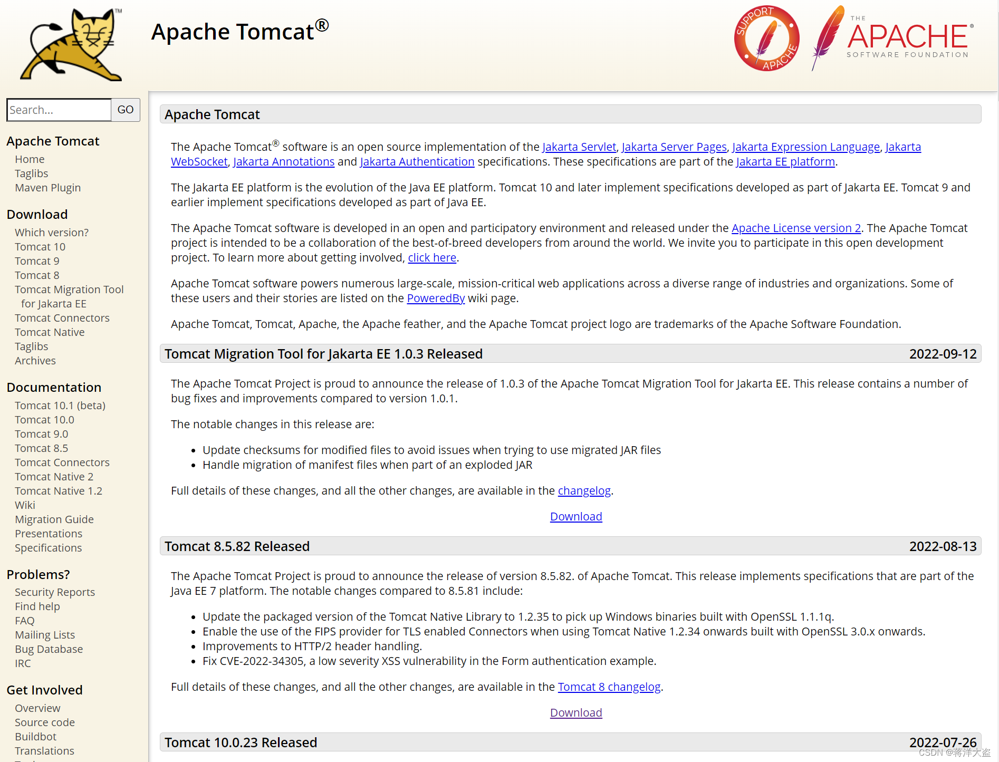
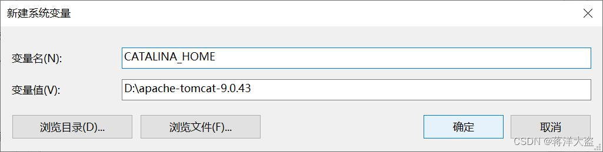
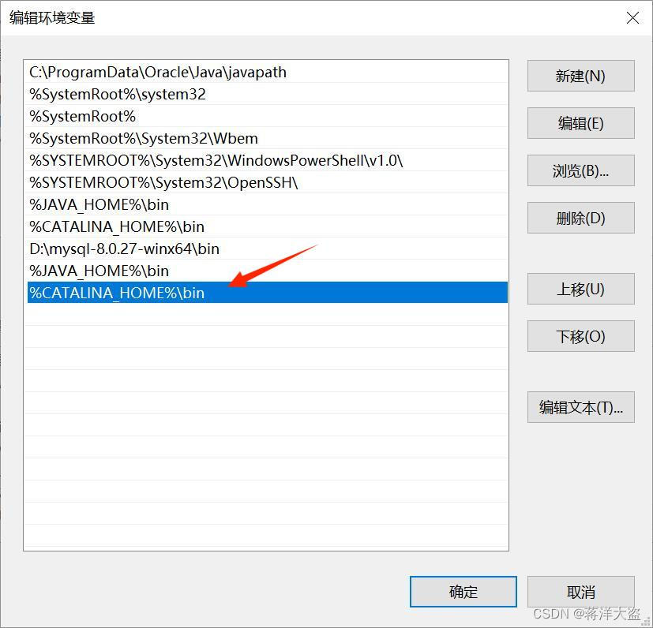
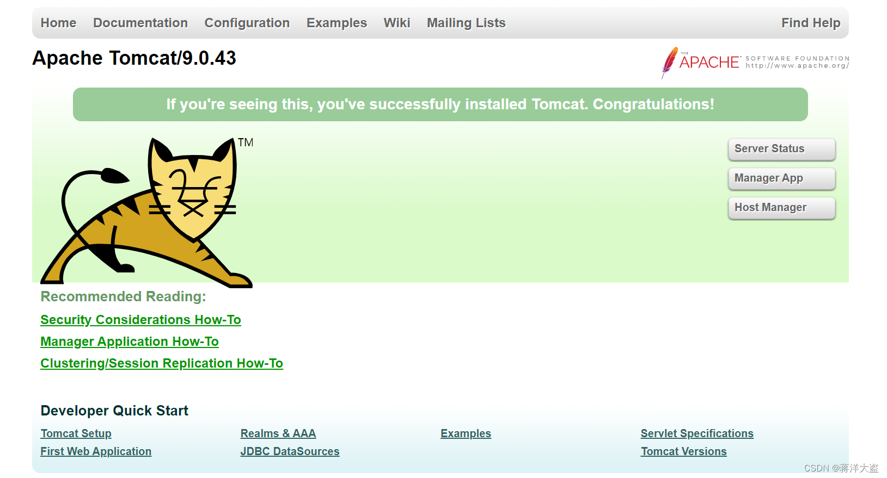
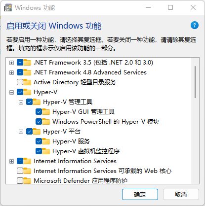

## 4.1 环境准备

### 4.1.1  Tomcat 介绍与安装

Tomcat是在Oracle公司的JSWDK（JavaServer Web DevelopmentKit，是Oracle公司推出的小型Servlet/JSP调试工具）的基础上发展起来的一个优秀的Servlet容器，**Tomcat本身完全用Java语言编写**。作为一个开源软件，Tomcat除了运行稳定、可靠，并且效率高之外，还可以和目前大部分的主流Web服务器（如IIS、Apache、Nginx等）一起工作。

tomcat的版本实际上比较复杂，目前有7、8、9、10四个版本并行发布，在安装它之前我们需要在电脑上配置好JDK环境，具体的各个版本的兼容信息我们可以通过官网查询。安装Tomcat服务器，为WPS服务发布和数据资源发布提供环境。

第一步，在Tomcat官网(http://tomcat.apache.org/)下载Zip到指定目录中并解压，这一步不需要安装过程。



第二步，配置Tomcat环境变量。首先复制Tomcat的安装路径（如D:\apache-tomcat-9.0.43），然后在【此电脑】→【属性】→【高级系统设置】→【环境变量】中新建变量名，【系统变量】→【新建】→变量名：CATALINA_HOME  变量值：Tomcat的安装路径→【确定】，如图4.1所示。最后在【Path】→【编辑】→【新建】→输入%CATALINA_HOME%\bin，如图4.2所示。




第三步，启动并测试Tomcat。 在Tomcat安装路径下的bin目录里找到startup.bat，双击运行，保持窗口打开状态。  打开浏览器，在地址栏输入http://localhost:8080/或http://127.0.0.1:8080/，能看到Tomcat首页即启动成功(若出现闪退现象，请先检查环境变量配置是否正确)，如图4.3所示。如果关闭Tomcat窗口，则Tomcat服务器关闭。


### 4.1.2  Docker 介绍与安装

Docker 并非是一个通用的容器工具，它依赖于已存在并运行的 Linux 内核环境。Docker 实质上是在已经运行的 Linux 下制造了一个隔离的文件环境，因此它执行的效率几乎等同于所部署的 Linux 主机。因此，Docker 必须部署在 Linux 内核的系统上。如果其他系统想部署 Docker 就必须安装一个虚拟 Linux 环境。在 Windows 上部署 Docker 的方法都是先安装一个虚拟机，并在安装 Linux 系统的的虚拟机中运行 Docker。

第一步，安装Hyper-V 。方式一：Hyper-V 是微软开发的虚拟机，类似于 VMWare 或 VirtualBox，仅适用于 Windows 10。这是 Docker Desktop for Windows 所使用的虚拟机。【控制面板】→【程序】→【程序和功能】→【启用或关闭Widows功能】→【Hyper-V】，全部勾选并点击确定。如图4.4所示。方式二：可以通过命令来启用 Hyper-V ，请右键开始菜单并以管理员身份运行 PowerShell，执行以下命令：`Enable-WindowsOptionalFeature -Online -FeatureName Microsoft-Hyper-V -All`



第二步，安装 Docker Desktop for Windows。点击(https://hub.docker.com/?overlay=onboarding)，并下载 Windows 的版本，如果你还没有登录，会要求注册登录。双击下载的 Docker for Windows Installer 安装文件，一直点击【Next】，直到 【Finish】 完成安装。安装之后，可以打开 PowerShell 并运行以下命令检测是否运行成功：`docker run hello-world`.安装成功后会出现：Hello from Docker！

### 4.1.3 PyWPS的安装与使用

#### 4.1.3.1 依赖关系和要求(Linux安装)

PyWPS 在 Python 2.7、3.3 或更高版本上运行。PyWPS 目前在 Linux（主要是 Ubuntu）上进行测试和开发。在安装 PyWPS 之前，必须在系统中安装 GDAL 的 Git 和 Python 绑定。*在基于 Debian 的系统中，可以使用apt*等工具安装这些软件包：

`$ sudo apt-get install git python-gdal`

或者，如果 GDAL 已安装在您的系统上，您可以通过 pip 安装 GDAL Python 绑定：

`$ pip install GDAL==1.10.0 --global-option=build_ext --global-option="-I/usr/include/gdal"`

1. 使用pip:安装 PyWPS 最简单的方法是使用 Python 包索引 (PIP)。它从存储库中获取源代码并自动将其安装在系统中。这可能需要超级用户权限（例如基于 Debian 的系统中的*sudo*）：

`$ sudo pip install -e git+https://github.com/geopython/pywps.git@master#egg=pywps-dev`

2. 手动安装：手动安装 PyWPS 需要[下载](https://pywps.org/download)源代码，然后使用setup.py脚本。再次是基于 Debian 的系统的示例（注意sudo的安装用法）：

   ```sh
   $ tar zxf pywps-x.y.z.tar.gz
   $ cd pywps-x.y.z/
   ```

   然后使用 pip 安装包依赖项：

   ```sh
   $ pip install -r requirements.txt
   $ pip install -r requirements-gdal.txt  # 用于GDAL Python绑定 (如果 python-gdal 没有通过 apt-get被安装)
   $ pip install -r requirements-dev.txt  # 对于开发人员任务
   ```

   要在系统范围内安装 PyWPS，请运行：

   ```sh
   $ sudo python setup.py install
   ```

#### 4.1.3.2 Windows 安装

要使用 PyWPS，用户必须对流程进行编码并通过服务发布它们。官方提供了一个示例服务，为首次使用的用户提供了一个良好的起点。它启动了一个非常简单的内置服务器（依赖于[Flask Python Microframework](http://flask.pocoo.org/)），这对于测试来说足够好。该示例服务可以直接克隆到用户区域：

```sh
$ git clone https://github.com/geopython/pywps-flask.git
```

PyWPS 未在 MS Windows 平台上进行测试。这主要是因为缺少多处理库。它用于处理异步执行，即在发出存储响应文档的请求并更新显示执行进度的状态文档时。因此我们通过Docker来安装PyWPS。

第一步，在DockerHub中搜索PyWPS，并找到可用的Docker镜像pywps/flask-alpine，如图4.X所示。


第二步，打开终端，在命令行中输入`docker pull pywps/flask-alpine:3.6` 拉取镜像，拉取成功后输入`docker run -p 5551:5000 pywps/flask-alpine:3.6`启动镜像，其中-p是端口映射，我们以端口号5551启动该镜像。在Docker Desktop中可以看到镜像已经被启动。


第三步，在浏览器中输入`http://localhost:5551/` 并回车，可以看到一个PyWPS的页面已经被打开，此时说明拉取的镜像已经成功部署并启动。

