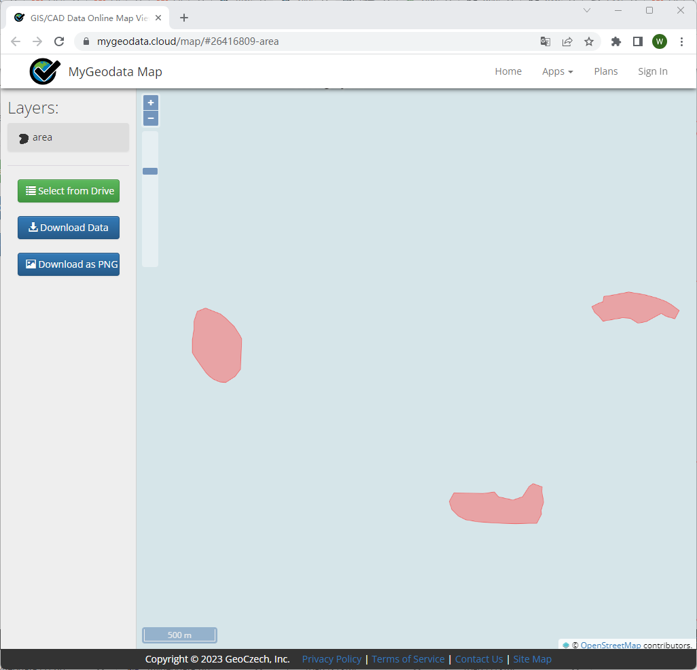

## 4.2 面积计算服务

这一节通过面积计算服务对PyWPS进行实践。该服务是由pywps-flaske中默认的服务。

第一步，使用Get Capabilities请求查询服务。我们在浏览器中输入`http://localhost:5551/wps?service=WPS&request=GetCapabilities&VERSION=1.0.0`得到响应文档如下：

```xml
This XML file does not appear to have any style information associated with it. The document tree is shown below.
<!--  PyWPS 4.0.0  -->
<wps:Capabilities xmlns:xlink="http://www.w3.org/1999/xlink" xmlns:wps="http://www.opengis.net/wps/1.0.0" xmlns:ows="http://www.opengis.net/ows/1.1" xmlns:gml="http://www.opengis.net/gml" xmlns:xsi="http://www.w3.org/2001/XMLSchema-instance" service="WPS" version="1.0.0" xml:lang="en-US" xsi:schemaLocation="http://www.opengis.net/wps/1.0.0 http://schemas.opengis.net/wps/1.0.0/wpsGetCapabilities_response.xsd" updateSequence="1">
<ows:ServiceIdentification>
<ows:Title>PyWPS Demo server</ows:Title>
<ows:Abstract>PyWPS testing and development server. Do NOT use this server in production environement. You shall setup PyWPS as WSGI application for production. Please refer documentation for further detials.</ows:Abstract>
<ows:Keywords>
<ows:Keyword>WPS</ows:Keyword>
<ows:Keyword>GRASS</ows:Keyword>
<ows:Keyword>PyWPS</ows:Keyword>
<ows:Keyword> Demo</ows:Keyword>
<ows:Keyword> Dev</ows:Keyword>
<ows:Type codeSpace="ISOTC211/19115">theme</ows:Type>
</ows:Keywords>
<ows:ServiceType>WPS</ows:ServiceType>
<ows:ServiceTypeVersion>1.0.0</ows:ServiceTypeVersion>
<ows:Fees>None</ows:Fees>
<ows:AccessConstraints>None</ows:AccessConstraints>
</ows:ServiceIdentification>
<ows:ServiceProvider>
<ows:ProviderName>PyWPS Developement team</ows:ProviderName>
<ows:ProviderSite xlink:href="http://pywps.org/'"/>
<ows:ServiceContact>
<ows:IndividualName>Your Name</ows:IndividualName>
<ows:PositionName>Developer</ows:PositionName>
<ows:ContactInfo>
<ows:Phone>
<ows:Voice>+00 00 11 22 33</ows:Voice>
</ows:Phone>
<ows:Address>
<ows:AdministrativeArea>None</ows:AdministrativeArea>
<ows:PostalCode>000 00</ows:PostalCode>
<ows:Country>World, Internet</ows:Country>
<ows:ElectronicMailAddress>info@yourdomain.org</ows:ElectronicMailAddress>
</ows:Address>
<ows:OnlineResource xlink:href="http://pywps.org"/>
<ows:HoursOfService>8:00-20:00UTC</ows:HoursOfService>
<ows:ContactInstructions>Knock on the door</ows:ContactInstructions>
</ows:ContactInfo>
<ows:Role>pointOfContact</ows:Role>
</ows:ServiceContact>
</ows:ServiceProvider>
<ows:OperationsMetadata>
<ows:Operation name="GetCapabilities">
<ows:DCP>
<ows:HTTP>
<ows:Get xlink:href="http://localhost:5000/wps"/>
<ows:Post xlink:href="http://localhost:5000/wps"/>
</ows:HTTP>
</ows:DCP>
</ows:Operation>
<ows:Operation name="DescribeProcess">
<ows:DCP>
<ows:HTTP>
<ows:Get xlink:href="http://localhost:5000/wps"/>
<ows:Post xlink:href="http://localhost:5000/wps"/>
</ows:HTTP>
</ows:DCP>
</ows:Operation>
<ows:Operation name="Execute">
<ows:DCP>
<ows:HTTP>
<ows:Get xlink:href="http://localhost:5000/wps"/>
<ows:Post xlink:href="http://localhost:5000/wps"/>
</ows:HTTP>
</ows:DCP>
</ows:Operation>
</ows:OperationsMetadata>
<wps:ProcessOfferings>
<wps:Process wps:processVersion="undefined">
<ows:Identifier>feature_count</ows:Identifier>
<ows:Title>Feature count</ows:Title>
<ows:Abstract>This process counts the number of features in an uploaded GML </ows:Abstract>
<ows:Metadata xlink:title="Feature" xlink:type="simple"/>
<ows:Metadata xlink:title="Count" xlink:type="simple"/>
</wps:Process>
<wps:Process wps:processVersion="1.3.3.7">
<ows:Identifier>say_hello</ows:Identifier>
<ows:Title>Process Say Hello</ows:Title>
<ows:Abstract>Returns a literal string output with Hello plus the inputed name</ows:Abstract>
</wps:Process>
<wps:Process wps:processVersion="undefined">
<ows:Identifier>centroids</ows:Identifier>
<ows:Title>Process Centroids</ows:Title>
<ows:Abstract>Returns a GeoJSON with centroids of features from an uploaded GML.</ows:Abstract>
</wps:Process>
<wps:Process wps:processVersion="1.3.3.7">
<ows:Identifier>ultimate_question</ows:Identifier>
<ows:Title>Answer to the ultimate question</ows:Title>
<ows:Abstract>The process gives the answer to the ultimate question of "What is the meaning of life?</ows:Abstract>
<ows:Metadata xlink:title="Ultimate Question" xlink:type="simple"/>
<ows:Metadata xlink:title="What is the meaning of life" xlink:type="simple"/>
</wps:Process>
<wps:Process wps:processVersion="undefined">
<ows:Identifier>sleep</ows:Identifier>
<ows:Title>Sleep Process</ows:Title>
<ows:Abstract>The process will sleep for a given delay or 10 seconds if not a valid value</ows:Abstract>
<ows:Metadata xlink:title="Sleep" xlink:type="simple"/>
<ows:Metadata xlink:title="Wait" xlink:type="simple"/>
<ows:Metadata xlink:title="Delay" xlink:type="simple"/>
</wps:Process>
<wps:Process wps:processVersion="0.1">
<ows:Identifier>buffer</ows:Identifier>
<ows:Title>GDAL Buffer process</ows:Title>
<ows:Abstract>The process returns buffers around the input features, using the GDAL library</ows:Abstract>
</wps:Process>
<wps:Process wps:processVersion="undefined">
<ows:Identifier>area</ows:Identifier>
<ows:Title>Process Area</ows:Title>
<ows:Abstract>Process returns the area of each feature from a submitted GML file</ows:Abstract>
</wps:Process>
<wps:Process wps:processVersion="0.1">
<ows:Identifier>boundingbox</ows:Identifier>
<ows:Title>Bounding box in- and out</ows:Title>
<ows:Abstract>Given a bounding box, it returns the same bounding box</ows:Abstract>
</wps:Process>
<wps:Process wps:processVersion="1.0.0.0">
<ows:Identifier>testjson</ows:Identifier>
<ows:Title>Process Test</ows:Title>
</wps:Process>
</wps:ProcessOfferings>
<wps:Languages>
<wps:Default>
<ows:Language>en-US</ows:Language>
</wps:Default>
<wps:Supported>
<ows:Language>en-US</ows:Language>
</wps:Supported>
</wps:Languages>
</wps:Capabilities>
```

在响应文档中我们可以看到一些服务，每个服务都包含了它的Identifier、Title以及Abstract。其中area服务的作用是进程从提交的GML文件返回每个要素的面积，如下：

```xml
<wps:Process wps:processVersion="undefined">
<ows:Identifier>area</ows:Identifier>
<ows:Title>Process Area</ows:Title>
<ows:Abstract>Process returns the area of each feature from a submitted GML file</ows:Abstract>
</wps:Process>
```

第二步，在知道服务的Identifier的情况下，我们可以使用DescribeProcess操作来获得该服务的具体描述，在浏览器中输入`http://localhost:5551/wps?service=WPS&version=1.0.0&request=DescribeProcess&identifier=area`,我们会得到一个关于服务的响应文档。在这份响应文档中，我们可以看到服务的具体描述，如输入与输出的参数形式。Process Area 支持通过gml+xml的格式输入，并将计算结果以Literal字符的形式返回。

```xml
This XML file does not appear to have any style information associated with it. The document tree is shown below.
<!--  PyWPS 4.0.0  -->
<wps:ProcessDescriptions xmlns:xlink="http://www.w3.org/1999/xlink" xmlns:wps="http://www.opengis.net/wps/1.0.0" xmlns:ows="http://www.opengis.net/ows/1.1" xmlns:gml="http://www.opengis.net/gml" xmlns:xsi="http://www.w3.org/2001/XMLSchema-instance" xsi:schemaLocation="http://www.opengis.net/wps/1.0.0 http://schemas.opengis.net/wps/1.0.0/wpsDescribeProcess_response.xsd" service="WPS" version="1.0.0" xml:lang="en-US">
<ProcessDescription wps:processVersion="None" storeSupported="true" statusSupported="true">
<ows:Identifier>area</ows:Identifier>
<ows:Title>Process Area</ows:Title>
<ows:Abstract>Process returns the area of each feature from a submitted GML file</ows:Abstract>
<DataInputs>
<Input minOccurs="1" maxOccurs="1">
<ows:Identifier>layer</ows:Identifier>
<ows:Title>Layer</ows:Title>
<ComplexData>
<Default>
<Format>
<MimeType>application/gml+xml</MimeType>
</Format>
</Default>
<Supported>
<Format>
<MimeType>application/gml+xml</MimeType>
</Format>
</Supported>
</ComplexData>
</Input>
</DataInputs>
<ProcessOutputs>
<Output>
<ows:Identifier>area</ows:Identifier>
<ows:Title>Area</ows:Title>
<LiteralOutput>
<ows:DataType ows:reference="urn:ogc:def:dataType:OGC:1.1:string">string</ows:DataType>
</LiteralOutput>
</Output>
</ProcessOutputs>
</ProcessDescription>
</wps:ProcessDescriptions>
```

第三步，准备数据，在示例数据对应的文件中，我们准备了数据area.gml，内容如下。该数据包含了三个面，如图4.X所示。如果想要使用shp数据或其他格式数据，可以通过https://mygeodata.cloud/进行格式的转换。我们将该数据放在[Path]\webapps\PyWPS\Data\mygeodata\area.gml ,并启动Tomcat，让数据可以作为Web资源被访问。

```xml
<?xml version="1.0" encoding="utf-8" ?>
<ogr:FeatureCollection
     xmlns:xsi="http://www.w3.org/2001/XMLSchema-instance"
     xsi:schemaLocation="http://ogr.maptools.org/ area.xsd"
     xmlns:ogr="http://ogr.maptools.org/"
     xmlns:gml="http://www.opengis.net/gml">
  <gml:boundedBy>
    <gml:Box>
      <gml:coord><gml:X>0.0425045052335822</gml:X><gml:Y>0.03019076053432326</gml:Y></gml:coord>
      <gml:coord><gml:X>0.07326459284914372</gml:X><gml:Y>0.04481800833490072</gml:Y></gml:coord>
    </gml:Box>
  </gml:boundedBy>
                                                                                         
  <gml:featureMember>
    <ogr:area fid="area.0">
      <ogr:geometryProperty><gml:Polygon srsName="EPSG:4326"><gml:outerBoundaryIs><gml:LinearRing><gml:coordinates>0.043340103108456,0.043806482696114 0.044284020406944,0.043433035478347 0.044367674545998,0.0433633237158 0.044618636963161,0.04316813078033 0.044855657023814,0.042931110786566 0.045148446510503,0.042652263734164 0.045538832492755,0.042038800215309 0.045622486631809,0.041857549629275 0.045552774849264,0.039947447274348 0.045204215936539,0.039487349620099 0.044618636963161,0.039110906082908 0.044242193337417,0.039138790789426 0.043851807355165,0.039306099028327 0.043600844938003,0.039487349620099 0.043377767233859,0.039710427270966 0.043001323608115,0.040240236689353 0.042708534121426,0.040658507280385 0.042504505233582,0.040986340640755 0.042504505233582,0.041821938297444 0.042608954967941,0.042448636534136 0.042608954967941,0.042970885060837 0.04281785443666,0.043597583288154 0.043340103108456,0.043806482696114</gml:coordinates></gml:LinearRing></gml:outerBoundaryIs></gml:Polygon></ogr:geometryProperty>
      <ogr:ID>0</ogr:ID>
    </ogr:area>
  </gml:featureMember>
  <gml:featureMember>
    <ogr:area fid="area.1">
      <ogr:geometryProperty><gml:Polygon srsName="EPSG:4326"><gml:outerBoundaryIs><gml:LinearRing><gml:coordinates>0.058735420398862,0.031595415360538 0.059034773110265,0.032148066434541 0.060853916510329,0.032102012178486 0.061590784723014,0.032194120690571 0.061844083171124,0.031894768025987 0.062765168436979,0.031687523873069 0.063363873859785,0.031894768025987 0.06377836222942,0.032539527610155 0.06403166067753,0.032723744633449 0.06460733896869,0.032516500482223 0.064584311837043,0.032240174946589 0.064699447495275,0.031549361104228 0.064538257573751,0.031042764283584 0.064561284705397,0.030789465872346 0.064261931993994,0.030213787662765 0.06377836222942,0.030213787662765 0.06294938549015,0.030190760534323 0.062074354487588,0.030213787662765 0.060577590930573,0.030305896176504 0.059771641322949,0.030444058946974 0.059311098690022,0.030674330230674 0.058896610320387,0.03108881854011 0.058735420398862,0.031595415360538</gml:coordinates></gml:LinearRing></gml:outerBoundaryIs></gml:Polygon></ogr:geometryProperty>
      <ogr:ID>0</ogr:ID>
    </ogr:area>
  </gml:featureMember>
  <gml:featureMember>
    <ogr:area fid="area.2">
      <ogr:geometryProperty><gml:Polygon srsName="EPSG:4326"><gml:outerBoundaryIs><gml:LinearRing><gml:coordinates>0.068935492099624,0.044603088504969 0.070071497260845,0.044818008334901 0.071023285368896,0.044664494170724 0.07182155926597,0.044449574340347 0.072404913267679,0.044234654509347 0.072773347374021,0.044019734677724 0.073264592849144,0.043651300679214 0.072988267269387,0.043129352511566 0.072435616109874,0.043282866678897 0.072128587687922,0.043467083679278 0.071453125159628,0.043098649678059 0.071176799579872,0.04294513551037 0.070654851262554,0.042853027009595 0.070163605787431,0.04316005534506 0.069672360312308,0.043190758178542 0.068444246624501,0.042975838343928 0.068198623886939,0.043282866678897 0.067922298307183,0.043528489345974 0.067738081254012,0.043896923345082 0.068167921044744,0.044111843177062 0.068444246624501,0.044203951676298 0.068505652308891,0.044541682839164 0.068935492099624,0.044603088504969</gml:coordinates></gml:LinearRing></gml:outerBoundaryIs></gml:Polygon></ogr:geometryProperty>
      <ogr:ID>0</ogr:ID>
    </ogr:area>
  </gml:featureMember>
</ogr:FeatureCollection>

```



第四步，调用面积计算服务，在浏览器中输入`http://localhost:5551/wps?
service=WPS&request=Execute&version=1.0.0&identifier=area&DATAINPUTS=layer=@xlink:href=http://172.31.41.229:8080/PyWPS/Data/mygeodata/area.gml&storeExecuteResponse=true`，ip替换为本机的ip地址即可，计算完成后得到响应文档,可以看到三个面的面积已经被分别计算出来，并通过第二步中的LiteralData格式返回。

```xml
This XML file does not appear to have any style information associated with it. The document tree is shown below.
<!--  PyWPS 4.0.0  -->
<wps:ExecuteResponse xmlns:xlink="http://www.w3.org/1999/xlink" xmlns:wps="http://www.opengis.net/wps/1.0.0" xmlns:ows="http://www.opengis.net/ows/1.1" xmlns:gml="http://www.opengis.net/gml" xmlns:xsi="http://www.w3.org/2001/XMLSchema-instance" xsi:schemaLocation="http://www.opengis.net/wps/1.0.0 http://schemas.opengis.net/wps/1.0.0/wpsExecute_response.xsd" service="WPS" version="1.0.0" xml:lang="en-US" serviceInstance="http://localhost:5000/wps?service=WPS&request=GetCapabilities" statusLocation="http://localhost:5000/outputs/4f85f9ba-1598-11ee-b2c3-0242ac110006.xml">
<wps:Process wps:processVersion="None">
<ows:Identifier>area</ows:Identifier>
<ows:Title>Process Area</ows:Title>
<ows:Abstract>Process returns the area of each feature from a submitted GML file</ows:Abstract>
</wps:Process>
<wps:Status creationTime="2023-06-28T09:44:00Z">
<wps:ProcessSucceeded>PyWPS Process Process Area finished</wps:ProcessSucceeded>
</wps:Status>
<wps:ProcessOutputs>
<wps:Output>
<ows:Identifier>area</ows:Identifier>
<ows:Title>Area</ows:Title>
<wps:Data>
<wps:LiteralData dataType="urn:ogc:def:dataType:OGC:1.1:string">[1.1011711674314759e-05, 1.01897895180239e-05, 7.0157786287432416e-06]</wps:LiteralData>
</wps:Data>
</wps:Output>
</wps:ProcessOutputs>
</wps:ExecuteResponse>
```

