# Web处理服务框架评测

## 摘要
随着近年来Web上地理处理的成熟，越来越多的地理处理服务和功能以在线Web处理服务(WPS)的形式可用。因此，这些地理处理服务的质量对于确保WPS实例满足用户的期望非常重要。在本文中，我们对WPS服务器的性能进行了量化分析，并对初步结果进行了说明和讨论。为此，我们使用了两个测试场景来测量五个WPS服务器的响应时间、响应大小、吞吐量和故障率，这些服务器包括52WPS North、Deegree、Geoserver、◦和Zoo。我们还根据软件体系结构、感知的易用性、部署的灵活性和文档的质量等定性指标来评估每台WPS服务器。针对可访问性评估的案例研究用于评估每种实施的相对优势和劣势，并指出在使用这些WPS服务器时遇到的挑战。
## 1 引言
随着地理空间服务的发展，基于网络的地理信息系统已经向面向服务的范例发展(Mayer，Stollberg，&Zipf，2009)。今天，空间服务可以用来有效地支持空间信息用户承担的常见任务，例如空间数据的发现和访问、处理或可视化。Web目录服务(CSW)、Web要素服务(WFS)、Web覆盖服务(WCS)、Web地图服务(WMS)和WPS是由OWS(开放地理空间联盟Web服务)计划定义的常见服务。CSW提供了发布和搜索空间数据和服务的描述性信息(元数据)集合的能力(Solntseff&Yezerski，1974)(Nebert，Whiteside，&Vretanos，2007)。WFS是发布矢量空间数据的主要地理空间服务，通常使用地理标记语言(GML)编码(Vretanos，2002)。WCS定义了一个标准接口和操作，使得能够互操作地访问空间覆盖(表示空间/时间变化现象的空间信息)数据集(Evans，2003)。WMS提供数据的可视化，并且与WFS和WCS不同，它不直接提供数据(De La Beaujardiere，2004)。

在处理服务方面，开放地理空间联合会(OGC)标准化了WPS接口，用于发布空间过程、发现这些过程并由用户绑定到这些过程(Schut，2007)。空间过程可能包括算法、计算或各种模型，它们作为服务实例公开，并对空间数据进行操作。因此，WPS可用于设计和开发各种不同的地理信息系统功能，并可供网络上的用户使用，以及提供对先前定义的功能、计算或计算模型的访问。

随着网络上地理处理的出现，WPS规范及其(应用)配置文件已被广泛应用于各种用例，从可访问性评估(Steiniger、Poorazizi和Hunter，2013)到生态建模(Dubois、Schulz、Skøien、Bastin和Peedell，2013)。越来越多的WPS实例使用也引发了相关的质量问题--用户/开发人员可能会关注服务质量(Qos)属性，如性能、可靠性和安全性。

在评估特定服务的服务质量时，特定WPS的性能通常对用户很重要，可以说是最重要的。此外，性能还直接影响其他服务质量属性；例如，性能差将影响可靠性、可伸缩性、容量、准确性、可访问性和可用性(CiBulka，2013)。

在WPS的设计和开发过程中，开发人员通常关注两个方面。正如前面提到的，从数量的角度来看，性能是确保用户和应用程序开发人员满意的关键原则之一。从定性的角度来看，软件体系结构、感知的易用性、部署的灵活性、文档的质量和支持可访问性等质量问题是指导开发人员选择WPS框架的重要因素，该框架最适合评估Web处理服务框架的特定应用领域。

从定量和定性两个角度对空间服务进行评价的文献中已经报道了几个综述。Kalbere(2010)对MapServer的WMS进行了评估和优化。COSMC(捷克测绘和地籍办公室)和CENIA(捷克环境信息局)对WMS的可用性和性能进行了测试(Horák、Ardielli和Horáková，2009)。Bermudez等人。(2009)比较了WFS和SOS(传感器观测服务)发布时间序列数据的能力。Tamayo等人。在我们之前的工作中，我们基于不同的测试场景评估了三种SOS服务器--52◦North、MapServer和Deegree--的性能(Poorazizi、Leung和Hunter，2012年)。此外，自2007年以来，每年都会在FOSS4G(地理空间自由与开放源码软件)会议上展示WMS性能评测，该会议提供了衡量和比较WMS服务器安装性能的标准化程序(http://wiki.osgeo.org/wiki/FOSS4G_Benchmark)。

在地理处理领域，很少有人尝试评估WPS服务器。Scholten等人。(2006)研究了空间数据基础设施(SDI)中用于地理处理的Web服务的效率，但重点关注缓存、网络适配、数据粒度和通信模式。Michaelis和Ames(2009)评估了WPS 0.4.0规范，确定了挑战，并从实现的角度提出了潜在的增强。此外，在2011年FOSS4G会议上展示了一场WPS枪战，该会议评估了5台WPS服务器，52◦North、Deegree、Geoserver、PyWPS和Zoo，以符合OGC的WPS和互操作性(WPS_Shootout)。上述工作的主要成果是集中在有影响力的性能问题、WPS协议及其规范以及符合性和互操作性测试方面。但是，还需要评估WPS的功能和性能。通过性能评估，WPS开发人员可以(I)确定每个系统的优点和缺点，(Ii)改进WPS服务器以满足应用程序用户和开发人员的要求(朱，2003)。本文对这些问题进行了探讨。我们在可访问性评估场景中使用两个测试计划评估了五个WPS服务器--52◦North、Deegree、Geoserver、PYWPS和Zoo的性能。为此，使用了WalkYourPlace交通模型(Steiniger等人，2013)来设计地理处理工作流程。然后使用Python开发工作流，并使用候选WPS服务器将其包装并公开为标准WPS。样本地点是在加拿大阿尔伯塔省卡尔加里市范围内采用分层随机抽样方法选择的。在实验期间，我们控制了并发请求的数量和WPS的输入参数，以评估WPS服务器的性能和负载能力。论文的其余部分结构如下。第二节介绍了WPS规范。第三节介绍了候选WPS服务器的规格。第四节解释了用于评估WPS服务器的方法，以及对所用服务器的案例研究、技术体系结构、测试场景和硬件配置的描述。第五节给出了研究结果。在第六节中，根据定性指标对WPS服务器进行了评估。第七部分总结了我们的研究结果。

## 2 WPS

OGC于2007年6月(Schut，2007)发布了WPS规范的1.0.0版。该规范以及OGC网络处理服务最佳实践讨论文件描述了一个网络服务接口，该接口定义了在空间分析执行期间客户端和服务器应该如何合作，以及应该如何呈现该过程的结果(Schäffer，2012)。客户端可以使用三种方法通过三种核心操作发送请求：通过HTTP(超文本传输协议)GET进行的键值对(KVP)编码、通过HTTP的POST进行的XML(可扩展标记语言)，或使用SOAP/WSDL(简单对象访问协议/Web服务描述语言)方法。WPS规范定义了三种在Internet上启用空间处理的强制操作(Schut，2007)。GetCapability操作允许客户端请求和接收描述特定服务器实现的功能的服务元数据文档。DescribeProcess操作返回有关进程要求的详细信息，如输入和输出参数以及允许的数据格式。执行操作使用提供的输入参数调用由WPS实现的特定流程，并将服务的结果返回给客户端。

## 3 WPS Servers

本文使用了五台WPS服务器进行性能评估。52◦北区WPS是由52◦北区地理空间开放源码软件有限公司开发的。它实现了WPS 1.0.0规范的三个强制操作。52◦North WPS服务器被实现为Servlet，并且可以部署在任何Servlet容器中，如ApacheTomcat(http：//tomcat.apache.org/)。使用52◦North的WPS SDK(软件开发工具包)来定义服务配置、服务元数据和业务逻辑所需的参数，从而实现定制的WPS流程。可以使用JTS(http://www.vividsolutions.com/jts/JTSHome.htm)、GeoTool(http://www.geotools.)等各种库来集成空间分析功能Org/)、R(http://www.r-project.org/)，GRASS(http://grass.osgeo.org/)，SEXTANTE(http：//www.sextantegis.com/)和ArcGIS服务器(http：//www.esri.com/Software/arcgis/arcgisserver.

Deegree WPS(http://www.deegree.org/)是一个内置到Deegree Java框架中的服务，用于地理空间应用程序和OGC服务实现，Deegree 3。Deegree 3是一个开放源码地理空间(OSGeo)基金会项目。它支持WPS 1.0.0标准规范的核心配置文件操作。Deegree WPS服务器被实现为Servlet，并且可以部署在任何Servlet容器中，例如，ApacheTomcat。开发自定义流程需要创建一个Maven(http://maven.apache.org/)项目。配置参数和服务元数据通过XML配置文件定义，业务逻辑作为Java类实现。Deegree WPS目前支持SEXTANTE空间库，但正在考虑FME(http://www.safe.com/fme/fme-technology/))和GRASS(http://grass.osgeo.org/))等其他空间库。

Geoserver WPS(OSGeo Wps)是流行的开源http://docs.geoserver.org/项目Geoserver的一部分，该项目是OSGeo基金会的一个项目。它支持WPS 1.0.0规范中包含的三个强制操作。Geoserver WPS服务器使用Java技术作为Servlet构建，并在集成的Jetty或ApacheTomcat Web服务器环境中运行。开发自定义流程通过创建Maven(https://maven.)来完成Apache.org/)项目。配置参数和服务元数据通过XML配置文件定义，业务逻辑作为Java类实现。Geoserver WPS支持GeoTools和JTS空间库。

Http://pywps.wald.intevation.org/)是由Intevation GmbH开发的基于PythonWPS的实现。它实现了WPS 1.0.0规范的强制操作。它作为CGI(通用网关接口)应用程序运行，因此可以部署在任何HTTP服务器环境中，例如，ApacheHTTP服务器。开发自定义流程需要创建一个python文件来实现业务逻辑并定义服务元数据和配置参数。PYWPS支持通过GRASS、GDAL(http://www.gdal.)访问广泛的分析功能Org/)和R库。

Zoo(http://www.zoo-project.org/是OSGeo Foundation的一个项目，它使现有的开源库能够通过其WPS框架进行交互。它支持WPS 1.0.0规范的强制操作。它作为CGI应用程序运行，因此可以部署在任何HTTP服务器环境中。开发自定义流程需要创建定义服务元数据和配置参数的配置文件(.zcfg)。业务逻辑可以用几种编程语言实现，包括C/C++、PHP、JavaScript、Java、Perl、Python或FORTRAN。Zoo WPS框架默认支持GRASS、GEOS(http://trac.osgeo.org/geos/)，和GDAL)等几个空间库。

表1列出了52个◦北区、Deegree、Geoserver、PYWPS和Zoo WPS服务器的技术特征。

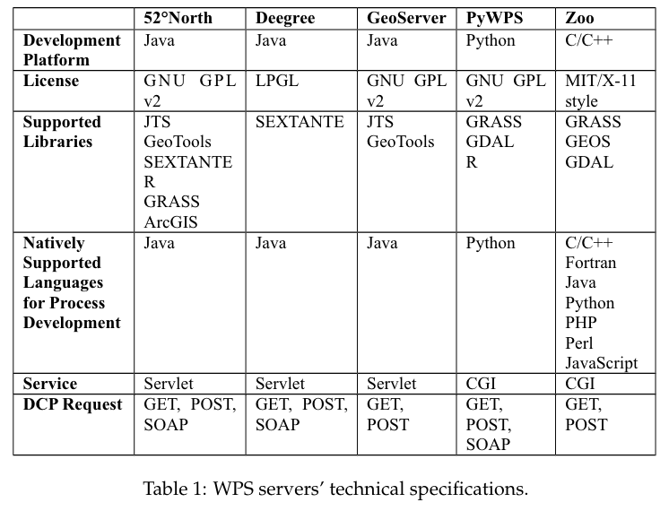

## 4 方法

在本节中，我们将介绍用于测试和测量WPS服务器性能的方法。
### 4.1案例研究
为了评估WPS服务器的性能，我们使用了WalkYourPlace交通模型(http：//webmapping.ucalgary.ca/WPSClient/)，这是为PlanYourPlace项目开发的可访问性评估模型之一(Steiniger等人，2013年)。基于该模型，如果用户提供(I)他们的当前位置，或者可能他们想要开始步行的位置，(Ii)他们愿意步行到感兴趣的点或中转站的最大时间，(Iii)平均步行速度，(Iv)他们想要等待交通的最长时间，以及(V)他们想要乘坐交通工具旅行的最长时间，那么系统将评估使用行人和交通基础设施可到达的区域的范围。然后分析可访问区内的服务(例如，诸如公园、商店、图书馆等的兴趣点(POI))。以确定可访问性区域的可访问性分数。如果用户愿意，他们可以要求应用距离衰减函数，该函数对距离用户开始位置较远的POI的贡献进行折扣。接下来，对无障碍区域进行犯罪评估。可达性面积、可及性得分和犯罪指数是该模型的最终输出。有关作为WalkYourPlace框架一部分部署的可访问性评估模型的更多详细信息，请参阅Steiniger等人。(2013年)

### 4.2 技术架构
图1展示了WalkYourPlace运输模型的处理服务体系结构。该服务体系结构旨在降低复杂性并实现地理处理服务的重用。从服务设计的角度来看，使用了自下而上(Granell，Díaz，&Gould，2010)的方法来设计服务。然后，使用可通过HTTP GET/POST访问的方式使用Python实现地理处理服务。在这种情况下，PostGIS空间函数被用来执行几何计算，如计算点对之间的距离，计算多边形的面积，以及合并多个几何对象。其余功能是使用Python库开发的。然后，地理处理服务被包装为标准的WPS，并使用52ZOOWPS、Deegree、Geoserver、◦和Zoo框架进行公开。在这种情况下，WPS服务器充当网关，支持与后端(基于Python)地理处理服务进行标准通信。它实际上接受执行请求，解析查询，并使用HTTP处理程序将其发送到相应的基于Python的服务。在获得结果之后，WPS服务器将其准备为标准的WPS响应并将其发送回客户端。在本研究中，我们开发了7个基于Python的地理处理模块来执行分析，并开发了7个WPS实例，使用每个WPS服务器将它们包装并公开为标准的WPS服务(参见图1)。PostgreSQL/PostGIS数据库用于存储各种空间数据集，如街道和交通网络、交通时间表和犯罪数据，这些数据最初分别从OpenStreetMap、卡尔加里交通和卡尔加里警察局获得。为了搜索无障碍区域内的景点，使用REST(表述性状态转移)API(应用程序编程接口)按需从OpenStreetMap和MapQuest数据库获取POI数据集。对于基于公交的可达性区域的计算，我们使用了卡尔加里市发布的通用交通供给规范(GTFS)格式的数据。

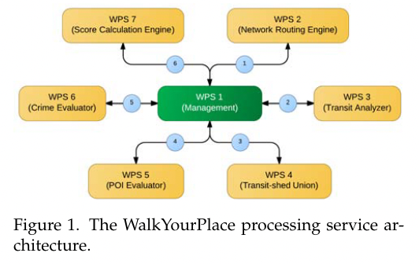

地理处理服务框架包括可访问性评估引擎，该可访问性评估引擎通过以多步骤模式(即，工作流)链接地理处理服务来执行可访问性分析。为了实现所需的应用程序灵活性、服务可重用性和提高性能，使用了工作流管理的链接方法(Alameh，2003)。

图2显示了一个UML序列图，其中概述了如何计算行人和交通基础设施的可访问性分数。客户端向管理WPS发送WPS执行命令，管理WPS然后启动对步行式WPS的执行调用。步行式WPS返回基于网络的可访问性区域的GeoJSON多边形。管理WPS然后向公交WPS发送执行请求，以查找可访问区内的所有公交停靠站，并基于第4.1节中描述的用户定义的约束为每个公交停靠站生成可访问区。运输WPS将返回GeoJSON编码的多面要素。接下来，管理WPS向联合WPS发送执行请求，以合并由运输WPS生成的所有可访问区。UNION WPS返回编码为GeoJSON的单个面要素。管理WPS然后向POI WPS发送执行请求以查找可访问性区域内的所有吸引子。POI WPS返回编码为GeoJSON点的服务点集，以及描述找到的要素类型的属性。然后，管理WPS向犯罪WPS重复相同的请求，以获得事件地点。最后，管理WPS向聚集WPS发送执行请求，连同可访问性多边形、来自POI和犯罪WPS的响应、以及指示是否应该应用距离衰减函数的布尔变量。来自聚合WPS的响应包括可访问性分数、犯罪分数和可访问性区域。管理WPS然后将聚合WPS的响应返回给客户端以供呈现。

### 4.3 场景测试

在本研究中，为了确保对所有WPS服务器使用相同的测试条件，我们使用Python开发了地理处理服务，然后将它们包装并公开为WPS服务。在这种实现下，WPS服务器(即52PythonNorth、Deegree、Geoserver、PYWPS和Zoo)充当网关，支持客户端(即用户或其他服务)和使用◦实现的后端地理处理服务之间的标准交互。例如，当客户端向管理WPS发送执行请求时，它会向相应的可通过HTTP GET/POST访问的Python服务发送请求。在获得响应后，管理WPS向其他WPS服务(即WalkShare、Transport、Union、POI、Crimes和Aggregation WPS)发送执行请求，这些服务依次与后端的Python服务进行通信以获取处理结果。因此，Execute方法依赖于外部服务调用，并测量整个工作流调用的响应时间(图2)以评估“端到端”性能，即响应时间包括通信时间和处理时间。
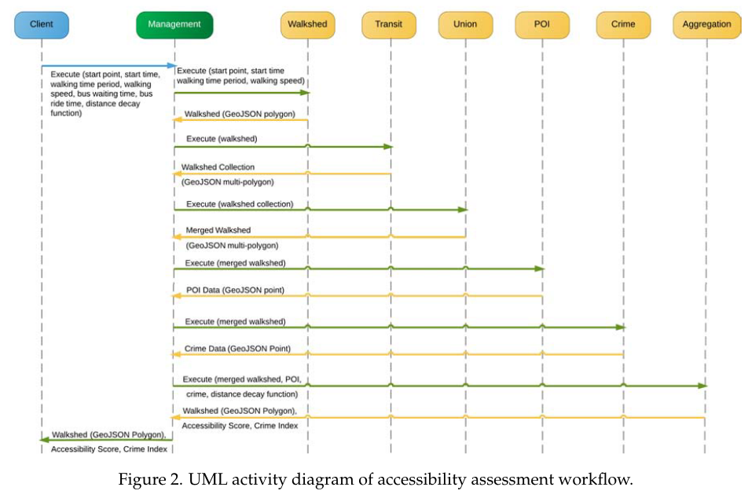
为了评估WPS服务器的性能，我们设计了两个基于可访问性评估案例的测试场景。在第一个场景(场景A)中，我们随机选择WPS输入参数来生成45个执行请求。并发请求的数量被假定为恒定(n=1)。使用以下标准选择输入参数：

- 步行起点：样本地点是在卡尔加里市范围内采用分层随机抽样方法选择的(见图3)。
- 步行开始时间：早上5点之间的随机时间戳。和中午12点，这是卡尔加里运输运营时间(http://www.)Calgarytransit.com/accescalgary/小时。HTML)。
- 步行时间：我们随机选择了5分钟到20分钟之间的数值。
- 步行速度：我们选择了3公里/小时到6公里/小时之间的随机值，步长为0.5公里/小时。
- 公交车等待时间：我们选择了0分钟到步行时间段之间的随机值。
- 公交车乘车时间：我们选择了0分钟和步行时间之间的随机值，公交车等待时间。
- 距离衰减函数：随机选择一个布尔变量(即True/False)。

对于第二个场景(场景B)，我们重点关注并发请求的数量。在这种情况下，使用2n模式生成并发请求的数量，而变量“n”选择在0到7之间，步长值为1。为每个WPS服务生成30个WPS执行请求，并根据并发请求模式进行复制。使用上述方案A的方法来确定所有其他标准。

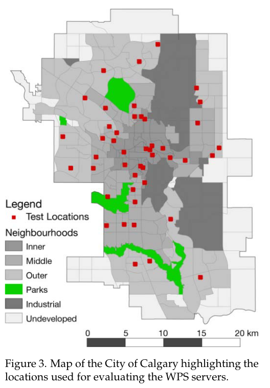

### 4.4 测试环境、

为了更准确地反映用户体验，所有测试都从客户端进行了测量。在服务器端，使用Dell OptiPlex 990作为主机，配备英特尔酷睿i5(3.1 GHz)CPU、8 GB内存和500 GB磁盘空间，运行Microsoft Windows 7专业版(64位)。为了在相同的条件下部署和测试WPS服务器，每个WPS包都安装在具有相同硬件配置的单独的虚拟机上。VMware Player5.0.1(http：//www.vmware.com/)用于设置5个虚拟机，它们可以访问4 GB的RAM、40 GB的磁盘空间，并使用8个CPU核心中的4个，运行Ubuntu 12.04 LTS(64位)。这些虚拟机的网络配置被设置为“桥接”，允许它们直接连接到物理网络并获得专用IP地址。表2总结了服务器机器(主机)和虚拟机的配置。有关所用数据库服务器和软件库配置的更多信息，请参见附录A。

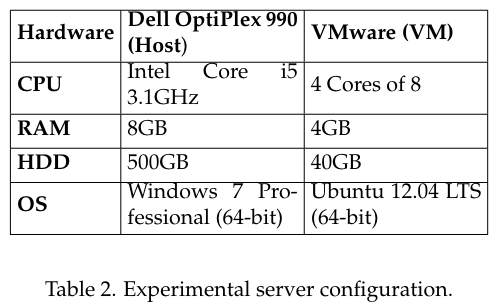

用于在客户端运行测试的机器是主机。在这项研究中，我们使用相同的机器来设置服务器并对其进行测试，而根据(VMware，2006)的说法，“涉及网络流量的工作负载的理想设置是使用外部客户端(在不同的物理系统上)向虚拟机发送网络流量和从其接收网络流量”。虽然这可能会影响WPS服务器的性能，但所有服务器的测试条件(即硬件和软件配置)都是相同的，如表2、表6和表7所示。假设网络时间是恒定的，因此不会对响应时间造成太大影响。

为了运行测试并测量性能因素(例如，响应时间、响应大小等)，使用了ApacheJMeter(http://jmeter.apache.org/)，因为它是一个被广泛接受的Web应用程序性能测试工具。

## 5 实验结果

由于每个WPS服务器都使用数据库连接来执行查询，因此首先执行预热运行。这确保了在指标(运行时间)中不考虑建立到数据库的连接的开销。在每次性能测试期间，只运行一台虚拟机。记录响应时间、响应大小和请求是否成功。这些数据允许估计平均响应时间、平均服务器吞吐量、平均服务器故障率和每个WPS服务器返回的平均响应大小。下面的图4至图7和表3报告了实验结果。
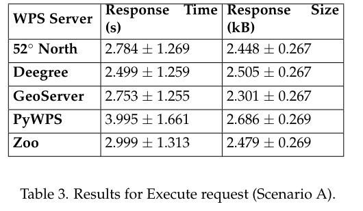

首先，报告了场景A的性能测试。表3列出了每个WPS服务器的平均响应时间、服务调用返回所有响应字节所用的时间、平均响应大小、客户端和服务器之间交换的数据量，如图4所示。
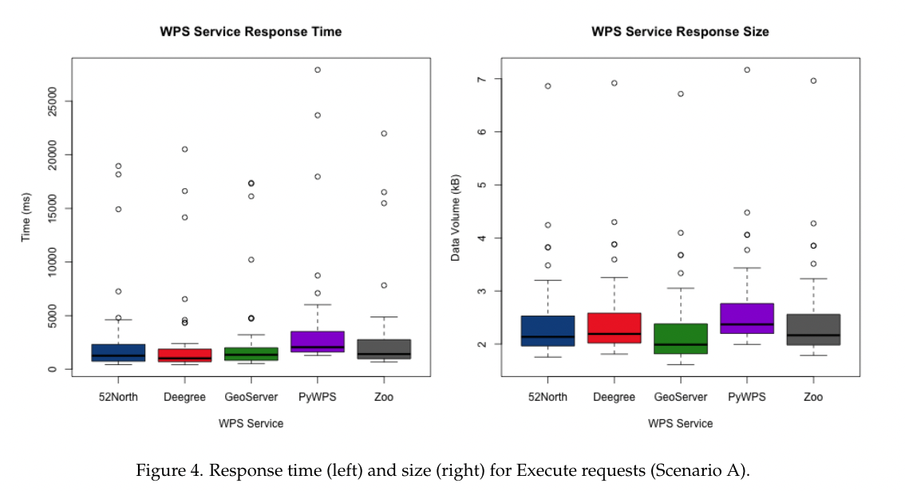

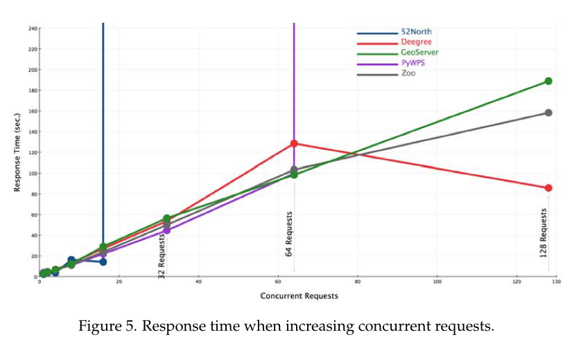

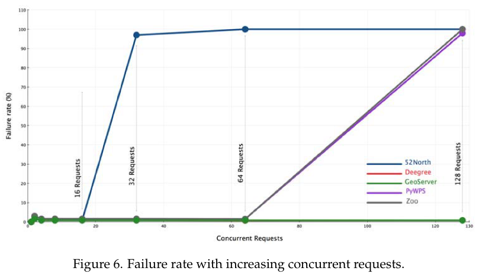

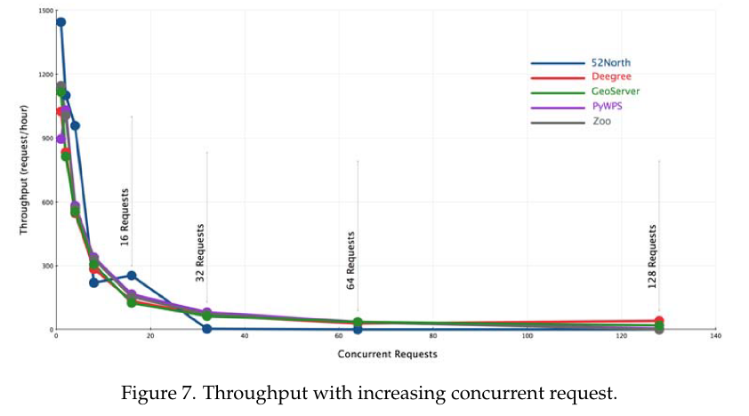

根据数据，最快的WPS服务器是Deegree，平均响应时间为2.499±1.259 S(95%可信区间)，其次是Geoserver WPS、52◦North WPS、Zoo WPS和PYWPS。单因素方差分析(ANOVA)检验表明，所有WPS服务器的响应相似，它们之间没有显著差异，F(4,220)=0.739，p=0.566。

在响应大小方面，所有WPS服务器返回的响应包数据量(≈2.484 kB)也没有显著差异(F(4,220)=1.071，p=0.372)。Geoserver WPS向客户端返回的数据量最少(2.301±0.267 kB)，而PyWPS返回的数据量最多(2.686±0.269 kB)。

响应大小不同的原因是Execute响应中的XML标记略有不同。例如，表4中列出了PyWPS和Geoserver WPS的执行响应的wps：ExecuteResponse内容，这两个响应分别返回了最多和最少的数据量。
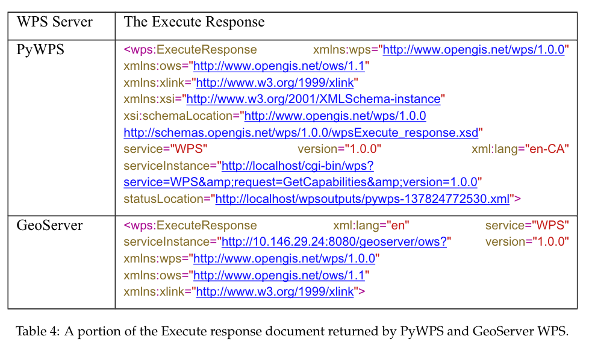
场景B旨在评估每台服务器上负载增加的影响。通过将并发请求数从1增加到2、4、8、16、32、64，并以128个并发请求结束，评估了负载的影响。在正常情况下(n=1)，使用预定义的输入参数测试单个服务和服务链，没有观察到错误。然后使用这些参数来测量WPS服务器在高负载(n>1)下的性能。为了获得有代表性的结果，所有实验都重复了30次，并记录了响应时间、响应大小和服务器成功/失败。通过这些数据可以估计和比较服务器吞吐量。结果如图5至图7所示。

图5显示Deegree、Geoserver和Zoo的性能大致相似，唯一的区别是deegree对128个并发请求的响应时间有所改善。随着并发请求从64个增加到128个，Deegree的响应时间缩短到大约是PyWPS和Zoo的一半。显然，当分别收到16个和64个以上的并发请求进行处理时，52◦North和PYWPS遇到了困难。同样明显的是，当向PyWPS和Zoo WPS服务器发送超过64个并发请求时，故障率急剧增加，在128个并发请求时接近100%。吞吐量也受到并发请求数量的显著影响，特别是对于52◦North，当并发请求增加到16个以上时，它每小时返回的成功请求不到1个。当一次只收到一个请求时，所有服务器的性能都要好得多，其中52◦North实现了每小时1,445个成功请求的吞吐量，其次是动物园(1,145个)、地理服务器(1,115个)、Deegree(1,024个)和PYWPS(每小时894个请求)。

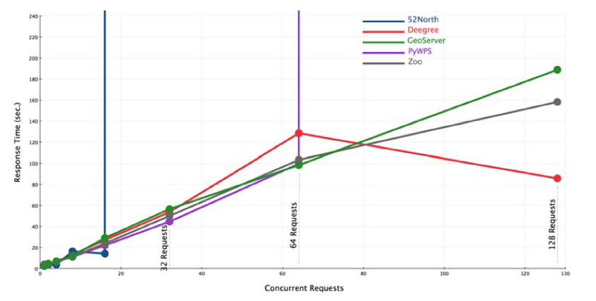
由于数据的差异，当使用双因素方差分析结果时，只有并发请求的数量对负载测试有影响(F(1，30)=20.640，p<0.001)，单个服务器不会对观察到的差异做出贡献。随着并发请求数量的增加，Geoserver和Zoo遵循了类似的(线性)趋势。Deegree的表现往往更好，尤其是在高负荷时(n=128)。此外，52个◦North和PYWPS分别在处理超过16个和64个请求时未作出回应。Deegree和Geoserver的故障率呈现出相同的模式。我们观察到在高载荷(n>4)下的失败率为0.8%。PyWPS和Zoo也遵循了相同的失败率模式。在4到64个并发请求之间保持不变(≈为1.6%)，然后在较高负载(n>64)下接近100%。所有WPS服务器在吞吐量方面的表现相似，例如，它们每小时处理大约600个请求的4个并发请求。它表明WPS服务器能够每6秒处理一次请求(n=4)。这一结果需要进一步的调查，以确定是否可以调整服务器以在现实世界条件下更有效地运行。图5至图7总结了这些结果。

## 6 吸取的经验教训

在本部分中，我们将讨论每种WPS服务器的相对优势和劣势，以及在使用它们时遇到的挑战。在这方面，从定性的角度对WPS服务器进行了评估，包括：安装和配置的简易性；创建新流程的易用性和灵活性；对开发语言的本地支持；文件的质量；以及社区支持。定性比较结果如表5所示。

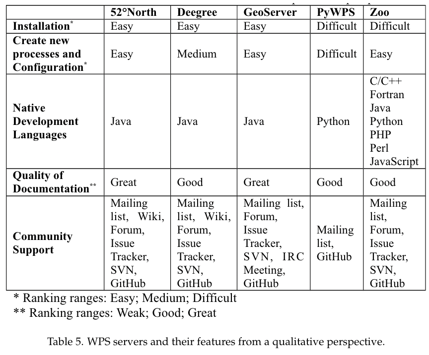

安装--由于52◦North WPS、Deegree WPS和Geoserver WPS服务器都是基于Servlet的应用程序，因此安装过程非常简单。对于52WebNorth和Deegree，安装是通过将下载/构建的WAR(◦存档)文件部署到Servlet容器(如ApacheTomcat)来完成的。对于Geoserver，在将WAR文件部署到Servlet容器中之后，应该将WPS扩展解压到Geoserver安装的WEB-INF/lib目录。库依赖是PyWPS和Zoo WPS服务器安装过程中的主要问题。它们有几个必须首先安装的库依赖项。PyWPS遵循使用setup.py脚本的典型的Python安装过程。需要进一步配置以设置服务器路径和进程文件夹位置。安装Zoo内核、配置和安装Zoo Service Provider是在Zoo WPS服务器上部署服务所需的主要步骤。

创建新的流程和配置，因为52◦North WPS、Geoserver WPS和Zoo WPS框架都有很好的文档记录，新流程的创建和配置都很简单。对于52◦North WPS，此过程使用WPSSDK分三步完成：(I)为流程创建一个JAVA类，(Ii)将流程导出为JAR(Java存档)文件，以及(Iii)将流程部署到52◦North的WPS框架中。对于Geoserver WPS，通过分三步创建一个Maven项目来开发新流程：(I)为流程创建一个Java类和一个XML配置文件；(Ii)将项目编译为JAR文件；以及(Iii)将流程部署到Geoserver的WPS框架中。要为Zoo WPS创建新进程，必须完成两个步骤：(I)使用支持的编程语言之一创建服务文件，并为该进程创建zcfg配置文件，以及(Ii)将CGI应用程序部署到Zoo的WPS框架中。尽管Deegree的文件(http://download.deegree.org/Documentation/3.3.3/html/)组织良好，内容全面，但如何在Deegree的工作方案框架内建立和部署一个新的流程并不特别清楚，也没有太多的例子作为开发的基础。然而，应该创建一个Maven项目，并且应该遵循三个步骤将新流程添加到Deegree的WPS中：(I)为流程创建一个Java类和一个XML配置文件，(Ii)将项目编译为WAR文件，以及(Iii)将Servlet应用程序部署到任何Servlet容器中。要向PyWPS框架添加新流程，需要执行两个步骤：(I)创建服务文件并修改配置文件(即，pywps.cfg和pywps.cgi)；(Ii)将CGI应用程序部署到PyWPS框架中。有时，PyWPS服务器会返回一个HTTP错误500，这会阻止它满足WPS请求，尤其是在添加了新进程之后。要解决此故障，需要几个访问权限设置(有关详细信息，请参阅Hamre(2011))。

本地开发语言-52◦North WPS、Deegree WPS、Geoserver WPS和PYWPS框架分别支持一种用于开发新流程的本地编程语言，而Zoo WPS框架支持七种编程语言。这为开发人员增加了灵活性，因为他们能够以他们选择的语言开发新的处理服务，或者将服务作为独立的模块来开发，这些模块可以利用来自许多不同语言的库。

文档质量-52◦北区和Geoserver WPS文档内容全面，为安装和配置WPS服务器提供了明确的说明，并提供了开发新流程实例的明确说明。

社区支持-52◦北区WPS、Deegree WPS、Geoserver WPS和Zoo WPS框架拥有庞大的用户/开发人员社区，并提供不同的通信媒介来支持他们。PyWPS似乎没有一个活跃的用户/开发人员社区，这可能会使访问支持变得困难。

## 7 讨论和结论

我们通过一个关注可访问性评估的案例研究，使用两个测试场景评估了WPS服务器的性能。在第一个场景中，使用45个随机生成的执行请求测试WPS服务器，使并发请求的数量保持不变(n=1)。结果表明，平均而言，Deegree返回响应包的速度最快。然而，单因素方差分析表明，在给定数据的情况下，被测试的WPS服务器之间的响应时间没有显著差异(F(4,220)=0.739，p=0.566)，返回的数据量也没有显著差异(F(4,220)=1.071，p=0.372)。

在第二个场景中，通过改变并发请求的数量来进行负载测试。总体来说，Deegree和Geoserver的表现相似，尽管Deegree在高负载下往往表现得更好。52WPSNorth在收到16个以上的并发请求进行处理时会遇到困难，但与其他◦服务器相比，在低负载下执行起来更有效。在低负载下，n=1，52◦North的吞吐量最高，每小时完成1,445个请求；其次是Zoo，每小时1,145个请求；Geoserver，每小时1,115个请求；Deegree和PyWPS分别每小时完成1,024和894个请求。一旦负载增加到超过16个并发请求，52◦North的吞吐量实际上就变成了每小时零请求。虽然在低负载(n=1)下没有遇到失败的请求，但Deegree和Geoserver的成功率稳定在4个或更多并发请求，约为99.2%。PyWPS和Zoo遵循相同的模式，在4到64个并发请求之间的成功率为98.4%。

虽然在测试期间为每个WPS服务器分配了四个CPU核心，但通过查看CPU负载日志，可以明显看出，在测试期间的任何时候，除了PyWPS之外，通常只有一个CPU核心被使用。具体地说，Deegree只使用了一个CPU核心；52◦North、Geoserver和Zoo分别使用了一个CPU核心的20%和其他核心的5%。在测试过程中，PyWPS使用了所有内核。此外，所有WPS服务器的内存使用量在测试期间保持不变(有微小波动)。平均内存使用率为30%。这表明，如果实施特定于服务器的调优或更有效的开发策略，性能改进是可能的。例如，在基于Java的应用程序中使用多个CPU核心是通过JVM(Java虚拟机)来处理的，这通常会有问题。在这种情况下，如果使用特定的实现方法或软件库(例如，并行库)，则可以产生更好的性能。

我们还必须注意，WPS服务器的响应时间取决于服务的处理要求的强度。因此，性能结果将取决于工作流的复杂性、各个后端进程的复杂性以及数据的复杂性。

WPS服务器也在定性指标方面进行了评估。52◦North WPS、Deegree WPS和Geoserver WPS服务器易于安装，并有详细的文档记录。他们还在世界各地拥有开发人员/用户社区，并提供不同的通信方式来支持他们的用户/开发人员。关于PyWPS的文档并不完整，也不总是清晰和简明，这使得安装和配置PyWPS服务器变得困难。PyWPS似乎没有一个活跃的用户/开发人员社区，因此，用户/开发人员可能会因缺乏支持而蒙受损失。动物园WPS确实有可访问的文档和可访问的支持社区。它还支持几种编程语言，并提供了强大而灵活的方法来开发WPS实例。一般来说，与其他WPS服务器相比，在考虑定性指标时，52◦North和Geoserver似乎是最佳选择，因为它们满足我们在此研究中选择的大多数评估标准。

应该注意的是，标准遵从性是WPS领域的一个主要问题，本研究没有对此进行调查。互操作性和标准符合性测试可以作为定性评估过程的一部分进行，该过程侧重于模式、语义和编码。

总而言之，在选择适当的WPS服务器时，我们认为同时考虑定量和定性指标非常重要。每个指标的重要性可以根据不同的应用程序需求进行加权。一般来说，从用户的角度来看，性能是选择基于Web的应用程序时最重要的因素之一，而从开发人员的角度来看，诸如感知的安装和配置的简易性、开发语言的多样性、文档的质量和支持的可获得性等定性因素可能更为关键。要选择WPS服务器，我们建议从链接到评估标准的一组基本问题开始评估过程。问题可能是“谁是该系统的用户？”“最终用户应该能够对系统做什么？”“对于系统的开发，开发人员对哪些编程语言感到满意？”“后端流程有多复杂？”系统应如何工作，同步还是异步？“用来设计处理工作流程的架构是什么？”“预计的用户数量是多少？”最后，应该根据特定应用程序或用例的定量性能指标和定性“易用性”指标之间的权衡来选择最合适的WPS服务器。这可能导致为不同的应用程序选择不同的WPS服务器。

注：已开发的基于Python的地理处理服务、WPS实例和测试脚本是公开可用的，请参见附录B。

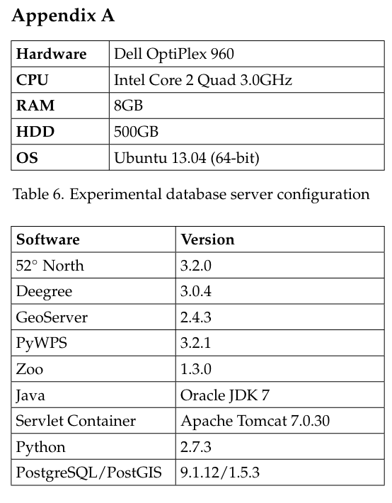

Appendix B 已开发的基于Python的地理处理服务、WPS实例和测试脚本可通过以下URL公开获得：测试脚本：
- https://github.com/mepa1363/foss4g-testscript 

Python-based geoprocessing services: 
  
-  https://github.com/mepa1363/wyp-server52north-foss4g 
-   https://github.com/mepa1363/wyp-serverdeegree-foss4g 
-    https://github.com/mepa1363/wyp-servergeoserver-foss4g 
-  https://github.com/mepa1363/wyp-serverpywps-foss4g 
- https://github.com/mepa1363/wyp-serverzoo-foss4g 

WPS instance: 

- https://github.com/mepa1363/wyp-wrapper52north-centralized-transit 
- https://github.com/mepa1363/wyp-wrapperdeegree-centralized-transit 
-   https://github.com/mepa1363/wyp-wrappergeoserver-centralized-transit 
- https://github.com/mepa1363/wyp-wrapperpywps-centralized-transit 
- https://github.com/mepa1363/wyp-wrapperzoo-centralized-transit