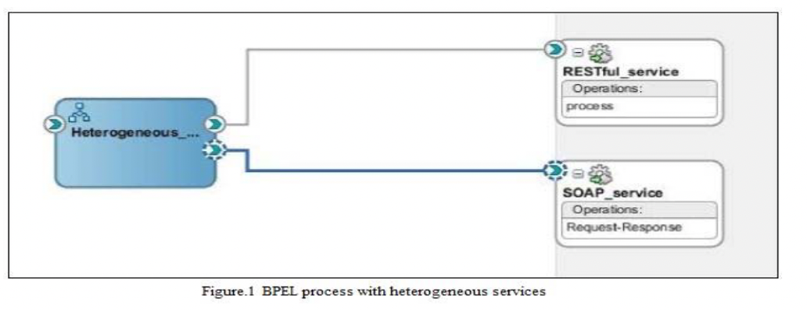
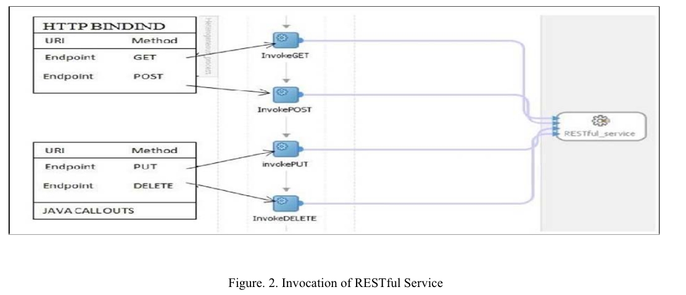
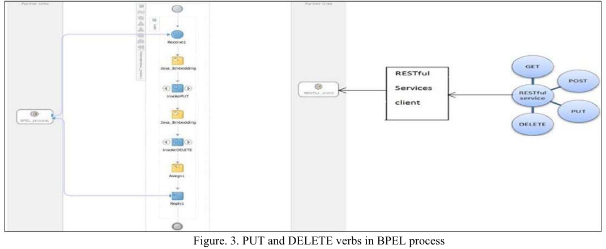
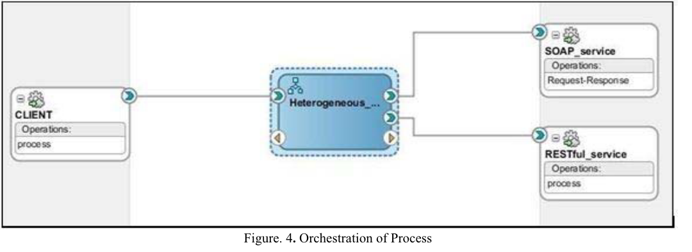
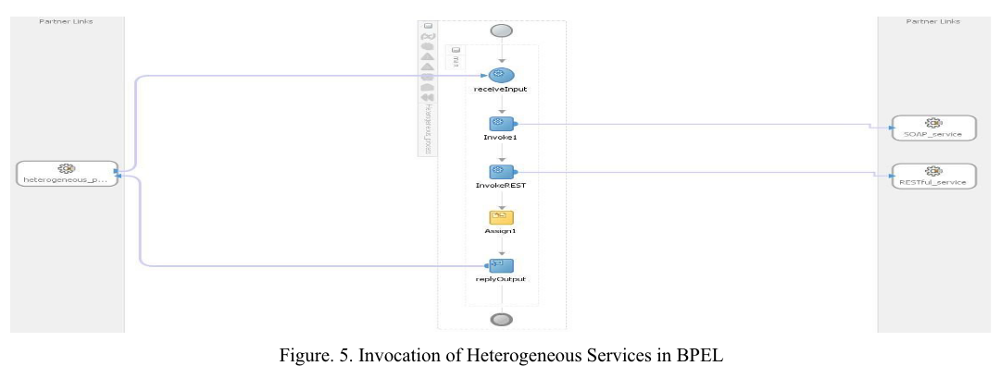
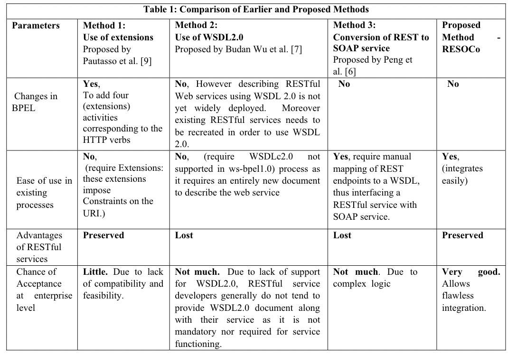

## 摘要

许多在线企业将其技术产品和服务产品作为Web服务公开。为了提供所需的功能，通常需要组合许多简单的Web服务来创建组合Web服务。传统上，服务是作为基于SOAP的服务实现的。然而，基于REST的服务现在正变得越来越流行。因此，有大量服务可供用户包含在组合服务中。BPEL(Business Process Execution Language，业务流程执行语言)已用于根据工作流创建复杂服务。目前，BPEL标准不支持在业务流程中包含REST风格的Web服务。这避免了在复杂的业务用例中包含许多有用的服务，其中需要大量的Web服务才能实现所需的功能。**本文提出了一种RESOCO方法，使传统的BPEL引擎在组合中既可以使用基于SOAP的服务，也可以使用RESTful服务。因此，提出的方法有助于增加可用于组合的服务的数量，同时还保留了REST式服务的轻量级特性的优势。**

## 1. 引言

Web服务已经成为企业提供在线服务的流行方式[1]。**传统上，Web服务一直作为可使用HTTP上的简单对象访问协议(Soap)访问的组件提供。SOAP在对等点之间提供了一个分散的、基于XML的分布式消息传递框架。有关服务的输入、输出参数和服务端点的详细信息可在Web服务描述语言(Web Service Description Language，WSDL)文档[2]中找到。服务的另一个实现本质上是面向资源的，称为REST[RESTful State Transfer](3)。在这种情况下，每个Web服务(即所提供的功能和相关数据)都被认为是资源。因此，它可以由统一资源标识符[URI](3)来标识。服务消费者使用HTTP方法：POST、GET、PUT和DELETE来操作/访问此类服务。**

在线企业提供的服务很复杂。提供简单功能的服务被组合成复杂的服务。除了传统的基于SOAP的服务外，不同的服务提供商正在提供大量的REST风格的服务。因此，包含在复杂服务中的可用组件服务选项池在数量上非常大。BPEL[Business Process Execution Language，业务流程执行语言](4)是被广泛接受的基于SOAP的服务组合技术。**Web服务业务流程执行语言2.0版(WS-BPEL 2.0)依赖于WSDL1.1(Web服务描述语言)规范[2]来组合基于SOAP的服务，并且不是为REST风格的服务设计的。**虽然可以使用WSDL2.0和WADL[Web应用程序描述语言](5)来描述REST风格的Web服务，但是WS-BPEL 2不支持这些。过去一些研究人员提出了一些组合REST风格服务的方法。框架REST2SOAP允许通过中间的SOAP服务[6]将REST风格的服务的功能包含到复杂服务中。这种方法很复杂，并且会导致响应时间增加。吴等人提出的另一种方法。允许通过手动映射端点来调用REST服务，并且需要在广泛使用的BPEL标准中进行扩展[7]。JOpera是BPEL的扩展，支持REST风格的服务组合[8]。然而，这种方法也需要使用修改后的BPEL组合引擎，并且不允许在组合服务中无缝包含异类服务(SOAD和RESTful)。

因此，在本文中，通过使BPEL能够使用HTTP绑定调用REST风格的服务来编排REST风格的服务以及SOAP服务，提出了一种RESOCO方法来组合异质服务。此HTTP绑定使BPEL能够**调用与基于SOAP的Web服务相同的REST风格的Web服务**。为REST风格的Web服务生成WSDL1.1文档，以支持在标准BPEL组合流程中顺利集成REST风格的服务。因此，(I)不会为了调用REST风格的Web服务而修改BPEL元素。(Ii)使用HTTP请求使用REST风格的Web服务，保留了REST风格的Web服务的优势。

这篇论文的组织方式如下。在第二节中，讨论了相关工作。在第三节中，提出了一种用于异类编排的方法。在第四节中，讨论了测试案例，以说明所提出的方法的有效性。第五部分为结束语。

## 2.RELATED WORK

这一部分讨论了相关领域中不同研究人员的一些贡献。

W3C为基于服务的业务流程推荐的Web服务业务流程执行语言(Web Services Business Process Execution Language，WSBPEL)标准。WSBPEL被设计为使用WSDL1.1[2]来使用服务。**Wsdl文档提供了各种有关SOAP服务的细节，如输入参数、输出参数、服务的端点等。**WS-BPEL使用该文档来指定组件服务的链接。因此，WSBPEL和WSDL语言紧密结合在一起[9]。**WSDL2.0旨在描述REST风格的Web服务[9]。但是，它与现有的BPEL不兼容。**

**WSO2 Mashup Server[10]将RESTful封装为基于SOAP的Web服务。**JavaScript(带有E4X XML扩展)用于提供服务输入和接收输出。然后，该功能将与处理后的数据一起作为一个SOAP服务重新发布。WSO2 Mashup提供了更多的功能，但它不是一种业务流程语言，不适合实现具有复杂逻辑控制的流程。WSO2的成分描述没有标准化，在工业上没有广泛的应用。

为了能够组合基于REST风格的服务和基于SOAP的服务，Peng等人提出了一个框架REST2SOAP。在这项工作中，REST风格的服务由中间的SOAP服务调用，以支持在组合服务中包含功能[6]。这导致损害了REST式服务的优势。在他等人提出的另一种方法中，根据服务类型划分工作流。基于SOAP的服务使用BPEL进行编排，而REST服务使用REST编排引擎进行编排[11]。该方法很复杂，因为使用两个执行引擎来执行单个工作流。此外，这种方法允许形成非常少的组合物，并且不适合在需要时实现所有可能的复杂功能。Wu等人提出了一种方法，通过手动将REST端点映射到WSDL或使用REST扩展直接调用BPEL中的REST风格的服务来组合异类(SOAP和REST风格)服务。[7]。**在考虑企业应用程序时，几乎不可能手动将REST端点映射到一个WSDL文档。**扩展BPEL需要业务使用BPEL的修改版本，而这不是组合的标准。**此外，由于缺少wsdl，它与SOAP服务的交互很麻烦。**

JOpera是由C.Pautasso在2009年[8][9]提出的，它是对BPEL的轻量级扩展，用于本机支持使用业务流程的REST风格的Web服务组合。JOpera扩展使组合成为可能，然而，BPEL中的更改并不可取，因为这些更改会导致对已被广泛使用的现有流程进行修改。调查的文献表明，可用的方法不允许在组合中无缝集成基于SOAP的服务和REST风格的服务，因为这些服务要么需要在广泛使用的BPEL标准中进行扩展，要么只允许组合一种类型的服务。

## 3 🔤提出的方法--RESOCO🔤

REST风格的Web服务，使用HTTP协议进行通信。。在资源上使用HTTP的GET、POST、PUT和DELETE操作。BPEL引擎被设计为与SOAP服务或其他BPEL流程一起工作。**为了允许RESTful成为BPEL的一部分，在BPEL的HTTP绑定活动中使用外部引用创建RESTful服务。**使用HTTP绑定伙伴链接生成包含REST风格服务的BPEL。图1显示了REST风格的服务以及指向异类BPEL流程的基于SOAP的服务的合作伙伴链接。



**为包含REST风格的Web服务的BPEL子流程生成WSDL1.1文档，以支持在标准BPEL组合流程中顺利集成REST风格的服务。用于访问REST服务功能的四个动词被包装到四个服务元素中，作为一个WSDL文档中的单个服务。用于客户端服务器通信的HTTP GET和POST谓词具有WSDL1.1中描述的绑定。由于基本的HTTP绑定不支持PUT和DELETE动词，因此对它们进行了特别的考虑，并通过使用Java嵌入活动构建了用于描述REST风格的Web服务的WSDL1.1文档。**

这允许在BPEL中为REST服务创建合作伙伴链接。HTTP绑定用于在BPEL中为GET和POST动词绑定REST风格的服务，并使用Java调用，使用Java嵌入活动来绑定PUT和DELETE动词，如图2所示。


在WSDL1.1规范中为REST风格的Web服务的GET和POST动词的描述指定了以下协议特定信息[2]：

1. 绑定的规范，无论使用的是HTTP GET还是POST。
2. 每个操作的相对地址(相对于端口中定义的基址)
3. 生成端口地址WSDL1.1用于REST风格的Web服务的GET动词的描述文档，其指示必要的描述信息。清单1显示了REST式服务的GET谓词调用的WSDL文档。

生成用于REST风格的Web服务的GET动词的WSDL1.1描述文档，其指示必要的描述信息。清单1显示了REST式服务的GET谓词调用的WSDL文档。

Listing 1 WSDL for GET Verb.

```xml
<wsdl: binding name = “Request_Response_ptHttpGet” type = “tns: Request_Response_ptt”>
    <http: binding verb =”GET”/>
    <wsdl: operation name=”Request-Response”>
        <http:operation location=””/>
        <wsdl:input>
            <http:urlEncoded/>
        </wsdl: input>
        <wsdl: output>
            <mime: content type = “text/xml”/>
        </wsdl: output>
    </wsdl: operation>
</wsdl: binding>
<wsdl: binding name = “Request_Response_pttBinding” type = “tns: Request_Response_ptt”>
    <soap: binding transport ="http://schemas.xmlsoap.org/soap/http"/>
    <wsdl: operation name = "Request-Response">
        <soap: operation style ="document" soapAction ="RequestResponse"/>
        <wsdl:input>
            <soap:body use = "literal"/>
        </wsdl:input>
        <wsdl: output>
            <soap:body use = "literal"/>
        </wsdl: output>
    </wsdl: operation>
</wsdl: binding>
```

BPEL的HTTP绑定活动不支持PUT和DELETE动词。为了解决扩展Java嵌入活动的问题，BPEL的核心部分是嵌入活动，因此不需要扩展。不过，它正被重用来调用REST式服务的方法。BPEL Java嵌入活动用于嵌入Java代码，而Java代码又调用客户端以获得REST风格的服务，如图3所示。BPEL的Java嵌入活动用于Java调出。Java调出基本上是一个服务请求，它源自Java程序，目的地是远程服务。在这里，Java调用是从BPEL向REST式服务的客户端发出的。



通过在BPEL中创建REST风格的合作伙伴链接，将生成包含REST风格的BPEL。该BPEL可以进一步组合为普通的SOAP服务。图4说明了BPEL流程与客户端服务的编排



在服务编排中，单个服务控制整个流程。该服务负责启动流程并控制BPEL流程的整个生命周期。控制服务被称为客户端服务，它被公开为一个SOAP服务。该客户端服务编排BPEL流程(即异类流程)。这个异类流程包含业务流程，该业务流程既包含基于SOAP的服务，也包含基于REST的服务。当客户端提供通过接收活动接受的输入时，BPEL流程开始。现在可以在同一进程中调用SOAP和REST风格的组件服务。按照工艺要求进行作业。这些操作可以包括使用赋值活动的数据转换、文件处理、数据库处理等，并将流程的输出返回给流程客户端。**图5显示了BPEL流程，其中REST风格的服务嵌入到BPEL流程中以形成组件服务。**




开发了一项考试服务，以测试拟议方法的可行性和有效性。这个测试服务是一个组合服务，包含各种基于SOAP的REST组件服务。这些组件服务提供以下功能：更新问题、向客户端提供考试问题、评估答案和计算分数的评估服务。这个复杂的服务被编排为使用来自不同类型服务的问题，并通过从不同服务提供商获取问题来生成试卷，并在结束时生成记分卡。该提议已经与其他现有的组合基于SOAP和RESTful服务的方法进行了比较。



## 结论

在本文中，提出了一种简单而有效的方法，它允许在复杂服务中包含基于SOAP的服务和REST风格的服务。该方法非常有用，因为现在可用的服务池更大了，因为这两种类型的服务都可以以更流畅的方式组合。此外，由于可以使用现有的BPEL标准，因此不需要对现有流程进行任何更改。因此，这种方法很容易在工业上采用。此外，由于RESTful服务仍然可以按其现有形式使用，因此保留了轻量级的优势。在未来，可以做一些与选择合适的构件服务、检测故障的构件服务以及它们的替换相关的工作。


## REFERENCES
 [1] W3.org, "Web Services @ W3C", 2011. [Online]. Available: Http://www.w3.org/2002/ws/. [Accessed: 19- Jan- 2015]. 

[2] W3.org, "Web Service Definition Language (WSDL)", 2016. [Online]. Available: http://www.w3.org/TR/wsdl. [Accessed: 19Apr- 2015]. 

[3] R.Fielding, "Architectural Styles and the Design of Network-based Software Architectures", 2000. [Online]. Available: https://www.ics.uci.edu/~fielding/pubs/dissertation/top.htm. [Accessed: 12- Mar- 2015]. 

[4] D. Jordan and J. Evdemon, "Web Services Business Process Execution Language", Docs.oasis-open.org, 2007. [Online]. Available: http://docs.oasis-open.org/wsbpel/2.0/OS/wsbpel-v2.0OS.html. [Accessed: 07- Feb- 2015]. 

[5] M. Hadley, "Web Application Description Language", W3.org, 2009. [Online]. Available: http://www.w3.org/Submission/wadl/. [Accessed: 23- May- 2015].

 [6] Yu-Yen Peng; Shang-Pin Ma; Lee, J., "REST2SOAP: A framework to integrate SOAP services and RESTful services," in ServiceOriented Computing and Applications (SOCA), 2009 IEEE International Conference on , vol., no., pp.1-4, 14-15 Jan. 2009 doi: 10.1109/SOCA.2009.5410458
 
  [7] Budan Wu; Rongheng Lin; Junliang Chen, "Integrating RESTful Service into BPEL Business Process on Service Generation System," in Services Computing (SCC), 2013 IEEE International Conference on , vol., no., pp.527-534, June 28 2013-July 3 2013 doi: 10.1109/SCC.2013.70 
  
  [8] Pautasso, C. “Composing RESTful services with JOpera”. In Software Composition, Lecture Notes in Computer Science Volume 5634, 2009, pp. 142-159. 
  
  [9] Cesare Pautasso, RESTful Web service composition with BPEL for REST, Data & Knowledge Engineering, Volume 68, Issue 9, September 2009, Pages 851-866, ISSN 0169-023X, http://dx.doi.org/10.1016/j.datak.2009.02.016. 
  
  [10] WSO2, "Products | WSO2 Inc". [Online]. Available: http://wso2.com/products/. [Accessed: 07- Mar- 2015]. 
  
  [11] Kejing He, "Integration and orchestration of heterogeneous services," in Pervasive Computing (JCPC), 2009 Joint Conferences on , vol., no., pp.467-470, 3-5 Dec. 2009 doi: 10.1109/JCPC.2009.5420139