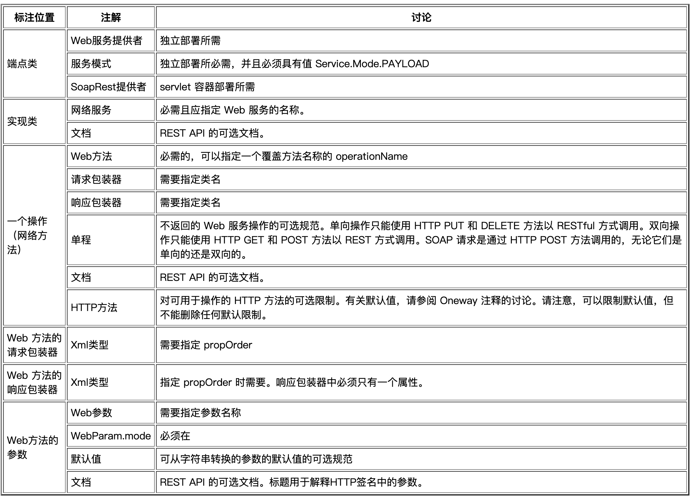

# idea 3 for 硕士论文
https://ieeexplore.ieee.org/document/7544888
## 组合的 SOAP 和 REST Web 服务


soaprest项目是一个框架，用于开发接受 SOAP 和 REST 调用的 Web 服务端点。Web 服务的设计问题之一是必须决定是使用 SOAP 还是 REST。现有框架将特定端点限制为 SOAP 或 REST。soaprest端点 被指定为使用 WSDL 的 SOAP Web 服务，但也将接受 REST 调用，并将根据请求的调用方式做出响应。这在单个 Web 服务中提供了 SOAP 和 REST 的优势。


这是一个实验项目，它不支持 Java Web 服务的所有功能。它还从 SOAP 映射到 REST，而不是相反，因此只使用了一些 REST 参数样式。从 SOAP 到 REST 的映射如下：
1. 可以使用 GET 或 POST 方法以 RESTfully 方式调用操作。PUT 和 DELETE 仅支持没有返回值的操作。
2. 使用 POST 的 RESTful 调用与使用 SOAP 的调用几乎相同。唯一的区别是不能使用 SOAP 信封和正文元素。如果使用它们，则无法将调用与 SOAP 调用区分开来，并且将被这样对待。
3. 仅当 SOAP 请求的参数都是 String 类型或可从 String 转换时，才可以使用 GET 进行 RESTful 调用。稍后将更详细地讨论转换。
4. 要使用 GET 调用 Web 服务，操作由 URL 的最后一个路径段指定。参数在 URL 的查询部分中指定为名称-值对。每个参数最多有一个值。未指定的参数如果有一个参数，将被赋予默认值。否则，它们将为空。可以使用 soaprest.DefaultValue 注释指定默认值。即使实际默认值具有其他类型，默认值也被指定为字符串。
5. 对于 GET 或 POST，RESTful 调用的返回值与 SOAP 调用生成的 SOAP 信封的主体相同
6. SEI 的操作名称永远不能重载。不能在同一个 SEI 中有两个同名的操作，即使它们具有不同的签名。
7. Web 服务实现不必是实现 SEI 的类。soaprest 框架从 Web 服务实现中获取它的所有注释，并且从不检查 SEI。这允许实现类的方法具有重载名称并抛出未在 SEI 中声明的异常。重载名称时，必须使用 WebMethod 注释指定不同的操作名称。但是，请记住客户端使用的是 SEI，而不是实现。


### SOAP Web 服务相对通用，但要映射到 REST 需要一些限制：

1. 必须开发两个类：一个实现类和一个提供者（端点）类。提供程序类是部署的类。可以生成所有其他类和文件。
2. WSDL 和模式文档可以手动开发或使用 wsgen 开发。构造提供者类时必须设置 WSDL 的位置。
3. 具体化 Web 服务操作的类（即请求和响应类）必须在类路径中。ObjectFactory 类（每个包一个）也必须位于类路径中。这些类可以手动开发或使用 wsimport 开发。与 JWS 不同，不能使用 jaxb.in​​dex 文件代替包中的 ObjectFactory 类。生成的接口和生成的服务类不必在类路径中。但是，SOAP 客户端将需要该接口。
4. 必须注释实现类。这是此类注释的示例：
@WebService(name = "抹灰", targetNamespace = "http://xyz.org")
公共类 PlasteringImpl 实现 PlasteringInterface {
可以省略一些注释，但不应依赖于此行为。有关注释的更多信息如下所示。soaprest 代码尝试查找默认值，但它们可能与 JWS 将使用的默认值不同。

5. 实现类的web方法的web方法和web参数都要注解。
6. 实现类可以部署在支持Web 服务的容器中，例如glassfish，但是当这样做时，Web 服务将只能通过SOAP 的方式访问。为了同时支持 SOAP 和 REST，必须部署提供者类。


### Web 服务可以部署为独立服务，也可以部署为 servlet 容器中的组件。请注意，必须部署提供者，而不是实现类。容器可以是任何 servlet 容器。没有必要有一个支持网络服务的容器。端点（提供者）类必须具有以下属性：

1. 它必须是 {@link soaprest.DualProvider} 的子类。
2. 如果仅作为独立服务部署，则必须注解为 WebServiceProvider，ServiceMode 必须为 PAYLOAD。这样的提供者不能部署在容器中。
3. 如果要将其部署为独立服务或在 servlet 容器中，则必须将其注释为 SoapRestProvider。
4. 构造函数必须使用实现对象和具有 JAXB 可序列化类的包的包名称列表来调用超类构造函数。这些包必须有 ObjectFactory 类。
5. 如果仅作为独立服务部署，则构造函数可能带有参数。
6. 如果要部署在servlet容器中，那么构造函数必须是无参数的。任何参数通常都在 web.xml 文件中指定，并getInitParameter在部署端点后使用该方法提取。这通常是通过覆盖该init() 方法来完成的。
7. 要以独立方式部署服务，主程序必须构造一个端点对象，然后部署它。
8. 测试服务显示了上述所有内容是如何完成的。有关测试服务的更多信息，请参见测试包中的文档。

以下是 soaprest 包使用的注解：



转换是一个很大的话题，但 soaprest 包提供了一个特例。如果类具有带单个 String 参数的构造函数并且不抛出任何异常，则该类可从 String转换。转换为 String 使用 toString 方法。原始类型也可以通过自动装箱和拆箱从 String 转换而来。但是，基本类型不接受空参数。

当使用 GET 调用操作时，参数将由 soaprest 包自动转换为目标类型。基本类型也是如此。当使用 POST 调用具有可从 String 转换的非原始参数的操作时（例如，当使用 SOAP 调用时），则必须修改 wsimport 生成的请求包装器类，以便参数具有目标类型。对于返回值，必须以类似的方式修改响应包装器类。

可以使用 WSDL 的 XSD 部分中的 JAXB 注释来指定包装类的修改。这是如何完成的：

```xml
 <xsd:simpleType name="ConvertibleType">
  <xsd:注解>
   <xsd:应用信息>
    <jaxb:javaType name="org.project.MyConveribleType"/>
   </xsd:应用信息>
  </xsd:注解>  
  <xsd:restriction base="xsd:string"/>
 </xsd:简单类型>
 ```

 org.project.MyConveribleType注释告诉 wsimport（或更准确地说，xjc）在生成的代码中 使用 而不是 String。

 人们会认为 URL 和 URI 类可以从 String 转换而来，但如果参数格式不正确，它们的构造函数就会抛出异常。但是，如果手动修改生成的代码，则 Web 服务可以正常工作。


 版权所有 (c) 2012 Ken Baclawski。版权所有。

如果满足以下条件，则允许以源代码和二进制形式重新分发和使用，无论是否进行修改：

源代码的重新分发必须保留上述版权声明、此条件列表和以下免责声明。
二进制形式的重新分发必须在随分发提供的文档和/或其他材料中复制上述版权声明、此条件列表和以下免责声明。
本软件由 KEN BACLAWSKI 按“原样”提供，不提供任何明示或暗示的保证，包括但不限于对适销性和特定用途适用性的暗示保证。在任何情况下，KEN BACLAWSKI 或贡献者均不对任何直接、间接、偶然、特殊、惩戒性或后果性损害（包括但不限于替代商品或服务的采购；使用、数据或利润损失；或业务中断），无论是基于任何责任理论，无论是合同责任、严格责任还是侵权行为（包括疏忽或其他），以任何方式因使用本软件而引起，即使已被告知发生此类损害的可能性。