# 智能制造中的上下文感知工作流管理：基于语义网的方法的文献综述

## 摘要

智能制造系统(SMS)是一种软件系统，它通过使用物联网(IoT)设备和连接到机器的服务来识别自动化制造操作的机会。为了有效地运行，SMS应该足够灵活，能够对制造过程执行自动或半自动调整，以响应意外变化，这是一种称为上下文感知的功能。

本文对智能制造领域中的上下文感知工作流管理方法进行了文献分析，重点介绍了2015-2022年间发表的基于语义网的方法。采用系统文献回顾(SLR)方法，通过PICOC方法分析最新研究成果。这项工作的贡献是(1)关于智能制造系统中基于语义Web的方法的上下文感知工作流管理的SLR，(2)基于内容和主要工作流管理功能领域的系统分类来分解方法的一致性，以及(3)识别上下文感知、用例实现、所使用的工具、许可、安全性和可扩展性等技术特征的改进机会。还提出了一种新的体系结构和组件来应对已确定的积极挑战。

## 1引言
第四次工业革命，也被称为工业4.0，代表着信息和通信技术(ICT)与制造运营系统[1]相结合的重大变革。各种计算技术，如大数据分析、云服务和物联网(IoT)，正在出现并融合在制造系统中，以创建智能制造系统(SMS)。SMS是灵活的、可自我重新配置的系统，可以根据不断变化的条件对生产过程进行自动或半自动调整[2]。

有效管理和分析短信生产流程产生的数据具有挑战性，对协调的物联网服务的需求正在增长[3]。编排定义了应该如何执行工作流中的一组任务或活动以实现目标[4]。工作流的目标可以是转换材料、提供服务或处理信息。特别是，工作流管理学科监督工作流配方的设计、执行和监控[5]。

🔤使用全球已知的标准符号语言，例如BPMN(业务流程建模和符号语言)、BPEL(业务流程执行语言)、YAWL(另一种工作流语言)，可以将工作流配方形式化为业务流程[6]。这些正式工作流配方的管理属于业务流程管理(Business Process Management，BPM)规程。BPM是一组减少错误和成本的工具和技术。它们被用来提高从电信、保险、政府和银行到制造公司等领域的组织的生产率。🔤

协调物联网服务通常会带来互操作性问题，因为各种物联网设备使用的通信协议和技术的差异使通信更加复杂[8]。为了应对这一挑战，研究人员利用语义网技术来促进跨网络的物联网设备之间的有效通信[9]。例如，Mehdi等人。[10]提出了一种基于语义网的智慧城市领域解决方案。他们的建议旨在提高异构物联网设备和服务之间的互操作性，并可应用于其他领域。

语义网技术具有解释上下文信息和推断新知识的能力，这可以增强工作流的动态性质[11]。为短信提供语义网技术可以将一个系统变成一个情景软件系统。这样的系统能够重新配置自己，当暴露在变化的情况下时显示出认知行为[9]。由于上下文感知支持，动态适应在工作流设计和运行时发生。这极大地促进了服务级别协议(SLA)的管理，并确保提高服务可用性和可靠性以响应消费者需求[9]。

鉴于这些系统在工业4.0制造环境中的关键性质，对最先进技术的批判性审查将是及时的。虽然已经确定了一些相关的研究，但还没有发现专注于研究智能制造领域的语义上下文感知工作流管理方法的研究。例如，布雷斯林等人。[12](2010)介绍了关于语义网及其在工业领域的影响的文献综述。然而，他们的工作是在十多年前发表的，主要集中在强调语义网在行业中的好处，而不是调查最先进的解决方案。

Pauwell等人的研究成果。[13](2017)回顾了语义网技术在建筑、工程和建筑(AEC)领域的应用和用例。他们的工作比较了最先进的解决方案，而且是及时的。然而，它们不包括具有上下文感知功能的方法，而是将其作为语义网可以对上下文数据做什么的一般概念来提及。

Asghari等人对基于物联网的服务组合方法进行了深入的研究。在[14](2018)。作者提供了一种技术分类来对这些方法进行分类，其中基于语义网的方法被归入面向数据的类别。他们还提到，上下文感知是服务组合领域的未来挑战。然而，只分析了14种基于语义网的方法，因为语义网是作为实现服务组合的各种技术之一提出的。此外，他们没有确定情景感知功能如何增强各个工作流管理功能领域。

Bazan和Estevez[15](2021)分析了行业4.0业务流程管理的最先进水平，重点是物联网和智能对象。这项工作还研究了将上下文感知整合到BPM领域中，以增强业务流程对上下文变化的响应。然而，在他们的工作中只分析了两种基于语义网的方法。

因此，在本文中，我们对2015年至2022年发表的智能制造领域的语义上下文感知工作流管理方法进行了方法论文献回顾。分析了上述研究中未讨论的主题、技术和建议。对该领域的现有提案进行调查，以确定正在使用的工具和技术以及改进的机会。基于这些发现，提出了一种新的体系结构来应对已确定的挑战。这项工作的首要目标是帮助研究人员对该领域有一个大致的了解。

本文的结构安排如下：第二节简要解释了背景、概念和文献综述方法，第三节概述了文献综述方法。第四节对选定的研究进行了回顾，并按技术分类进行了组织。本节还包括比较表，以分析每种方法的优点和局限性。第五部分，分析了所选研究的趋势和差距，并提出了研究问题。第6节根据查明的差距提出了一种综合办法。最后，第七节给出了结论和对未来研究的建议。

## 2 背景

 
在本部分中，将介绍与工作流管理、上下文感知和语义网相关的关键概念和定义。本节是对文件中使用的术语的介绍，有助于加深对正在讨论的概念的理解。

### 2.1. 工作流管理

工作流管理负责可编排任务的分析、建模和自动化[4]。虽然该学科不需要软件，但工作流管理系统(WFMS)通常用于协作、自动化和跟踪。这些系统管理工作流，包括设计、执行和监控阶段[5]。

如图1所示，典型的工作流管理系统必须在三个功能领域提供支持：(1)设计时：与定义和建模工作流过程和活动有关；(2)运行时：与人类用户和IT应用程序的交互有关，这通常是工作流过程和活动的一部分；以及(3)管理：由管理工作流过程和对过程的活动排序的工具组成。后者包括监控工具，用于在工作流问题可能对关键业务流程产生负面影响之前识别和解决这些问题[4]。

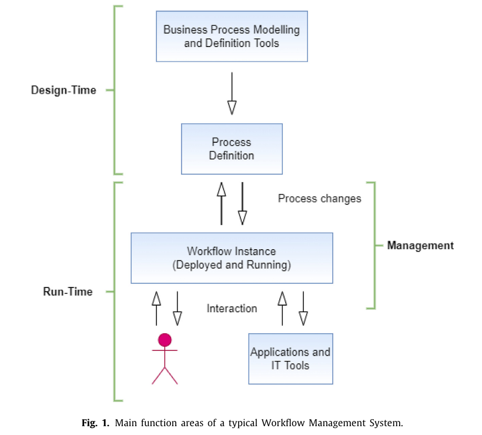

使用支持以可操作任务的形式执行微服务(REST服务)的标准化表示法语言，可以将工作流配方形式化为业务流程。这些符号语言包括BPMN(业务流程建模和符号语言)、BPEL(业务流程执行语言)和YAWL(另一种工作流语言)。这些形式化配方的管理属于业务流程管理(Business Process Management，BPM)规程，其中包括用于设计、执行和管理业务流程的系统和符号语言。

#### 2.1.1 业务流程管理(BPM)

对象管理组织(OMG)将BPM定义为“一组用于持续、迭代地改进运营业务所涉及的所有流程的技术”[7]。BPM技术有助于从包括制造业在内的各个领域的企业中减少成本和错误，并提高效率[7]。业务流程的建模必须基于标准表示法语言，以便WFMS理解和解释它们。可用的符号语言的数量是巨大的，可以在[16]中找到完整的比较。BPM社区中最常用的是BPMN、BPEL、YAWL和DMN(决策模型和符号)，所有这些都是基于XML的业务流程设计。然而，BPMN已经成为业务流程图的标准[17]，并且根据OMG的说法，DMN被设计为与BPMN一起工作[18]。

许多系统可以管理以不同表示法语言编写的业务流程。业务流程管理套件(Business Process Management Suite，BPMS)是一组强大的技术工具，用于设计、执行和监控业务流程。Gartner在[19，20]中考虑的一些流行的开源BPM是Camunda、Bonita和Process Maker。可以通过启用情景感知功能来增强工作流，该功能可以解释情景变化并执行后续调整。以下小节使用IBM提出的用于构建自主系统的体系结构解释了上下文感知的概念。然后介绍了可用于映射和处理物联网传感器数据的技术。

### 2.2. 情境感知

上下文是指可用于理解实体的当前状态(情境或位置)的任何数据[21]。如果一个系统在其运行的环境中发生变化时能够执行适应，则该系统被认为是上下文感知的。这些调整是为用户的需求、偏好和期望量身定做的。调整可以是动态的，并在系统运行时应用。然而，上下文感知系统并不一定意味着自动化或实时处理，而是指响应上下文的能力[23]。

上下文感知系统遵循支持基于环境信息的适应的体系结构[24]。IBM已经提出了用于构建自主和自适应系统的MAPE-K(监视、分析、计划、执行和知识)框架[25](图2)。MAPE-K为构建组件奠定了基础，这些组件可以：(1)捕获产品和过程信息，(2)分析这些数据以产生输出并将该信息存储在知识库中，(3)制定计划以响应可能影响系统正常行为的任何情况，以及(4)部署该计划以允许在运行时应用适应。

表1总结了MAPE-K模块以及执行每个阶段的技术和技术(基于[25])。尽管有多种技术可用于构建情景感知系统，但语义网受到科学界的青睐，因为它可以将物联网传感器数据建模为本体实体，然后应用推理技术[26]。因此，下一小节将解释语义网的概念及其优势。
 

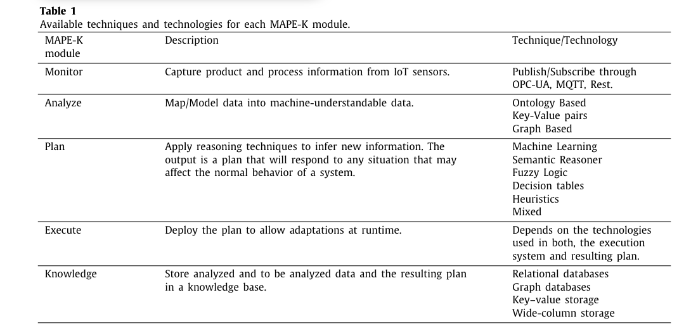

 #### 2.2.1. 语义网 The Semantic Web 

 语义网是一个概念，它赋予信息明确的含义，并使计算机和人们能够协同工作[27]。语义是指将数据转换为本体实体的过程，本体是形式化的，图2。IBM的MAPE-K参考模型。资料来源：由[25]扩展而来。标准化的知识表示法[27]。语义网技术堆栈包括：(1)用于编写本体的语言OWL(Web Ontology Language)，(2)RDF(资源描述框架)-用于编写数据的语言，(3)SWRL(语义Web规则语言)-用于编写规则或约束的语言，(4)SPARQL(简单协议和RDF查询语言)-用于查询RDF数据的语言，以及(5)语义推理器-允许解释上下文并通过对照SWRL规则评估RDF数据来推断新知识的引擎[28]。

 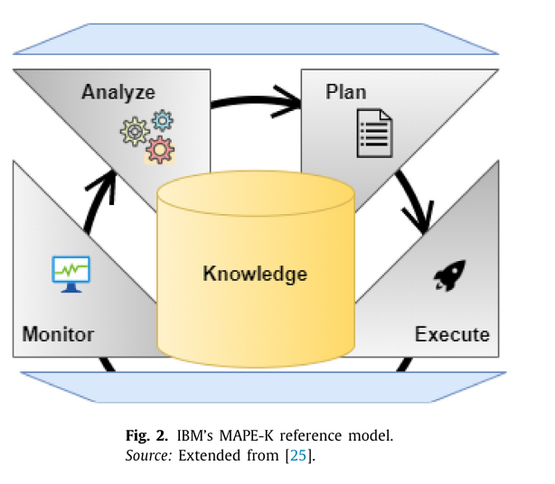

 语义Web允许在各种应用程序之间混合、公开和共享结构化和半结构化数据。本体的这种链接结构形成一个带标签的图，其中边表示由图节点[29]表示的两个资源之间的命名链接。例如，SOSA本体是一个描述物联网设备、传感器和执行器的模型，并对它们的属性和关系进行建模[30]。物联网和语义网技术的结合产生了语义互操作性，即在物联网实体之间明确交换和使用信息的能力[31]。有许多用于捕获物联网设备的本体，其中最重要的是描述物联网传感器及其观测的SSN(语义传感器网络)1和对物联网系统和应用程序的知识建模的IoT-Lite本体2。一旦物联网设备及其服务被语义注释，就可以通过将推理功能应用于语义描述和约束来在系统中实现上下文感知。

 
由于物联网设备可以捕获各种类型的情景信息，因此可以在工作流管理区域的设计时和/或运行时使用情景感知功能。此外，重要的是确定在每个工作流管理功能领域中在哪里以及如何实施(由语义网技术授权的)上下文功能，以及如何改进它。为了实现这一目标，以下部分介绍了进行这一文献回顾所使用的方案和方法。

## 3. 文献综述法

文献综述是按照[32]中概述的系统文献综述(SLR)指南进行的。如图3所示，该方法由两个主要阶段和相关的子步骤组成。规划阶段包括定义协议，同时在选定的数字图书馆中执行搜索字符串，并在执行阶段进行文章的精选。
### 3.1. 规划

确定议定书在任何SLR中都是至关重要的，因为它概述了审查中涉及的程序，并作为将要开展的活动的日志[33]。许多工具可以确保程序系统化，从电子表格等简单工具到专门为单反设计的专门工具。在这方面，Parsifal是一个开源的在线工具，旨在支持研究人员执行SLR，特别是在软件工程的背景下[34]。帕西法尔被选中来记录这次单反的整个过程。在开始工作之前，确定范围是至关重要的。在这方面，PICOC方法通常用于确定一个主题的各个组成部分，并随后形成研究问题[35]。

#### 3.1.1。定义PICOC元素和同义词

PICOC代表人口、干预、比较、结果和背景。表2详细说明了每个PICOC元素的定义以及所选的关键字和同义词。由于关键字源自PICOC元素，因此必须考虑可在数字图书馆中执行的查询中使用的同义词。

#### 3.1.2. 阐述研究问题

研究问题(RQ)是决定研究识别和数据提取的重点的关键要素[33]。RQ必须包括PICOC要素，以确定研究重点并协助确定主要研究[35]。这台单反相机的研究问题如下。

(RQ1)：与支持业务流程生命周期的语义Web解决方案相关的开放视角和未来挑战是什么？

(RQ2)：在构建支持业务流程生命周期的语义Web解决方案时使用了哪些工具和算法？

(RQ3)：在衡量支持业务流程生命周期的语义Web解决方案的性能时，会考虑哪些评估因素？

#### 3.1.3.选择数字图书馆资源

一篇文章的有效性取决于数据库的适当选择，因为它必须充分涵盖研究领域[36]。例如，Web of Science(WOS)和Scope us是多学科数据库，提供对技术、生物医学和其他领域的文献的访问。然而，在这项工作中，重要的是也包括与计算机科学相关的来源，如EI Compendex、IEEE和Science Direct。

#### 3.1.4.定义包含和排除标准

建立纳入和排除标准，以执行从图书馆来源收集的文章的提炼步骤。纳入标准是指可以考虑进行下一步细化的文章。排除标准是指不符合这一研究目的的文章，因此被从研究中删除。表3提供了考虑纳入和排除这一SLR的标准。

#### 3.1.5 确定质量评估核对表

质量评估清单指的是分配给每篇文章的一组问题、答案和分数。因此，文章可以根据它们的分数进行分类和筛选，以获得与研究领域更密切相关的文章。表4列出了该单反相机的质量评估核对表

#### 3.1.6 定义数据提取表单

数据摘录表格是由输入文本字段组成的可视化表格，设计用于在审查过程中登记来自文章的相关数据。这一步骤有助于综合每篇文章的信息并回答既定的研究问题[37]。表5列出了数据提取表单的输入字段。

### 3.2.正在进行

在定义了协议之后，通过执行先前定义的步骤进行审查。

#### 3.2.1.构建数字图书馆搜索字符串

通过合并3.1.1中定义的PICOC元素和同义词来构建搜索字符串，以在每个选定的数据库库中运行。搜索字符串使用圆括号和布尔运算符AND分隔总体、干预、比较和结果，而同义词则使用布尔运算符OR分隔

#### 3.2.2 收集研究资料

在每个数字图书馆中执行搜索字符串后，搜索结果被下载为CSV(逗号分隔值)文件，其中包含摘要、作者、标题、出版年份等元数据。这些数据对于数据提取和定量和定性分析是有用的。在这一步骤中，从所有数据库中共收集了404篇论文。

#### 3.2.3.学习精选与提炼

这一阶段包括选择论文和提炼论文的三个步骤。第一步是确定在所选数据库的每个搜索中出现的重复项。利用自动程序通过执行标题匹配来搜索和排除重复论文。在这项工作中，研究被导入到Parsifal中，以利用其预先构建的功能Find_Duplates。该工具从最初的404篇论文中识别出83篇重复的论文。剩下的两个改进步骤然后由一位作者为每篇文章手动执行。因此，在第二步中，对剩余的321篇论文进行了纳入和排除标准的筛选。在最后的细化步骤中，对88篇文章进行了质量评估，并为每篇文章分配了从1.0到5.0的权重/分数。结果，36篇论文的质量得分>=3.5，并被选入深度审查阶段。图4示出了每个数字图书馆的导入、接受和拒绝的研究的分布。
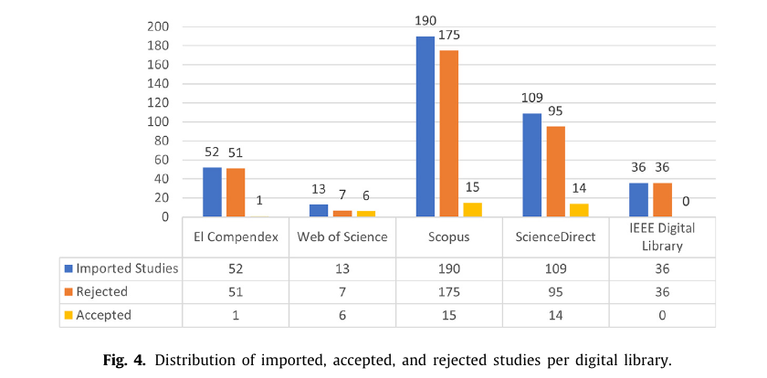

## 4.对文献进行分类深入回顾

入选的36篇文章介绍了在一个或多个工作流管理功能领域使用语义网技术的方法。表6根据研究的主要侧重点和工作流管理职能领域对研究进行了分类。这些类别包括流程建模、服务组合、服务组合优化、可重构系统、自主计算和知识管理系统。每一类别都作了简要描述，对该类别所包括的研究重点有一个大致的了解。还列出了每个类别的论文数量。

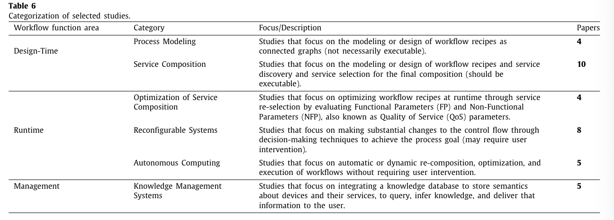

以下各节深入回顾了每个类别中选定的文章。还为每个类别提供了比较表，以简要总结每篇论文的主要思想、用例(如果有)、优势、使用的工具和机会。后者突出了提案中的弱点，并有助于确定这一研究领域当前的积极挑战。这些积极的挑战将在第5节中讨论。

为了确定每个类别中最重要的作品，我们进行了引文分析，如图5所示。该分析通过统计文章被其他作品引用的次数来衡量文章的相关性。

### 4.1. 流程建模

流程建模是一门使用不同方法和技术支持组织流程的学科[38]。流程图模型是一种常用的流程建模技术。它是一种图形表示，其中使用符号来表示定义和分析业务问题的操作和流动方向[39]。表7比较了被归类为流程建模的所选方法。这些研究提出了原型和实现，重点是通过语义网技术增强的工作流建模。例如，Suri等人。[40]提出了物联网感知业务流程开发的语义框架。该方法使用BPMN 2.0的扩展版本将物联网资源集成到业务流程中。该方法使用Signavio BPMS实现流程模型的语义标注，使用IoT-BPO本体辅助用户进行本体标注。

Barz等人提出了一种利用BPMN和本体进行燃气轮机维修数据自动处理的方法。在[41]中。该体系结构处理从机器到传感器的带语义注释的数据，并分析数据以进行异常检测。该方法使用语义知识库来存储和查询数据，使用Camunda BPMN来设计和控制燃气轮机维修过程。同样，Kaar等人也是如此。[42]开发了一种集成了多视角RAMI4.0(工业参考体系结构模型)特点的本体，并提出将其与S-BPM(面向对象的业务流程管理)相结合来封装行业标准和利益相关者行为。

### 4.2.知识管理系统

知识管理系统的主要目的是捕获产品和过程信息，并在以后使用它来自动化过程。这些系统通常将信息存储在知识数据库中，然后通过应用复杂的规则、试探法、人工智能和代理来推断新的知识[44]。表8比较了被归类为知识管理系统的选定方法。这些研究提出了将知识数据库集成到系统中以存储和处理设备和服务的语义的原型和实现。例如，Borsato[45]提出了一种基于本体的语义信息模型，用于计算能源效率指标。首先创建BPMN，然后将其划分为活动，直到达到基本任务(自顶向下方法)，以便所有BPMN实体都可以作为个体和断言映射到本体中。然后，利用Protégé和racerPro的推理和查询功能。每项任务都由一个操作来完成，该操作对应于一个制造单元过程。他们的解决方案通过为给定的个人提供数据属性断言，为制造单元流程提供参数。
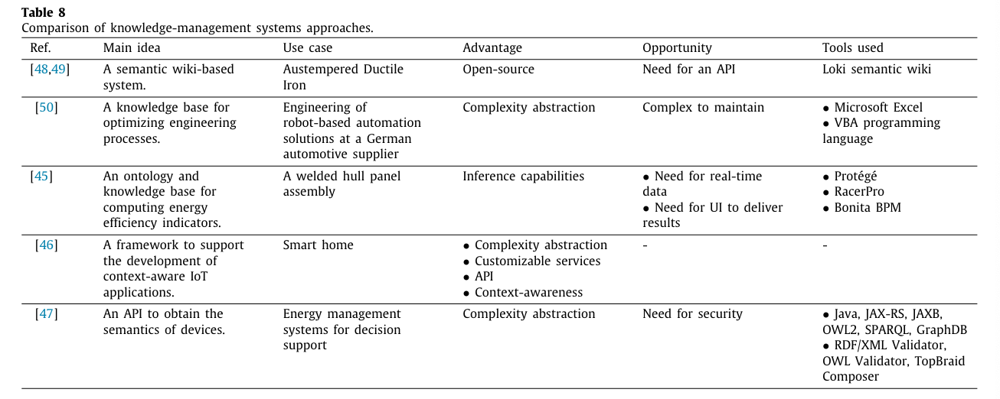

Elkady等人提出了一种用于智能家居场景的语义和上下文感知框架。在[46]。该框架从物联网设备收集数据，并考虑到温度、位置、日期和时间等不同类型的上下文数据，使用本体来解释上下文。API(应用程序编程接口)提供对后端的抽象访问，并提供上下文信息。结果表明，他们的方法可以根据上下文的变化进行预测。同样，希波利特等人。[47]提出了一个面向能源管理领域的语义件和语境件框架。使用本体来描述设备的语义，并且Web服务生成器工具从本体的实例创建Web服务。该工具嵌入了SPARQL查询，并使用API通过HTTP/REST而不是HTTP/SPARQL来促进从知识库中提取数据。

### 4.3.服务组合

服务组合是一种涉及发现、选择和执行服务以实现用户目标的技术。这是通过将用户目标分解为功能性和非功能性需求/属性(FP和NFP)来执行的[14]。表9比较了分类为服务组合的选定方法。这些研究提出了关注使用语义网技术的服务组合的原型和实现。例如，Bucchiarone等人。[51]提出了一种基于人工智能(AI)规划的构图框架。该框架通过使用BPEL的扩展来实现服务发现、选择、组合和部署，[52]称之为“可适应的普遍流语言(APFL)”。使用APFL活动可以在设计时使用前提条件和效果进行注释。作者使用APFL创建了一个执行服务组合的组合规划器模块。该算法创建抽象活动，然后将其替换为较小的组合“片段”。使用人工智能规划算法作为推理机制，通过考虑先前执行的知识并分析上下文以重用最终组合中的片段，从而最小化搜索空间。

Kir和Erdogan[53]设计了一个名为‘’agileBPM‘’的智能业务流程管理框架。该框架结合了本体和代理，通过使用分层任务网络(HTN)规划器算法来组合服务，从而提供认知和异常处理能力。该算法评估服务质量、业务目标和业务规则，以执行能够实现用户目标的流程的搜索和排名。同样，Mazzola等人也是如此。在他们的研究中[54-56]提出了一种用于语义Web服务组合的体系结构和组件。该方法使用遵循一切即服务原则的Web服务注释工具来注释Web服务并将其存储在公共市场中。创建BPMN模型并使用注释丰富，以根据IOPE(输入、输出、前提和效果)定义每个任务的语义行为。基于模式的算法用于业务流程的语义组合，并包括一个优化阶段来考虑非功能方面(服务质量约束)来解决约束优化问题(COP)。   

### 4.4.服务组合的优化

服务组合优化是指根据服务等级协议(SLA)重新选择现有组合中的服务以提高服务质量(Qos)参数的过程。这个过程是由执行相同功能的大量Web服务的汇聚驱动的[62]。服务质量参数是用于评估服务并确定任务的最佳服务的非功能属性(NFP)。这些参数由0到100之间的数值表示，例如响应时间、可用性、吞吐量、成功率、可靠性、合规性、最佳实践、延迟、相关性和级别(最高、最低、白金、黄金)。表10比较了归类为服务组合优化的选定方法。例如，贝克等人。[63]开发了一种专门针对能源效率的最优服务组合算法。该算法致力于减少组合问题中使用的服务数量，同时也降低了能量消耗。该方法结合了语义网技术来描述服务。通过考虑来自不同提供商的各种服务来创建初始组合计划。然后，该算法通过对服务提供商列表进行排序来执行优化，使得那些具有最多服务数量的服务被放在第一位。然后，考虑服务质量条件来选择最佳的单独服务或组合服务。最后，通过获取最优服务进行重组。
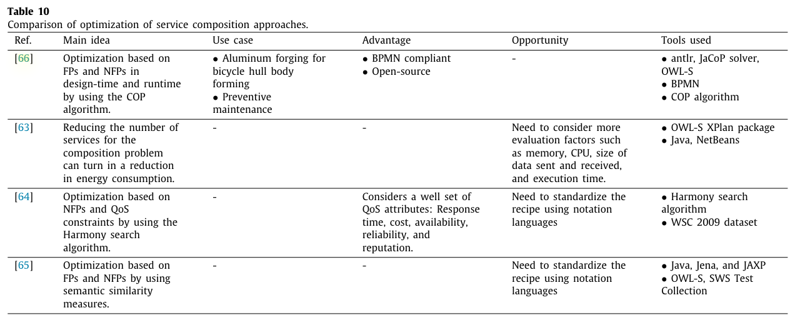
Bekkouche等人提出了一种优化的语义Web服务组合方法。在[64]中。他们的方法考虑了优化问题的NFP和Qos约束，该优化问题通过应用和谐搜索(HS)算法来解决。该方法使用Web服务挑战(WSC)2009数据集进行了测试。同样，Abid等人。[65]提出了一种首先对服务进行分类、发现和组合的优化语义Web服务组合框架。然后使用语义相似性度量进行优化，考虑FP和Qos参数来计算最优服务。
### 4.5.可重构系统

可重构系统是一种可以通过重新安排应用程序、平台、系统架构、底层基础设施和管理设施等元素，在运行时动态执行重新配置的系统。这通常在系统维护期间或在安装新更新时进行，有时需要用户干预[67]。表11比较了分类为可重构系统的选定方法。这些研究提出了原型和实现，重点是重新配置系统，以对控制流程进行实质性更改，目的是通过决策、适应性案例管理和机器学习技术实现用户目标。例如，Ciasullo等人。[68]提出了一种在业务流程外包环境下通过选择最合适的供应商来支持群体决策问题的框架。该框架包括一个“时间感知”功能，以考虑从过去的执行所经过的时间。该框架依赖于模糊语言共识模型(在[69，70]中提出)和上下文感知插件(在[71]中提出)。通过考虑用户参与决策群体的当前环境和时间，实现了一种强化学习算法来学习和分配权重/分数，以支持用户的决策过程。
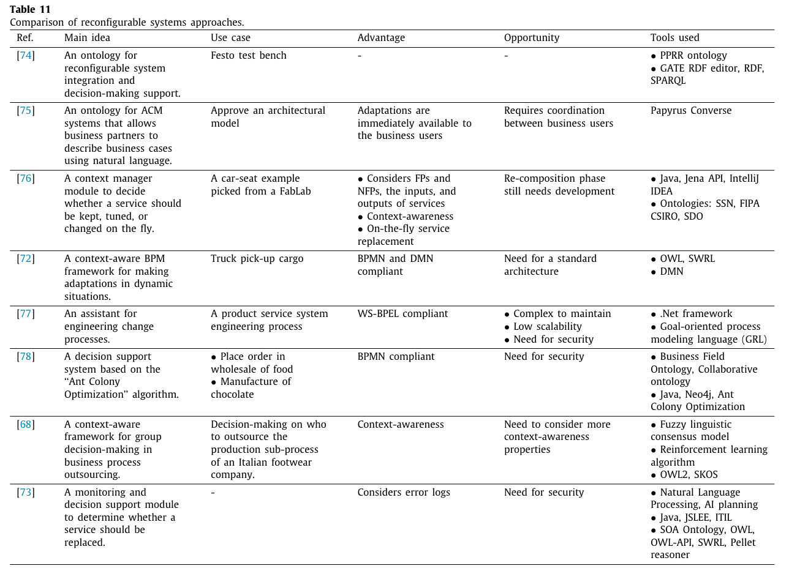
上下文感知的BPM生态系统是由Song等人提出的。在[72]。该提议将物联网数据集成到情景本体中，以增强业务流程决策。使用该框架，业务流程在设计时和运行时都知道其上下文，因此可以适应动态情况。该体系结构由业务流程模型和上下文实体及其关系组成。语境是从包括物联网设备和信息系统在内的各种来源感知的，然后进行分析以输出可理解的语境知识。然后创建决策模型以考虑该上下文知识。在执行阶段，相应地部署和执行业务流程和决策模型。在类似的脉络下，奥多涅斯等人。[73]制定了自动化监测和决策支持框架。该框架使用自然语言处理(NLP)来创建“问题文件”，该文件定义了实现目标的一系列行动。监控模块收集在执行期间生成的日志。然后，决策支持模块获取日志，并通过使用推理引擎在需要时改变负责的服务来确定是否存在真正的错误。

### 4.6.自主计算

自主计算是一个专注于自适应和自主计算系统的研究领域，这些系统能够在不需要人工干预的情况下配置、修复、优化和保护自己[79]。表12比较了归类为自主计算的选定方法，这些方法侧重于服务的自动或动态组合、优化和执行。例如，Alférez和Pelechano[80]提出了一个上下文感知框架，用于在运行时自主调整服务组合。该方法使用本体和BPMN和WSBPEL在设计时创建模型，以支持服务组合的动态调整。验证阶段在执行之前检查模型及其配置的可变性，以确保安全的服务重组。在运行时，无论何时发生上下文事件，都会查询先前创建的模型以执行服务重新组合。

Lam等人设计了一种应用MAPEK(监视、分析、计划、执行和知识)范式进行自主计算的方法。在[81，82]中。这种方法依赖于使用语义网络技术促进可互操作的物联网系统开发的“自主管理器”。该体系结构集成了一个语义抽取器(SE)，它从服务和系统中收集信息，并将其转换为语义知识。SE使用机器学习(ML)技术来识别流行的语义模型并提取必要的信息。然后，从所选择的本体构建知识图，并将信息存储在知识库中。自主框架(AF)使用SPARQL和SWRL作为推理机制，用于运行时的知识推理和决策。

Arul等人。[83]通过对Web服务添加语义以满足用户需求的动态变化，提出了一种自动动态服务组合框架。他们采用了分层任务网络规划器的扩展版本，称为基于用户约束的分层任务网络(HTNUC)，它能够理解OWL-S过程。该建议利用用户需求和约束来生成一个抽象的复合工作流，该工作流确定任务的执行顺序。然后创建最优抽象组合工作流以满足用户目标。使用基于本体的搜索将服务的句法定义转换为语义定义。最后，使用语义Web服务发现(SWSD)选择最合适的候选服务，以从发现的服务生成具体的可执行工作流。

## 5.讨论

在这一部分中，分析了最新研究的趋势和差距，并提出了研究问题。

### 5.1.对RQ的分析和回答

**(RQ1)：与支持业务流程生命周期的语义Web解决方案相关的开放视角和未来挑战是什么？**

**(A)流程建模和面向服务的架构解决方案需要标准化**

许多被评论的论文建议加入新的过程建模语言，以使食谱对于语义推理器和工作流管理软件是可解释的。虽然[85]证明了现有的流程建模语言(如BPMN和BPEL)可以支持额外的特性和定制的元素和属性，但重要的是保持现有表示法语言的高级别表达能力，如[61]所述。

在面向服务的体系结构的标准化方面，所审查的许多原型都是作为非面向工业的体系结构提出的，缺乏对安全和可伸缩性等重要功能的支持。遵循面向服务的体系结构(SOA)的解决方案提供了几个优势，包括可伸缩性、集成、覆盖范围更广和面向未来，如[86]中所述。这可以通过API连接到后端来实现[87]。工业物联网框架应该具有SOA、自动化、可扩展性和安全性，例如箭头框架[88]、AUTOSAR[89]和FIWARE[90]。工业IoT框架的最新平台和最先进水平的比较可在[91]中找到。

RAMI 4.0的引入是为了标准化机器之间的互操作性。该模型通过三维层模型对I4.0组件进行标准化和数字化表示[92]。为了实现这一点，引入了资产管理外壳(AAS)的概念，它通过提供资产的技术和操作数据来实现网络内资产的互操作和识别。有关AAS的更多详细信息，请参阅[93]。

**(B)需要协助流程设计人员对制造业务流程进行建模**

在BPM环境中，业务流程的设计是由流程设计人员处理的任务。BPM通常应用于银行、企业资源规划或类似管理软件领域的系统[94]。然而，文献中的一些作者发现需要将过程设计者包括在制造系统领域中以用于制造业务过程的设计。业务流程设计人员通常不具备适当的知识或工具来配置机器服务或使用此类服务编排流程。因此，挑战在于提供工具来帮助流程设计人员设计制造业务流程。考虑到AAS通过使用子模型来描述机器服务[92]，可以开发基于AAS的建模工具，在建模器调色板中提供资产服务，从而促进制造业务流程的设计。

**(C)需要能够利用边缘计算环境的业务流程管理软件**

大多数现有的服务组合原型都是作为基于云的架构交付的，数据处理主要在中央服务器中处理。然而，边缘计算已经成为工业领域的流行模式，因为它通过将云计算设施连接到最终用户来提供低延迟、更高的移动性和更多的上下文信息[59]。因此，开发能够在边缘环境中组合服务的业务流程管理软件至关重要。

**(D)需要解释上下文信息以执行动态适应**

动态适应这一文献综述分析了36个提案中有16个提案中存在语境意识特征的研究。上下文感知是普适计算的一个重要特征，因为它允许解释上下文信息[95]。在工作流实例中，可以通过从设备捕获数据并通过使用语义网技术对其进行处理来实现上下文感知[96]。图6示出了按工作流功能区的上下文感知的应用。例如，在设计时阶段，IOPE是增强工作流设计的主要技术。这一点在Bucchiarone等人的工作中得到了证明。[51]实现了半自动的工作流建模。在运行时阶段，如Bekkouche等人所报告的，基于服务质量(QoS)的优化是主要技术。在[64]中，谁在运行时替换了工作流中的服务。使用语义维基的知识管理是管理阶段最常用的技术。在这方面，Elkady等人。[46]提出了一个基于语义的框架，该框架以上下文变化触发的提醒或通知的形式向用户界面传递上下文信息。

尽管一些作者在他们的建议中启用了上下文感知，但应该通过考虑传感器日志来进一步利用这一点。如第2.2.1节所述，可以使用本体来利用传感器提供的数据。能够解释上下文信息的本体论的属性包括响应时间、gps位置、成功率、网络延迟、hasWeight、hasSize、hasTemperature和hasHumity。

为了有效地适应任务执行过程中的意外事件，实时收集和分析数据以制定计划至关重要。一种方法是IBM用于构建自治系统的MAPE-K参考模型，如第2.2节所述。在监控阶段，可以利用物联网传感器捕获情景数据，然后通过OWL、RDF、SWRL和SPARQL等语义网络技术对其进行处理。在规划阶段，可以使用决策模型和符号(DMN)标准创建决策表。通过将DMN和BPMN相结合，可以动态地改变工作流的执行，以确保标准化的决策。

**(RQ2)：在构建支持业务流程生命周期的语义Web解决方案时使用了哪些工具和算法？**

回顾的研究提出了建立在语义网技术之上的原型和实现，以支持工作流生命周期的各个阶段。表13总结了用于开发每个提案的语义网工具。工具和本体的完整列表可以在第4节发布的表格中找到，这些表格按类别组织。

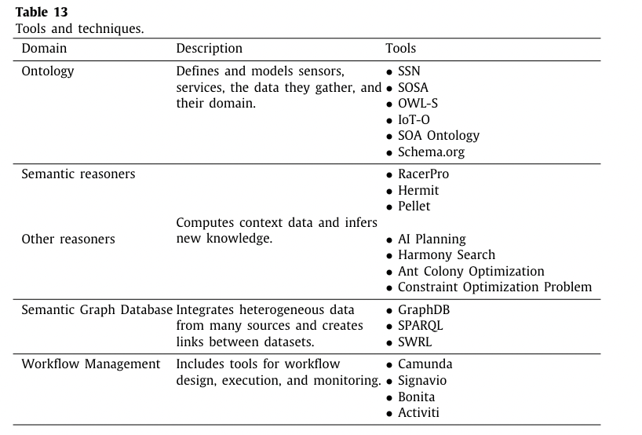

**(RQ3)：在衡量支持业务流程生命周期的语义Web解决方案的性能时，会考虑哪些评估因素？**

为了回答这个问题，收集了被审查的文章在提案的试验阶段使用的数据集和衡量变量。在所审查的36项研究中，有30项介绍了提案的评价阶段。图7显示了用于测量其方法的性能的前5个测量变量。执行时间得分最高，在12篇论文中被考虑，其次是Precision/Recall/F得分(5分)和服务数量(3分)。Precision/Recall/FScore是通常与分类方法相关的性能指标(在0到1之间)。接受审查的作者应用这些衡量标准来评估从收集中检索到的数据的质量和数量。较高的精度表示算法返回的相关结果比不相关的结果多，而较高的查全率表示算法返回大多数相关结果(无论是否也返回不相关的结果)。F-Score提供了一个单一的分数，在一个数字中平衡了对精确度和召回率的担忧。另一方面，没有评估上下文软件变量：响应时间、位置、可用性、吞吐量、成功率、可靠性、合规性、最佳实践、延迟、相关性和级别。

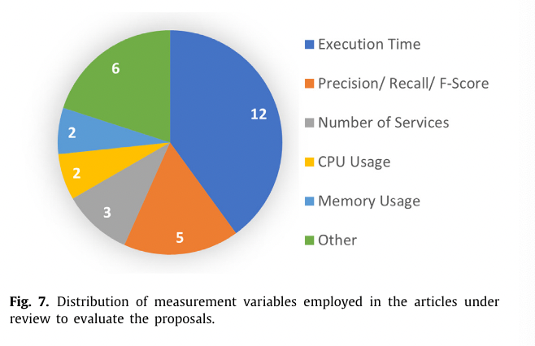

图8总结了作者为测试他们的建议而考虑的用例。例如，在用例“卡车提货”中，Song等人。试验了环境感知的BPM框架，以便在动态情况下进行调整。在“巧克力制造”的案例中，Montaral等人。提出并测试了一个决策支持系统。关于数据，表14列出了作者在评价阶段使用的数据集。这些是包括Qos参数的语义网服务的集合。
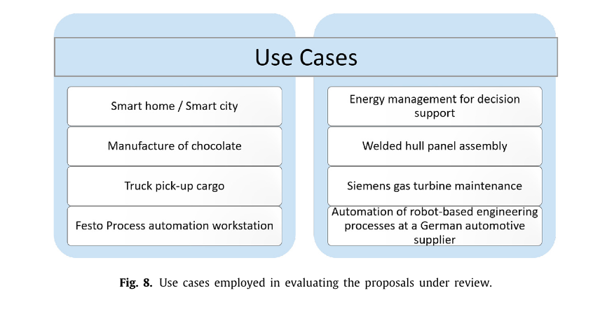

下一节将对关键词进行相关性分析，探讨评论论文中的研究主题。

### 5.2.关键词相关性分析

这一小节揭示了本文献综述中的研究主题。使用了科学界广泛使用的VOS查看器软件，该软件用于构建文献计量学网络并将其可视化为聚类图。VOS查看器和CitNetExplorer的比较以及对集群算法的描述可以在[97]中找到。在这一分析中，VOS查看者被提供了通过第二次精炼阶段(88篇论文)的论文的索引关键词的数据集(第3.2.3小节)。数据被手动打磨以删除多余的空格，然后导出到CSV文件中作为软件的输入。

在VOS查看器中，每个圆圈代表一个关键字，圆圈的大小表示在标题或摘要中包含该关键字的论文数量。频繁出现的关键词在可视化中往往彼此靠近，线条表示关键词之间的链接，最小强度为1。如图9所示，文献中最突出的主题是本体，由22个条目的蓝色簇表示。紧随其后的是物联网和语义网的结合，以19个项目的橙色集群为代表。另一方面，边缘计算和语义互操作性(顶部中心，粉色)是最小的集群，只有7个项目，与更大的集群的连接有限。此外，边缘计算和业务流程管理之间似乎没有直接联系，这表明这一领域存在潜在的研究机会。

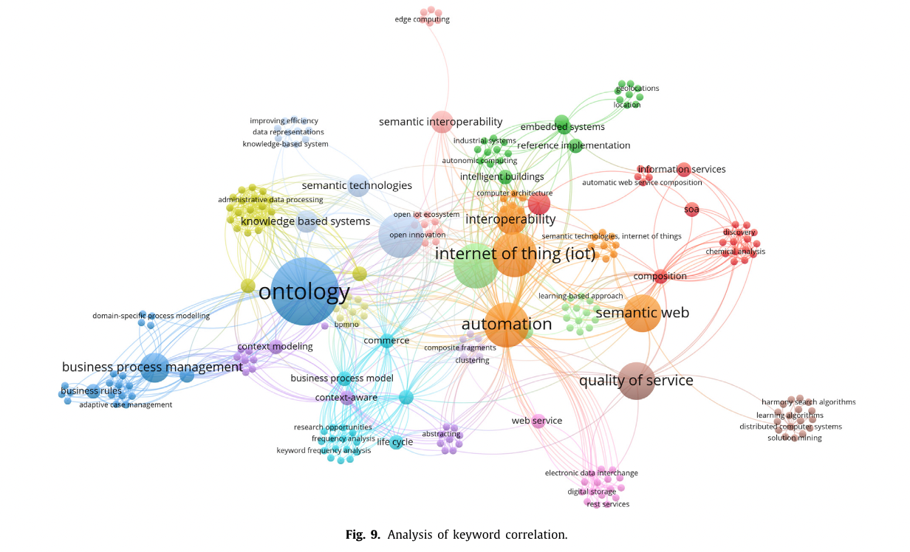

总而言之，目前用于创建语义和上下文感知智能制造解决方案的工具和算法已经确定。工作流管理系统特别用于管理制造过程，使用BPMN作为标准表示语言。就描述机器、设备和服务的本体而言，语义网技术已经达到了成熟水平。然而，这篇文献回顾揭示了缺乏结合了诸如AAS之类的行业4.0标准体系结构的原型。在接下来的一节中，提出了一项建议，以解决最先进技术中已查明的差距。

## 6.上下文感知工作流管理体系结构：基于资产管理外壳的方法

在本节中，我们提出了一个体系结构来解决第5节中确定的挑战。建议的体系结构编排了基于AAS的业务流程，并提供了上下文感知功能，以在运行时增强业务流程的决策维度。本文件概述了该提案的基本细节，更多细节见[98]的扩展说明。如图10所示，该体系结构包括几个组件：
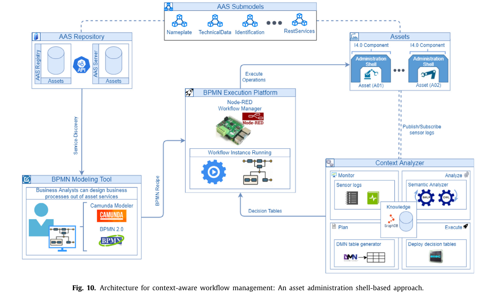

1. “Assets”(右上角)表示工厂级的I4.0物理设备。这些资产通过AAS概念进行数字化，其数字表示存储在存储库中。
2. ‘’AAS Repository‘’(左上角)可以是AAS服务器或AAS注册表，具体取决于供应商的实现(例如Basyx、NOVAAS、Admin-Shell-io等)。
3. ‘’RestServices‘’子模型(顶部-中间)被提出以允许描述机器服务。
4. “BPMN建模工具”(左下角)包括Camunda Modeler和一个新的Camunda插件“AAS Web服务发现程序”，它从AAS存储库中的资产中发现服务。
5. ‘’BPMN Execution Platform‘’(中心)使用任何可以解释和运行以BPMN编写的配方的工作流执行器或业务流程执行器来管理资产服务的编排。
6. ‘’Context-Analyzer‘’(右下角)监控并计划适应以响应上下文变化，以增强运行时工作流的动态化。该组件基于IBM用于构建自主系统的MAPE-K框架。

该提案提供了一个综合解决方案，该方案在边缘计算环境中结合了语义网、业务流程和AAS行业标准的使用。就我们所知，没有一种方法可以同时使用这三个元素来执行服务的动态重新选择。虽然有类似的方法结合了用于上下文识别和服务重新选择的语义网，但这些方法通常是基于云的，并且不使用AAS标准来表示资产。该体系结构开发的组件是开源的，并在APACHE-2.0许可下授权社区使用和进一步开发。

## 7.结论

业务流程管理学科正在智能制造领域获得吸引力，因为它促进了正式标准化工作流程食谱的设计。这项技术与语义网技术相结合，提供了上下文感知系统，可以增强决策过程以响应上下文变化。

本文应用PICOC方法对智能制造领域基于语义网的工作流管理方法的研究现状进行了系统的综述。选择并分析了2015至2022年间发表的36项研究。这项研究涉及的主题范围很广，这带来了一定的挑战，因为很难对选定的作品进行分类。尽管如此，审查在确定实地挑战和解决研究问题方面可以被认为是成功的(第5.1节)。

我们的分析突出了技术方面的未来发展机会，例如考虑上下文感知的语义和标准化流程建模，以及包括安全性和可伸缩性在内的体系结构问题。还确定了用于构建语义和情景件智能制造解决方案的趋势工具和算法。此外，审查还检查了通常用于评估此类方法的因素和数据集，为使用正确的工具、实践和标准构建解决方案提供信息。最后，在第6节中提出了一种新颖的体系结构，它解决了文献中确定的挑战，并利用了研究中发现的最佳做法和标准。

这项研究为该领域的新手和专家提供了宝贵的资源，并为未来的研究工作奠定了基础。特别是，我们创新的上下文感知工作流管理体系结构可以通过解决当前文献综述中确定的挑战来增强：(1)在流程建模和面向服务的体系结构解决方案中需要标准化，(2)需要在制造业务流程的建模中协助流程设计者，(3)需要能够利用边缘计算环境的业务流程管理软件，以及(4)需要解释上下文信息以执行动态适应。我们计划通过开发必要的组件并为寻求在其制造过程中采用AAS标准的行业提供标准化解决方案来满足这些需求。

