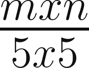
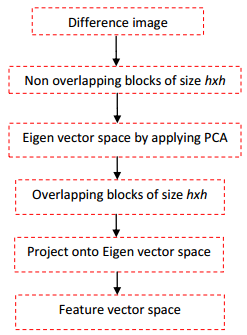

# 基于PCA和K-Means的多时相卫星图像非监督变化检测

不同时间采集的区域图像的自动变化检测是图像处理中最有趣的课题之一。这样的图像被称为多时间图像。变化检测涉及分析两个多时相卫星图像，以发现在两个时间戳之间可能发生的任何变化。它是遥感的主要用途之一，在国防检查、毁林评估、土地利用分析、灾害评估和监测许多其他环境/人为变化等广泛任务中得到应用。

我们将在这篇博客文章中概述一种无监督的变化检测方法。它涉及到对使用多时相图像构建的变化数据即差异图像的自动分析。差值图像是两个图像逐个像素的减法。然后通过主成分分析(PCA)从差值图像中提取像素块的特征向量。随后，通过将像素的邻域投影到特征向量上，为差异图像中的每个像素构造特征向量。特征向量空间是所有像素的特征向量的集合，通过K-Means算法进行聚类后，我们得到两个簇-一个表示属于变化的类别的像素，另一个表示属于不变的类别的像素。每个像素将属于任一簇，因此可以生成改变图。因此，实现此应用程序的步骤如下：

1. 差异图像生成与特征向量空间(EVS)

2. 构建特征向量空间(FVS)

3. 特征向量空间和变化图的聚类


我们将在美国地质调查局(USGS)网站上提供的陆地卫星图像开发的图像库上演示该算法的工作。该网站提供了各种分辨率的图像，并详细描述了图像中发生的变化。一些多时相图像对可以从这里下载。

https://www.dropbox.com/s/1y03i19ov78vewc/corpus.zip?dl=0

## 1.差值映象与特征向量空间

如前所述，差异图像具有2个灰度图像的对应像素的强度值的绝对值差异。因此，计算的差异图像将使得与土地变化相关联的像素的值将具有与与未改变的区域相关联的像素的值显著不同的值。

`difference image (i, j) = |image1(i, j) - image2(i, j)|`

如果Image1和Image2变量是两个图像，则可以在Python中按如下方式完成此操作：

``` python
from scipy.misc import imread, imsave, imresize
import numpy as np
 
image1 = imread(imagepath1)
image2 = imread(imagepath2)
new_size = np.asarray(image1.shape) / 5
new_size = new_size.astype(int) * 5
image1 = imresize(image1, (new_size)).astype(np.int16)
image2 = imresize(image2, (new_size)).astype(np.int16)
diff_image = abs(image1 - image2)
```

接下来是构建特征向量空间的任务。在此之前，让我们快速浏览一下什么是PCA。PCA是一种强调变化并在数据集中带出强大模式的技术。它将一组可能相关变量的观测值转换为一组线性不相关变量的值，称为主成分。它是一种广泛使用的降维方法。

PCA 获取数据集，并在对其执行均值归一化后确定其协方差矩阵。计算协方差矩阵的特征向量和特征值（给我们 EVS），然后按特征值的降序对特征向量进行排序。这个排序步骤是PCA算法的实际启示。特征向量已按特征值的降序排序，因为具有最高特征值的特征向量是数据集的主成分。该向量显示大多数数据沿哪个方向倾斜。因此，通过PCA，我们已经能够提取表征数据的线。由于这是对PCA的简要介绍，我们鼓励您从这里和这里阅读更多关于它和相关概念的信息。
http://sebastianraschka.com/Articles/2015_pca_in_3_steps.html

在这种方法中，我们从差异图像中获取大小为 5 x 5 的非重叠块，并将它们展平为行向量。可以调整图像大小，使两个尺寸都是 5 乘以 的倍数。这些行向量的集合形成一个向量集。在脚本中，正是这样做的。如果我们的差异图像的大小为 ，则向量集中的行数将为。

`scipy.misc.imresize()change_detection.py find_vector_set()m x n`

``` python
def find_vector_set(diff_image, new_size):
 
    i = 0
    j = 0
    vector_set = np.zeros((int(new_size[0] * new_size[1] / 25),25))
    while i < vector_set.shape[0]:
        while j < new_size[0]:
            k = 0
            while k < new_size[1]:
                block   = diff_image[j:j+5, k:k+5]
                feature = block.ravel()
                vector_set[i, :] = feature
                k = k + 5
            j = j + 5
        i = i + 1
 
    mean_vec   = np.mean(vector_set, axis = 0)
    vector_set = vector_set - mean_vec   #mean normalization
 
    return vector_set, mean_vec
```

然后将 PCA 应用于该向量集以获得特征向量空间。特征向量空间将是一个 25 x 25 矩阵;它的每一列都是 25 维的特征向量。在 Python 中，从 中我们可以简单地导入模块并使用它来对变量执行 PCA 以获得变量.

    `sklearn.decompositionPCAvector_setEVS`

``` py
from sklearn.decomposition.PCA import PCA
 
pca = PCA()
pca.fit(vector_set)
EVS = pca.components_
```

## 2. 构建特征向量空间

构建FVS涉及再次从差异图像中获取5 x 5块，将它们展平，最后将它们投影到EVS上，只是这一次，块将重叠。向量空间（VS）首先是通过为差分图像的每个像素构造一个向量来创建的，这样一种5 x 5块实际上是像素的5 x 5邻域。这里需要注意的是，根据此逻辑，4 个边界行和 4 个边界列像素不会获得任何特征向量，因为它们不会有 5 x 5 邻域。（我们可以通过排除这些像素来管理，因为可以安全地假设这里发生的任何变化都将集中在图像的中间区域，而不是边缘）。因此，我们将在 FVS 中使用所有 25 维的特征向量。将FVS投影到25维EVS仅意味着执行以下矩阵乘法(m x n)- 8

`(VS)((m x n - 8) x 25) .(EVS)(25 x 25) = (FVS)(m x n - 8) x 25`

下图总结了到目前为止在该方法中遵循的步骤。


函数为我们确定特征向量空间。该函数与 类似，但从差异图像中提取重叠块。`find_FVS()find_vector_set()`

```py
def find_FVS(EVS, diff_image, mean_vec, new):
 
    i = 2
    feature_vector_set = []
 
    while i < new[0] - 2:
        j = 2
        while j < new[1] - 2:
            block = diff_image[i-2:i+3, j-2:j+3]
            feature = block.flatten()
            feature_vector_set.append(feature)
            j = j+1
        i = i+1
 
    FVS = np.dot(feature_vector_set, EVS)
    FVS = FVS - mean_vec
    return FVS
```

像素的特征向量现在位于其方差最大化的空间中。这将有助于后续的聚类步骤，以更好地将像素分为 2 类 – 更改的像素 （） 和未更改的像素 （pix_cpix_u）。

## 3. 特征向量空间的聚类和变化图

像素的特征向量携带信息，无论像素具有已更改像素的特征还是未更改像素的特征。构建特征向量空间后，我们现在需要对其进行聚类，以便将像素分组为两个不相交的类。我们将使用 K-means 算法来做到这一点。因此，每个像素将被分配给一个集群，使得集群的平均向量和像素的特征向量之间的距离最小。每个像素都有一个从 1 到 K 的标签，表示它们所属的簇号。

```py
from sklearn.cluster import KMeans
from collections import Counter
 
def clustering(FVS, components, new):
 
    kmeans = KMeans(components, verbose = 0)
    kmeans.fit(FVS)
    output = kmeans.predict(FVS)
    count  = Counter(output)
 
    least_index = min(count, key = count.get)
    change_map  = np.reshape(output,(new[0] - 4, new[1] - 4))
    return least_index, change_map
```


Date: November 25, 2017
Author:
26 Comments
Automatic change detection in images of a region acquired at different times is one the most interesting topics of image processing. Such images are known as multi temporal images. Change detection involves the analysis of two multi temporal satellite images to find any changes that might have occurred between the two time stamps. It is one of the major utilization of remote sensing and finds application in a wide range of tasks like defence inspections, deforestation assessment, land use analysis, disaster assessment and monitoring many other environmental/man-made changes.

我们将在这篇博文中概述一种用于更改检测的无监督方法。它涉及使用多时态图像构建的变化数据（即差异图像）的自动分析。差异图像是 2 个图像的逐像素减去。然后通过主成分分析 （PCA） 提取来自差异图像的像素块的特征向量。随后，通过将差分图像中的每个像素的邻域投影到特征向量上，为该特征向量构建特征向量。特征向量空间是所有像素的特征向量的集合，在通过 K-means 算法进行聚类时，给了我们两个聚类——一个表示属于已更改类的像素，另一个表示属于未更改类的像素。每个像素将属于任一聚类，因此可以生成更改映射。因此，实现此应用程序的步骤是：

差分图像生成和特征向量空间 （EVS）
构建特征向量空间 （FVS）
特征向量空间和变化映射的聚类
我们将在从美国地质调查局（USGS）提供的LANDSAT图像开发的图像语料库上演示该算法的工作原理。该网站提供各种分辨率的图像，并详细说明图像中发生的变化。可以从此处下载一些多时态图像对。

让我们潜入！

1. 差分图像和特征向量空间
如前所述，差分图像具有2个灰度图像的相应像素的强度值的绝对值差。因此，计算出的差异图像将使与土地变化相关的像素值与与未更改区域相关的像素的值明显不同。

difference image (i, j) = |image1(i, j) - image2(i, j)|

这可以在 Python 中完成，如果 image1 和 image2 变量是 2 个图像：

1
2
3
4
5
6
7
8
9
10
from scipy.misc import imread, imsave, imresize
import numpy as np
 
image1 = imread(imagepath1)
image2 = imread(imagepath2)
new_size = np.asarray(image1.shape) / 5
new_size = new_size.astype(int) * 5
image1 = imresize(image1, (new_size)).astype(np.int16)
image2 = imresize(image2, (new_size)).astype(np.int16)
diff_image = abs(image1 - image2)
接下来是构建特征向量空间的任务。在此之前，让我们快速浏览一下什么是PCA。PCA是一种强调变化并在数据集中带出强大模式的技术。它将一组可能相关变量的观测值转换为一组线性不相关变量的值，称为主成分。它是一种广泛使用的降维方法。

PCA 获取数据集，并在对其执行均值归一化后确定其协方差矩阵。计算协方差矩阵的特征向量和特征值（给我们 EVS），然后按特征值的降序对特征向量进行排序。这个排序步骤是PCA算法的实际启示。特征向量已按特征值的降序排序，因为具有最高特征值的特征向量是数据集的主成分。该向量显示大多数数据沿哪个方向倾斜。因此，通过PCA，我们已经能够提取表征数据的线。由于这是对PCA的简要介绍，我们鼓励您从这里和这里阅读更多关于它和相关概念的信息。

在这种方法中，我们从差异图像中获取大小为 5 x 5 的非重叠块，并将它们展平为行向量。可以调整图像大小，使两个尺寸都是 5 乘以 的倍数。这些行向量的集合形成一个向量集。在脚本中，正是这样做的。如果我们的差异图像的大小为 ，则向量集中的行数将为 \frac {m x n}{5 x 5}。scipy.misc.imresize()change_detection.py find_vector_set()m x n

1
2
3
4
5
6
7
8
9
10
11
12
13
14
15
16
17
18
19
20
def find_vector_set(diff_image, new_size):
 
    i = 0
    j = 0
    vector_set = np.zeros((int(new_size[0] * new_size[1] / 25),25))
    while i < vector_set.shape[0]:
        while j < new_size[0]:
            k = 0
            while k < new_size[1]:
                block   = diff_image[j:j+5, k:k+5]
                feature = block.ravel()
                vector_set[i, :] = feature
                k = k + 5
            j = j + 5
        i = i + 1
 
    mean_vec   = np.mean(vector_set, axis = 0)
    vector_set = vector_set - mean_vec   #mean normalization
 
    return vector_set, mean_vec
然后将 PCA 应用于该向量集以获得特征向量空间。特征向量空间将是一个 25 x 25 矩阵;它的每一列都是 25 维的特征向量。在 Python 中，从 中我们可以简单地导入模块并使用它来对变量执行 PCA 以获得变量。sklearn.decompositionPCAvector_setEVS

1
2
3
4
5
from sklearn.decomposition.PCA import PCA
 
pca = PCA()
pca.fit(vector_set)
EVS = pca.components_
2. 构建特征向量空间
构建FVS涉及再次从差异图像中获取5 x 5块，将它们展平，最后将它们投影到EVS上，只是这一次，块将重叠。向量空间（VS）首先是通过为差分图像的每个像素构造一个向量来创建的，这样一种5 x 5块实际上是像素的5 x 5邻域。这里需要注意的是，根据此逻辑，4 个边界行和 4 个边界列像素不会获得任何特征向量，因为它们不会有 5 x 5 邻域。（我们可以通过排除这些像素来管理，因为可以安全地假设这里发生的任何变化都将集中在图像的中间区域，而不是边缘）。因此，我们将在 FVS 中使用所有 25 维的特征向量。将FVS投影到25维EVS仅意味着执行以下矩阵乘法(m x n)- 8

(VS)((m x n - 8) x 25) .(EVS)(25 x 25) = (FVS)(m x n - 8) x 25

下图总结了到目前为止在该方法中遵循的步骤。

图1
构建特征向量空间的流程图
函数为我们确定特征向量空间。该函数与 类似，但从差异图像中提取重叠块。find_FVS()find_vector_set()

1
2
3
4
5
6
7
8
9
10
11
12
13
14
15
16
17
def find_FVS(EVS, diff_image, mean_vec, new):
 
    i = 2
    feature_vector_set = []
 
    while i < new[0] - 2:
        j = 2
        while j < new[1] - 2:
            block = diff_image[i-2:i+3, j-2:j+3]
            feature = block.flatten()
            feature_vector_set.append(feature)
            j = j+1
        i = i+1
 
    FVS = np.dot(feature_vector_set, EVS)
    FVS = FVS - mean_vec
    return FVS
像素的特征向量现在位于其方差最大化的空间中。这将有助于后续的聚类步骤，以更好地将像素分为 2 类 – 更改的像素 （） 和未更改的像素 （pix_cpix_u）。

3. 特征向量空间的聚类和变化图
像素的特征向量携带信息，无论像素具有已更改像素的特征还是未更改像素的特征。构建特征向量空间后，我们现在需要对其进行聚类，以便将像素分组为两个不相交的类。我们将使用 K-means 算法来做到这一点。因此，每个像素将被分配给一个集群，使得集群的平均向量和像素的特征向量之间的距离最小。每个像素都有一个从 1 到 K 的标签，表示它们所属的簇号。

1
2
3
4
5
6
7
8
9
10
11
12
13
from sklearn.cluster import KMeans
from collections import Counter
 
def clustering(FVS, components, new):
 
    kmeans = KMeans(components, verbose = 0)
    kmeans.fit(FVS)
    output = kmeans.predict(FVS)
    count  = Counter(output)
 
    least_index = min(count, key = count.get)
    change_map  = np.reshape(output,(new[0] - 4, new[1] - 4))
    return least_index, change_map
在我们的实验中，经验发现在K = 3时获得最佳结果。因此，中的参数将是 3。请记住，即使我们必须将像素分为 2 个类别，我们也选择了 K = 3，而不是 2。现在我们如何确定这些聚类中的哪一个包含属于已更改类的像素？可以假设包含最少像素数（用变量表示）的聚类是表示变化类的聚类，因为卫星图像中的背景或多或少保持不变，并且发生的变化相对较小。此外，此聚类的均值将是最高的。该聚类的平均值最高背后的原因是，发生某些变化的区域中的差异图像像素值高于没有变化的区域中的像素值。`componentsclustering()least_index`

因此，总之，像素数最少且均值最高的聚类是属于已更改类的聚类。

有了这些信息，我们现在将构建一个更改映射 - 一个二进制图像来显示更改检测的输出。我们选择保持背景为黑色，并显示白色的变化，即这些像素的强度值将为 255。您也可以反其道而行之。因此


以下 Python 行完成此任务：
```py
change_map[change_map == least_index] = 255
change_map[change_map != 255] = 0
imsave('change_map.jpg', change_map)
```

用于对卫星图像执行更改检测的整个 Python 代码如下：

```py
import cv2
import numpy as np
from sklearn.cluster import KMeans
from sklearn.decomposition import PCA
from collections import Counter
from scipy.misc import imread, imresize, imsave
 
def find_vector_set(diff_image, new_size):
 
    i = 0
    j = 0
    vector_set = np.zeros((int(new_size[0] * new_size[1] / 25), 25))
    while i < vector_set.shape[0]:
        while j < new_size[0]:
            k = 0
            while k < new_size[1]:
                block   = diff_image[j:j+5, k:k+5]
                feature = block.ravel()
                vector_set[i, :] = feature
                k = k + 5
            j = j + 5
        i = i + 1
 
    mean_vec   = np.mean(vector_set, axis = 0)
    vector_set = vector_set - mean_vec
    return vector_set, mean_vec
 
def find_FVS(EVS, diff_image, mean_vec, new):
 
    i = 2
    feature_vector_set = []
 
    while i < new[0] - 2:
        j = 2
        while j < new[1] - 2:
            block = diff_image[i-2:i+3, j-2:j+3]
            feature = block.flatten()
            feature_vector_set.append(feature)
            j = j+1
        i = i+1
 
    FVS = np.dot(feature_vector_set, EVS)
    FVS = FVS - mean_vec
    print "\nfeature vector space size", FVS.shape
    return FVS
 
def clustering(FVS, components, new):
 
    kmeans = KMeans(components, verbose = 0)
    kmeans.fit(FVS)
    output = kmeans.predict(FVS)
    count  = Counter(output)
 
    least_index = min(count, key = count.get)
    change_map  = np.reshape(output,(new[0] - 4, new[1] - 4))
    return least_index, change_map
 
def find_PCAKmeans(imagepath1, imagepath2):
 
    image1 = imread(imagepath1)
    image2 = imread(imagepath2)
 
    new_size = np.asarray(image1.shape) / 5
    new_size = new_size.astype(int) * 5
    image1 = imresize(image1, (new_size)).astype(np.int16)
    image2 = imresize(image2, (new_size)).astype(np.int16)
 
    diff_image = abs(image1 - image2)
    imsave('diff.jpg', diff_image)
 
    vector_set, mean_vec = find_vector_set(diff_image, new_size)
    pca     = PCA()
    pca.fit(vector_set)
    EVS = pca.components_
 
    FVS     = find_FVS(EVS, diff_image, mean_vec, new_size)
    components = 3
    least_index, change_map = clustering(FVS, components, new_size)
 
    change_map[change_map == least_index] = 255
    change_map[change_map != 255] = 0
 
    change_map = change_map.astype(np.uint8)
    kernel     = np.asarray(((0,0,1,0,0),
                             (0,1,1,1,0),
                             (1,1,1,1,1),
                             (0,1,1,1,0),
                             (0,0,1,0,0)), dtype=np.uint8)
    cleanChangeMap = cv2.erode(change_map,kernel)
    imsave("changemap.jpg", change_map)
    imsave("cleanchangemap.jpg", cleanChangeMap)
 
if __name__ == "__main__":
    a = 'image1.jpg'
    b = 'image2.jpg'
    find_PCAKmeans(a,b)
```
## 引用
[1] Turgay Celik, “Unsupervised change detection in satellite images using Principal Component Analysis and K-means clustering”, IEEE Geoscience and Remote Sensing Letters, Vol. 6, No.4, October 2009.