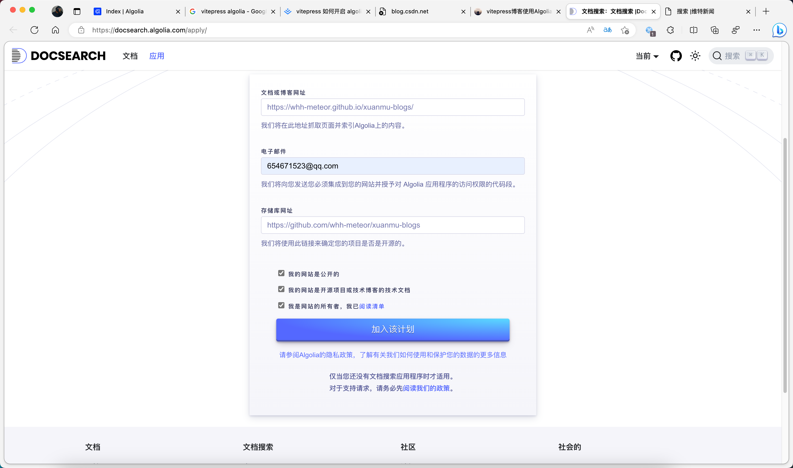
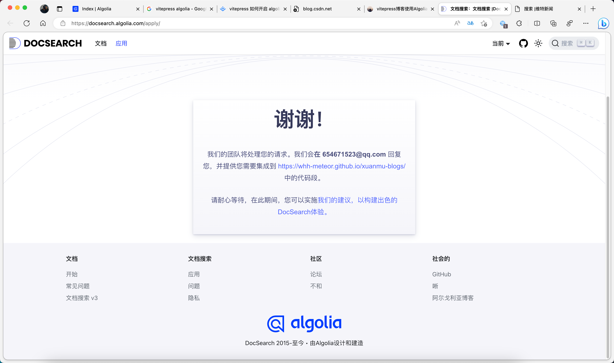
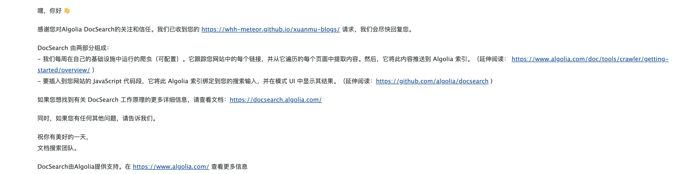

# algolia 搜索
https://www.algolia.com/apps/Z57D5U0Y2O/dashboard


## 申请



## 账号与创建应用

登录之后会进入控制台页面，点击右上角头像，会有一个设置选项，之后来到 Applications 这里，去创建一个应用


## 私钥放在 Github Secrets 中
将上述获取的 Admin API Key 添加到 Github Secrets 中，如下图所示，创建 API_KEY 和 APPLICATION_ID 两个字段，一会在 ci 中会使用到。

## 创建 crawlerConfig.json
在项目的根目录下创建 crawlerConfig.json 文件，内容如下，注意前两个字段需要进行替换。这是告诉 algolia 需要爬取的配置。
```json
{
  "index_name": "xuanmu-blogs", // 填写自己的索引名称
  "start_urls": ["https://whh-meteor.github.io/xuanmu-blogs/"], // 填写自己的网站地址
  "rateLimit": 8,
  "maxDepth": 10,
  "selectors": {
    "lvl0": {
      "selector": "",
      "defaultValue": "Documentation"
    },
    "lvl1": ".content h1",
    "lvl2": ".content h2",
    "lvl3": ".content h3",
    "lvl4": ".content h4",
    "lvl5": ".content h5",
    "content": ".content p, .content li"
  },
  "selectors_exclude": [
    "aside",
    ".page-footer",
    ".next-and-prev-link",
    ".table-of-contents"
  ],
  "js_render": true
}
```

## 编写 CI 脚本
在项目根目录.github/workflows 文件夹下，创建 algolia.yml 文件（名称可更改，自定义），粘贴如下内容：
```yaml
name: algolia
on:
  push:
    branches:
      - main
jobs:
  algolia:  
    runs-on: ubuntu-latest
    steps:
      - uses: actions/checkout@v2
      - name: Get the content of algolia.json as config
        id: algolia_config
        run: echo "config=$(cat crawlerConfig.json | jq -r tostring)" >> $GITHUB_OUTPUT
      - name: Push indices to Algolia
        uses: signcl/docsearch-scraper-action@master
        env:
          APPLICATION_ID: ${{ secrets.APPLICATION_ID }}
          API_KEY: ${{ secrets.API_KEY }}
          CONFIG: ${{ steps.algolia_config.outputs.config }}
```

解释一下：这里 yml 就是使用 Github Actions 在 Docker 中执行的 AlgoliaDocSearch scraper action，当我们推送到 main 分支时就会立即执行这个任务，当然如果你是 master 分支只需要修改 branches 那里的值即可。

## 在项目中接入
测试密钥 修改github密钥
1