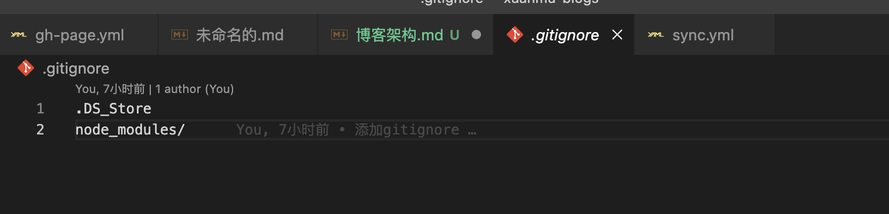
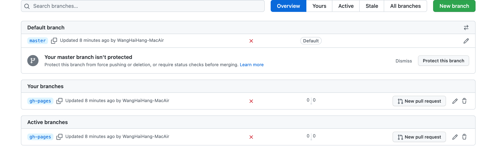
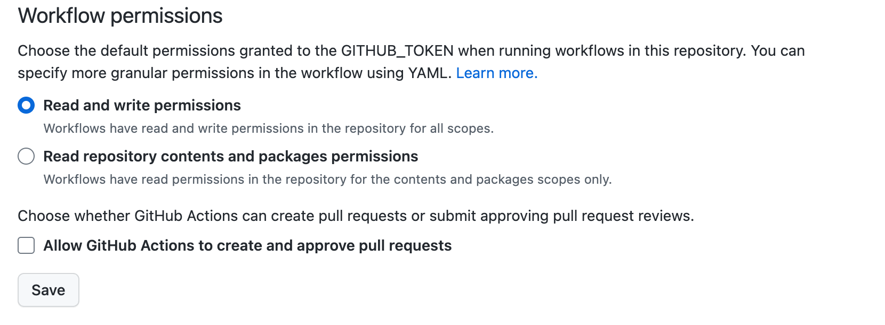

# 旋木博客 仓库架构

## 1.代码提交到Gitee
在ignore中忽略依赖和系统文件



开启镜像仓库-将Gitee代码同步到Github仓库


## 2.Github 自动化

事件监听，当page build 时，自动部署dist目录到gitee page中，避免手动部署。

sync.yml
```
name: Sync

on: page_build
# on:
#   branch_protection_rule:
#     types: [created,edited, deleted]

jobs:
  build:
    runs-on: ubuntu-latest
    steps:
      # - name: Sync to Gitee
      #   uses: wearerequired/git-mirror-action@master
      #   env:
      #     # 注意在 Settings->Secrets 配置 GITEE_RSA_PRIVATE_KEY
      #     SSH_PRIVATE_KEY: ${{ secrets.GITEE_RSA_PRIVATE_KEY }}
      #   with:
      #     # 注意替换为你的 GitHub 源仓库地址
      #     source-repo: git@github.com:whh-meteor/xuanmu-blogs.git
      #     # 注意替换为你的 Gitee 目标仓库地址
      #     destination-repo: git@gitee.com:martleth/xuanmu-blogs.git

      - name: Build Gitee Pages
        uses: yanglbme/gitee-pages-action@main
        with:
          # 注意替换为你的 Gitee 用户名
          gitee-username: martleth
          # 注意在 Settings->Secrets 配置 GITEE_PASSWORD
          gitee-password: ${{ secrets.GITEE_PASSWORD }}
          # 注意替换为你的 Gitee 仓库，仓库名严格区分大小写，请准确填写，否则会出错
          gitee-repo: martleth/xuanmu-blogs
          # 要部署的分支，默认是 master，若是其他分支，则需要指定（指定的分支必须存在）
          branch: master
          directory: docs/.vitepress/dist/
```


## Github pages自动部署

由于仓库存储整个项目文件，github page 只能访问到root 或者 docs目录

因此我们在gitee中新建分支gh-pages 并且镜像到github中



再由Github Action 进行页面部署

```
name: Deploy to GitHub Pages
on:
  push:	
    branches:	
      - master

jobs:
  deploy:
    name: Deploy to GitHub Pages
    runs-on: ubuntu-latest
    steps:
    - uses: actions/checkout@master

    - name: Deploy
      uses: s0/git-publish-subdir-action@develop
      env:
        REPO: self
        BRANCH: gh-pages
        FOLDER: docs/.vitepress/dist
        GITHUB_TOKEN: ${{ secrets.GITHUB_TOKEN }}
```

## 报错 403 分支部署 无权限

放开读写权限


成功访问