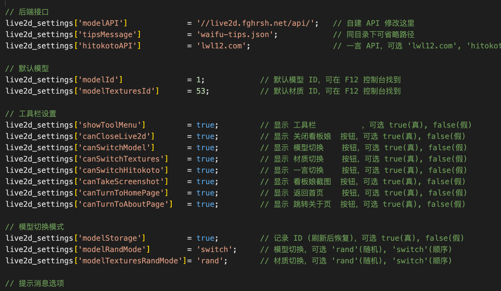
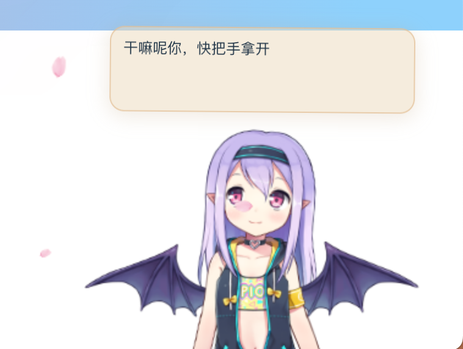
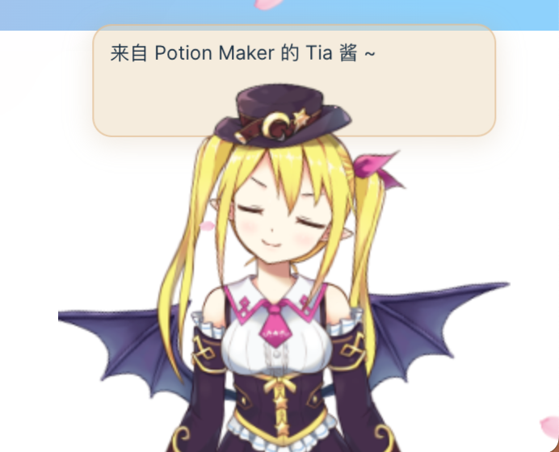
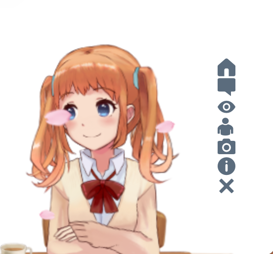
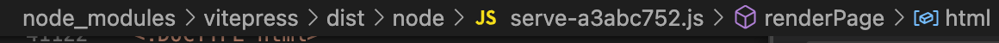

# 在博客中加入看板娘

## 在Github下载组件
 将组件加入项目
https://github.com/fghrsh/live2d_demo

## 在构建好的index.html中插入

```html
        <!-- 樱花特效 -->
<script  src="https://api.vvhan.com/api/yinghua"></script>
        <!-- 点击冒点 -->
<canvas width="1777" height="841" style="position: fixed; left: 0px; top: 0px; z-index: 2147483647; pointer-events: none;"></canvas>
<script src="https://cdn.jsdelivr.net/gh/SGYZ0910/CDN@1.0.7/js/maodian.js"></script>


    <script src="pio/jquery.min.js"></script>
    <script src="pio/jquery-ui.min.js"></script>
    <div class="waifu" >
    <!-- 工具栏 -->
    <div class="waifu-tool" style="z-index:999;">
      <span class="fui-home"></span>
      <span class="fui-chat"></span>
      <span class="fui-eye"></span>
      <span class="fui-user"></span>
      <span class="fui-photo"></span>
      <span class="fui-info-circle"></span>
      <span class="fui-cross"></span>
  </div>
      <!-- 提示框 -->
      <div class="waifu-tips"></div>
      
      <!-- 看板娘画布 -->
      <canvas id="live2d" class="live2d"></canvas>
      
      
      
  </div>
  
  <script src="pio/waifu-tips.js"></script>
  <script src="pio/live2d.js"></script>
  
  <!-- 初始化看板娘，加载 waifu-tips.json -->
  <script type="text/javascript">
    /* 可直接修改部分参数 */
      live2d_settings['modelId'] = 1;                  // 默认模型 ID
      live2d_settings['modelTexturesId'] = 1;          // 默认材质 ID
    /* 在 initModel 前添加 */
    initModel("pio/waifu-tips.json")
  </script>
  
  <!-- CSS 样式 -->
  <link rel="stylesheet" type="text/css" href="pio/waifu.css"/>
```


## 在waifu-tips.js 中可以修改看板娘参数










## 避免手动添加
在以下路径中找到 html渲染部分
加入代码



这样每次就不用手动渲染页面 
缺点是在node依赖中修改，在其他电脑拉取项目需要手动添加

肯定有更好的方式 但我不会