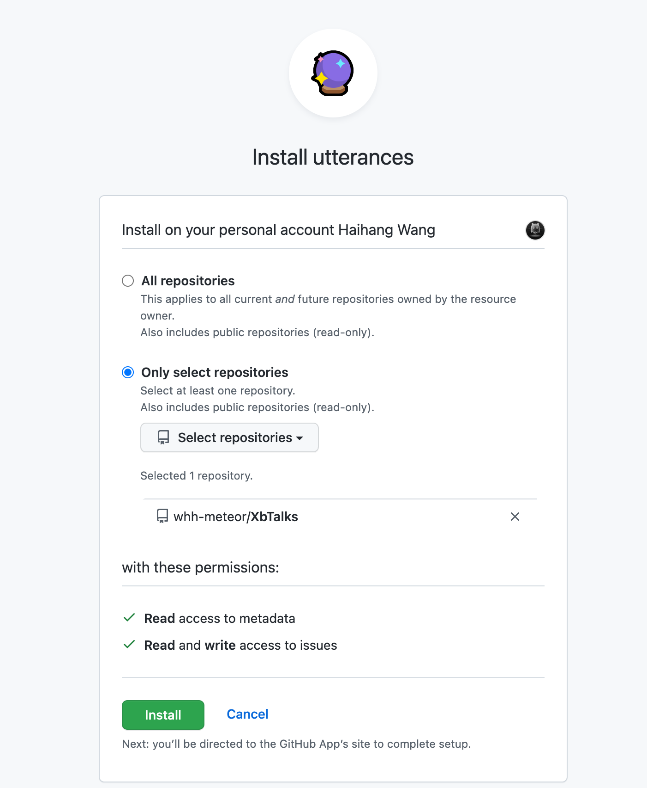

# utterances评论系统

新建仓库 XbTalks （Xuanmu blogs Talks）

安装utterances


 ## 修改index.js 
 ```javascript
 // .vitepress/theme/index.js
import DefaultTheme from 'vitepress/theme'
import FreeStyle from './components/FreeStyle.vue'
import MyLayout from './components/Layout.vue'
import './style/var.css'
export default {
  ...DefaultTheme,
  Layout: MyLayout, 
  enhanceApp({ app }) {
    // register global components
    app.component('FreeStyle', FreeStyle)
  }
}
```

## 添加Layout.vue作为主页
  - `<template #doc-footer-before></template>`定义插槽位置

- `<Layout> </Layout>` 会加入index.md 的内容

``` html
<!--.vitepress/theme/MyLayout.vue-->
<script setup>
import { useData } from 'vitepress'
import DefaultTheme from 'vitepress/theme'
import Comment from './Comment.vue';

const { frontmatter } = useData()
const { Layout } = DefaultTheme
</script>

<template>
 
 
 <Layout>  
   <!-- this is where markdown content will be rendered -->
  <template #doc-footer-before>
      <Comment v-if="!frontmatter.disableComment" ></Comment>
  </template>
</Layout>
  
 
</template>
```


## 评论组件 
```html
<!--.vitepress/theme/Comment.vue-->
<script setup>
import { onMounted } from 'vue';

onMounted(() => {
  const script = document.createElement('script');
  script.src = 'https://utteranc.es/client.js';
  script.async = true;
  script.crossOrigin = 'anonymous';
  script.setAttribute('repo', 'whh-meteor/XbTalks');
  script.setAttribute('issue-term', 'pathname');
  script.setAttribute('label', 'Comment');
  script.setAttribute('theme', 'github-light');
  document.querySelector('#comment').appendChild(script);
})

 
</script>
<template>
 
      <div id="comment"></div>
  
 
</template>

```


## 问题：
    - 评论需要刷新页面才能对应显示