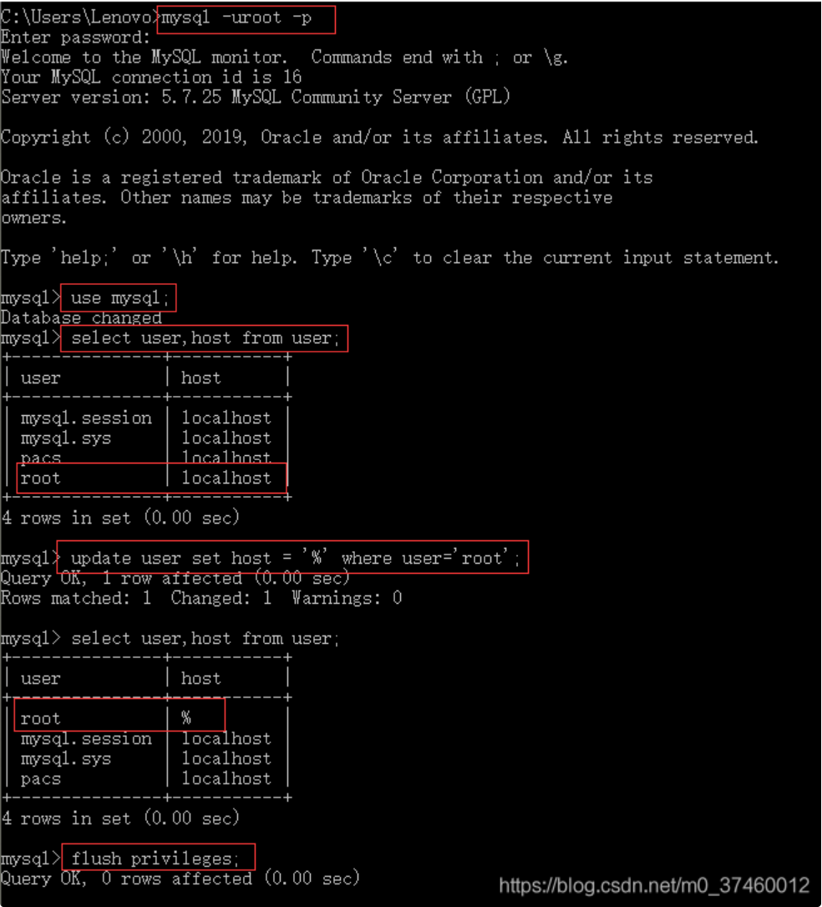
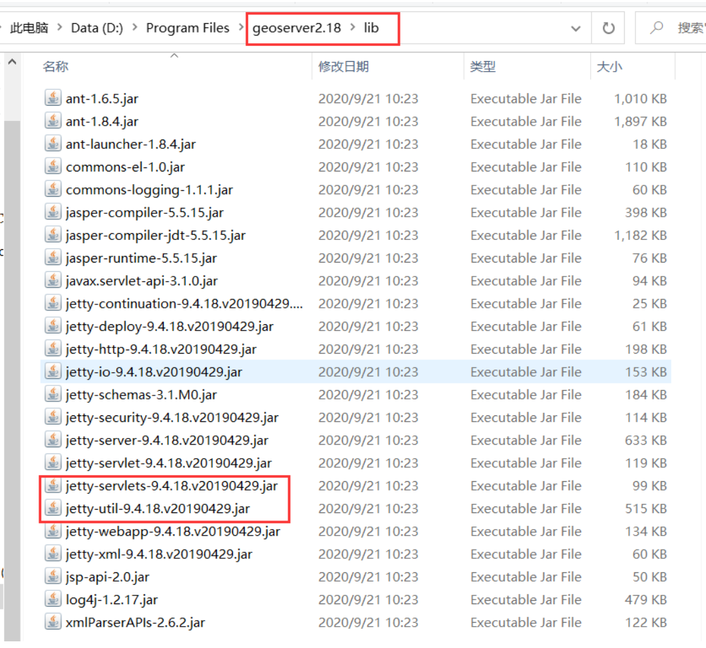
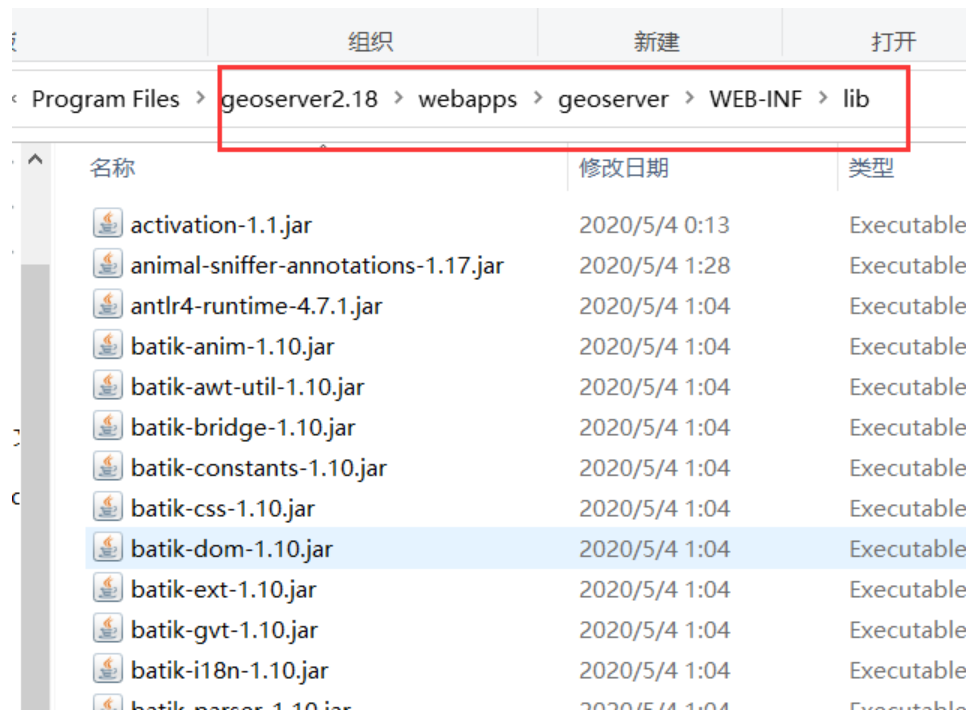
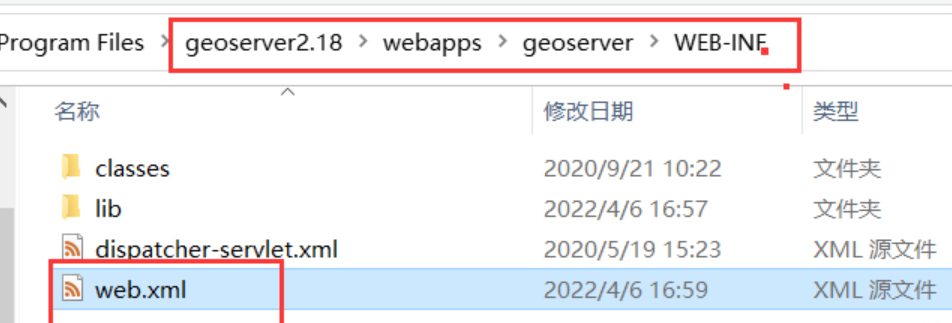
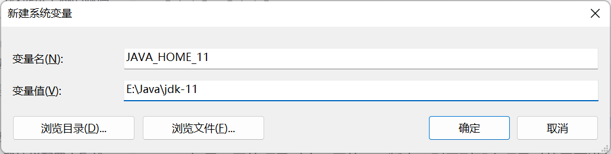
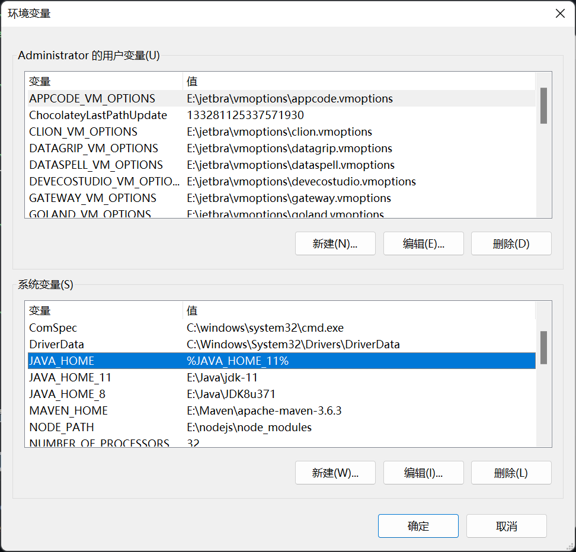
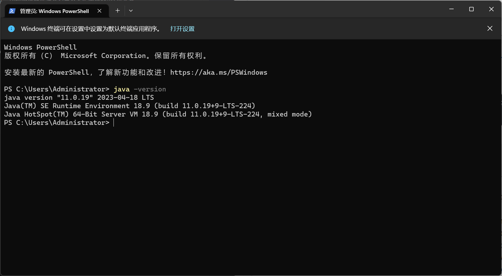
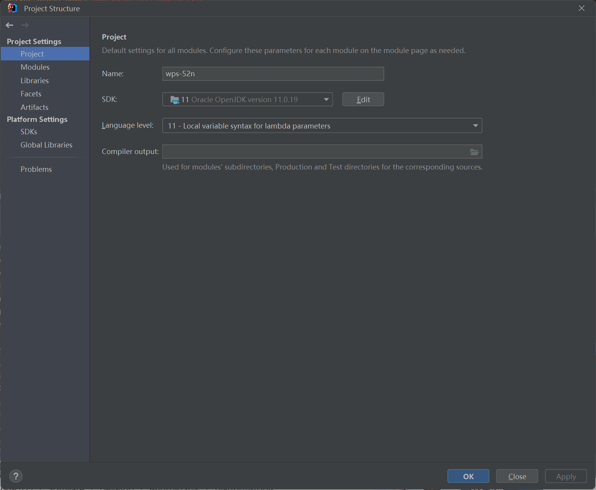
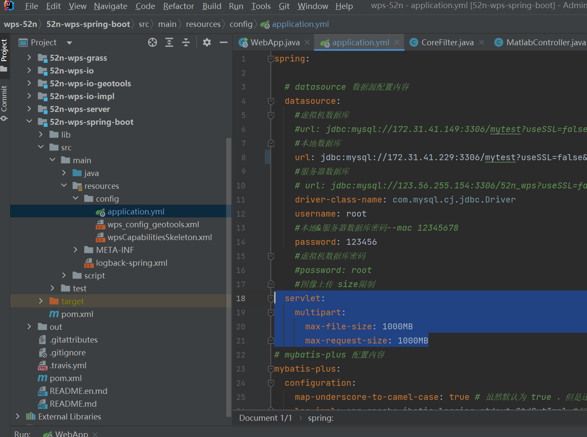
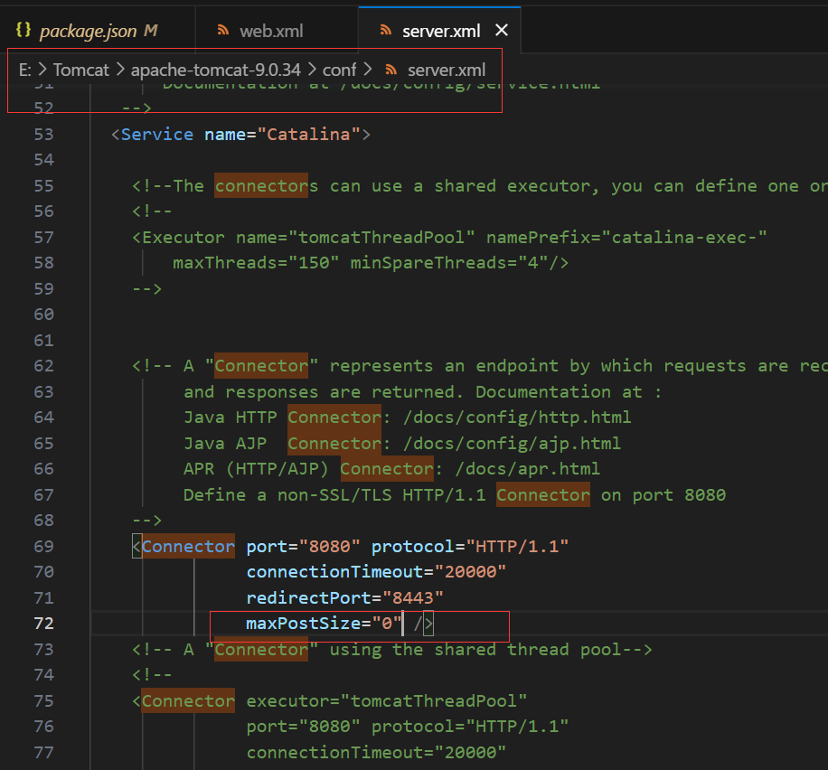

# ILCS 之部署问题

## Mysql无法连接

连接MySQL报异常。这个异常是数据库只允许localhost或127.0.0.1访问，不允许远程访问。我用的本机IP都不行。

解决办法：修改访问权限即可。

打开cmd，进入mysql



flush privileges是为了将权限更新操作刷新到内存中，而不用下次启动时生效。

## geoserver 报错跨域访问

在前端页面中通过OpenLayers或者Cesium等 API调用GeoServer地图服务器显示地图时，常会出现跨域问题，解决方案如下：
1. 进入geoserver安装目录，打开lib文件夹



2. 复制jetty-servlets-9.4.18.v20190429.jar、jetty-util-9.4.18.v20190429.jar两个包至geoserver2.18\webapps\geoserver\WEB-INF\lib文件夹中



3. 打开WEB-INF下的web.xml进行如下配置,将下面注释调的内容取消注释，大概在170行和225行。




```xml
<filter>
    <filter-name>cross-origin</filter-name>
    <filter-class>org.eclipse.jetty.servlets.CrossOriginFilter</filter-class>
    <init-param>
      <param-name>chainPreflight</param-name>
      <param-value>false</param-value>
    </init-param>
    <init-param>
      <param-name>allowedOrigins</param-name>
      <param-value>*</param-value>
    </init-param>
    <init-param>
      <param-name>allowedMethods</param-name>
      <param-value>GET,POST,PUT,DELETE,HEAD,OPTIONS</param-value>
    </init-param>
    <init-param>
      <param-name>allowedHeaders</param-name>
      <param-value>*</param-value>
    </init-param>
  </filter> 
<filter-mapping>
    <filter-name>cross-origin</filter-name>
    <url-pattern>/*</url-pattern>
</filter-mapping>

```

此时跨域问题仍存在，考虑出入站规则设置。


##  执行matlabjar包版本兼容问题
matlab/PCAMulbands/Matlab has been compiled by a more recent version of the Java Runtime (class file version 53.0), this version of the Java Runtime only recognizes class file versions up to 52.0

新的JDK的安装精简了很多，已经没有JRE安装了。
配置多个版本的JDK环境变量：

如果不同的项目对应不同的JDK版本，则用到那个项目时就需要进行对应的JDK环境变量切换，比较方便的做法是配置多个版本的JDK环境变量：





环境变量配置完成后打开新的命令窗口，使用命令【java -version】或【javac -version】检查配置是否正确：




修改编译器的jdk：



## 文件上传限制大小
文件上传org.apache.tomcat.util.http.fileupload.FileUploadException: Cannot write uploaded file to disk!

1. 修改SpringBoot配置：
  

  2. 修改Tomecat限制：
   添加maxPostSize="0" 不限制上传大小
   