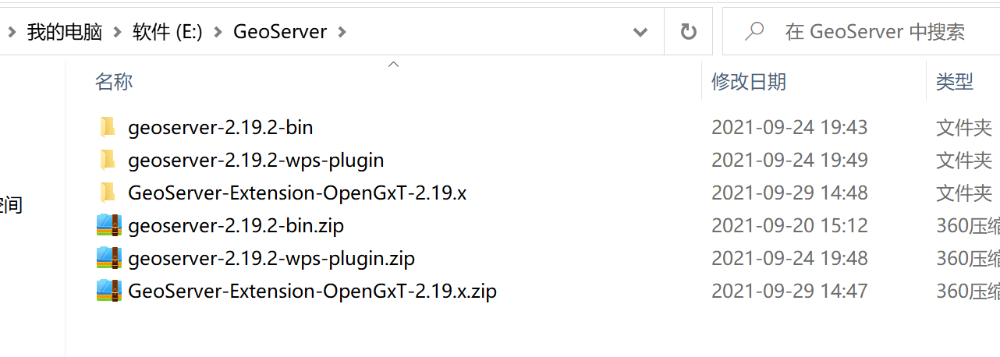

# ILCS技术栈及版本
 Winodws10 
## 前端
    Vue2.6.12

    Vue-Cli 5.0.4
## 后端
    Servlet -> SpringBoot 2.X
## UI
Ant Design 
    "ant-design-vue": "^1.7.2",
## 地图
    Openlayers 6
## 数据库 
    MySQL 5.7 
## 处理服务依赖环境

### MCR 

    Matlab2017a开发环境

### GRASS GIS
    7.0.6.1

## 服务器
### Tomcat
    Tomcat 9.0.34

### GeoServer 
Geoserver 2.19.2
    

### ArcGIS Server
    10.2.1