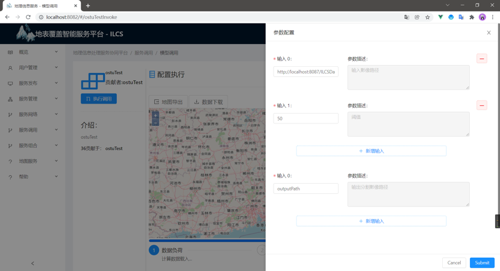

# 地表覆盖智能服务平台(ILCS)系统说明书
## 1.概述
地理信息领域发展的方向目前已由空间数据向数据分析处理进行转变，并且在云计算技术及WebGIS的不断发展的背景下，有效的克服了GIS领域的数据共享问题。本系统基于Web Service、OGC WPS等标准规范，为用户提供良好的交互界面，用于地理处理服务的共享与使用。
## 2.主要功能：
系统基于OGC Web处理服务（WPS）标准规范，面向多种层级的用户，基于SpringBoot+52°North技术和搭建服务器；基于MySQL技术搭建后端存储数据库；基于Vue搭建Web前端系统的基本架构；基于Open Layers和Ant Design For Vue搭建交互界面。实现WPS处理服务的发布，Matlab算法文件的上传、解析、编译，服务信息及用户信息的管理。系统管理员还可以进行服务信息的管理，用户权限管理，最终实现分层级多用户的WPS处理服务发布与管理。

###  2.1 系统基础功能
#### 2.1.1登录界面：

当用户名、密码均输入正确后，系统会进行验证码的验证操作，点击图片可更换验证码，不同的验证码由系统随机生成。在经过账户密码与验证码的双重验证后，用户可成功登录到系统中。

#### 2.1.2主界面：
系统主界面本着直观简明的原则设计。主界面包括左侧可伸缩的菜单栏和右侧工作台，左侧菜单分为一级菜单和二级菜单，可将隐藏，只显示菜单图标，当鼠标悬停时，展开悬浮的二级菜单栏。工作台中显示当前系统的服务数量，用户数量，访问次数及显示当天日期的日历组件。下方显示了服务调用动态与用户的模型贡献动态。系统顶部右侧显示登录用户姓名，下拉菜单内可查看“个人信息”、“修改密码”、“退出登录”等操作。同时在工作台与导航栏之间面包屑组件，用以查看当前页面的位置，通过点击面包屑可以实现页面之前的切换及快速定位。同时对许多请求或动作添加弹窗提示，如登陆成功，数据添加、删除等操作，如图所示。

系统用户登录成功后进入主界面，主界面分为不同的功能模块，主界面中对服务数量、用户信息、访问次数进行数据展示，显示算法调用排行和用户贡献服务排行如图：

#### 2.1.3用户管理界面

数据表是数据管理中必不可少的一部分，可以帮助系统管理者对系统进行有效的管理和操作。用户管理界面数据表的内容主要包括不同类别的用户数量统计，例如用户总数，管理员数量等。用户的基本信息展示（帐号、姓名、电话、右键、地址、加入时间、权限状态），新增用户及用户查询的功能实现。其中模糊查询由前端发送的输入数据经后端MyBatis处理，使用SQL语句的like关键字进行模糊查询，并返回查询结果,如图所示。

此外,系统登录中的所有固定用户名和账号目前暂时由本站系统管理员负责进行登录密码管理分配,以固定用户名和系统默认登录密码两种方式同时进行个人注册,用户在完成注册后即可根据实际需要随时随地修改用户账号和默认密码，如图所示。

点击详情，可查看各用户的详细信息与操作记录，如图。

### 2.2 基础服务功能

#### 2.2.1 服务发布

算法服务发布内容包括算法名称、方法名称、服务功能描述、关键字、作者、服务上传时间、算法文件、服务类型、服务权限、参数配置、输入描述、输出描述等相关信息。其中方法名称需要填入.m文件中的方法名称、服务功能描述包括对算法功能的简短描述，算法文件上传需要提交当前算法文件，上传到服务器中进行后台解析及打包处理。其他信息则插入对应数据库的表内。参数配置为自定义的算法配置，例如：调用一个空间分析算法，需要有输入参数与输出参数，以简单缓冲区为例，执行该算法文件需要输入要素，缓冲半径或缓冲距离等相关信息。发布自定义算法时就需要我们进行自定义的参数配置，同时在发布成功后如果需要使用参数调用的方式进行调用，可以利用自定义的配置动态生成前端界面的输入输出。

对于必要的输入参数，会进行验证。

上传算法文件，会进行上传验证，若上传失败，则返回错误提示。

#### 2.2.2 服务调用

WPS服务调用模块中，将调用功能划分为两个部分,分别是WPS标准的XML文件调用和参数调用。WPS标准的XML文件调用方式针对对于WPS服务有所了解的用户，可以通过编辑器的快速标记实现调用。参数调用针对不了解WPS服务的用户，通过一系列的配置后进行服务调用。

1. WPS标准的XML文件调用

    由于处理标准规定了执行处理与响应结果必须是WPS标准的XML格式，因此系统中加入了可以直接通过加载XML模板文件进行WPS操作的模块。在此模块中包含了固定格式模板与代码编辑器，既可以通过加载现有XML格式文件进行服务调用，也可以直接在代码编辑器中复制已处理好的文件进行调用，如图，直接调用缓冲区分析文件，可直接对参数进行修改，设置缓冲半径为0.05，输入参数类型为Double。
    
    系统在代码编辑器中引入了vkbeautify插件，该插件可自动对写入代码进行XML格式化操作，并对格式不正确的地方进行红色下划线标注。格式化操作完成后的文件由系统执行Axios的POST请求，将编辑器内容发送给后端处理程序，并由52°North项目执行WebProcessingService请求并返回处理结果，接收到处理结果后在系统中会进行处理结果显示，如图所示，处理程序返回了缓冲区分析的图形坐标信息。

2. 参数调用
   除文件调用外，在已有发布算法服务的基础上，可以通过参数调用的方式进行服务执行操作。进入该界面后，系统会搜索当前算法库内存在的算法，并动态生成算法目录，利用置顶搜索框可进行服务搜索，点击回车后会自动展开匹配结果，并且支持算法名称的模糊查询，点击后会在页面顶部生成调用按钮与服务描述，并在详情列表中可以看到发布的算法服务的详细信息（包括类型、目录、名称、关键字、发布者、时间、摘要、作者、输入描述、输出描述）。当点击“调用”按钮时，系统会根据当前点击的服务生成具体的服务调用界面。

   

   算法服务调用界面包括算法简介与配置执行，由调用界面中选中的算法内容动态生成，其中配置执行中包括计算流程、计算结果、地图展示三个部分，计算流程中对每一步的操作进行记录，进行流程的展示；计算结果显示WPS处理返回结果，通常为XML格式结果或图像地址；地图显示则是对执行调用结果进行可视化展示，支持地图的导出jpg格式。在界面中点击加载数据，参数配置界面会以“抽屉”的形式从右侧弹出，点击任意位置即可关闭。参数配置中包括输入参数与参数描述，对于所需的输入或输出及描述在发布服务时进行配置，调用服务时只需要按照规定的输入输出进行配置即可，
   

   通过参数调用的方式相比于XML文件调用，更加易懂、直观，但是配置过程较为复杂，同时对于服务结果的图形可视化方面的处理也非常复杂。参数调用在本质上还是对于XML文件调用的进一步升级，不同的是在XML文件上进行参数和结果的解析与获取，单单以WPS很难完成图形可视化，因此在参数调用结果展示上使用了Openlayers的相关技术，利用OSM地图作为地图，对结果进行可视化的展示。
#### 2.2.3 服务管理

服务管理模块与用户管理模块类似，通过数据表的结构进行数据展示，显示包括当前已有服务的基本信息与状态，可对已有服务进行查询、编辑、查看描述、删除等操作。

点击描述会将页面跳转到单个算法的描述页面，展示服务的XML文件描述，描述中包括算法的输入和输出描述、以及支持的数据格式。以便于管理员及用户掌握当前系统内的服务具体情况。
#### 2.2.4 数据自动发布服务

数据通过GeoServer可以进行Web端的处理、存储、显示，通过Tomcat和Geoserver作为容器，通过Java程序进行自动发布处理。用户可在系统界面进行数据的发布处理与显示。

### 2.3知识图谱部分

#### 2.3.1 服务知识图谱

#### 2.3.2 本体知识图谱

### 2.4 服务链部分
#### 2.4.1 服务组合（手动）

#### 2.4.2 服务组合（自动）

### 2.5 集成算法服务

#### 2.5.1 水体提取算法

该算法是经简化的OSTU算法，目的是用于水体提取，该案例选择的是上海地区周边landsat7影像，在进行参数配置时首先将原始影像发布到GeoServer地图服务，同时保存在Tomcat服务器中，然后交由后台算法进行处理，处理完成后同样将处理结果进行发布，用来显示在Openlayers中，通过卷帘工具可以对比查看处理前后内容。

#### 2.5.2 臭氧估算模型

通过臭氧估算模型MLR模型进行估算，将结果输出到指定目录中，格式为．mat。目前完成后台算法开发，还未进行界面化。

#### 2.5.3 DSCM地表覆盖动态监测模型
从用户需求的角度来看，变化检测有以下三个层次[18]。(1)LCC区域检测，即LCC发生在哪里？(2)单一类型LCC检测，即特定覆盖类型(如农田或草地)的LCC发生在哪里？变化面积是增加了还是减少了？(3)各种类型的LCC检测，即覆盖类型A(例如，农田)更改为覆盖类型B(例如，建筑物)？
为了满足上述需求，提出了一种面向服务的动态计算模型，采用了三种不同的策略，如图1所示。基于WMS-LCC的LCC数据访问是针对LCC数据存在即用的情况而设计的。对于不存在的土地覆盖数据，提出了基于空间关系的土地覆盖数据动态提取方法，可用于基于空间关系的土地覆盖数据生成。针对有土地覆盖数据或土地覆盖数据可供使用的情况，开发了按需LCC服务组合，但可以利用多时相遥感图像进行土地覆盖变化检测。

1. 基于WMS-LCC的LCC数据访问

2. 基于空间关系的土地覆盖数据生成
   
3. 按需LCC服务组合
   
### 2.6 平台算法集成
#### 2.6.1 GRASS GIS算法集成

按一定程序进行配置后，可调用GRASS集成的算法程序。

#### 2.6.2 ArcGIS 算法
使用ArcGIS发布GP服务到AGS，再通过API的方式调用GP服务。

#### 2.6.3 自定义发布的嵌入算法（Matlab、Python）

如图，.m文件由于不能直接执行，需要进行编译打包，.py脚本可以通过直接交由Python解释器处理。

#### 2.6.4 GEE服务集成（研究中）

Gee for Python，利用Jupyter组件可视化，封装为Web应用，再以组件的形式引入系统。

#### 2.6.5 Geoserver服务集成

同样基于OGC标准，在服务启动的情况下可以进行调用，但GeoServer本质上同样是利用GRASS进行处理。

#### 2.6.6 Docker引入外部App
基于Docker封装的算法可以无视平台、操作系统、接入系统，也可以封装不同的编程语言。如Python、R、Java等
- Pca+Kmeans 变化检测 （python）

- 基于R语言的滤波器

## 3系统开发

### 3.1 开发技术

1. 前端框架： @vue/cli 4.5.10 脚手架
2. 后端框架：SpringBoot2.x 、52°North 3.6、GRASS 7.0.6
3.  地图展示：OpenLayers：6.x -lastest
          GeoServer：2.19.2
4. 编译环境：Matlab：：R2017a
	      MatlabRuntime（MCR）：v92
5. 系统环境：Window10  Ubuntu 20.4
6. 数据库环境：MySQL 5.7   Docker-lastest
7. 服务器环境：Nginx ：1.18.0
8. JAVA环境：JDK/JRE:1.8.0_251
9. Python环境：Python2.7、Python3.6
10. 代码协同管理：Gitee

### 3.2 组织架构

#### 3.2.1 功能架构

#### 3.2.2服务架构

#### 3.2.3 数据库架构
系统数据库基于MySQL设计，针对于系统应用环境，设计以满足用户的各项应用需求，其中包括信息和数据的管理需求、操作需求。用户数据表中包括用户的个人信息、权限、帐号密码等信息。

- 表 1用户信息表

| 字段名    | 类型     | 长度 | 字段说明         |
| --------- | -------- | ---- | ---------------- |
| id        | int      | 11   | 主键             |
| account   | varchar  | 255  | 登录系统的帐号   |
| name      | varchar  | 255  | 系统用户真实姓名 |
| password  | varchar  | 255  | 系统用户密码     |
| email     | varchar  | 255  | 用户邮箱         |
| telephone | varchar  | 255  | 用户电话         |
| address   | varchar  | 255  | 用户的居住地址   |
| jointime  | datetime | 16   | 用户的创建时间   |
| tags      | varchar  | 255  | 用户身份权限     |

系统访问日志表中，系统中对于各功能页面的访问或操作，都会被记录在系统日志内。管理员可以查看用户的访问情况，便于进行访问统计。此外，用户可以查看个人的页面访问记录。

- 表 2 系统访问日志表

| 字段名     | 类型    | 长度 | 字段说明             |
| ---------- | ------- | ---- | -------------------- |
| id         | int     | 11   | 主键                 |
| accessname | varchar | 255  | 日志记录的访问用户名 |
| accessweb  | varchar | 255  | 访问的页面           |
| accessurl  | varchar | 255  | 访问的地址           |
| accesstime | varchar | 255  | 访问的时间           |

算法服务表中、包含了算法的基础信息、输入和输出的参数和描述、以及当前的运行状态、被发布的时间等细节信息。在用户提交算法模型至服务器后、算法模型的相关信息会被提交到数据库中，同时算法文件保存到云服务器本地上，并由后台处理程序打包为可执行的jar包。

- ​表 3 算法服务表

| 字段名         | 类型     | 长度 | 字段说明                          |
| -------------- | -------- | ---- | --------------------------------- |
| id             | int      | 11   | 主键                              |
| name           | varchar  | 255  | 算法名                            |
| methodsname    | varchar  | 255  | 方法名                            |
| type           | varchar  | 255  | 算法模型类别                      |
| owsIdentifier  | varchar  | 255  | WPS标准的Identifier用来提交算法库 |
| owsFunction    | varchar  | 255  | 算法作用                          |
| owsKeywords    | varchar  | 255  | 关键字                            |
| owsDescription | longtext | 255  | 算法描述                          |
| owsNotes       | longtext | 255  | 算法记录                          |
| owsAuthors     | varchar  | 255  | 开发作者                          |
| owsAbstract    | varchar  | 255  | 摘要地址                          |
| IP             | varchar  | 255  | 输入参数一                        |
| IPD            | varchar  | 255  | 输入参数一的描述                  |
| OP             | varchar  | 255  | 输出参数一                        |
| OPD            | varchar  | 255  | 输出参数的描述一                  |
| outputdescribe | varchar  | 255  | 算法模型输出参数                  |
| inputdescribe  | varchar  | 255  | 算法模型输入参数                  |
| publishman     | varchar  | 255  | 发布人                            |
| time           | varchar  | 255  | 发布时间                          |
| statute        | varchar  | 255  | 当前状态：Online/Offline          |
| filename       | varchar  | 255  | 算法文件名（.m文件）              |
| authority      | varchar  | 255  | 算法权限                          |