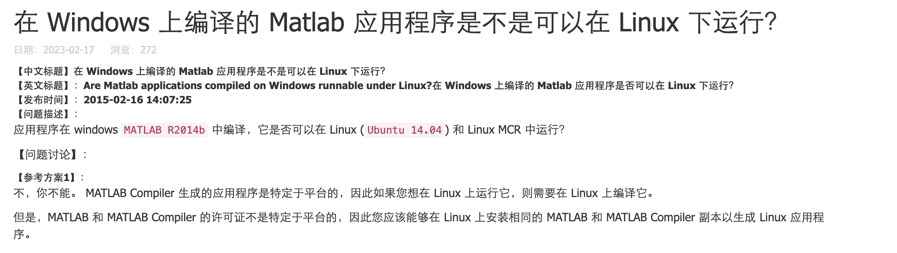
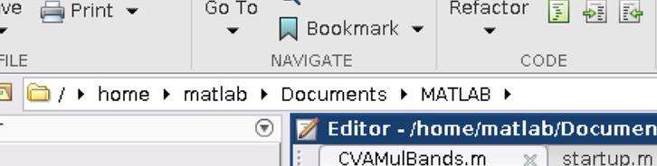
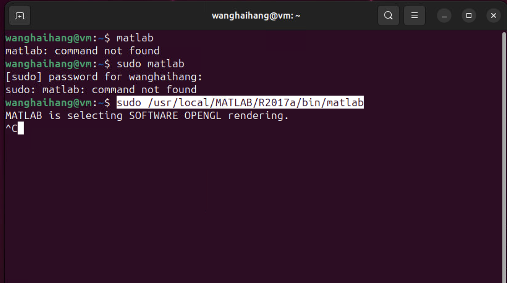

## 安装jdk


```sh
#进入usr文件目录
cd /usr
#创建Java文件夹
mkdir java

tar -zxvf jdk-11_linux-x64_bin.tar

```

配置环境

```sh
进入配置文件
vi /etc/profile
输入i进入编辑模式
export JAVA_HOME=/usr/java/jdk-11 
#后接JDK的路径
export PATH=$JAVA_HOME/bin:$PATH
 
按ESC 退出按钮，输入:wq 退出和保存文件
```


```sh
刷新配置文件
source /etc/profile
```


```sh
测试java版本
java -version
```

## 安装Marlab Component Runtime （MCR）


解压MCR文件
```sh
unzip MCR_R2017a_glnxa64_installer.zip
```

如果-bash: unzip: 未找到命令

```sh
sudo yum install unzip (CentOS)
sudo apt-get install unzip(Ubuntu)
```
静默安装
```sh
./install -mode silent -agreeToLicense yes
```

```
Preparing installation files ...
Installing ...
(八月 24, 2023 09:13:46) ##################################################################
(八月 24, 2023 09:13:46) #
(八月 24, 2023 09:13:46) # Today's Date: 
(八月 24, 2023 09:13:46) Thu Aug 24 09:13:46 CST 2023
(八月 24, 2023 09:13:46) 
(八月 24, 2023 09:13:46) System Info
(八月 24, 2023 09:13:46) OS: Linux 3.10.0-1160.88.1.el7.x86_64
(八月 24, 2023 09:13:46) Arch: amd64
(八月 24, 2023 09:13:46) Data Model: 64
(八月 24, 2023 09:13:46) Language: zh
(八月 24, 2023 09:13:46) Java Vendor: Oracle Corporation
(八月 24, 2023 09:13:46) Java Home: /tmp/mathworks_5013/sys/java/jre/glnxa64/jre
(八月 24, 2023 09:13:46) Java Version: 1.7.0_60
(八月 24, 2023 09:13:46) Java VM Name: Java HotSpot(TM) 64-Bit Server VM
(八月 24, 2023 09:13:46) Java Class Path: /tmp/mathworks_5013/java/config/installagent/pathlist.jar
(八月 24, 2023 09:13:46) User Name: root
(八月 24, 2023 09:13:46) Current Directory: /tmp/mathworks_5013
(八月 24, 2023 09:13:46) Input arguments: 
(八月 24, 2023 09:13:46) root /usr/mcr
(八月 24, 2023 09:13:46) libdir /tmp/mathworks_5013
(八月 24, 2023 09:13:46) mode silent
(八月 24, 2023 09:13:46) agreeToLicense yes
(八月 24, 2023 09:13:46) standalone true
(八月 24, 2023 09:13:46) connectionMode OFFLINE_ONLY
(八月 24, 2023 09:13:47) Starting local product/component search in download directory
(八月 24, 2023 09:13:48) Searching for archives...
(八月 24, 2023 09:13:48) Reading /usr/mcr/archives
(八月 24, 2023 09:13:48) 正在汇集产品列表...
(八月 24, 2023 09:13:48) 1467 files found in /usr/mcr/archives
(八月 24, 2023 09:13:48) Reading /usr/mcr
(八月 24, 2023 09:13:48) 9 files found in /usr/mcr
(八月 24, 2023 09:13:48) Archive search complete.  1476 total files found.
(八月 24, 2023 09:13:50) Completed local product/component search
(八月 24, 2023 09:13:50) Starting local product/component search in download directory
(八月 24, 2023 09:13:50) Searching for archives...
(八月 24, 2023 09:13:50) /usr/local/MATLAB/MATLAB_Runtime/v92/archives doesn't exist ... skipping.
(八月 24, 2023 09:13:50) Archive search complete.  0 total files found.
(八月 24, 2023 09:13:50) Completed local product/component search
(八月 24, 2023 09:13:50) Installing Product: MATLAB Runtime - Builder JA 9.2
(八月 24, 2023 09:13:52) Installing Product: MATLAB Runtime - Core 9.2
(八月 24, 2023 09:14:12) Installing Product: MATLAB Runtime - GPU 9.2
(八月 24, 2023 09:14:26) Installing Product: MATLAB Runtime - Hadoop And Spark 9.2
(八月 24, 2023 09:14:26) Installing Product: MATLAB Runtime - NET And XL 9.2
(八月 24, 2023 09:14:26) Installing Product: MATLAB Runtime - Numerics 9.2
(八月 24, 2023 09:14:38) Notes: 
在目标计算机上，将以下内容追加到环境变量 LD_LIBRARY_PATH 的末尾:

/usr/local/MATLAB/MATLAB_Runtime/v92/runtime/glnxa64:/usr/local/MATLAB/MATLAB_Runtime/v92/bin/glnxa64:/usr/local/MATLAB/MATLAB_Runtime/v92/sys/os/glnxa64:


(八月 24, 2023 09:14:38) Exiting with status 0
(八月 24, 2023 09:14:38) End - Successful.
Finished
```


可以在末尾处添加

```
export LD_LIBRARY_PATH=/usr/local/MATLAB/MATLAB_Runtime/v92/runtime/glnxa64:/usr/local/MATLAB/MATLAB_Runtime/v92/bin/glnxa64:/usr/local/MATLAB/MATLAB_Runtime/v92/sys/os/glnxa64:
```


刷新环境变量

```source /etc/profile```

## Docker拉取 Tomcat
拉取docker镜像

`docker pull tomcat:9.0.34`
 
 挂载数据卷


`docker run --name gdsp-wps -d -p 8088:8080 -v /opt/wanghaihang/warPackage:/usr/local/tomcat/webapps  docker.io/tomcat:9.0.43`


以root权限进入容器
`docker exec -it --user=root 6bc6 /bin/sh `


查看日志
`tail -f catalina.2023-08-24.log -n 1000`


## WPS服务执行Matlab配置

java builder 放入lib并挂载到docker中


`docker run --name gdsp-wps -d -p 8088:8080 -v /opt/wanghaihang/warPackage:/usr/local/tomcat/webapps  -v /opt/wanghaihang/lib:/usr/local/tomcat/lib docker.io/tomcat:9.0.43`

docker run --name wps -d -p 8087:8080 -v /opt/wanghaihang/warPackage:/usr/local/tomcat/webapps -v /opt/wanghaihang/lib:/usr/local/tomcat/lib  docker.io/tomcat:9.0.43


cp -r lib/* warPackage

cp -r webapps/javabuilder.jar  lib


disk full 

更换文件夹


docker run --name wps2 -d -p 8088:8080 -v /home/wanghaihang/warPackage:/usr/local/tomcat/webapps -v /home/wanghaihang/Arithmetic:/usr/local/arithmetic  docker.io/tomcat:9.0.43


## 问题
### 高版本 tomcat webapp访问目录无权限
 cp -r webapps.dist/* webapps
```
cp: cannot create directory 'webapps/ROOT': Permission denied
cp: cannot create directory 'webapps/docs': Permission denied
cp: cannot create directory 'webapps/examples': Permission denied
cp: cannot create directory 'webapps/host-manager': Permission denied
cp: cannot create directory 'webapps/manager': Permission denied
```

查看webapps提示没有权限。


原因：

centos7中安全模块selinux把权限禁掉了。

有三种方法解决：

1.在运行时加 --privileged=true

```sh
[xuhaixing@localhost tomcat]$ docker run -d -p 9091:8080 -v /home/XXXX/docker/tomcat/webapps/:/usr/local/tomcat/webapps/ --privileged=true --name managertomcat XXXX/mytomcat
c512137b74f3366da73ff80fc1fd232cc76c95b52a4bab01f1f5d89d28185b28
[xuhaixing@localhost tomcat]$ ls
```
 

2.临时关闭selinux然后再打开
    
 

```sh
[root@localhost tomcat]# setenforce 0
[root@localhost tomcat]# setenforce 1
```
 

3.添加linux规则，把要挂载的目录添加到selinux白名单

更改安全性文本的格式如下
`chcon [-R] [-t type] [-u user] [-r role] 文件或者目录`

选顷不参数： 
-R  ：该目录下的所有目录也同时修改； 
-t  ：后面接安全性本文的类型字段，例如 httpd_sys_content_t ； 
-u  ：后面接身份识别，例如 system_u； 
-r  ：后面街觇色，例如 system_r
执行：

`chcon -Rt svirt_sandbox_file_t /home/XXXX/docker/tomcat/webapps/`


chcon -Rt svirt_sandbox_file_t /home/wanghaihang/warPackage/ILCSData/


## 安装本地tomcat


 ./ startup.sh

netstat -nltp | grep 8080

启动后无法访问 如果在Linux上开启了防火墙，可能会阻止Tomcat的访问。可以通过以下命令关闭防火墙：

systemctl stop firewalld

关闭防火墙后，Tomcat能够正常访问，则需要针对Tomcat开启端口：

```sh
[root@localhost bin]# systemctl stop firewalld
[root@localhost bin]# firewall-cmd --add-port=8080/tcp --permanent
FirewallD is not running
[root@localhost bin]# systemctl start firewalld
[root@localhost bin]# firewall-cmd --add-port=8080/tcp --permanent
success
 
```


## Linux重新打包jar包
需要到Linux环境下编译成jar包，通用。Java是一次编写。不代表所有的class都能用。不同环境的机器需要重新编译。

mcc -W 'java:matlab.CVAMulBands,Matlab' -a '/home/wanghaihang/matlab/*' -d '/home/wanghaihang/matlab/mcc' CVAMulBands.m


## 虚拟机安装Linux CentOS7 

### 安装Matlab

目前 M1 芯片下 arm64 虚拟机无法安装matlabr2017a r2017b




## centos安装Docker

CentOS系统中安装Docker可以按照以下步骤进行：

更新系统和安装所需依赖：

sudo yum update
sudo yum install -y yum-utils device-mapper-persistent-data lvm2

配置Docker的稳定仓库：

sudo yum-config-manager --add-repo https://download.docker.com/linux/centos/docker-ce.repo

安装Docker：

sudo yum install -y docker-ce

启动Docker服务并设置为开机自启：

sudo systemctl start docker
sudo systemctl enable docker

验证Docker安装是否成功：

docker version

如果以上步骤没问题并显示了Docker的版本信息，那么说明Docker已成功安装在CentOS系统中。

如果您想使用Docker的话，可能还需要执行以下额外步骤：

将当前用户加入docker用户组，以便于使用docker命令时无需使用sudo：

sudo usermod -aG docker $USER

退出当前终端会话并重新登录，使用户组的更改生效。

验证docker命令是否可以使用无需sudo：

docker run hello-world


docker save -o ./matlab2022.tar mathworks/matlab:r2022b


docker run --init -it --rm -p 5901:5901 -p 6080:6080 --shm-size=512M mathworks/matlab:r2022b -vnc


docker commit --change 'ENTRYPOINT ["/bin/run.sh"]' 71e4e80b1677 matlabwithtoolboxes:r2022b

挂载目录



 docker run --init -it  -p 5902:5901 -p 6082:6080 -v D:\王海航-资料-勿动\4-ILCS开发资料\ILCS依赖环境\ILCS4MatlabService:/home/matlab/Documents/MATLAB --shm-size=512M matlabwithtoolboxes:r2022b -vnc


 mcc -W 'java:matlab.CVAMulBands,Matlab' -a '/home/wanghaihang/Matlab/*' -d '/home/wanghaihang/Matlab/mcc' CVAMulBands.m


 ### 安装jdk

 
 sudo teamviewer --daenon start


https://www.xjx100.cn/news/402563.html?action=onClick


## docker

MacM1 安装Docker 提示Command not found
用vim打开该文件
~/.zprofile
然后在文本最后插入下面这一行
export PATH="$PATH:/Applications/Docker.app/Contents/Resources/bin/"
然后写入并退出vim，执行下面这行来应用该环境变量
source ~/.zprofile
最后，执行docker --version，查看结果


sudo docker build --platform linux/amd64 -t mcr2017_jdk8:v1 .


### dockerfile
```docker
FROM adoptopenjdk/openjdk8:jre8u282-b08


# ADD matlab.txt /mcr-install/matlab.txt
# COPY MCR_R2017a_glnxa64_installer.zip /mcr-install/MCR_R2017a_glnxa64_installer.zip

# RUN apt-get update && \
# 	apt-get install -y curl wget unzip xorg && \
# 	cd /mcr-install  && \
# 	unzip MCR_R2017a_glnxa64_installer.zip && \
# 	mkdir /opt/mcr && \
# 	./install -inputFile matlab.txt && \
# 	cd / && \
# 	rm -rf mcr-install
RUN apt-get update && \
	apt-get install -y curl wget unzip xorg 
 
RUN mkdir /usr/local/MATLAB

RUN mkdir /usr/local/MATLAB/MATLAB_Runtime
WORKDIR /usr/local/MATLAB
COPY MCR_R2017a_glnxa64_installer.zip /usr/local/MATLAB

RUN cd /usr/local/MATLAB
RUN  unzip MCR_R2017a_glnxa64_installer.zip 
RUN ./install -mode silent -agreeToLicense yes
RUN rm -rf /usr/local/MATLAB
ENV LD_LIBRARY_PATH /usr/local/MATLAB/MATLAB_Runtime/v92/runtime/glnxa64:/usr/local/MATLAB/MATLAB_Runtime/v92/bin/glnxa64:/usr/local/MATLAB/MATLAB_Runtime/v92/sys/os/glnxa64:/usr/local/MATLAB/MATLAB_Runtime/v92/extern/bin/glnxa64
ENV XAPPLRESDIR /usr/local/MATLAB/MATLAB_Runtime/v92/X11/app-defaults


ADD ./apache-tomcat-9.0.34.tar.gz /usr/local
ADD ./javabuilder.jar /usr/local/apache-tomcat-9.0.34/lib
ADD ./wps.war /usr/local/apache-tomcat-9.0.34/webapps
RUN mkdir /usr/local/apache-tomcat-9.0.34/webapps/ILCSData
RUN mkdir /opt/lib

ADD ./CVAMulBands.jar /opt/lib

WORKDIR /usr/local
ENV TOMCAT_HOME=/usr/local/apache-tomcat-9.0.34
ENV PATH=$PATH:$TOMCAT_HOME/bin
EXPOSE 8080
CMD startup.sh && tail -F /usr/local/apache-tomcat-9.0.34/logs/catalina.out
 
```

###  matlab在arm64下无法执行

```docker

FROM adoptopenjdk/openjdk8:jre8u282-b08


 
RUN apt-get update && \
	apt-get install -y curl wget unzip xorg && \
    mkdir /usr/local/MATLAB && \
	mkdir /usr/local/MATLAB/MATLAB_Runtime 
	
WORKDIR /usr/local/MATLAB
COPY MCR_R2017a_glnxa64_installer.zip /usr/local/MATLAB

RUN cd /usr/local/MATLAB && \
	unzip MCR_R2017a_glnxa64_installer.zip  && \
	./install -mode silent -agreeToLicense yes && \
	rm   MCR_R2017a_glnxa64_installer.zip

ENV LD_LIBRARY_PATH /usr/local/MATLAB/MATLAB_Runtime/v92/runtime/glnxa64:/usr/local/MATLAB/MATLAB_Runtime/v92/bin/glnxa64:/usr/local/MATLAB/MATLAB_Runtime/v92/sys/os/glnxa64:/usr/local/MATLAB/MATLAB_Runtime/v92/extern/bin/glnxa64
ENV XAPPLRESDIR /usr/local/MATLAB/MATLAB_Runtime/v92/X11/app-defaults


ADD ./apache-tomcat-9.0.34.tar.gz /usr/local
ADD ./javabuilder.jar /usr/local/apache-tomcat-9.0.34/lib
ADD ./wps.war /usr/local/apache-tomcat-9.0.34/webapps

WORKDIR /usr/local
ENV TOMCAT_HOME=/usr/local/apache-tomcat-9.0.34
ENV PATH=$PATH:$TOMCAT_HOME/bin
RUN mkdir /usr/local/apache-tomcat-9.0.34/webapps/ILCSData  && \
	mkdir /opt/lib
ADD ./CVAMulBands.jar /opt/lib

EXPOSE 8080
CMD startup.sh && tail -F /usr/local/apache-tomcat-9.0.34/logs/catalina.out
 

```


## 容器不足清理废弃镜像

```sh

[root@localhost /]# docker system prune
WARNING! This will remove:
        - all stopped containers
        - all volumes not used by at least one container
        - all networks not used by at least one container
        - all dangling images
Are you sure you want to continue? [y/N] y
Deleted Volumes:
2f77f41a78d4562b3b952ede5e1f914f1f9748815417117e1dbe267311c84625
4e0ebfbe34964053c5f3474a32bb6546e3f94d9e38730b6994e6d0e8f3355971
0ee40870d0bd9c63801d3e0607341c7aebc595cd6c2743284b5b5e68a5a20736
4757ea45f325ed2523324f931a6015657c3e9a7b0eabb00eb22b4b39d2a87c62
f029ea4bf2c25d7962415733f9c80c31a1a6fc113f1a3a64da9683183fb23b28
f55927dc01d653612c77d15ae8ab0f0e377d74d36b912c74d16a4afc333ced10
portainer_db
25ec614bcd741e79c712d4786dab5c0b24f028aa31c2f835a24bdcd018971078
45a5acd1ea45503901d6fd778a012c7f5e5e0639bf29a52972358ca4eb0b365b
e473236b5d2bc10afc89115fa308687f5c323b73e0bda674221a7a26c6270576
f9a8be8a27154e2e481d873b334f5f4822595a5773c72978c4867d4a6800d559
fd5f0fd72d0a947eba9041ac9fe74b1e944f06cbb1333b51b825b99582687c53
0b888f102e65ef15a95aab410532782c25257a2f12f08b69dd418196d1fada11
43107a8f99dbd0452992eb82f9fc593f1e2382a155b57a11033cbef35ee6323c
758e9e1570116858f1262c8f4d61725f44a693be2a7e93580e9dc47781d5d304
e9b67a5f95aa857ec4acc2031593930b5eb982f18ecc9230206ccb6f3190f435
1ae7107d792dc0486c927fd66ec7755b2a141e6f9b8a812d89237b854895687e
b08a9401cc8d0847e553792a3301256f591f98f64ad93e70b61962b081f55c43
073a77c06cd7cb61c70861ca5a95e81f265b87f9ebb061168f0980e57d0ffb47
e74c929cfb07e440fa319dfd93ff722e6c4bec33d43d1e1387979af493224a1b
4765c2d52ee0162518c6757bece9c26b797041460d32e1228e9824309b848417
4cc3f10b07ab4f6c1cf531323924972e1ad51a5162a32f556c9aeeed9f4d3046
8dd8e9c898fc9d040c45e9b75a61ba1a20215c451cc5f126bd3b96189982ae25
cca1414a12c7ad1f86c175d02c65ba30af6730905a1e0e0e3ccba1f8e7a22470
2d1040eadebf504b43b9eb1c9dc3d513e27270d36bcae303dd40415682281c18
8c5cb2365eb01542cb3d761c2dd2c853cb60d4c3e8f34b228e8aecc5b7917e1d
26070861235fa8295c9913affd78072606fd3bcebd461b14f70516ce64291766
4813db41e2eb4b4aad197e7ba9fbd648bbab4d91ff8ccc7a9d5adfccee66a978
bc0eb896d8e334565f39a814fc07ca47d9a1e503342e85477a7afeaae80f811a
81ef2af4e177d55973dc95d21ecf901e175d39718016d6462a6e1ab408f32639
dd733ed9e98c2c4add0abb873875c53a2273c7a99d50613402bc0a55f021bd2b
37a8d36fa4d46f12c98f5751c415b25afaced9980badea5e3bebe4972a465577
f647d7e07ed9777146afefa66f0d4b788464bcc92deb2c4cd11d0e6fec8b090b
db3e34455fb2bc103db95b0e95203f4ae138a61705259c6ceddc878fdaa91132
4c8bd97edd46ff4be1a6670b93a5b943cb191e8920561d6bce2a8d8843e70f0d
5ad355d434e2d67efae9af62d8d6a70c27afa54990e8d768516db150ae0bf74e
ab8bcdeb47832b74b21308918e21501f45f8d47ad93fd5478660f3a490cda763
cfdd8be8aea8145a628b8361b7d0b35d393039bc71b303693b6b947c8eaa7f03
eb075afa9db89d5e295d8e8580973b70070fd56385d1177431435ecf4c6c0832
336cd97a951d11454f751177a4f7ce765bfb289373250f67de6e014d1e2d4471
47334748d3f9783b19e9ffb8369729356a8a7433bb0ff13d9a3421ff4a69cc38
4ab96fe814b608441af726ee878a9963785e6e7b0977ea172e9d37b5139f7e04
opt_db-data
8736810a0a9dc33d54fbbb0fccb2df22c61b15dbe901290138011fb38b70c54b
886ea9a437e1cdd24dbc24834da6241c0d3053090c7e33dd99ef22e947166da4
88fa6f6b5ea3fe4e33d02a2b3e6a0514a87f98a9f0515e4d47b70fc733aba014
a419378381890c40c55931d93405da071599d8ed90d2396730d5a4fc2a331746
a5ad4f8b1abe866ea5dc8abedb321607773daa376f2cae69e4cd7da7ecc2dc54
b479fbe1bf60c442b05bc06b3194b679b88860845d26675e678c6287dc788350
d4298bc19bfa0a35d6ea433b339f536900d03bfab421452f3d76883116bbe246
fe1e397e85044a31d3426acb28c0e32f8bf1da16cece7f06c620fdc0411b5a06
23c47dd545413a6edff4e0944436f373dc208861584e9b4e120d26e33a4a8d14
875efb17ea787569e3becba22355f949810c24f7838bbe5e5b69bb9d24f81b14

Deleted Networks:
root_default
opt_default

Total reclaimed space: 3.778 GB
[root@localhost /]# 
```


## 问题：Dockfile中的CMD命令只对最后一条生效，因此使用sh脚本同时启动tomcat和jar
```sh
#!/bin/bash
java -jar /opt/jarpackage/serviceback.jar > wps-1ogs.log 2>&1 &
/usr/local/apache-tomcat-9.0.34/bin/startup.sh run &
tail -F /usr/local/apache-tomcat-9.0.34/logs/catalina.out &
tail -F /opt/jarpackage/wps-1ogs.log

```

然后再执行脚本 并且暴露端口号 ，要给sh脚本执行权限

```docker
COPY ./start.sh /opt/start.sh
RUN chmod +x /opt/start.sh

EXPOSE 8080
EXPOSE 8003

# CMD  startup.sh && tail -F /usr/local/apache-tomcat-9.0.34/logs/catalina.out 
CMD ["/opt/start.sh"]
 
```


## 导出容器包-在服务上导入并执行
docker save -o mcr_jdk_v20.tar mcr2017jdk8:v20

docker load -i mcr_jdk_v20.tar

 

docker run -d -p 8085:8080 -p 8086:8003 -v /home/wanghaihang/webapps:/usr/local/apache-tomcat-9.0.34/webapps -v /home/wanghaihang/jarpackage:/opt/jarpackage --restart=always


 docker run -d -p 8085:8080 -p 8086:8003 -v /home/wanghaihang/webapps:/usr/local/apache-tomcat-9.0.34/webapps -v /home/wanghaihang/jarpackage:/opt/jarpackage -v /home/wanghaihang/lib:/opt/lib --restart=always mcr2017_jdk8:v20

  docker run -d -p 8085:8080 -p 8086:8003 -v /home/wanghaihang/webapps:/usr/local/apache-tomcat-9.0.34/webapps -v /home/wanghaihang/jarpackage:/opt/jarpackage -v /home/wanghaihang/lib:/opt/lib -v /home/wanghaihang/lib:/opt/lib --restart=always mcr2017_jdk8:v20





去掉char()重新编译
k_('/home/wanghaihang/Matlab/clay_/clay_.tif','/home/wanghaihang/Matlab/clay_/sand_.tif','/home/wanghaihang/Matlab/clay_/silt_.tif','/home/wanghaihang/Matlab/clay_/soc_.tif','/home/wanghaihang/Matlab/clay_/res.tif')