:::tip
2022-10-11 王海航  Docker NDVI 模型封装 
:::

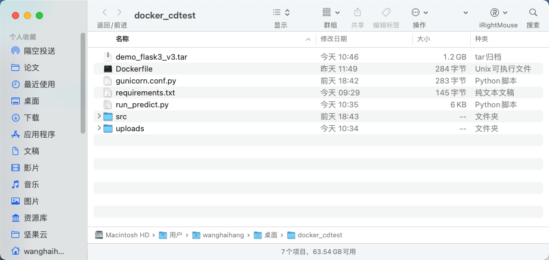

## 1 Dockerfile文件制作

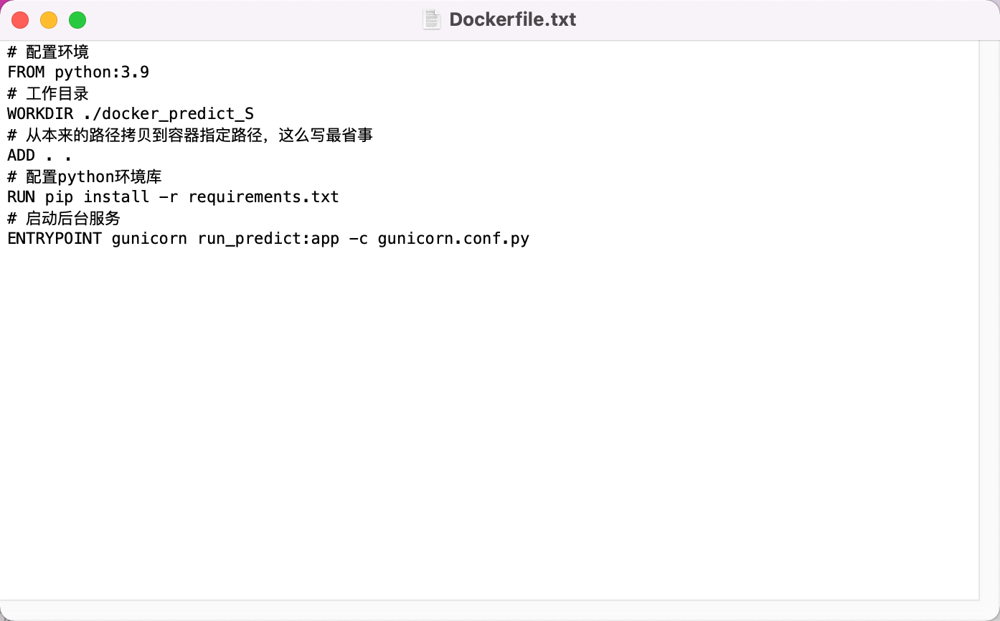

## 2 python需要封装的文件
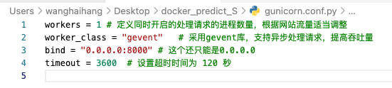
```python
@app.route('/test',methods=['POST'])
def en():
     b2 = request.files['b2']
     b4 = request.files['b4']
     tmp_fname2 = os.path.join('uploads', uuid4().__str__())
     tmp_fname4 = os.path.join('uploads', uuid4().__str__())
    
     b2.save(tmp_fname2)
     b4.save(tmp_fname4)
     size  = Image.open(tmp_fname2).size
     print(size)

     b2 = cv.imread(tmp_fname2)
     print(np.max(np.array(b2)))
     b4 = cv.imread(tmp_fname4)
     print(np.max(np.array(b4)))

  
     
        #影像运算（+，-，*，/）
     sub = (b2 - b4)*1.0
     sum = (b2 + b4)*1.0

 
     result = cv.divide(sub, sum)
    #结果影像为三波段，取第一波段
     result = result[:,:,0]
     result = (result <= 1) * 255.0 #阈值分割，括号内的result<=1为阈值分割
     data = base64.b64encode(result).decode()
     result = result.astype(np.uint8)
     result = Image.fromarray(result)
     #result.show()
     
    
     os.remove(tmp_fname2)
     os.remove(tmp_fname4)

     imgByteArr = io.BytesIO()
     result.save(imgByteArr,format='TIFF')
     imgByteArr = imgByteArr.getvalue()

     return imgByteArr

```

## 3 获取项目所需依赖

打开命令提示符，将路径切换到需要生成依赖的项目的根目录下，依次输入：
pip install pipreqs
pipreqs ./

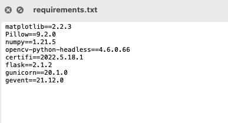

## 4 创建image镜像

`sudo docker build -t demo_flask:v1 .`

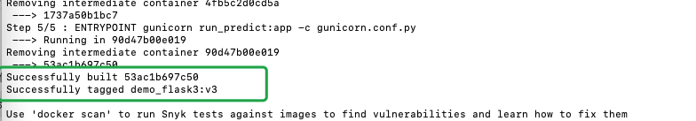

## 5 执行镜像

`sudo docker run -it --rm -p 8000:8000 demo_flask:v1`

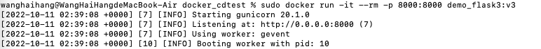


## 6 保存镜像文件
 `docker save -o demo_flask.tar demo_flask:v1`

 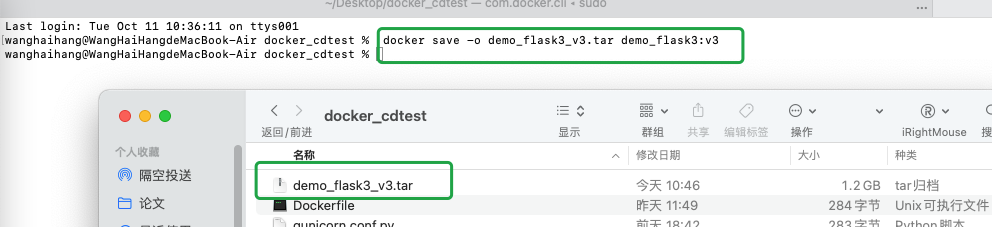


## 7 删除镜像

`docker rmi 镜像id`

## 8 重新导入镜像

`docker load -i demo_flask.tar`

## 9 请求算法 


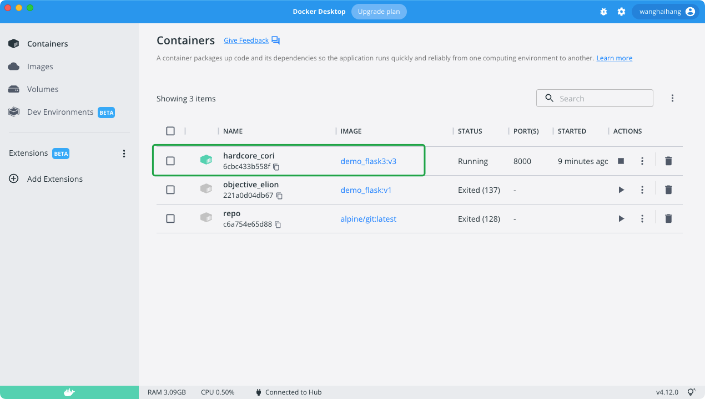

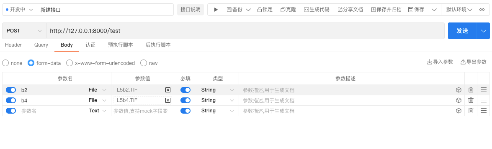

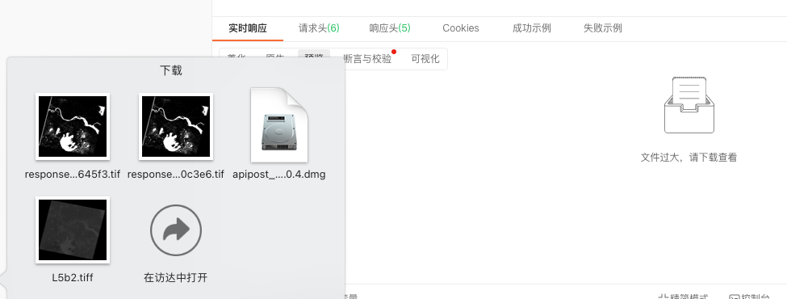

## 10 Windows部署

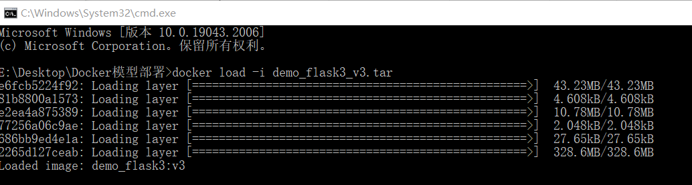

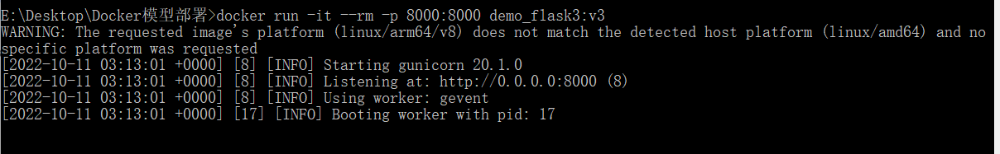

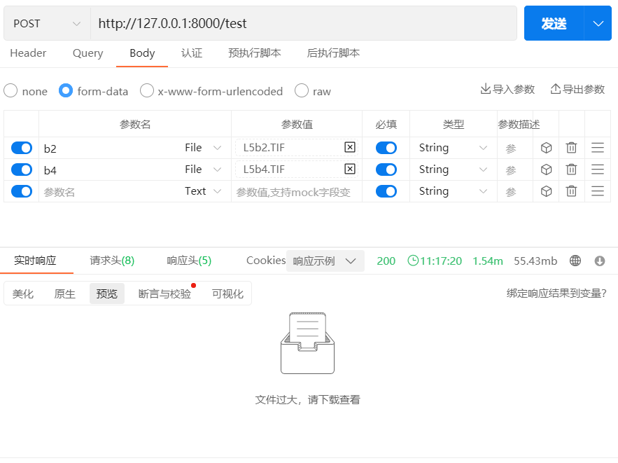

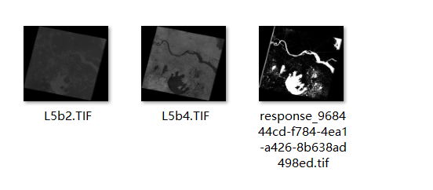


