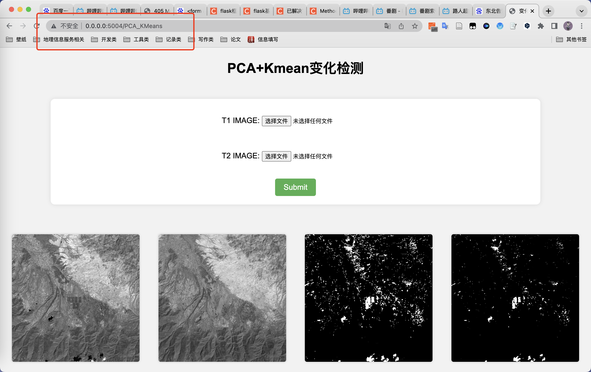
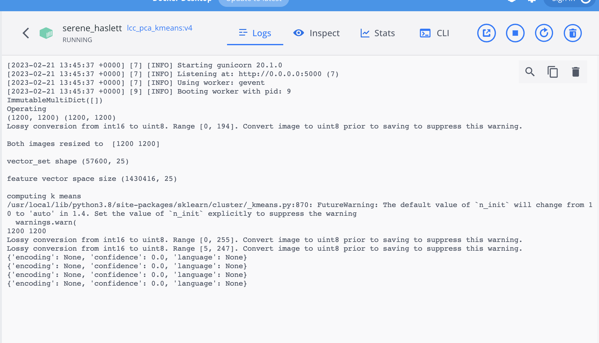
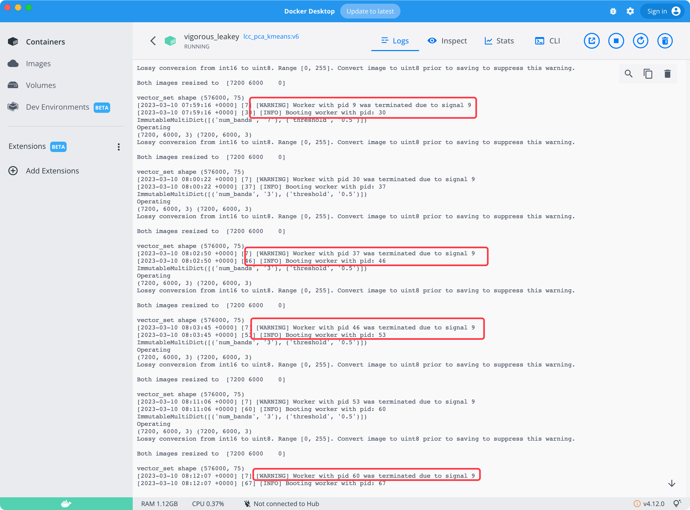

# 变化检测 PCA+KMeans算法封装

## 1.准备
### 1.1 Dockerfile
Dockerfile
```
# 配置环境
FROM python:3.8
# 工作目录
WORKDIR ./Docker_Python_PCA_KMeans
# 从本来的路径拷贝到容器指定路径，这么写最省事
ADD . .
# 配置python环境库
RUN pip install -r requirements.txt -i https://mirrors.aliyun.com/pypi/simple/
# 启动后台服务
ENTRYPOINT gunicorn run_predict:app -c gunicorn.conf.py

```
### 1.2 requirements.txt
```
chardet==5.1.0
Flask==2.2.2
imageio==2.25.1
matplotlib==3.5.3
numpy==1.21.5
opencv_python_headless==4.6.0.66
Pillow==9.4.0
scikit_learn==1.2.1
scipy==1.10.0
gunicorn==20.1.0
gevent==21.12.0
```
### 1.3 gunicorn.conf.py
```
workers = 1 # 定义同时开启的处理请求的进程数量，根据网站流量适当调整
worker_class = "gevent"   # 采用gevent库，支持异步处理请求，提高吞吐量
bind = "0.0.0.0:5000" # 这个还只能是0.0.0.0
timeout = 3600  # 设置超时时间为 120 秒

```
### 1.4 index.html
```
<!DOCTYPE html>
<html lang="en">
<head>
  <meta charset="UTF-8">
  <title>Flask Show Image</title>
</head>
<body>
  
</body>
</html>
```
### 1.5 post.html
```
 
<!DOCTYPE html>
<html>
<head>
  <title>变化检测</title>
  <!-- <style>
    h1 {
        color: blue;
        font-size: 24px;
        font-family: Arial, sans-serif;
        text-align: center;
      }
      
    /* 表单元素的样式 */
    form {
      width: 500px;
      margin: auto;
      padding: 20px;
      background-color: #fafafa;
      box-shadow: 0 0 10px rgba(0,0,0,0.2);
      border-radius: 10px;
    }
    /* 表单标签的样式 */
    label {
      display: block;
      margin-bottom: 8px;
      font-size: 16px;
      color: #333;
    }
    /* 表单输入框的样式 */
    input[type="text"], input[type="email"], input[type="password"] {
      display: block;
      width: 100%;
      padding: 8px;
      font-size: 16px;
      color: #333;
      background-color: #fff;
      border: 1px solid #ddd;
      border-radius: 5px;
    }
    /* 表单按钮的样式 */
    button {
      display: block;
      margin: auto;
      width: 120px;
      padding: 8px;
      font-size: 16px;
      color: #fff;
      background-color: #337ab7;
      border: none;
      border-radius: 5px;
      cursor: pointer;
    }

    img[src="https://www.example.com/placeholder.jpg"] {
  display: none;
}
  </style> -->


  <style> 
    body {
      font-family: Arial, sans-serif;
      background-color: #f2f2f2;
      margin: 0;
      padding: 0;
    }
    h1 {
      text-align: center;
      margin-top: 50px;
    }
    form {
      margin: 50px auto;
      width: 80%;
      display: flex;
      flex-direction: column;
      align-items: center;
      justify-content: center;
      background-color: white;
      padding: 20px;
      border-radius: 10px;
      box-shadow: 0 0 10px rgba(0, 0, 0, 0.1);
    }
    label {
      margin: 10px 0;
      font-size: 18px;
    }
    input[type="file"] {
      margin: 10px 0;
    }
    button[type="submit"] {
      margin-top: 20px;
      background-color: #4CAF50;
      color: white;
      border: none;
      padding: 10px 20px;
      border-radius: 5px;
      font-size: 18px;
      cursor: pointer;
    }
    button[type="submit"]:hover {
      background-color: #3e8e41;
    }
    img {
      margin: 20px;
      border-radius: 5px;
      box-shadow: 0 0 5px rgba(0, 0, 0, 0.2);
    }

  </style>

</head>
<body>
    <h1>PCA+Kmean变化检测</h1>
   
  <form action="http://127.0.0.1:5000/PCA_KMeans" method="post" enctype="multipart/form-data">
       
    
    <label>T1 IMAGE: <input type="file" name="img1" multiple></label>
    <br>
    <label>T2 IMAGE: <input type="file" name="img2" multiple></label>
    <button type="submit">Submit</button>
</form>
<div style="text-align: center">
    
    
    
    
  </div>
  
 
  <body>

</html>
```

## 2 打包模型
```
docker build -t lcc_pca_kmeans:v1 .
```
Successfully built 1233e044cd21
Successfully tagged lcc_pca_kmeans:v1


## 3以特定端口号运行容器
docker run -itd -p 5004:5000 lcc_pca_kmeans:v4 



## 4 其他 
Python已经取消scipy库中imread，imresize，imsave三个函数的使用,在文件中直接写入imresize函数源代码。

高效准确处理scipy.misc 中imresize、imread导入错误问题
https://blog.csdn.net/qq_43561314/article/details/126211227


## 5 内存处理
- 构建
`sudo docker build -t lcc_pca_kmeans:v6 .`
- 执行
 `docker run -itd -p 5006:5000 lcc_pca_kmeans:v6 `
 - 监控状态
`sudo docker stats a890458eaa9367b72c210aeae814e755077cea81f463966ac69c79f361213340`

- 资源拉满导致任务终止
  

- 限制内存到14并监控状态
  `docker run -itd -p 5006:5000 -m 14g lcc_pca_kmeans:v6 `


##   迁移与部署

  待更新