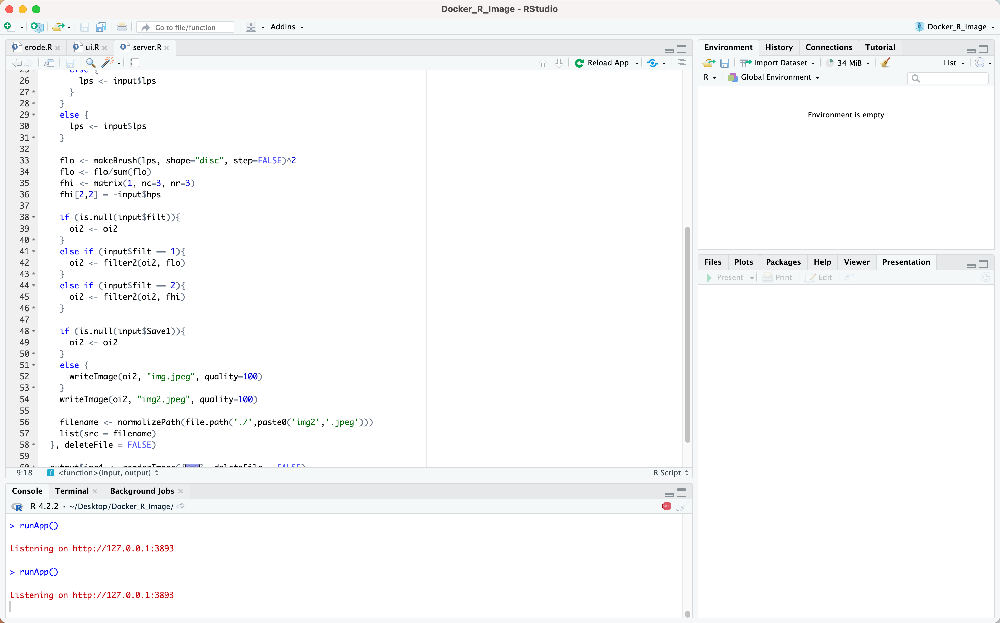
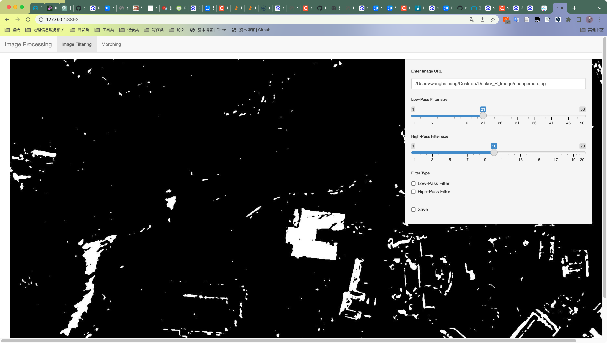
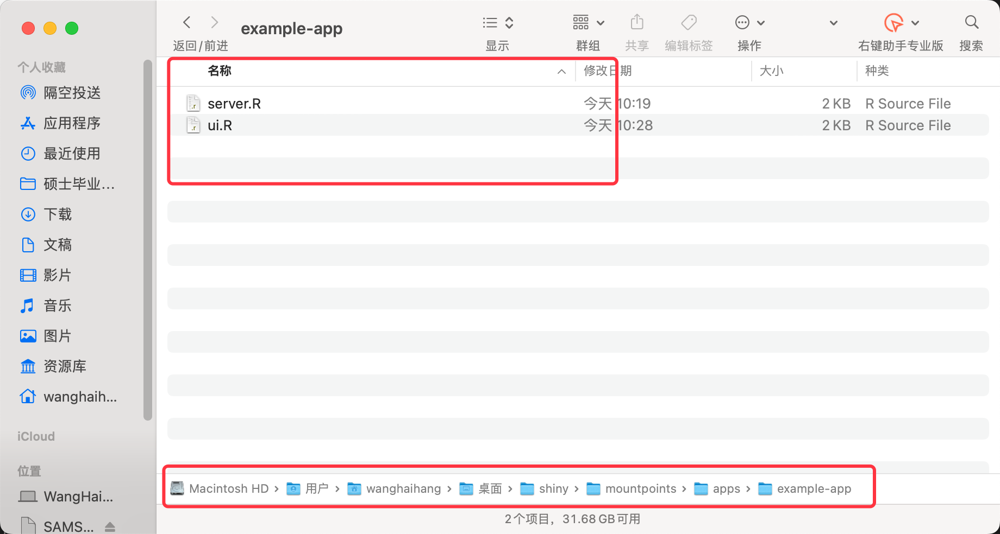
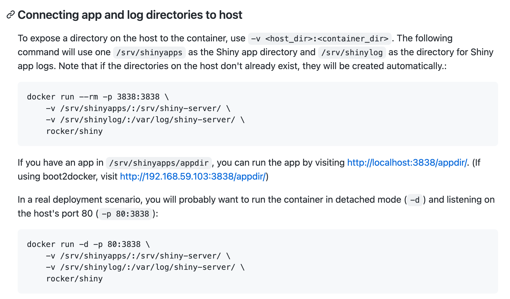
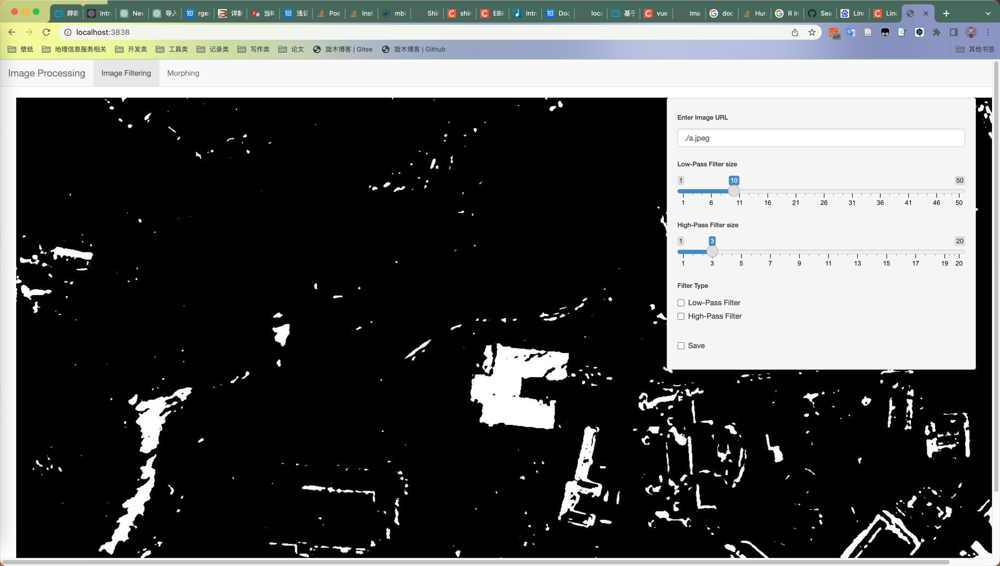

# R 图像处理

##  安装图像处理库
```R
install.packages("BiocManager")
BiocManager::install("EBImage")
```
## R语言函数

```R

library("EBImage")

erodes <- function(path, thr) {
  shapes <- readImage(path)
  kern = makeBrush(thr, shape='diamond')
  shapes_erode= erode(shapes, kern) # 腐蚀
  shapes_dilate = dilate(shapes, kern) # 膨胀
  #display(combine(shapes,shapes_erode, shapes_dilate), 
  display(combine(shapes,shapes_erode), 
          all=TRUE,method = 'browser',nx = 3)
}
```
调用函数
```R
erodes("changemap.jpg",9)
```


## R语言 交互

R语言的交互式个痛点，在Docker中封装后需要有框架解决交互问题

因此我们引入UI框架shiny


### 本地测试

在同一文件夹下面 放置ui.r和server.r

执行Run App



在浏览器中打开



可以通过UI对图像进行处理

## 部署测试

- shiny server
    封装好的交互组件需要进行部署，不然没有办法在docker中进行使用
    因此我们使用镜像 rocker/r-ver:3.6.3

https://github.com/rocker-org/shiny

-  克隆项目
    `git clone git@github.com:rocker-org/shiny.git`
把ui.r 和 server .r 在目录中替换


- 拉取镜像
把镜像拉取到本地仓库

`docker pull rocker/r-ver:3.6.3`


### dockerfile 构建镜像
```docker

FROM rocker/r-ver:3.6.3

RUN apt-get update && apt-get install -y \
    sudo \
    gdebi-core \
    pandoc \
    pandoc-citeproc \
    libcurl4-gnutls-dev \
    libcairo2-dev \
    libxt-dev \
    xtail \
    wget


# Download and install shiny server
RUN wget --no-verbose https://download3.rstudio.org/ubuntu-14.04/x86_64/VERSION -O "version.txt" && \
    VERSION=$(cat version.txt)  && \
    wget --no-verbose "https://download3.rstudio.org/ubuntu-14.04/x86_64/shiny-server-$VERSION-amd64.deb" -O ss-latest.deb && \
    gdebi -n ss-latest.deb && \
    rm -f version.txt ss-latest.deb && \
    . /etc/environment && \
    R -e "install.packages(c('shiny', 'rmarkdown'), repos='$MRAN')" && \
    cp -R /usr/local/lib/R/site-library/shiny/examples/* /srv/shiny-server/ && \
    chown shiny:shiny /var/lib/shiny-server
RUN R -e "install.packages('BiocManager')"
RUN R -e "BiocManager::install('EBImage')"
RUN R -e "install.packages('shiny')"
RUN R -e "install.packages('htmlwidgets')"
EXPOSE 3838

COPY shiny-server.sh /usr/bin/shiny-server.sh

CMD ["/usr/bin/shiny-server.sh"]

```
- 执行容器
sudo docker run -itd -p 3838:3838  rshiny/server:v1 


容器已经被成功创建

- 挂载应用
  查看文档 需要在执行docker run 的时候使用-v挂载到特定目录上

  

  执行命令
  `docker run `
 
## 但此时无法执行既定程序 ！！


 ## 重写dockerfile 
```docker
# get shiny server and R from the rocker project
FROM rocker/shiny-verse:4.0.5

# system libraries
# Try to only install system libraries you actually need
# Package Manager is a good resource to help discover system deps
RUN apt-get update && apt-get install -y \
    libcurl4-gnutls-dev \
    libssl-dev 
    
RUN apt-get update && \
    apt-get install -y default-libmysqlclient-dev
    
RUN apt-get update \
 && apt-get install -y --no-install-recommends \
   libfftw3-dev \
   gcc && apt-get clean \
 && rm -rf /var/lib/apt/lists/*
 
RUN apt update
RUN apt-get install -y curl
RUN apt-get -y install libcurl4-openssl-dev
    
# install R packages required 
RUN R -e 'install.packages(c("DBI","tidyverse", "shiny", "plotly","googleCloudStorageR","shinyWidgets","BiocManager"), \
            repos="https://packagemanager.rstudio.com/cran/__linux__/focal/2021-04-23"\
          )'
          
RUN R -e "install.packages('RMySQL', repos='http://cran.rstudio.com/', version='0.10.21', dependencies=TRUE)"


# install required R libraries https://stackoverflow.com/questions/70991621/installing-r-package-decipher-in-a-docker-image https://gist.github.com/zoevanhavre/ed78a14db3a8763e15457f04764b40e6

RUN Rscript -e 'requireNamespace("BiocManager"); BiocManager::install();' \
&& Rscript -e 'requireNamespace("BiocManager"); BiocManager::install("EBImage")' 

# copy the app directory into the image

COPY ./shiny-app/* /srv/shiny-server/
# RUN mkdir -p /srv/shiny-server/tmpdata

# run app
CMD ["/usr/bin/shiny-server"]
```

### 执行命令
sudo docker build -t r_shiny-ebimage:v10 .  

### 错误 writeJPEG 无法 创建图像

RUN R -e "install.packages('jpeg', dependencies=TRUE)"

并在代码中调用库library('jpeg')

无法使用！！！

### 可能是权限问题？

给app目录放开文件权限为最大
```docker
RUN chmod -R 777 /srv/shiny-server
RUN chmod -R 777 /srv
```

  1. 构建镜像
`sudo docker build -t r_shiny-ebimage:v20 . `    
2. 执行镜像       
`sudo docker run -itd -p 3838:3838  r_shiny-ebimage:v20`
-itd 服务停止不终止容器； -p 映射端口号; 

成功执行程序@！


同时url支持https


# 完整的Dockerfile

可能包含一些不必要的组件

```docker
# get shiny server and R from the rocker project
FROM rocker/shiny-verse:4.0.5

# system libraries
# Try to only install system libraries you actually need
# Package Manager is a good resource to help discover system deps
RUN apt-get update && apt-get install -y \
    libcurl4-gnutls-dev \
    libssl-dev 
    
RUN apt-get update && \
    apt-get install -y default-libmysqlclient-dev
    
RUN apt-get update \
 && apt-get install -y --no-install-recommends \
   libfftw3-dev \
   gcc && apt-get clean \
 && rm -rf /var/lib/apt/lists/*
 
RUN apt update
RUN apt-get install -y curl
RUN apt-get -y install libcurl4-openssl-dev 
    
# install R packages required 
RUN R -e 'install.packages(c("DBI","tidyverse", "shiny", "plotly","googleCloudStorageR","shinyWidgets","BiocManager"), \
            repos="https://packagemanager.rstudio.com/cran/__linux__/focal/2021-04-23"\
          )'
          
RUN R -e "install.packages('RMySQL', repos='http://cran.rstudio.com/', version='0.10.21', dependencies=TRUE)"

RUN R -e "install.packages('jpeg', dependencies=TRUE)"


# install required R libraries https://stackoverflow.com/questions/70991621/installing-r-package-decipher-in-a-docker-image https://gist.github.com/zoevanhavre/ed78a14db3a8763e15457f04764b40e6

RUN Rscript -e 'requireNamespace("BiocManager"); BiocManager::install();' \
&& Rscript -e 'requireNamespace("BiocManager"); BiocManager::install("EBImage")' 

# copy the app directory into the image

COPY ./shiny-app/* /srv/shiny-server/
# 给该文件放开最大权限
RUN chmod -R 777 /srv/shiny-server
RUN chmod -R 777 /srv
# RUN mkdir -p /srv/shiny-server/tmpdata

# run app
CMD ["/usr/bin/shiny-server"]
```


ui.r
```r
library(EBImage)
library(shiny)
library(jpeg)
shinyUI(navbarPage("Image Processing",
               
                   
                   
                   tabPanel("Image Filtering",
                            fluidPage(
                              sidebarLayout(
                                 position = "right",
                                sidebarPanel(
                                  textInput("url", label = h6("Enter Image URL"), value = ""),
                                  
                                  sliderInput("lps", label = h6("Low-Pass Filter size"),min = 1, max = 50, value = 21),
                                  sliderInput("hps", label = h6("High-Pass Filter size"),min = 1, max = 20, value = 10),
                                  checkboxGroupInput("filt",label = h6("Filter Type"), choices = list("Low-Pass Filter" = 1, "High-Pass Filter" = 2)),              
                                  checkboxGroupInput("Save1", label = h6(""), choices = list("Save"=1))
                                ),
                                
                                mainPanel(
                                  imageOutput("img3")
                                ))
                            )),
                   
                   tabPanel("Morphing",
                            fluidPage(
                              sidebarLayout(
                                position = "right",
                                sidebarPanel(
                                  sliderInput("mm", label = h6("Magnitude"),min = 1, max = 50, value = 21),                              
                                  checkboxGroupInput("morph",label = h6("Morphological Operators"), choices = list("Erode" = 1, "Dilate" = 2)),              
                                  checkboxGroupInput("Save2", label = h6(""), choices = list("Save"=1))
                                ),
                                
                                mainPanel(
                                  imageOutput("img4")
                                ))
                            ))                 
))
```

server.r
```r

library(EBImage)
library(shiny)
library(jpeg)
shinyServer(function(input, output) {
  
  output$text <- renderText({
    # web image
    download.file(input$url,"1.jpeg",mode = "wb")
    #native image
    img <- readImage(input$url)
    writeImage(img, "img.jpeg", quality=100)

    "Image:"
  })
  
   
  
   
  
  output$img3 <- renderImage({
    oi2 <- readImage(input$url)

    if (input$lps>1){
      if (input$lps %% 2 == 0 ){
        lps <- input$lps + 1
      }
      else {
        lps <- input$lps
      }
    }
    else {
      lps <- input$lps
    }
    
    flo <- makeBrush(lps, shape="disc", step=FALSE)^2
    flo <- flo/sum(flo)
    fhi <- matrix(1, nc=3, nr=3)
    fhi[2,2] = -input$hps
    
    if (is.null(input$filt)){
      oi2 <- oi2
    }
    else if (input$filt == 1){
      oi2 <- filter2(oi2, flo)
    }
    else if (input$filt == 2){
      oi2 <- filter2(oi2, fhi)
    }
    
    if (is.null(input$Save1)){
      oi2 <- oi2
    }
    else {
      writeImage(oi2, "img.jpeg", quality=100)
   
    }
    writeImage(oi2, "img2.jpeg", quality=100)

    filename <- normalizePath(file.path('./',paste0('img2','.jpeg')))
    list(src = filename)
  }, deleteFile = FALSE)
  
  output$img4 <- renderImage({
    oi2 <- readImage(input$url)
   
    if (input$mm>1){
      if (input$mm %% 2 == 0 ){
        mm <- input$mm + 1
      }
      else {
        mm <- input$mm
      }
    }
    else {
      mm <- input$mm
    }
    
    kern <- makeBrush(mm, shape="diamond")^2
    
    if (is.null(input$morph)){
      oi2 <- oi2
    }
    else if (input$morph == 1){
      oi2 <-  erode(oi2, kern)
    }
    else if (input$morph == 2){
      oi2 <- dilate(oi2, kern)
    }
    
    if (is.null(input$Save1)){
      oi2 <- oi2
    }
    else {
      writeImage(oi2, "img.jpeg", quality=100)
  
    }
    writeImage(oi2, "img2.jpeg", quality=100)


    filename <- normalizePath(file.path('./',paste0('img2','.jpeg')))
    list(src = filename)
  }, deleteFile = FALSE)
  
  
})
```

