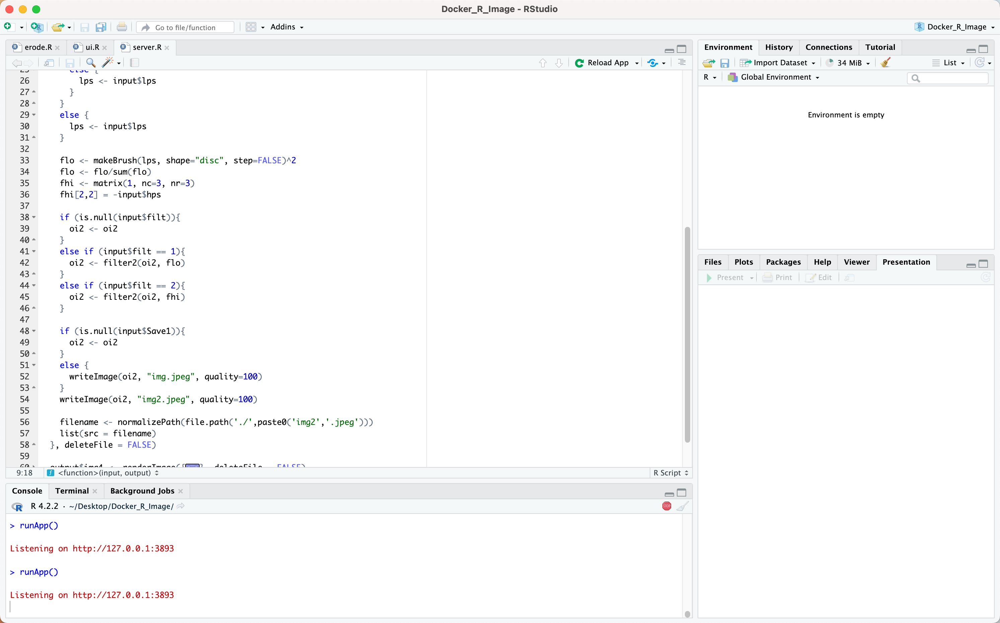
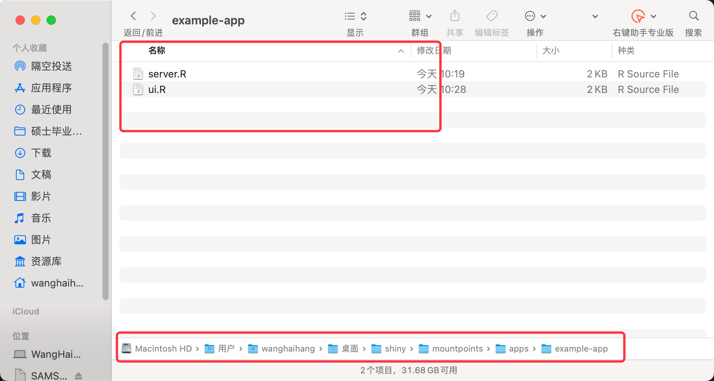

# R

##  安装图像处理库
```R
install.packages("BiocManager")
BiocManager::install("EBImage")
```
## R语言函数

```R

library("EBImage")

erodes <- function(path, thr) {
  shapes <- readImage(path)
  kern = makeBrush(thr, shape='diamond')
  shapes_erode= erode(shapes, kern) # 腐蚀
  shapes_dilate = dilate(shapes, kern) # 膨胀
  #display(combine(shapes,shapes_erode, shapes_dilate), 
  display(combine(shapes,shapes_erode), 
          all=TRUE,method = 'browser',nx = 3)
}
```
调用函数
```R
erodes("changemap.jpg",9)
```


## R语言 交互

R语言的交互式个痛点，在Docker中封装后需要有框架解决交互问题

因此我们引入UI框架shiny

### shiny 封装组件

ui.R
```R
library(EBImage)
library(shiny)

shinyUI(navbarPage("Image Processing",
               
                   
                   
                   tabPanel("Image Filtering",
                            fluidPage(
                              sidebarLayout(
                                 position = "right",
                                sidebarPanel(
                                  textInput("url", label = h6("Enter Image URL"), value = "/Users/wanghaihang/Desktop/Docker_R_Image/changemap.jpg"),
                                  
                                  sliderInput("lps", label = h6("Low-Pass Filter size"),min = 1, max = 50, value = 21),
                                  sliderInput("hps", label = h6("High-Pass Filter size"),min = 1, max = 20, value = 10),
                                  checkboxGroupInput("filt",label = h6("Filter Type"), choices = list("Low-Pass Filter" = 1, "High-Pass Filter" = 2)),              
                                  checkboxGroupInput("Save1", label = h6(""), choices = list("Save"=1))
                                ),
                                
                                mainPanel(
                                  imageOutput("img3")
                                ))
                            )),
                   
                   tabPanel("Morphing",
                            fluidPage(
                              sidebarLayout(
                                position = "right",
                                sidebarPanel(
                                  sliderInput("mm", label = h6("Magnitude"),min = 1, max = 50, value = 21),                              
                                  checkboxGroupInput("morph",label = h6("Morphological Operators"), choices = list("Erode" = 1, "Dilate" = 2)),              
                                  checkboxGroupInput("Save2", label = h6(""), choices = list("Save"=1))
                                ),
                                
                                mainPanel(
                                  imageOutput("img4")
                                ))
                            ))                 
))

```

server.R
```R
library(EBImage)
library(shiny)

shinyServer(function(input, output) {
  
  output$text <- renderText({
    # web image
    #download.file(input$url,"1.jpeg",mode = "wb")
    #native image
    img <- readImage(input$url)
    writeImage(img, "img.jpeg", quality=100)
    "Image:"
  })
  
   
  
   
  
  output$img3 <- renderImage({
    oi2 <- readImage("img.jpeg")
    if (input$lps>1){
      if (input$lps %% 2 == 0 ){
        lps <- input$lps + 1
      }
      else {
        lps <- input$lps
      }
    }
    else {
      lps <- input$lps
    }
    
    flo <- makeBrush(lps, shape="disc", step=FALSE)^2
    flo <- flo/sum(flo)
    fhi <- matrix(1, nc=3, nr=3)
    fhi[2,2] = -input$hps
    
    if (is.null(input$filt)){
      oi2 <- oi2
    }
    else if (input$filt == 1){
      oi2 <- filter2(oi2, flo)
    }
    else if (input$filt == 2){
      oi2 <- filter2(oi2, fhi)
    }
    
    if (is.null(input$Save1)){
      oi2 <- oi2
    }
    else {
      writeImage(oi2, "img.jpeg", quality=100)
    }
    writeImage(oi2, "img2.jpeg", quality=100)
    
    filename <- normalizePath(file.path('./',paste0('img2','.jpeg')))
    list(src = filename)
  }, deleteFile = FALSE)
  
  output$img4 <- renderImage({
    oi2 <- readImage("img.jpeg")
    if (input$mm>1){
      if (input$mm %% 2 == 0 ){
        mm <- input$mm + 1
      }
      else {
        mm <- input$mm
      }
    }
    else {
      mm <- input$mm
    }
    
    kern <- makeBrush(mm, shape="diamond")^2
    
    if (is.null(input$morph)){
      oi2 <- oi2
    }
    else if (input$morph == 1){
      oi2 <-  erode(oi2, kern)
    }
    else if (input$morph == 2){
      oi2 <- dilate(oi2, kern)
    }
    
    if (is.null(input$Save1)){
      oi2 <- oi2
    }
    else {
      writeImage(oi2, "img.jpeg", quality=100)
    }
    writeImage(oi2, "img2.jpeg", quality=100)
    
    filename <- normalizePath(file.path('./',paste0('img2','.jpeg')))
    list(src = filename)
  }, deleteFile = FALSE)
  
  
})
```


### 本地测试

在同一文件夹下面 放置ui.r和server.r

执行Run App



在浏览器中打开


可以通过UI对图像进行处理

## 部署测试

### shiny server
    封装好的交互组件需要进行部署，不然没有办法在docker中进行使用
    因此我们使用镜像 rocker/r-ver:3.6.3

https://github.com/rocker-org/shiny

### 克隆项目
    `git clone git@github.com:rocker-org/shiny.git`
把ui.r 和 server .r 在目录中替换


### 拉取镜像
把镜像拉取到本地仓库

`docker pull rocker/r-ver:3.6.3`

