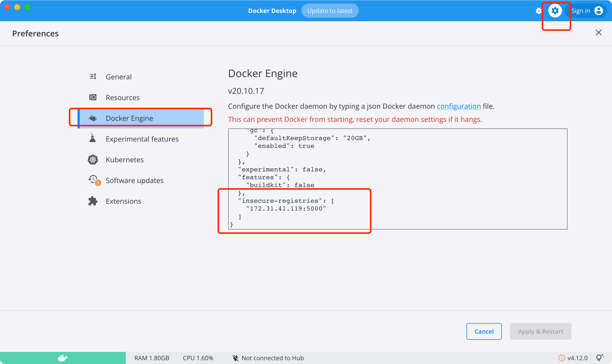
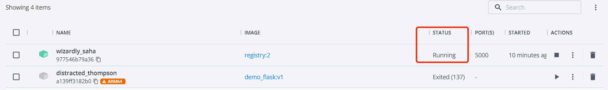
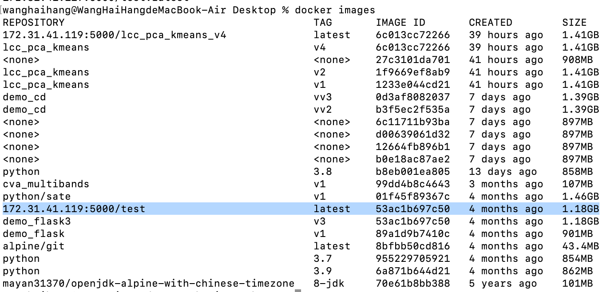

# Docker 搭建私有仓库

##  使用registry构建镜像
```
 docker run -d -p 5000:5000 registry:2
```
自动下载并启动一个registry容器

## 修改Docker daemon
内部使用的私有仓库，可以自行配置证书或者关闭对仓库的安全性检查


 ## 打标签

 ```
 wanghaihang@WangHaiHangdeMacBook-Air Desktop % docker images
REPOSITORY                                        TAG       IMAGE ID       CREATED        SIZE
lcc_pca_kmeans                                    v4        6c013cc72266   38 hours ago   1.41GB
172.31.41.123:5000/lcc_pca_kmeans_v4              latest    6c013cc72266   38 hours ago   1.41GB
<none>                                            <none>    27c3101da701   40 hours ago   908MB
lcc_pca_kmeans                                    v2        1f9669ef8ab9   40 hours ago   1.41GB
lcc_pca_kmeans                                    v1        1233e044cd21   41 hours ago   1.41GB
demo_cd                                           vv3       0d3af8082037   7 days ago     1.39GB
demo_cd                                           vv2       b3f5ec2f535a   7 days ago     1.39GB
<none>                                            <none>    6c11711b93ba   7 days ago     897MB
<none>                                            <none>    d00639061d32   7 days ago     897MB
<none>                                            <none>    12664fb896b1   7 days ago     897MB
<none>                                            <none>    b0e18ac87ae2   7 days ago     897MB
python                                            3.8       b8eb001ea805   13 days ago    858MB
cva_multibands                                    v1        99dd4b8c4643   3 months ago   107MB
python/sate                                       v1        01f45f89367c   4 months ago   1.46GB
demo_flask3                                       v3        53ac1b697c50   4 months ago   1.18GB
demo_flask                                        v1        89a1d9b7410c   4 months ago   901MB
alpine/git                                        latest    8bfbb50cd816   4 months ago   43.4MB
python                                            3.7       955229705921   4 months ago   854MB
python                                            3.9       6a871b644d21   4 months ago   862MB
mayan31370/openjdk-alpine-with-chinese-timezone   8-jdk     70e61b8bb388   5 years ago    101MB

 ```

 使用docker tag命令标记镜像172.31.41.119:5000/为私有仓库地址

 ```
  docker tag lcc_pca_kmeans:v4 172.31.41.119:5000/lcc_pca_kmeans_v4
 ```

 ## 上传镜像

 ```
 wanghaihang@WangHaiHangdeMacBook-Air Desktop % docker push 172.31.41.119:5000/lcc_pca_kmeans_v4
Using default tag: latest
The push refers to repository [172.31.41.119:5000/lcc_pca_kmeans_v4]
1214155e1b92: Pushing [=========>                                         ]  91.74MB/498.1MB
c014d61e197e: Pushed 
daa7980b04d3: Pushed 
63990fc74c1f: Pushed 
2a415cbabd02: Pushed 
a4ac6623bedc: Pushed 
d7c757e0bebf: Pushed 
edc43eb2bdb6: Pushing [==>                                                ]  20.41MB/488MB
765e013775a6: Pushed 
beaf68924af7: Pushed 
791bbde8b96b: Pushed 
29284a104249: Pushed 

 ```

**如果报错显示503 需要proxy代理，检查registry：2 仓库是否在运行？**


## 拉取镜像
```
wanghaihang@WangHaiHangdeMacBook-Air Desktop % docker pull 172.31.41.119:5000/test
Using default tag: latest
latest: Pulling from test
Digest: sha256:c3762b4d0858be64b473306022c3bae8df38a5a634b1dd669afcada0dbcd1e24
Status: Downloaded newer image for 172.31.41.119:5000/test:latest
172.31.41.119:5000/test:latest
```

