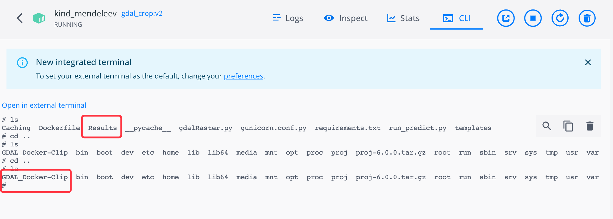

# 数据卷持久化容器数据到本地目录

## PAMC的服务为例
### 裁剪

`docker run -itd  -p 5050:5000 -v E:/Tomcat/apache-tomcat-9.0.34/webapps/ILCSData/PAMC_Chain/Step1:/GDAL_Docker_Clip/Results  172.31.41.119:5000/gdal_crop:v2`

### 变化检测

`docker run -itd -p 5008:5000 -v E:/Tomcat/apache-tomcat-9.0.34/webapps/ILCSData/PAMC_Chain/Step2:/Docker_Python_PCA_KMeans/Results  172.31.41.119:5000/lcc_pca_kmeans:v8`

##