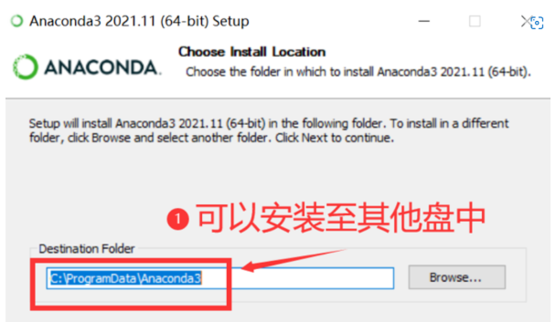
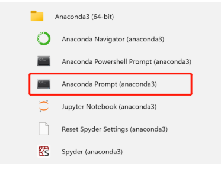
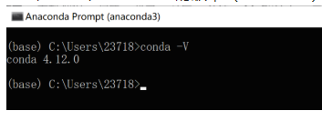
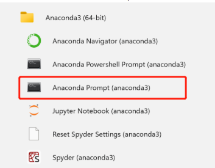
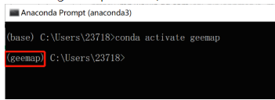
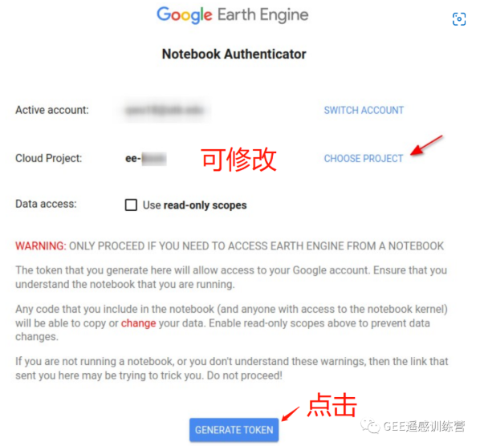
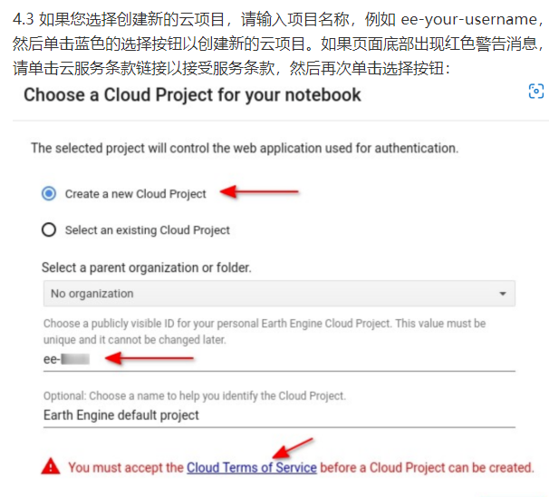
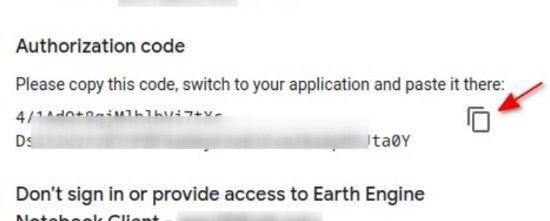

# 安装geemap框架
## 第一步：安装anaconda:

### 1.1 anaconda安装链接：

https://www.anaconda.com/products/distribution

### 1.2 选择window版本64位：

### 1.3 安装选项（未提及的按默认处理）：

## 第二步：安装geemap

### 2.1 打开Anaconda3 下面的 anaconda Prompt：

### 2.2 检查一下anaconda的版本（conda -V），看看是否安装成功

### 2.3 安装geemap的虚拟环境：
`conda create -n gee python`

### 2.4 激活geemap的虚拟环境：
`conda activate gee`

### 2.5 安装mamba包：
`conda install -c conda-forge mamba`

### 2.6 安装pygis包：
`mamba install -c conda-forge geemap pygis`

## 第三步：启动jupyter lab

### 3.1 重新启动anaconda Prompt：

### 3.2 激活geemap的虚拟环境：

### 3.3  将根目录转成自己文件所在目录，比如小编目录为：D:\anaconda3\geemap_text，利用cd..进行转换磁盘，直到剩下C:\，再输入D: ，最后利用cd +路径，转换到自己所在路径：

## 第四步：GEE认证：

### 4.1 新建Notebook:

### 4.2 输入以下代码，并运行（Shift+Enter）:
`import eeee.Authenticate()`

### 4.3 跳出认证界面，可以修改Cloud Project 名称，也可直接默认，点击GENERATE TOKEN：

### 4.3 如果您选择创建新的云项目，请输入项目名称，例如 ee-your-username，然后单击蓝色的选择按钮以创建新的云项目。如果页面底部出现红色警告消息，请单击云服务条款链接以接受服务条款，然后再次单击选择按钮：

### 4.4 选择您的GEE账号：

### 4.5 允许Notebook 访问 Earth Engine 账号：

### 4.6 将认证码复制粘贴到jupyter lab对应栏里：

## 第五步：在jupyter lab显示地图：
### 5.1 重新建立一个Notebook，导入geemap包，并利用set_proxy()函数设置端口，例如：小编Internet选项端口为10809：
### 5.2 显示正常使用：

