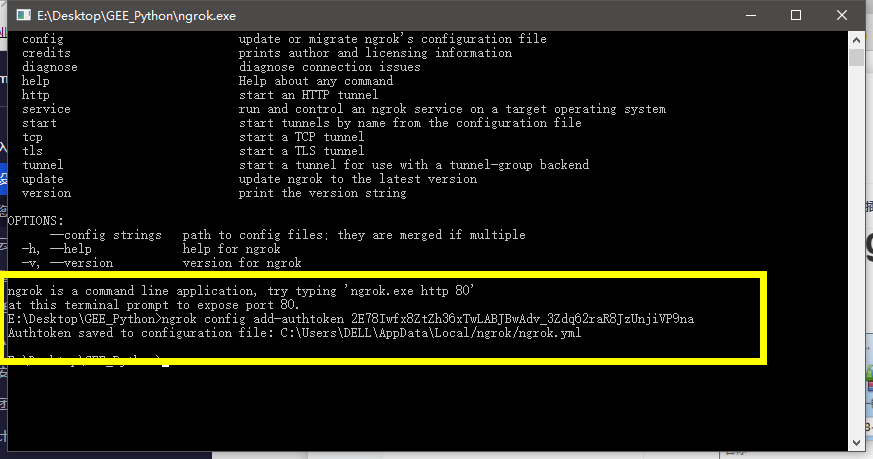
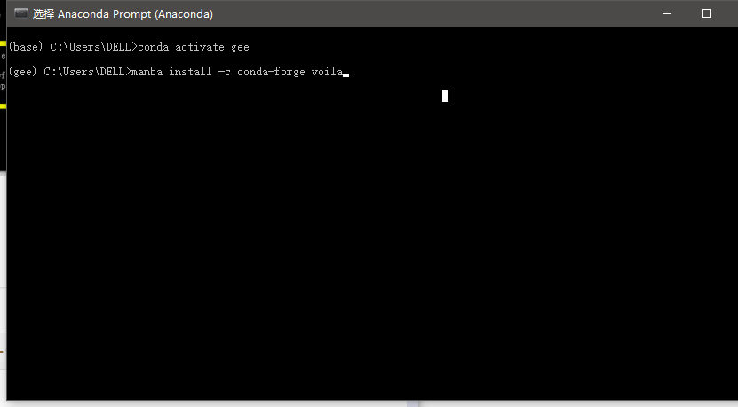
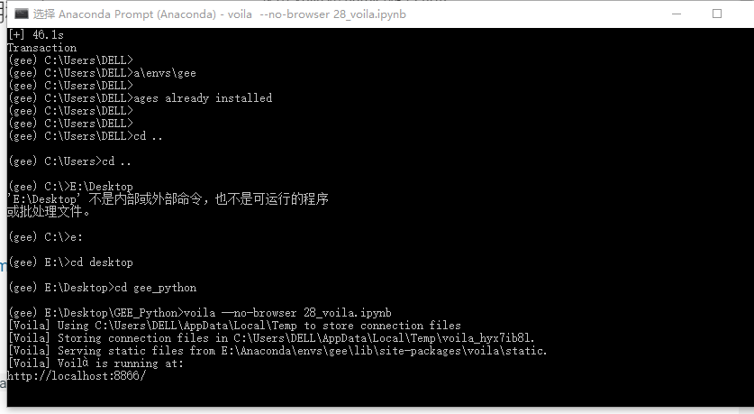
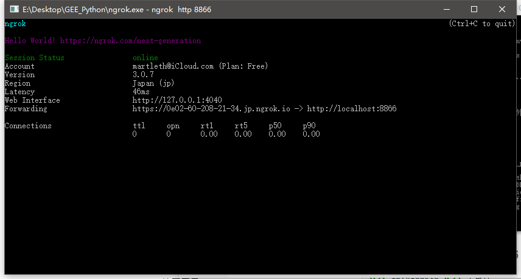
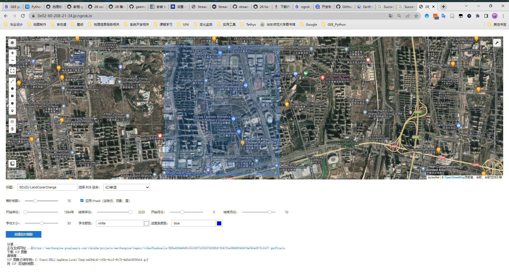
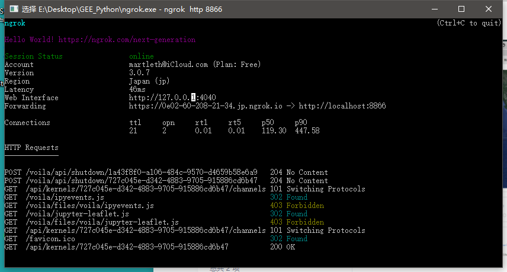
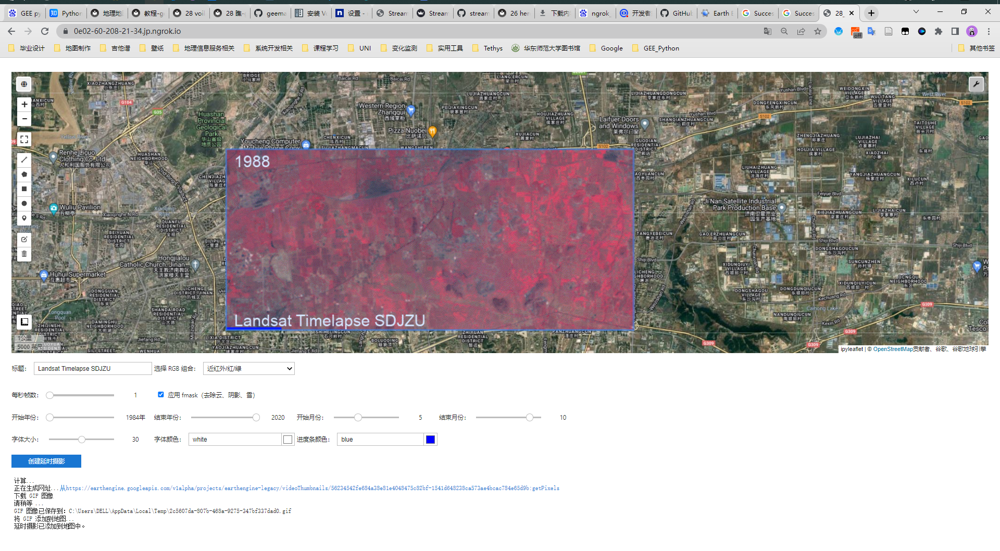

## 1.下载 ngrok

运行exe 
在网站授权帐户信息到本地配置

## 2.下载 voila
`mamba install -c conda-forge voila`

volia 运行程序文件 端口号显示8866  voila --no-browser 28_voila.ipynb

ngrok 穿透8866    ngrok http 8866

## 缺点：
1、需要梯子
2、内网穿透访问速度慢
3、依赖于特定端口号（再解决）