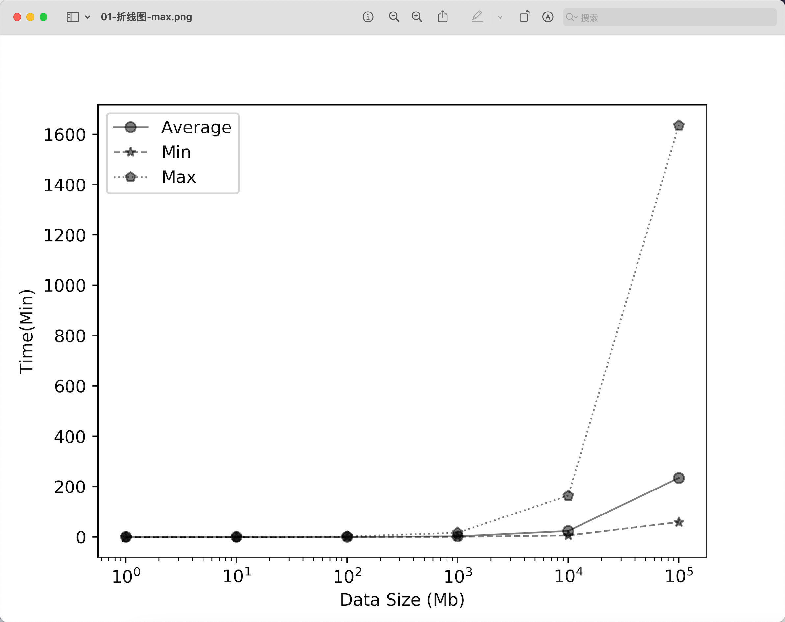

# python绘图-折线图

```py
import matplotlib.pyplot as plt
import numpy as np


 


# 数据设置
x_axis_data = [1,10,100,1000,10000,100000]
y_axis_data1 = [0.137/60,1.429/60,13.697/60,140.273/60,1402.71/60,14020/60] #7M/s
y_axis_data2 = [0.137/60/4,1.429/60/4,13.697/60/4,140.273/60/4,1402.71/60/4,14020/60/4] # 30M/s  
y_axis_data3 = [0.137/60*7,1.429/60*7,13.697/60*7,140.273/60*7,1402.71/60*7,14020/60*7] #1M/s
 
         
#画图
plt.semilogx(x_axis_data, y_axis_data1, 'ko-', alpha=0.5, linewidth=1, label='Average')#'
plt.semilogx(x_axis_data, y_axis_data2, 'k*--', alpha=0.5, linewidth=1, label='Min')
plt.semilogx(x_axis_data, y_axis_data3, 'kp:', alpha=0.5, linewidth=1, label='Max')
# 幂指数显示坐标轴
plt.xscale('log')
# plt.yscale('log')
  


#设置坐标轴范围
# plt.xlim((-5, 5))
# plt.ylim((0, 250))


plt.legend()  #显示上面的label
plt.xlabel('Data Size (Mb)')
plt.ylabel('Time(Min)')#accuracy
plt.savefig("01-折线图-max.png", dpi=500) # dpi越大，图片越清晰

plt.show()

 

```


## 控制颜色
颜色之间的对应关系为
- b---blue   
- c---cyan  
- g---green    
- k----black
- m---magenta 
- r---red  
- w---white    
- y----yellow

## 控制线型
符号和线型之间的对应关系
- `-`      实线
- `--`     短线
- `-.`     短点相间线
- `：`     虚点线


## 控制标记风格
标记风格有多种：
- `.`  Point marker
- `,`  Pixel marker
- `o`  Circle marker
- `v`  Triangle down marker 
- `^`  Triangle up marker 
- `<`  Triangle left marker 
- `>`  Triangle right marker 
- `1`  Tripod down marker
- `2 ` Tripod up marker
- `3`  Tripod left marker
- `4`  Tripod right marker
- `s`  Square marker
- `p`  Pentagon marker
- `*`  Star marker
- `h`  Hexagon marker
- `H`  Rotated hexagon D Diamond marker
- `d`  Thin diamond marker
- `|` Vertical line (vlinesymbol) marker
- `_`  Horizontal line (hline symbol) marker
- `+`  Plus marker
- `x`  Cross (x) marker


## 效果

