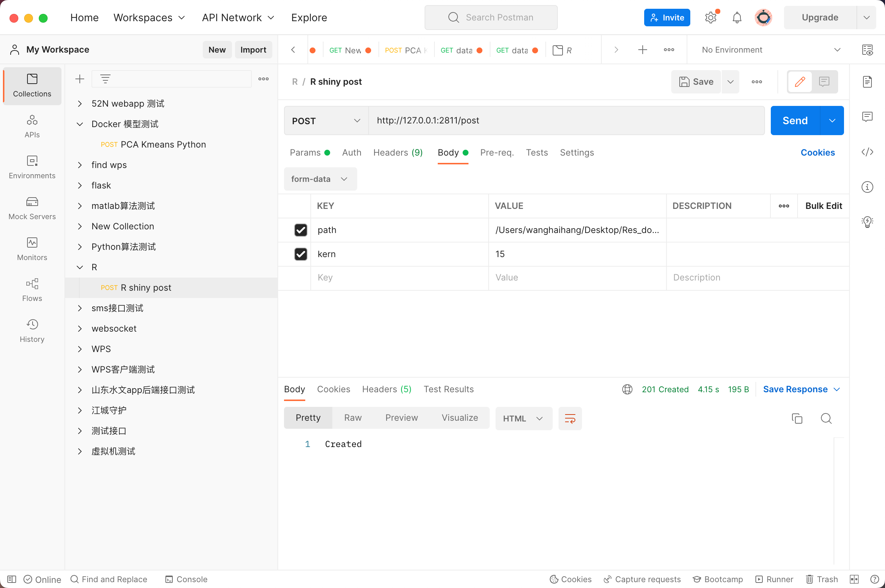
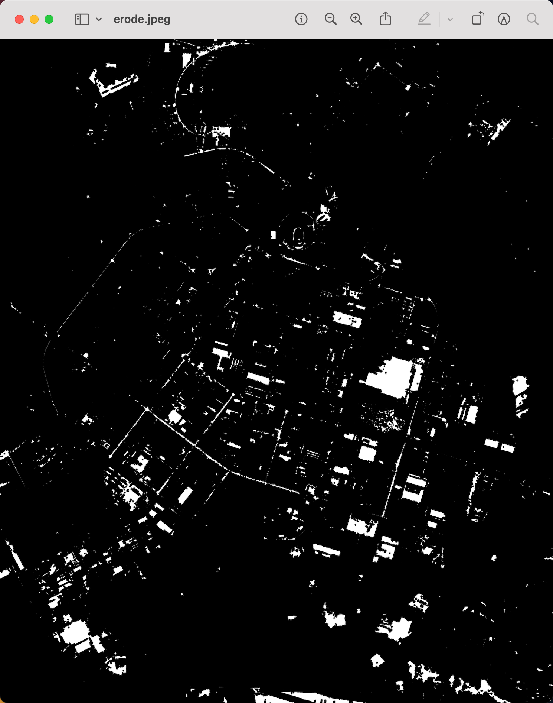

# R语言使用http请求
## 安装http包

    `install.packages("httr")`
```r
    > install.packages("httr")
also installing the dependencies ‘sys’, ‘askpass’, ‘curl’, ‘openssl’

trying URL 'https://cran.rstudio.com/bin/macosx/big-sur-arm64/contrib/4.2/sys_3.4.1.tgz'
Content type 'application/x-gzip' length 50670 bytes (49 KB)
==================================================
downloaded 49 KB

trying URL 'https://cran.rstudio.com/bin/macosx/big-sur-arm64/contrib/4.2/askpass_1.1.tgz'
Content type 'application/x-gzip' length 22910 bytes (22 KB)
==================================================
downloaded 22 KB

trying URL 'https://cran.rstudio.com/bin/macosx/big-sur-arm64/contrib/4.2/curl_5.0.0.tgz'
Content type 'application/x-gzip' length 776462 bytes (758 KB)
==================================================
downloaded 758 KB

trying URL 'https://cran.rstudio.com/bin/macosx/big-sur-arm64/contrib/4.2/openssl_2.0.6.tgz'
Content type 'application/x-gzip' length 2489665 bytes (2.4 MB)
==================================================
downloaded 2.4 MB

trying URL 'https://cran.rstudio.com/bin/macosx/big-sur-arm64/contrib/4.2/httr_1.4.5.tgz'
Content type 'application/x-gzip' length 504665 bytes (492 KB)
==================================================
downloaded 492 KB


The downloaded binary packages are in
	/var/folders/z7/nnt8vmgd1mj0g8sqgytv4n680000gn/T//Rtmpm6JJ58/downloaded_packages
> 
```


## 安装库 library(brochure)
`remotes::install_github("ColinFay/brochure")`

## 代码

```r
library(shiny)
library(brochure)
library(EBImage)
# We'll start by defining a home page
home <- function(
    httr_code
){
  brochure::page(
    href = "/",
    # Simple UI, no server side
    ui = tagList(
      tags$h1("Hello world!"),
      tags$p("Open a new R console and run:"),
      tags$pre(
        httr_code
      )
    )
  )
}
postpage <- function(){
  page(
    href = "/post",
    req_handlers = list(
      function(req){
        if( req$REQUEST_METHOD == "POST" ){
      
          # reading the req$.bodyData. 
          # query <- parseQueryString(req$QUERY_STRING)
          # print(query)
          # path <- query$path
          # print(query$path)
          body <- readLines(
            req$.bodyData,
            # The file will have no final EOL
            # and we don't want a message to be 
            # printed to the console
            warn = FALSE
          )
          print(body)
          # Here, you can define your own handling 
          # logic of the body. 
          # We'll simply print it to the console 
          # in this example.
          path <- body[4]
          kern <- as.numeric(body[8])# 转为数字
          print(path)
          print(kern)
          #按路径读取影像
          oi2 <- readImage(path)
          print(oi2 )
          #腐蚀
          kern = makeBrush(kern, shape='diamond')
          oi2 <- erode(oi2, kern)
          writeImage(oi2, "erode.jpeg", quality=100)
          
          return(
            httpResponse(
              status = 201, 
              content = "Created"
            )
          )
        } 
        return(req)
      }
    ), 
    ui = tagList(
      tags$p("Hello from /post!")
    )
  )
}
brochureApp(
  home(
    httr_code = "httr::POST('http://127.0.0.1:2811/post', body = 'plop')"
  ),
  postpage()
)


```


## 发送请求



## 结果

