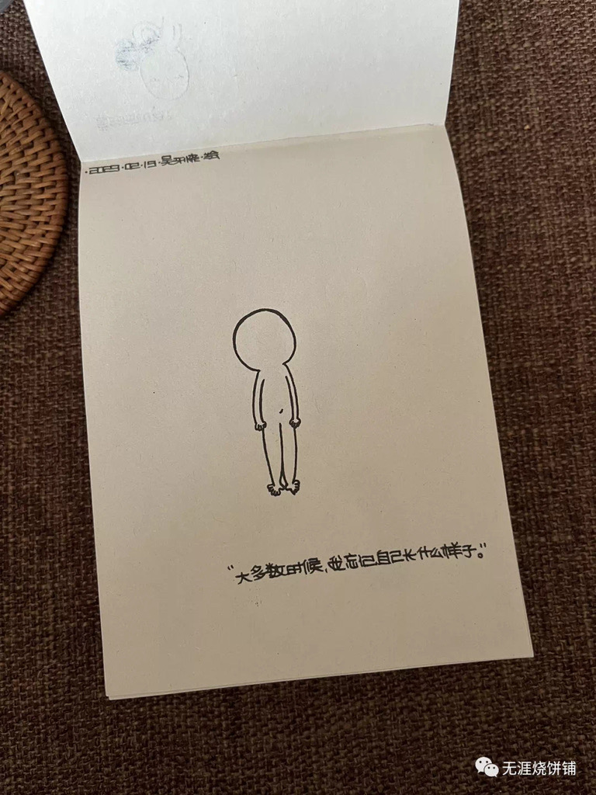

# 欲
”你所有的压力都是因为你太想要了，你所有的痛苦都是因为你太较真了，有些事不能尽你心意就是在提醒你该转弯了。如果事事都如意，那就不叫生活了，所以睡前原谅，一切醒来不问过往，珍惜所有的不期而遇，看淡所有的不辞而别。

人生就是一站有一站的风景，一岁有一岁的味道， 你的年龄应该成为你生命的勋章，而不是你伤感的理由，生活嘛，慢慢来你又不差。“

当我欲于人，当人欲于我，当我欲于己，我都不快乐都不自由。我都看不见月亮。
    ——无涯烧饼铺

